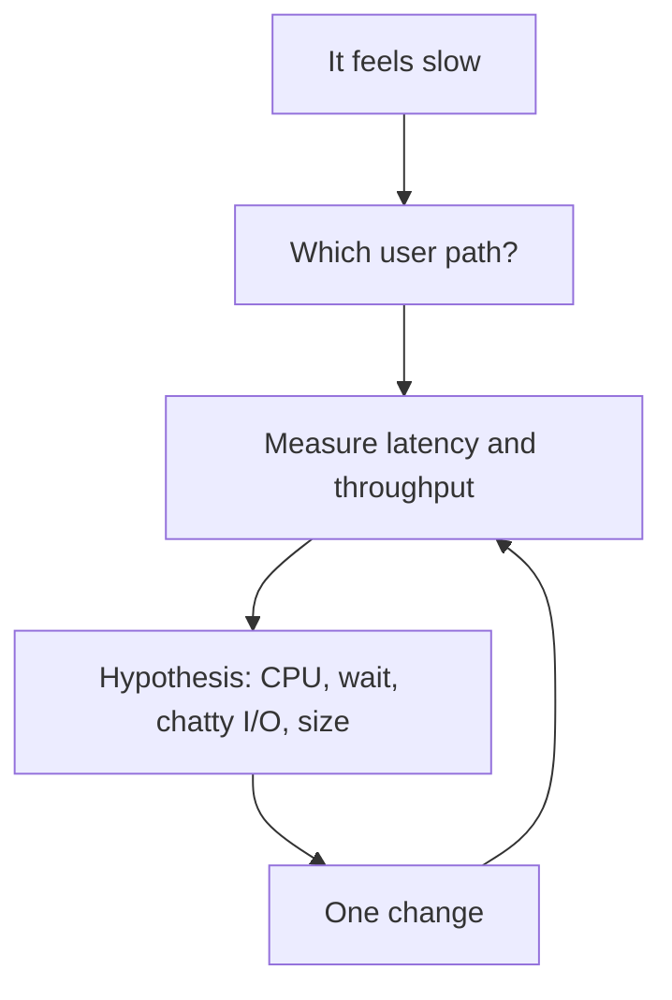
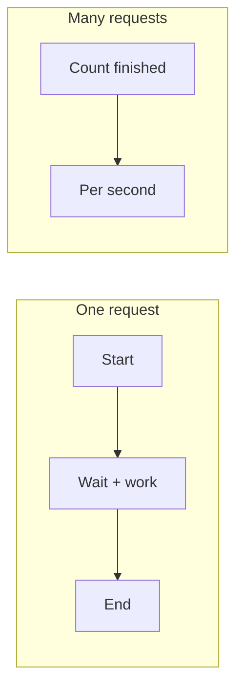

# Month 17 · Week 1 · Day 1
# Measurement First: Latency, Throughput, and Percentiles

**Program:** Full-Stack Mastery · 18 months  
**Phase:** 6 — Advanced engineering and system design  
**Month index:** [../../README.md](../../README.md)  
**Week 1:** Day 1 (today) · [2](day-02.md) · [3](day-03.md) · [4](day-04.md) · [5](day-05.md) · [6](day-06.md) · [7](day-07.md)  
**Week rhythm today:** Learn + type-along  
**Student state:** Month 16’s gate is true: a commit can reach production through CI/CD. Project 7 already lives in **your** repos. This month you do not invent a new product. You **measure** what you already shipped, then you change **one** thing at a time.  
**Study time:** 3–4 focused hours

**This week covers:** measurement, latency vs throughput, percentiles, frontend waterfalls, API timing, SQL plans, pools, cache, load tests, a baseline on **your** hot path.

Today: why “it feels slow” is not a ticket, how to name **latency** and **throughput**, why **average** lies, and how to capture numbers you can defend. Frontend evidence is Day 2. Timing middleware and `EXPLAIN` are Day 4. Do not skip either.

Labs: `~\fullstack-lab\month-17\week-01\day-01\`. Product numbers stay in **your** Project 7 notes. This textbook will **not** paste that product.

---

## How to use this textbook

1. Read a section. Close it. Say the idea in a full sentence with an example from **your** app.  
2. Type the tiny timing lab. Do not paste a “performance playbook” from a vendor blog.  
3. When you name a number, name **what you measured**, **how**, and **on which machine**.  
4. Optional review links are for later rechecking.

---

## How to read this chapter

A **performance problem** is a claim that can fail: “this path is slower than we will accept, under this load, measured this way.” Month 1 taught that a test without a failing claim is a souvenir. Month 17 teaches the same for speed. A feeling is a **hypothesis generator**. It is not evidence.



**Wrong belief:** “We’ll add Redis and Kafka and it will scale.”  
**Correct:** you add a component when you can name the **failure** it prevents and the **failure** it introduces. Today you do not add Redis. You learn to **talk in numbers**.

**Wrong belief:** “The API is fine; the average response is 40 ms.”  
**Correct:** users live in the **tail**. If one request in twenty takes 2 seconds, p95 is the number that matches the complaint. Average can look healthy while the product feels broken.

---

## Today's contract

By the end of this day you will be able to:

1. Define **latency** and **throughput** without swapping the words.  
2. Explain why **mean** (average) is a weak ticket, and what **p50 / p95 / p99** actually are.  
3. Name the **units** you will write on a ticket: milliseconds for a request, requests per second for a server, bytes for a payload.  
4. Capture a **tiny** local measurement of a FastAPI path with wall-clock times — not a cloud APM.  
5. Write `MEASURE.md` that turns a vague complaint into a measurable claim.

**Today's gate.** Closed-book:

> Latency is how long one request waited. Throughput is how many requests finished per unit time. Average hides the tail. p95 is the time under which 95% of samples finished. “It feels slow” is a hypothesis. A ticket names path, load, metric, and machine.

---

## Time box

| Block | Minutes | Work |
|---|---|---|
| A | 55 | Theory |
| B | 55 | Type-along: timed FastAPI + a percentile table |
| C | 70 | Independent: turn five complaints into tickets |
| D | 15 | Git |
| E | 15 | Recall |

---

# Block A — Theory

## 1. Why this month starts with a stopwatch

You already have logs with a request id (Month 11), containers you can inspect (Month 15), and a pipeline that can ship a commit (Month 16). None of that tells you **which millisecond** a user is paying.

Teams still “optimize” by:

- adding a cache they cannot invalidate  
- rewriting SQL they never `EXPLAIN`  
- splitting a monolith because a list page “felt slow”  
- buying a bigger instance because CPU graphs were unread

Month 17’s first skill is **refusing to change code until a number exists**. The loop is: measure → hypothesize → one change → measure again. Day 7 will force that loop on a lab. Day 6 will force it on **your** Project 7.

## 2. Latency is not throughput

**Latency** is the time from “the client started the request” to “the client had the response.” For an HTTP GET, that includes DNS (if cold), TCP, TLS, waiting in a queue, your Python, SQL, serialization, and the bytes on the wire. You must say **where the clock started**.

**Throughput** is how many of those requests complete per unit time: 40 requests/second on this laptop, 400 on a 2-vCPU box, whatever you actually counted.

They are related and they are not the same:

- One slow query can raise **latency** while **throughput** stays modest because workers are blocked.  
- A chatty page that fires 30 APIs can have “fast endpoints” and a **slow user**. That is frontend latency of a **journey**, Day 2.  
- You can raise throughput by adding workers and still have terrible p99 if every request waits on a lock.



**Wrong belief:** “If I can handle 1,000 RPS, users will be happy.”  
**Correct:** 1,000 RPS at 8-second p95 is a crowd of angry people. Throughput without a latency percentile is a vanity metric.

**Wrong belief:** “If p50 is 30 ms, we are fast.”  
**Correct:** p50 is the median. Half of requests are slower. If the slow half includes checkout, you optimized the wrong half.

## 3. Where time goes — a model you can debug

Every millisecond is one of these:

| Bucket | What it looks like | First check |
|---|---|---|
| **Queueing** | Request waited for a worker, a DB connection, a lock | Pool exhaustion, worker count |
| **CPU** | Python JSON, image resize, tight loop | One core pegged; others idle |
| **Wait (I/O)** | SQL, Redis, S3, outbound HTTP | Time in `await` / driver |
| **Size** | Huge JSON, uncompressed images | Network waterfall, Content-Length |
| **Client** | Main thread blocked, huge JS parse | Chrome Performance, Day 2 |
| **Distance** | User far from the server | Later: CDN, region — not today’s fix |

Most web slowness is **wait**, not CPU. Month 1 already said that. You will still forget it the first time someone says “we need Kubernetes.” Kubernetes does not make a sequential scan faster. Optional until needed; this course does not require it.

## 4. Average vs percentiles — the arithmetic that lies

Take ten latencies, milliseconds:

`20, 22, 21, 19, 24, 23, 20, 25, 18, 2000`

- **Mean (average):** sum / 10 ≈ **221 ms**. One outlier dominates.  
- **Median (p50):** sort them; the 5th/6th sit near **21–22 ms**. Half of users were fine.  
- **p95:** 95% of samples finished **at or below** this value. With only ten samples, p95 is near the **second-slowest**, not the mean.  
- **p99:** 99% finished at or below. You need **more samples** before p99 is stable. Quoting p99 from 12 `curl.exe` calls is theatre.

**How to compute a percentile honestly (this course):**

1. Collect **N** samples of the **same** operation (same path, same machine, same warm/cold rule).  
2. Sort ascending.  
3. p95 index ≈ `ceil(0.95 * N) - 1` (zero-based), or nearest-rank — pick one method and **write it down**.  
4. Report **N**, **min**, **p50**, **p95**, **max**. Mean is optional; never mean alone.

**Wrong belief:** “I’ll take three `curl.exe` times and average them for the sprint report.”  
**Correct:** three samples cannot support p95. They can support “min/max on my laptop after a warm-up.” Write that sentence. Do not write “API p95 is 40 ms” from three numbers.

**Wrong belief:** “p99 must always be in the dashboard or we are unprofessional.”  
**Correct:** p99 needs volume. Local labs often stop at p50/p95 plus max. Production can grow into p99 when traffic exists. Inventing p99 from a dozen clicks is a false optimization of the **report**, not of the product.

## 5. Cold vs warm — you must name the start condition

The first request after process start pays: import time, connection open, TLS session, empty Query cache, empty Postgres buffer cache. The fifth request does not.

A ticket that mixes cold and warm is two tickets pretending to be one.

Write, every time:

- **Warm:** ignore the first 2–5 requests, then sample.  
- **Cold:** restart Uvicorn (and optionally the browser with cache disabled) and measure the first request **on purpose**.

Day 2 will add “disable cache” in Chrome. Today: do not compare a cold Python process to a warm one and call it a regression.

## 6. What “it feels slow” is allowed to become

A useful ticket has four fields:

1. **Path** — URL or UI journey (“open slip list after login”), not “the app.”  
2. **Load** — 1 user on a laptop, or 20 concurrent, or “after 10k rows.”  
3. **Metric** — p95 latency of `GET /slips`, or LCP on the list (Day 2), or SQL `actual time` (Day 4).  
4. **Environment** — your Windows machine, Compose on WSL, staging. Numbers do not travel without this.

Until those exist, the work is **investigation**, not “add Redis.”

## 7. Clocks you may use this month (and ones you may not worship)

**Allowed today:**

- Python `time.perf_counter()` around a function (monotonic, good for durations).  
- FastAPI middleware that logs duration (you will type a cousin on Day 4).  
- `curl.exe -w` time variables for a **spot check**.  
- Browser Network timing (Day 2).

**Not the lesson today:**

- A vendor APM as a substitute for understanding. If you already have CloudWatch from Month 16, you may **read** a latency number there **after** you can explain it. You may not skip the lab because a graph exists.  
- Tracing every SQL from an agent before you can read `EXPLAIN ANALYZE` yourself (Day 4).

`time.time()` is wall-clock and can jump. Prefer `perf_counter()` for durations.

## 8. Worked complaints — rewrite them

Keep this table. Day 3 will ask you to classify numbers without looking.

**Complaint A.** “The dashboard is slow.”  
**Not a ticket.** Missing path, metric, load. Possible real tickets: p95 of `GET /summary` > 500 ms on staging with 1k rows; or LCP on `/dashboard` > 2.5 s on a throttled cable profile.

**Complaint B.** “Postgres is the problem.”  
**Hypothesis.** Evidence would be: `EXPLAIN ANALYZE` actual time dominates the request log duration, or the pool waits. A CPU-bound JSON dump is not Postgres.

**Complaint C.** “We need more servers.”  
**Hypothesis about throughput.** If one request is 3 seconds of sequential SQL, a second server gives you two slow users in parallel. Horizontal scale is Week 4.

**Complaint D.** “Average latency dropped 10% after we added a cache.”  
**Incomplete.** Did p95 drop? Did stale data appear? Cache without invalidation is Day 5 and Day 7.

## 9. What you will not do today

- You will not add Redis.  
- You will not load-test Project 7 until Day 6’s **baseline** (and Day 5’s tiny Locust).  
- You will not paste product handlers into `fullstack-lab`.  
- You will not treat a single `curl.exe` as p95.

If queues grow under the same arrival rate, the waiting room fills. That is enough intuition for today.

---

# Block B — Type-along

```powershell
cd ~\fullstack-lab
mkdir month-17\week-01\day-01 -Force
cd ~\fullstack-lab\month-17\week-01\day-01
uv init --name lab-measure
uv add fastapi uvicorn pydantic
uv add --dev pytest httpx
```

Domain: **harbor desk slips**, not Project 7. Type `main.py`. A list endpoint is cheap. A report endpoint sleeps on purpose so you have a slow path to measure.

```python
import time
from fastapi import FastAPI
from pydantic import BaseModel

app = FastAPI()


class Slip(BaseModel):
    id: int
    name: str


SLIPS = [Slip(id=i, name=f"Slip {i}") for i in range(1, 21)]


@app.get("/slips")
def list_slips() -> list[dict]:
    return [s.model_dump() for s in SLIPS]


@app.get("/slips/report")
def slow_report() -> dict:
    time.sleep(0.25)
    return {"ok": True, "n": len(SLIPS)}
```

Pydantic v2: **`model_dump()`**, not `.dict()`.

Create `measure.py`. Type it. It warms the app, then records durations with `perf_counter`.

```python
import statistics
import time
from fastapi.testclient import TestClient
from main import app


def percentile(sorted_vals: list[float], p: float) -> float:
    if not sorted_vals:
        raise ValueError("empty")
    n = len(sorted_vals)
    rank = min(n, max(1, int((p / 100.0) * n)))
    return sorted_vals[rank - 1]


def sample(path: str, n: int, warm: int = 3) -> list[float]:
    client = TestClient(app)
    for _ in range(warm):
        client.get(path)
    times: list[float] = []
    for _ in range(n):
        t0 = time.perf_counter()
        r = client.get(path)
        t1 = time.perf_counter()
        assert r.status_code == 200
        times.append((t1 - t0) * 1000)
    return times


def summarize(label: str, times: list[float]) -> None:
    s = sorted(times)
    print(label)
    print(f"  n={len(s)} min={s[0]:.2f} p50={percentile(s, 50):.2f} "
          f"p95={percentile(s, 95):.2f} max={s[-1]:.2f} mean={statistics.mean(s):.2f}")


if __name__ == "__main__":
    summarize("/slips", sample("/slips", 40))
    summarize("/slips/report", sample("/slips/report", 20))
```

```powershell
uv run python measure.py
```

Write `NUMBERS.md`: paste **your** two summary lines (they are lab numbers, not product). Then write four sentences:

1. Which path is higher **latency**?  
2. Did you measure **throughput** today? (Honest answer: not really — you measured serial latency.)  
3. Is TestClient latency the same as `curl.exe` to Uvicorn? (No: TestClient is in-process, no TCP.)  
4. Why mean on `/slips/report` is almost the sleep.

Optional: `uv run uvicorn main:app --host 127.0.0.1 --port 8017` and `curl.exe -s -o NUL -w "time_total=%{time_total}`n" http://127.0.0.1:8017/slips`. Write one line: `curl.exe` vs TestClient — why they differ (TCP). Stop Uvicorn.

Write `PERCENTILE.md`: six lines on nearest-rank. Do not pretend it is Hyndman-Fan type 7 unless you implemented that.

---

# Block C — Independent

Open **your** Project 7 in another window. Do not copy source into the lab.

Write `TICKETS.md` in the lab folder. Rewrite these five complaints into the four-field shape (path, load, metric, environment). If you do not know a URL, use **resource names** only.

1. “The app feels slow in the morning.”  
2. “Listing is fine but opening a detail takes forever.”  
3. “After we imported last year’s data it got bad.”  
4. “Mobile is worse than desktop.”  
5. “Staging is fine; production is not.”

Then write `MY-HOT-PATH.md` (paths and resource **names** only):

1. One **read** path you suspect is hot (list or dashboard).  
2. One **write** path (create or status change).  
3. What you will **not** measure this week (images CDN, Kubernetes — optional, not required).  
4. One sentence: you do **not** have p95 yet, so you will not add a cache this week unless Day 5’s rules are all true.

Empty and honest beats a fake table.

---

# Block D — Git

```powershell
cd ~\fullstack-lab
git add month-17
git commit -m "Month 17 Day 1: latency vs throughput, percentile lab, tickets."
```

---

# Block E — Recall

1. Latency vs throughput — one sentence each.  
2. Why average of ten times with one 2-second outlier is a bad ticket.  
3. What p95 **is**, including that it needs enough samples.  
4. Cold vs warm.  
5. Four fields of a performance ticket.  
6. Why TestClient is not a browser waterfall.

## Office hours — measurements that lie

**Three curls as p95.** Report n, min, median, max. **Cold mixed into a regression.** Name warm-up. **Localhost as production.** Environment is a ticket field. **TestClient as user latency.** No TCP, no JS. **Throughput ignoring 500s.** Count successes (Day 5).

Windows: `uv run python measure.py`. `curl.exe` not `curl` if the alias wraps.

## Definition of done

- [ ] `measure.py` printed n, min, p50, p95, max for two paths  
- [ ] `NUMBERS.md` and `PERCENTILE.md` exist  
- [ ] `TICKETS.md` rewrites five complaints  
- [ ] `MY-HOT-PATH.md` uses *your* names without pasted source  
- [ ] You can say the gate paragraph closed-book  
- [ ] Commit exists  

---

## Optional review links

The definitions are explained in this chapter.

- [FastAPI TestClient](https://fastapi.tiangolo.com/tutorial/testing/)  
- [Python time.perf_counter](https://docs.python.org/3/library/time.html#time.perf_counter)  
- [curl.exe write-out variables](https://curl.se/docs/manpage.html#-w)

## Tomorrow

**Frontend performance** — waterfalls, bundle size, LCP/CLS ideas, Query cache as UX, images. Chrome Network and Performance as **evidence**, not as a screensaver.
