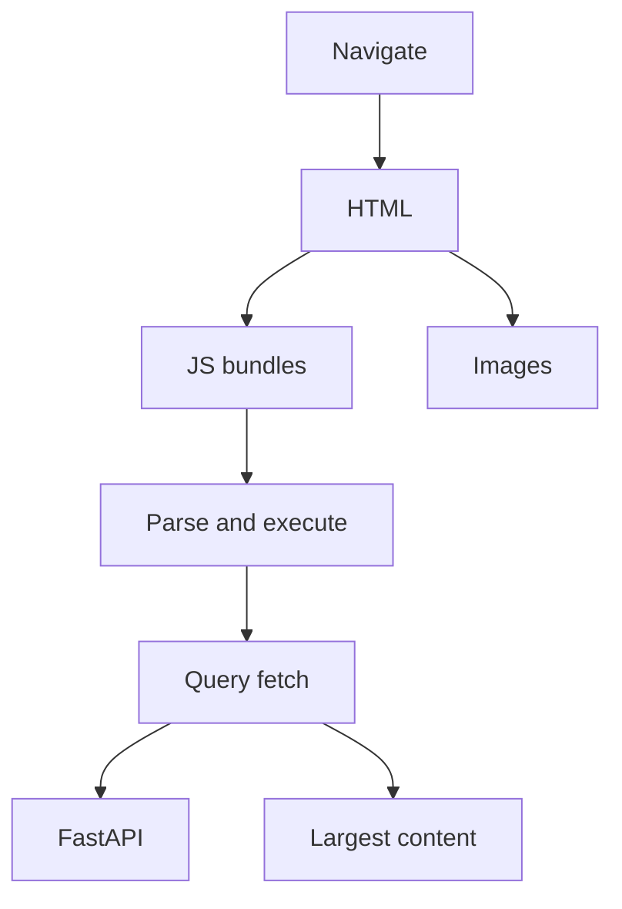

# Month 17 · Week 1 · Day 2
# Frontend Performance: Waterfalls, Bundles, LCP/CLS, Query Cache, Images

**Program:** Full-Stack Mastery · 18 months  
**Phase:** 6 — Advanced engineering and system design  
**Month index:** [../../README.md](../../README.md)  
**Week 1:** [1](day-01.md) · Day 2 (today) · [3](day-03.md) · [4](day-04.md) · [5](day-05.md) · [6](day-06.md) · [7](day-07.md)  
**Week rhythm today:** Exercises + debugging (theory is in this file)  
**Student state:** Day 1 gate passed. You can name latency, throughput, and p95. Today the **browser** is part of the user’s latency. An API that is 40 ms p95 can still feel slow if JavaScript, images, or a waterfall of fetches sit in front of paint.  
**Study time:** 3–4 focused hours  
**Prereq:** Day 1 gate passed.

Labs: `~\fullstack-lab\month-17\week-01\day-02\`. Chrome DevTools on a **lab page** and, separately, notes on **your** app. This textbook will **not** paste Project 7.

---

## How to use this textbook

1. Read until you can explain a Network waterfall in sentences.  
2. Type the tiny Vite page. Capture evidence with screenshots **you** take — describe them in markdown; do not paste product source.  
3. When you blame “React,” name a **row** in the waterfall or a **bundle kilobyte** number.  
4. Optional review links are for later rechecking.

---

## How to read this chapter

The user does not experience `GET /slips` in isolation. They experience **time to something useful on screen**. That time is: download HTML, download JS, parse/compile JS, run React, fire API calls (TanStack Query), download images, paint, then maybe shift layout.



**Wrong belief:** “The backend is fast, so the frontend cannot be the problem.”  
**Correct:** the backend can be fast **per call** while the page issues twenty calls in series, or while a 1.8 MB bundle blocks the main thread.

**Wrong belief:** “I’ll install a performance React wrapper and the Core Web Vitals will fix themselves.”  
**Correct:** Vitals are **measurements**. You change **bytes, order, and cache**. Libraries do not replace a waterfall you have not looked at.

---

## Today's contract

By the end of this day you will be able to:

1. Read a Chrome **Network** waterfall: queueing, TTFB, download, blocked-by-script.  
2. Name **bundle size** as a first-class cost (JS parse is CPU on the user’s device).  
3. Explain **LCP** and **CLS** as ideas — largest paint vs layout jump — without becoming a SEO consultant.  
4. Explain how **TanStack Query v5** cache (`queryKey`, staleTime) is **UX**, not only “state.”  
5. Say when **images** dominate: format, dimensions, lazy vs hero.  
6. Write evidence notes from DevTools on the lab, then a short honest note on **your** list page.

**Today's gate.** Closed-book:

> User latency includes JS and images. A waterfall shows order and blocking. LCP is largest contentful paint; CLS is unexpected layout shift. Query cache avoids refetch flicker when the key matches. I do not call a 2 MB bundle “just Vite.”

---

## Time box

| Block | Minutes | Work |
|---|---|---|
| A | 50 | Theory |
| B | 75 | Type-along: tiny Vite page + DevTools evidence |
| C | 50 | Independent: classify six slow-UI stories |
| D | 15 | Git |
| E | 15 | Recall |

---

# Block A — Theory

## 1. The waterfall is a timeline, not a gallery

Chrome **Network**: each row is a resource. The bar’s segments (queue, stall, DNS, connect, SSL, TTFB, download) are **where the time went**. Waterfall **shape** matters:

- **Serial chain:** HTML, then JS, then JS discovers API, then API returns, then images. You paid every step in sequence.  
- **Wide parallel:** many small files at once — can still be slow if they are huge or if the browser limits connections per origin.  
- **Blocked:** a script without `async`/`defer` (or a giant module graph) holds parsing.

**TTFB** (time to first byte) on the **document** is often the API + server + TLS to the **web origin**. TTFB on an **XHR/fetch** row is your FastAPI (plus proxy). Do not mix them in one sentence.

Disable cache in DevTools when you mean **cold**. Uncheck it when you mean **repeat visit**. Write which one you captured. Day 1’s cold/warm rule still holds.

**Wrong belief:** “All the time is ‘Waiting for server,’ so I must rewrite SQL.”  
**Correct:** that row might be the **HTML** from Vite or nginx. Look at the **URL**. The API call is a different row, often after JS executes.

## 2. Bundle size — bytes you make the CPU eat

Vite produces JS chunks. The browser **downloads**, then **parses and compiles**, then **runs**. On a mid phone, parse is not free. A dashboard that `import`s a chart library, a date library, and icons for routes you have not opened yet is a **self-inflicted** tax.

This course already uses code splitting by **route** when you lazy-load pages. If you have not, the exercise is: look at the Network filter `JS` after a fresh load of the **list** page. Sum transfer size. Write the number.

You do not need a webpack PhD. You need:

- one **entry** chunk size after gzip/brotli (Chrome shows transferred vs resource)  
- whether a **heavy** library loaded on a page that does not use it  
- whether source maps are served to production users (they should not be)

**Wrong belief:** “Minified means it is fast.”  
**Correct:** minification shrinks download. A minified 2 MB still parses. Split and delete unused imports.

## 3. LCP and CLS as ideas (not a certification)

**LCP (Largest Contentful Paint):** when the **largest** content element in the viewport (often a hero image or a heading plus first list) has painted. If your list is empty until Query returns, LCP may wait on the **API**. If a huge banner image is LCP, the API can be innocent.

**CLS (Cumulative Layout Shift):** content **jumps**. Classic: image without width/height, then the file arrives and pushes the list down; or a font swap; or a banner that injects after paint. Users miss buttons. It feels like “jank,” which is not a ticket until you name the shifting element.

**INP / FID** (interaction delay) exist. Today you need the idea: **a busy main thread** (big JS, synchronous work) makes clicks feel dead. You will not chase a perfect Lighthouse score as the gate. Lighthouse is a **flashlight**, like coverage in Month 14. It is not a trophy.

**Wrong belief:** “Lighthouse 100 means users are happy.”  
**Correct:** lab Lighthouse is a simulated device. Field users have worse networks. Use Lighthouse to **find** large images and unused JS, then verify in Network.

## 4. TanStack Query v5 cache is user experience

You already write:

```ts
useQuery({
  queryKey: ["slips", filters],
  queryFn: () => api.listSlips(filters),
})
```

Object API, v5. The **key** is the cache identity. If two screens use `["slips", filters]` with the same filters, the second screen can paint **from cache** while `isFetching` is true. That is **perceived performance**. `isPending` is first load with no data; `isFetching` can coexist with rows (Month 12).

Useful knobs (you already met them; today they are **performance** knobs):

- **`staleTime`:** how long data is fresh enough not to refetch on remount. Too low: spinner tax. Too high: stale lists after a mutation you forgot to invalidate.  
- **`gcTime`** (was cacheTime in v4): how long unused data lives in memory.  
- **Invalidation after mutation:** `queryClient.invalidateQueries({ queryKey: ["slips"] })` — correctness first, then speed.

A cache that never invalidates is a **false optimization** (Day 7). A cache you never use is a waterfall of identical GETs.

**Wrong belief:** “I’ll refetch on every window focus so data is always live.”  
**Correct:** that is a product choice. On a busy list it is extra load and flicker. If the product needs live updates, Week 3 discusses polling vs SSE vs WebSocket — **after** you know you need them.

## 5. Images

Images are often the **largest** bytes on a page.

| Mistake | What you see | Repair direction |
|---|---|---|
| 4000 px photo in a 320 px slot | Huge download, late LCP | Resize on upload (you have UploadFile from Month 9); serve a sensible width |
| No dimensions | CLS when the image pops in | `width`/`height` or CSS aspect-ratio |
| Eager below-the-fold gallery | Competes with LCP | `loading="lazy"` for non-hero |
| PNG for a photo | Waste | JPEG/WebP/AVIF as appropriate |
| Unbounded avatars | 50 img tags at full resolution | thumbs |

A **CDN** (Day 5 concept) sits in front of **static** bytes. It does not fix an API N+1. Do not “add CloudFront” today to avoid looking at ``.

## 6. React Router and when the JS runs

This course imports from **`react-router`**. New code uses that package. A lazy-loaded route adds a **JS row** to the waterfall. Name it when you see it.

## 7. Worked stories — where to look first

**S1.** List page: Network shows `/slips` at 45 ms, but the document’s JS is 1.4 MB transferred. **Frontend parse/download.** Not Postgres.

**S2.** `/slips` is 45 ms, but there are 40 requests to `/slips/1` … `/slips/40`. **N+1 HTTP** (cousin of SQL N+1). Fix the list payload or a batch endpoint — not a CDN.

**S3.** Repeat visit still waits because Query `staleTime` is 0 and refetch replaces the list with a spinner (`isPending` treated like `isFetching`). **UX bug in your flags.**

**S4.** Hero PNG is LCP. **Images.** **S5.** Font swap jumps the list. **CLS.** Not Redis.

## 8. What you will not do today

No Project 7 bundler rewrite, no GraphQL as a required round-trip fix (optional in this program), no pasted Vite personality.

## 9. Say it — closed-book drill

Waterfall vs `curl.exe`; LCP vs CLS; `isPending` vs `isFetching`; Query key; image CLS.

---

# Block B — Type-along

```powershell
cd ~\fullstack-lab
mkdir month-17\week-01\day-02 -Force
cd ~\fullstack-lab\month-17\week-01\day-02
npm create vite@latest harbor-ui -- --template react-ts
cd harbor-ui
npm install
npm install @tanstack/react-query
```

Replace `src/App.tsx` with a **tiny** page. Type it. Fake API delay so the waterfall is visible. Do not copy Project 7 screens.

```tsx
import { QueryClient, QueryClientProvider, useQuery } from "@tanstack/react-query";

const queryClient = new QueryClient();

async function fetchSlips(): Promise<{ id: number; name: string }[]> {
  await new Promise((r) => setTimeout(r, 400));
  return [{ id: 1, name: "North slip" }, { id: 2, name: "South slip" }];
}

function SlipList() {
  const q = useQuery({ queryKey: ["slips"], queryFn: fetchSlips, staleTime: 10_000 });
  if (q.isPending) return <p>Loading slips…</p>;
  if (q.isError) return <p role="alert">Could not load slips.</p>;
  return (
    <main>
      <h1>Harbor slips</h1>

      <ul>
        {q.data.map((s) => (
          <li key={s.id}>{s.name}</li>
        ))}
      </ul>
      {q.isFetching ? <p>Refreshing…</p> : null}
    </main>
  );
}

export default function App() {
  return (
    <QueryClientProvider client={queryClient}>
      <SlipList />
    </QueryClientProvider>
  );
}
```

```powershell
npm run dev
```

Open `http://127.0.0.1:5173` in **Chrome**. DevTools → Network → Disable cache → reload.

Write `WATERFALL.md`:

1. Document request: transferred size, TTFB (approx).  
2. JS module rows: rough count and whether they finish **before** the list text appears.  
3. The picsum image: size, whether it could be LCP.  
4. You will **not** see `/slips` on the network — the fetch is fake in-memory. Write that sentence so you never confuse this lab with API TTFB.

Then: Performance panel → record reload. Write `LCP.md`: what looks largest in the viewport (heading vs image). If Lighthouse is available in DevTools, run it **once** and copy **three** opportunity names (e.g. image size) into `LIGHTHOUSE.md` — opportunities, not a score as identity.

Add a second mount experiment: a button that unmounts and remounts `SlipList`. With `staleTime: 10_000`, the second mount should **not** show `Loading slips…` if cache is warm. Write `QUERY-CACHE.md`: `isPending` vs `isFetching` on remount.

Stop the dev server when done.

---

# Block C — Independent

Write `CLASSIFY.md`. For each story: **frontend / API / SQL / mixed**, **what evidence you would capture**, **one repair direction** (not a vendor).

1. p95 of `GET /slips` is 18 ms; the page is blank 1.2 s; JS transferred 1.6 MB.  
2. One `GET /slips` then 80 `GET /slips/{id}`.  
3. Image has no width/height; list jumps.  
4. Detail page is fast; returning to list shows a full-page spinner every time.  
5. `EXPLAIN ANALYZE` of the list query is 900 ms; JS is 80 KB.  
6. Production users in another continent; HTML TTFB is 800 ms; same query locally is 20 ms.

Then `MY-UI.md` for **your** Project 7 list (names only): one suspected JS cost, one image or empty-state LCP guess, whether Query keys include filters. No source.

---

# Block D — Git

```powershell
cd ~\fullstack-lab
git add month-17
git commit -m "Month 17 Day 2: frontend waterfall lab and classification."
```

If `harbor-ui/node_modules` is huge, add `month-17/week-01/day-02/harbor-ui/node_modules` to lab `.gitignore` before commit.

---

# Block E — Recall

1. What a waterfall row’s TTFB is **not** (it is not SQL `actual time` unless that row is the API).  
2. LCP vs CLS.  
3. Why `staleTime` can remove a spinner.  
4. Why minified 2 MB still hurts.  
5. N+1 HTTP vs N+1 SQL.

## Office hours

**“I’ll measure with the React Profiler only.”** Profiler is CPU of components. It misses download. Start with Network.

**picsum blocked or slow.** Use a local 1×1 png in `public/` if the network is rude. The lesson is dimensions and LCP, not picsum.

**npm create hung.** Node must be on PATH (you have used it since Month 4). Retry. Do not paste a dashboard template.

## Definition of done

- [ ] `WATERFALL.md`, `LCP.md`, `QUERY-CACHE.md`  
- [ ] `CLASSIFY.md` six rows  
- [ ] `MY-UI.md` without product source  
- [ ] Gate paragraph spoken  
- [ ] Commit exists  

---

## Optional review links

- [Chrome: Network features](https://developer.chrome.com/docs/devtools/network/)  
- [web.dev: LCP](https://web.dev/articles/lcp)  
- [web.dev: CLS](https://web.dev/articles/cls)  
- [TanStack Query v5: useQuery](https://tanstack.com/query/latest/docs/framework/react/guides/queries)  

---

## Tomorrow

**From memory:** interpret a table of numbers. Classify frontend vs API vs SQL. Days 1–2 closed during the drills.
