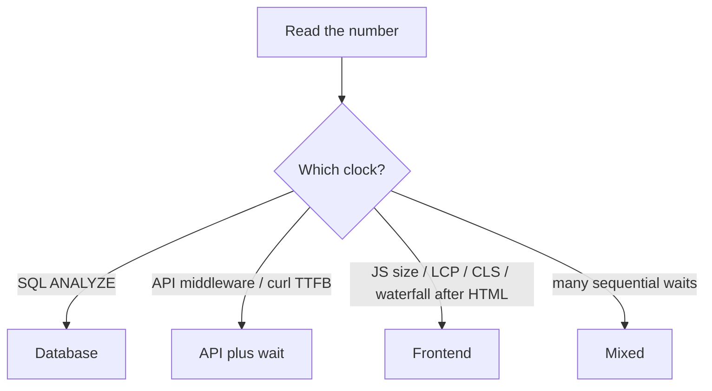

# Month 17 · Week 1 · Day 3
# From Memory: Classify a Table of Performance Numbers

**Program:** Full-Stack Mastery · 18 months  
**Phase:** 6 — Advanced engineering and system design  
**Month index:** [../../README.md](../../README.md)  
**Week 1:** [1](day-01.md) · [2](day-02.md) · Day 3 (today) · [4](day-04.md) · [5](day-05.md) · [6](day-06.md) · [7](day-07.md)  
**Week rhythm today:** Implement from memory  
**Student state:** Day 2 gate passed. You can name latency, percentiles, waterfalls, LCP/CLS, Query cache. Today those ideas must still live in your head — from **this file**.  
**Study time:** 3–4 focused hours  
**Prereq:** Day 2 gate passed.

Labs: `~\fullstack-lab\month-17\week-01\day-03\`. Do **not** copy Day 1 `NUMBERS.md`. Do **not** paste Project 7. Days 1–2 stay **closed** during the drills.

---

## How Day 3 works

Days 1 and 2 had type-along code. During the drills they stay **closed**. This file contains a recap so you are not sent to another site to learn.

Allowed:

- The complete explanation in this file  
- Your own notes in `fullstack-lab` (not Day 1–2 textbook files)  
- pytest / browser output in front of you  

Not allowed:

- Pasting a finished classification from AI  
- Opening Day 1 or Day 2 during Blocks 1–3  
- Browsing web.dev as the teacher during the drill  

If you are stuck **more than 25 minutes** on one task, open **only** the matching Day 1 or Day 2 section **in this textbook**, read it, close it, continue from memory. Record what you had to look up in `lookups.txt`. That list is tomorrow’s repair list.

There is **no answer key in the first half** of this file. You write `CLASSIFY.md` first. A worked box waits at the end for **after** you commit your attempt.

---

## How to read this chapter

A performance number is **meaningless** until you name the **clock** and the **layer**. The same “400 ms” can be SQL `actual time`, FastAPI middleware duration, `curl.exe` `time_total`, or LCP.



**Wrong belief:** “Memory day means I reread Day 1 with the file open.”  
**Correct:** the recap below is the teacher. Days 1–2 are the backup after 25 minutes.

---

## Complete explanation (measurement you must still own)

**Latency.** Time for **one** operation to finish. Units: milliseconds. You must say where the clock started (client start, server receive, SQL start).

**Throughput.** Completed operations per unit time (requests/second). High throughput with high p95 still hurts people. Count **successful** completions, not 500s that return instantly.

**Mean vs p50 vs p95 vs p99.** Mean is the arithmetic average; one outlier dominates. p50 is the median. p95 is a value such that about 95% of samples are **at or below** it (nearest-rank or equivalent — write the method). p99 needs **many** samples; a dozen curls is not p99.

**Cold vs warm.** First request pays process import, empty pools, empty caches. Warm samples ignore a few warm-up calls. Mixing them is two experiments.

**Ticket fields.** Path, load, metric, environment. “It feels slow” is a hypothesis.

**TestClient vs curl.exe vs browser.** TestClient is in-process ASGI — no TCP, no TLS, no JS. `curl.exe` is HTTP to a process. The browser adds HTML, JS parse, Query, images, main thread.

**Waterfall.** Network rows in time order. TTFB of the **document** is not TTFB of `GET /api/...`. Serial chains multiply waits.

**Bundle.** Transferred JS bytes plus parse/compile CPU. Minify ≠ small enough.

**LCP.** Largest contentful paint — hero image or main heading/list. **CLS.** Unexpected layout shift — images without dimensions, injected banners, font swap.

**TanStack Query v5.** `useQuery({ queryKey, queryFn })`. `isPending` = no success data yet. `isFetching` can be true while rows show. `staleTime` is UX. Invalidation after mutation is correctness.

**Images.** Oversized files, missing dimensions (CLS), eager below-the-fold.

**N+1.** SQL loop (Month 10–11) or HTTP loop (one list, then a GET per row). Different layers, same shape.

**Wrong belief:** “Average 40 ms means users are happy.”  
**Correct:** users live in the tail; p95/p99 and the **journey** matter.

**Wrong belief:** “Lighthouse 100 is the gate.”  
**Correct:** flashlight. Field network is worse.

**Wrong belief:** “If SQL is 5 ms, the page cannot be slow.”  
**Correct:** 2 MB JS and a waterfall of 40 GETs disagree.

**Windows.** PowerShell. `uv run`. `curl.exe`. Chrome DevTools on `127.0.0.1`.

---

## Today's contract

By the end of this day you will be able to:

1. Classify eight measurement rows as frontend, API, SQL, mixed, or “not a measurement.”  
2. Say what each number **cannot** prove.  
3. Recompute a tiny percentile table from memory.  
4. Rewrite two vibes into tickets.

**Today's gate.** Closed-book:

> I can look at a table of numbers and name the layer. I do not call mean a p95. I do not call TestClient a waterfall. I do not call Lighthouse a product requirement.

---

## Time box

| Block | Minutes | Work |
|---|---|---|
| 1 | 25 | Speak the recap; write `exam-01.md` (12–20 lines) |
| 2 | 50 | Classify eight rows in `CLASSIFY.md` |
| 3 | 45 | Mini-build: percentile helper tests from memory |
| 4 | 30 | Debug five false conclusions |
| 5 | 20 | Only now: compare to the worked box; `DIFF.md` |
| 6 | 20 | Design: one Project 7 path per layer |
| 7 | 15 | Retro + `lookups.txt` |

---

# Block 1 — Speak

No Day 1–2 files. Cover: latency vs throughput; percentiles; cold/warm; waterfall; LCP/CLS; Query `isPending` vs `isFetching`; ticket fields. Write `exam-01.md` in the lab folder — your words, not a paste of this recap.

```powershell
cd ~\fullstack-lab
mkdir month-17\week-01\day-03 -Force
cd ~\fullstack-lab\month-17\week-01\day-03
```

---

# Block 2 — Classify eight rows

Write `CLASSIFY.md`. For **each** row: layer (frontend / API / SQL / mixed / not a measurement), one thing it **supports**, one thing it **cannot** prove.

These numbers are **given**. You do not need Project 7. You do not need to run Chrome today.

**R1.** `EXPLAIN ANALYZE` for `SELECT ... FROM slips WHERE harbor_id = 1` shows `actual time=812.4 ms`, Seq Scan, 120,000 rows.

**R2.** FastAPI middleware log: `GET /slips 200 18ms` (warm, n not stated).

**R3.** Chrome Network: main JS transferred 1.72 MB; list API 22 ms; blank screen until JS finishes.

**R4.** Mean of three `curl.exe` `time_total` values: 41 ms, 39 ms, 44 ms. Report says “p95 = 41 ms.”

**R5.** LCP 3.1 s; LCP element is a 2800 px wide PNG displayed at 400 px; API 30 ms.

**R6.** 50 × `GET /slips/{id}` after one list request; each 12 ms; page usable at ~600 ms.

**R7.** Query remount shows `isPending` true every time; `staleTime` is 0; API 15 ms.

**R8.** CI fails if Lighthouse performance score < 90. No user path named.

If you want a ninth: “Kubernetes CPU limit is 100 m; p95 unknown.” Classify that too — it is a trap.

---

# Block 3 — Mini-build from memory

Days 1–2 closed. Recap is enough.

```powershell
cd ~\fullstack-lab\month-17\week-01\day-03
uv init --name lab-percentiles
uv add --dev pytest
```

Domain: **desk-hold latencies**, not Project 7.

`stats.py`: `nearest_rank_percentile(values: list[float], p: float) -> float`

- sort a copy  
- rank = `ceil(p/100 * n)` with `math.ceil`, clamped 1..n  
- return that 1-based element  
- empty list → `ValueError`  
- p outside 0..100 → `ValueError`

Tests in `test_stats.py`:

- `test_empty_raises`  
- `test_p50_odd_count` — `[10, 20, 30]` p50 is 20  
- `test_p95_ten_samples` — you pick ten numbers including a 2000 tail; assert p95 is **not** the mean  
- `test_mean_is_not_p95` — same list; `statistics.mean` differs from p95  

```powershell
uv run pytest -q
```

Write `LAYER.txt`: one sentence — these tests are **unit** tests of arithmetic, not a load test.

Do not add FastAPI today. That is Day 4.

---

# Block 4 — Debug false conclusions

Write `DEBUG.md`. For each: **wrong conclusion**, **why it is wrong**, **what to measure next**.

**A.** “R2 is 18 ms so users are happy.”  
**B.** “R4 is p95 because we averaged.”  
**C.** “R1 is 812 ms so we should add a CDN.”  
**D.** “R8 proves the product is fast.”  
**E.** “R6 is fine because each call is 12 ms.”  

No running broken product required.

---

# Block 5 — Worked box (only after CLASSIFY.md exists)

Compare. Write `DIFF.md`: three lines you had wrong, or `MATCH.txt` if you nailed it. Then read the box below.

**R1** SQL. Supports: this query is expensive; Seq Scan of 120k rows is a suspect. Cannot prove: the user’s LCP, or that an index is the only fix until you try `EXPLAIN` after a change.

**R2** API (server duration). Supports: handler + framework on that process was short **if** the clock is middleware. Cannot prove: p95, browser time, SQL (SQL could be 2 ms of the 18). n missing — not a percentile.

**R3** Frontend (JS). Supports: download/parse dominates. Cannot prove: Postgres guilt.

**R4** **Not a valid p95.** Three samples; mean labeled as p95. Supports only a tiny min/max snapshot.

**R5** Frontend (image / LCP). Mixed only if you also need API — here API is innocent.

**R6** Mixed / frontend-architecture (N+1 HTTP). Each API is fine; the **journey** is the sum plus overhead. Not “SQL is slow.”

**R7** Frontend (Query UX). API is fine. Cache policy.

**R8** **Not a measurement of a user path.** Policy/trophy. Can pass while R1 is true in production.

**Trap ninth:** a CPU limit without a latency number is **capacity config**, not evidence of slowness. Week 4.

**A–E keys:** A n=1-ish, no browser. B mean ≠ p95. C CDN does not fix Seq Scan. D score ≠ path. E N+1 HTTP.

---

# Block 6 — Design

`DESIGN.md` (10–15 lines): pick **your** primary list (name only). One number you would capture at SQL, one at API middleware, one at LCP. Which of those you **already** have (honest).

Do not paste handlers.

---

# Block 7 — Retro

`retro.md`: which row was hardest; whether you still want to report mean as the sprint metric; what you will baseline on Day 6.

```powershell
cd ~\fullstack-lab
git add month-17
git commit -m "Month 17 Day 3: classified performance numbers; percentile tests."
```

---

## Office hours

**“R2 includes SQL.”** Middleware duration **includes** SQL if the handler awaited it. Still classify as **API-layer clock**. To split, you need a SQL clock (Day 4 `EXPLAIN` or statement timing). Say “API clock, SQL unknown” if you wish — that is an A.

**“R6 is API because fetch.”** The **bug** is chatty client. Layer for the *problem* is frontend architecture / HTTP N+1. Saying “mixed” is also an A if you explain.

**pytest not found.** `uv add --dev pytest` then `uv run pytest -q`.

---

## Definition of done

- [ ] `CLASSIFY.md` completed **before** reading the worked box  
- [ ] Percentile tests green  
- [ ] `DEBUG.md` A–E attempted  
- [ ] `DIFF.md` or `MATCH.txt` after the box  
- [ ] `DESIGN.md` uses your nouns, no product source  
- [ ] Commit exists  

---

## Optional review links

Repair from this recap first.

- [Python math.ceil](https://docs.python.org/3/library/math.html#math.ceil)  

---

# Lecture: how to read a performance table

When a prompt gives `EXPLAIN ANALYZE actual time`, the first layer is **SQL**. When it gives middleware ms, the clock is **the API process**. When it gives transferred JS or LCP element, the layer is **frontend**. When it gives a **score** or a **vendor**, ask whether a **path** exists.

When someone says p95, ask **N**. If N < ~20, refuse the word p95; say min/median/max.

Write `HEURISTIC.md` (six lines): your rule for choosing the layer. Then go to Block 5 if you have not.

---

## Tomorrow

**Lab:** timing middleware + `EXPLAIN ANALYZE` review + connection pools. Still not Project 7 source.
