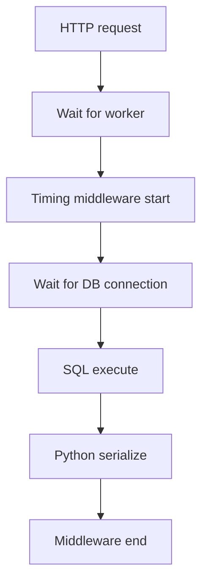

# Month 17 · Week 1 · Day 4
# Lab: API Timing Middleware, EXPLAIN ANALYZE, Connection Pools

**Program:** Full-Stack Mastery · 18 months  
**Phase:** 6 — Advanced engineering and system design  
**Month index:** [../../README.md](../../README.md)  
**Week 1:** [1](day-01.md) · [2](day-02.md) · [3](day-03.md) · Day 4 (today) · [5](day-05.md) · [6](day-06.md) · [7](day-07.md)  
**Week rhythm today:** Learn + lab feature  
**Student state:** You can classify numbers. Today you **split** an HTTP duration into “Python + wait” vs **SQL plan**, and you learn why a connection **pool** that is too small or too large both hurt.  
**Study time:** 3–4 focused hours  
**Prereq:** Day 3 gate passed. Month 10 `EXPLAIN` / `EXPLAIN ANALYZE` still belongs to you.

Labs: `~\fullstack-lab\month-17\week-01\day-04\`. Domain: **harbor desk slips**. Not Project 7 source.

---

## How to use this textbook

1. Read until you can say what middleware duration includes.  
2. Type the timing middleware. Run `EXPLAIN ANALYZE` on a **lab** query and write sentences.  
3. Do not add Redis today. Do not paste `~/ops-api/` pool settings as a personality.  
4. Optional review links are for later rechecking.

---

## How to read this chapter

An HTTP request on FastAPI spends time in **your code**, in **awaiting I/O**, and sometimes **queued** for a worker or a **database connection**. Month 11 request-id middleware already logged duration. Today that duration becomes a **tool**: compare it to SQL `actual time`. If they are close, the database dominated. If middleware is 400 ms and SQL is 8 ms, look at Python, extra queries (N+1), or the network to the DB.



**Wrong belief:** “I’ll add an index because the endpoint feels slow.”  
**Correct:** `EXPLAIN ANALYZE` first. Seq Scan of a tiny table is not a crime. Index Scan that still fetches the whole heap is not a victory.

**Wrong belief:** “pool_size=100 is professional.”  
**Correct:** each connection costs RAM on Postgres. 100 app workers × 100 pool is how you **knock over** the database. Too few connections: requests queue in the app. Too many: Postgres queues or OOMs.

---

## Today's contract

By the end of this day you will be able to:

1. Write Starlette/FastAPI middleware that logs **method, path, status, duration_ms** using `time.perf_counter()`.  
2. Compare that duration to **`EXPLAIN ANALYZE`** `actual time` for the query the handler runs.  
3. Explain **EXPLAIN** (plan only) vs **EXPLAIN ANALYZE** (runs the query).  
4. Explain **pool too small** vs **pool too large** in full sentences.  
5. Capture `pool.md` with numbers from a **tiny** SQLite or Postgres lab — not from production guesses.

**Today's gate.** Closed-book:

> Middleware duration is the API clock. EXPLAIN is a plan; ANALYZE runs it. Cost is not milliseconds; actual time is. A pool that is too small queues in the app; a pool that is too large queues or dies in Postgres. I do not add indexes without a plan.

---

## Time box

| Block | Minutes | Work |
|---|---|---|
| A | 50 | Theory |
| B | 70 | Type-along: timed API + SQL plan |
| C | 55 | Independent: pool thought-experiment + N+1 timing |
| D | 15 | Git |
| E | 15 | Recall |

---

# Block A — Theory

## 1. Timing middleware — what it is and is not

Month 11 taught request ids and JSON logs. Reuse that shape. A **duration** field is:

```text
t0 = perf_counter()  # at request start
... call_next ...
ms = (perf_counter() - t0) * 1000
```

It includes: routing, dependencies, your handler, SQL, Pydantic `model_dump()`, writing the body. It does **not** include: the client’s JS parse, Chrome queueing, TLS handshake before the request hits Uvicorn (that sits in `curl.exe` `time_connect` / `time_appconnect`).

Bind **127.0.0.1** in labs.

Log **path templates** if you can (`/slips/{id}` not `/slips/18472`) so cardinality stays sane. If you only have `request.url.path` today, say so in notes — high cardinality is a later observability problem, not an excuse to skip timing.

**Wrong belief:** “I’ll `print` in every route.”  
**Correct:** middleware is one place. Routes stay readable.

## 2. EXPLAIN vs EXPLAIN ANALYZE (Month 10, applied)

You did this on `w4_tickets`. The skill does not expire.

- **`EXPLAIN`** prints the **plan**: Seq Scan, Index Scan, Bitmap Heap Scan, Nested Loop, Hash Join, estimated **cost** and **rows**. Cost is a **planner unit**, not milliseconds.  
- **`EXPLAIN ANALYZE`** **executes** the query and adds **actual time** (ms) and **actual rows**. That is a measurement. Do not ANALYZE a 40-minute report on production as a joke.

If estimated rows and actual rows differ a lot, statistics may be stale (`ANALYZE tablename;` — different meaning from `EXPLAIN ANALYZE`).

**Seq Scan** reads the table. **Index Scan** walks a B-tree then fetches rows. Neither is morally better. A seq scan of 400 rows can beat a bad index. **Your job is sentences:** what node, why, what time.

Child **FK columns** are not auto-indexed. **N+1** is a loop of SQL; the middleware duration will look like “Python is slow” when it is **80 queries**. Fix with JOIN or `IN` / `= ANY`, parameterized (Month 10–11).

**OFFSET** pagination skips and drifts; **keyset** uses `WHERE` on the sort key. If your hot list uses `OFFSET 50000`, the plan will punish you. Mention it if you see it.

## 3. How to compare the two clocks

Suppose middleware says **840 ms** and `EXPLAIN ANALYZE` of the **one** list query says **12 ms**. Then the 840 is **not** “that SELECT.” Hunt: N+1, HTTP outbound, sleep, CPU JSON, wait on pool.

Suppose middleware says **840 ms** and ANALYZE says **830 ms** Seq Scan. Then the ticket is SQL. Hypothesis: index on `harbor_id` (or whatever you filter). **One change**, then ANALYZE again. Day 7’s loop.

## 4. Connection pools

A **pool** is a set of already-opened database connections the app reuses. Opening a TCP+auth connection per request is slow. SQLAlchemy 2.x / async engines you already configured have `pool_size` and `max_overflow`.

**Too few:** under concurrency, handlers **wait** for a free connection. Middleware duration grows; Postgres looks idle; the app is the queue. Symptoms: latency rises with concurrent users; `pg_stat_activity` is quiet.

**Too many:** Postgres spends RAM and backend processes. The **database** becomes the queue, or hits `max_connections`. Symptoms: `too many connections`; OS memory; everyone slow.

**Rough honesty for this course:** start from a small pool (e.g. 5) per **process**, know how many Uvicorn workers you run, and keep `workers × (pool_size + overflow)` **well under** Postgres `max_connections` (leave room for `psql`, migrations, admin). This is not a formula to tattoo. It is why “set pool to 200” is not a personality.

SQLite in a lab has a different story (file lock, one writer). Use SQLite to learn **timing**; use Postgres (Docker/WSL if you already have it from Month 10–15) to learn **pool wait**. If Postgres is not running today, write the pool essay from this theory and time SQLite anyway — do not skip middleware.

**Wrong belief:** “Each request should open and close a raw connection so we are clean.”  
**Correct:** that is how you add 20–100 ms of connect tax forever. Session **per request** (Month 11) is not the same as **connect** per request.

## 5. Uvicorn workers vs threads (enough for today)

One worker process handles some concurrency (async I/O). A **blocking** `time.sleep` or CPU loop blocks that worker’s event loop. `time.sleep` in an `async def` is a classic self-own: the loop cannot run other requests. Use `asyncio.sleep` only when you mean to wait; do not sleep in product code at all.

Pool wait is another blocking story if the driver blocks. Async drivers release the loop while waiting on the socket — still **latency** for that request.

## 6. What you will not do today

- You will not install an APM agent as a substitute for middleware + EXPLAIN.  
- You will not require Kubernetes HPA. Optional.  
- You will not `EXPLAIN ANALYZE` on the production primary as a load test.

---

# Block B — Type-along

```powershell
cd ~\fullstack-lab
mkdir month-17\week-01\day-04 -Force
cd ~\fullstack-lab\month-17\week-01\day-04
uv init --name lab-profile
uv add fastapi uvicorn pydantic sqlalchemy
uv add --dev pytest httpx
```

Type `db.py` — SQLite lab so Windows has zero extra services. The ORM is SQLAlchemy 2.x `mapped_column` style you already know. Keep it small.

```python
from sqlalchemy import create_engine, select, event
from sqlalchemy.orm import DeclarativeBase, Mapped, mapped_column, Session

engine = create_engine("sqlite:///slips.db", echo=False)


class Base(DeclarativeBase):
    pass


class Slip(Base):
    __tablename__ = "slips"
    id: Mapped[int] = mapped_column(primary_key=True)
    harbor_id: Mapped[int]
    name: Mapped[str]


def init_db() -> None:
    Base.metadata.create_all(engine)
    with Session(engine) as s:
        if s.scalar(select(Slip.id).limit(1)) is None:
            s.add_all(
                [Slip(harbor_id=1 if i < 50 else 2, name=f"Slip {i}") for i in range(1, 201)]
            )
            s.commit()
```

Type `main.py`. Middleware + list by `harbor_id` + a deliberately chatty endpoint.

```python
import time
from fastapi import FastAPI, Query, Request
from sqlalchemy import select
from sqlalchemy.orm import Session
from db import Slip, engine, init_db

app = FastAPI()


@app.middleware("http")
async def time_requests(request: Request, call_next):
    t0 = time.perf_counter()
    response = await call_next(request)
    ms = (time.perf_counter() - t0) * 1000
    print(f"{request.method} {request.url.path} {response.status_code} {ms:.1f}ms")
    response.headers["X-Duration-Ms"] = f"{ms:.1f}"
    return response


@app.on_event("startup")
def startup() -> None:
    init_db()


@app.get("/slips")
def list_slips(harbor_id: int = Query(...)) -> list[dict]:
    with Session(engine) as s:
        rows = s.scalars(select(Slip).where(Slip.harbor_id == harbor_id)).all()
        return [{"id": r.id, "harbor_id": r.harbor_id, "name": r.name} for r in rows]


@app.get("/slips/chatty")
def chatty(harbor_id: int = Query(...)) -> list[dict]:
    with Session(engine) as s:
        ids = s.scalars(select(Slip.id).where(Slip.harbor_id == harbor_id)).all()
        out = []
        for i in ids:
            row = s.get(Slip, i)
            if row:
                out.append({"id": row.id, "name": row.name})
        return out
```

`@app.on_event("startup")` is the older FastAPI style; if your version prefers lifespan, a lifespan context is also correct. Do not fight the framework — time the requests.

```powershell
uv run uvicorn main:app --host 127.0.0.1 --port 8017
```

Second terminal:

```powershell
curl.exe -s -D - -o NUL "http://127.0.0.1:8017/slips?harbor_id=1"
curl.exe -s -D - -o NUL "http://127.0.0.1:8017/slips/chatty?harbor_id=1"
```

Write `TIMING.md`: both `X-Duration-Ms` values. Chatty should be slower. That gap is **N+1**, not “SQLite is bad.”

SQLite `EXPLAIN QUERY PLAN` (cousin of Postgres EXPLAIN):

```powershell
uv run python -c "from sqlalchemy import text; from db import engine; conn = engine.connect(); print(conn.execute(text('EXPLAIN QUERY PLAN SELECT * FROM slips WHERE harbor_id = 1')).fetchall())"
```

Write `PLAN.md` in **four sentences**: what the plan said; whether it scanned the whole table; whether you need an index **yet**; what you would expect after `CREATE INDEX ix_slips_harbor ON slips(harbor_id);`.

If you have **Postgres** from Month 10 still running, stretch: copy the 200 rows into a throwaway table and run `EXPLAIN ANALYZE SELECT * FROM ... WHERE harbor_id = 1;` in `psql`. Write `POSTGRES.md` with Seq Scan vs Index Scan **after** creating an index. If Postgres is off, write `POSTGRES.md`: “not run; I still can explain ANALYZE vs EXPLAIN from Month 10.” Honest skip of the stretch is allowed; silent skip of `PLAN.md` is not.

Stop Uvicorn.

Add `test_timing.py`: TestClient `GET /slips?harbor_id=1` asserts 200 and `X-Duration-Ms` header present.

```powershell
uv run pytest -q
```

---

# Block C — Independent

Write `POOL.md` (15–25 lines). No cluster required.

1. 4 Uvicorn workers, `pool_size=20`, `max_overflow=10`, Postgres `max_connections=100`. Can you exhaust Postgres? Show the multiplication.  
2. 1 worker, `pool_size=2`, 50 concurrent requests that each hold a connection for 200 ms. Where do they wait?  
3. Why “set pool_size to max_connections” is a false optimization.  
4. One sentence on SQLite: pooling does not make SQLite into Postgres.

Then add an index in the lab **after** writing the pre-index plan:

```python
# run once in a small script or sqlite3
# CREATE INDEX IF NOT EXISTS ix_slips_harbor ON slips(harbor_id);
```

Re-run `EXPLAIN QUERY PLAN`. Append to `PLAN.md`: did the plan change? For 200 rows SQLite may still scan — **say that**. Small tables lie. That is the lesson: **do not celebrate an index without a plan that uses it on realistic volume**.

Write `COMPARE.md`: middleware ms vs SQL plan time for `/slips` vs `/slips/chatty`. Which clock moved?

---

# Block D — Git

```powershell
cd ~\fullstack-lab
git add month-17
git commit -m "Month 17 Day 4: timing middleware, query plan, pool notes."
```

---

# Block E — Recall

1. What middleware ms includes and excludes.  
2. EXPLAIN vs EXPLAIN ANALYZE.  
3. Cost vs actual time.  
4. Too-small vs too-large pool.  
5. Why chatty `/slips/{id}` loops show up as API time.

## Office hours

**Header missing in TestClient.** Middleware still runs; assert the header name exactly.

**`on_event` deprecated warning.** Lifespan is fine. Timing is the lesson.

**Chatty not slower.** 50 rows may be too fast on SQLite. Raise to 500 inserts in `init_db` if needed so the gap is visible. Do not use `time.sleep` to fake SQL.

**echo=True flood.** Leave `echo=False`; use EXPLAIN for plans.

Windows: `curl.exe`. Uvicorn `--host 127.0.0.1`.

## Definition of done

- [ ] Middleware prints and `X-Duration-Ms`  
- [ ] `TIMING.md` compares list vs chatty  
- [ ] `PLAN.md` four sentences + post-index note  
- [ ] `POOL.md` multiplication  
- [ ] pytest green  
- [ ] Gate paragraph spoken  
- [ ] Commit exists  

---

## Optional review links

- [PostgreSQL EXPLAIN](https://www.postgresql.org/docs/current/sql-explain.html)  
- [SQLAlchemy pooling](https://docs.sqlalchemy.org/en/20/core/pooling.html)  
- [Starlette middleware](https://www.starlette.io/middleware/)  

---

## Tomorrow

**Caching and load testing:** HTTP cache headers, app cache, Redis only with key/TTL/invalidation, CDN concept, a tiny Locust script.
