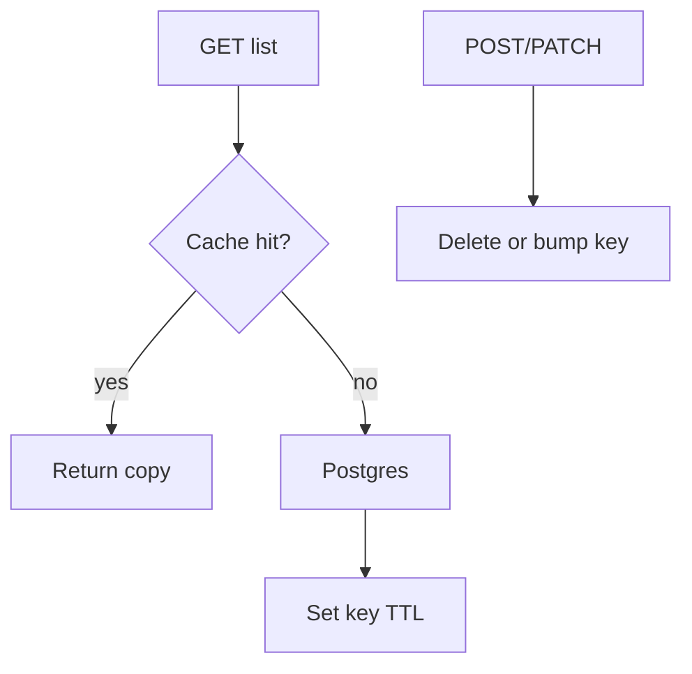

# Month 17 · Week 1 · Day 5
# Caching and Load Testing: Headers, Redis Rules, CDN, Locust

**Program:** Full-Stack Mastery · 18 months  
**Phase:** 6 — Advanced engineering and system design  
**Month index:** [../../README.md](../../README.md)  
**Week 1:** [1](day-01.md) · [2](day-02.md) · [3](day-03.md) · [4](day-04.md) · Day 5 (today) · [6](day-06.md) · [7](day-07.md)  
**Week rhythm today:** Tests + docs (plus a tiny load script you can defend)  
**Student state:** You can time an API and read a plan. Today you learn **when a cache is a lie**, how **HTTP cache headers** differ from **Redis**, what a **CDN** is for, and how to point a **tiny Locust** file at a lab — not at production.  
**Study time:** 3–4 focused hours

Labs: `~\fullstack-lab\month-17\week-01\day-05\`. This textbook will **not** paste Project 7. Redis is **optional until the three-part rule is true**.

---

## How to use this textbook

1. Read until you can refuse a cache that has no invalidation story.  
2. Type HTTP headers and a Locust file. If Redis is not running, skip the Redis lab and still write the rule.  
3. Optional review links are for later rechecking.

---

## How to read this chapter

A **cache** is a copy. Copies go stale. The only professional cache is one with:

1. a **key** (what identity is this copy?),  
2. a **TTL** (when does it die of old age?),  
3. **invalidation** (what write deletes or updates it?).

Month 11 already required that sentence for Redis. Month 17 repeats it because performance panic is how people add Redis **without** the sentence.



**Wrong belief:** “We’ll add Redis and it will scale.”  
**Correct:** Redis without invalidation serves **wrong lists**. Wrong is not a performance win.

**Wrong belief:** “Load testing is hitting F5.”  
**Correct:** a load test states **users**, **duration**, **path**, and **success criteria** (p95 and error rate). Locust (today) is one way to say that in Python.

---

## Today's contract

By the end of this day you will be able to:

1. Set and explain `Cache-Control` / `ETag` **ideas** for HTTP.  
2. Distinguish **browser/CDN cache**, **in-process app cache**, and **Redis**.  
3. Recite the Redis rule: key + TTL + invalidation **or you do not add Redis**.  
4. Explain a **CDN** as geographically distributed **static** (and sometimes cached GET) bytes — not a SQL index.  
5. Run a **tiny Locust** script against the Day 4 lab or today’s lab app; write results with **n**, error rate, and a latency number you do not over-claim.

**Today's gate.** Closed-book:

> A cache without a key, a TTL, and invalidation is a bug factory. HTTP headers talk to browsers and CDNs. Redis is not the system of record. Locust is a hypothesis tester, not a production attack. I do not load-test someone else’s server.

---

## Time box

| Block | Minutes | Work |
|---|---|---|
| A | 50 | Theory |
| B | 60 | Type-along: headers + Locust |
| C | 55 | Independent: cache design doc + optional Redis |
| D | 15 | Git |
| E | 15 | Recall |

---

# Block A — Theory

## 1. HTTP cache headers

The **browser** (and a **CDN** or reverse proxy) may store a GET response if you allow it.

| Header | Idea |
|---|---|
| `Cache-Control: no-store` | Do not keep a copy (auth pages, user-specific JSON). |
| `Cache-Control: private, max-age=60` | Browser may keep 60 s; not a shared CDN copy. |
| `Cache-Control: public, max-age=3600` | Shared caches may keep 1 hour. |
| `ETag` / `If-None-Match` | Conditional GET; **304** if unchanged. |
| `Vary` | “This cache key also depends on `Accept-Encoding` / `Authorization`.” |

**User-specific JSON** (`Authorization` cookie) behind `public` is how you leak user A’s list to user B. Default for **authenticated APIs** in this course: **`no-store`** or `private` with care. Static Vite assets with hashed filenames: **long `max-age`** — the hash **is** the invalidation.

**Wrong belief:** “I’ll Cache-Control public the slip list so we are fast.”  
**Correct:** if the list depends on who is logged in, you just built a privacy incident.

## 2. In-process app cache

A `dict` on the FastAPI module: fast, simple, **dies on restart**, **not shared** across Uvicorn workers. Invalidation must run **in every process** or you lie. Fine for a lab. Dangerous as a silent production strategy with multiple workers.

## 3. Redis cache (Month 11 applied)

Postgres remains the **system of record**. Redis holds a **copy** or ephemeral state.

Rules you already own:

- Key namespaced: `slips:list:harbor:1` not `data`.  
- TTL always.  
- After a **successful commit**, delete or overwrite the keys that include that row. Invalidate **after** commit, not before (or a failed transaction already dropped the cache and the next GET rebuilds from old DB — still better than serving new cache from uncommitted data).  
- Losing Redis must **not** lose rows.  
- Tests: fakeredis or skipif no URL.

Stampede: many GETs miss at once and all hit Postgres. TTL jitter and single-flight are later refinements. Today: do not set TTL to 1 second on a 800 ms query as a personality.

**If you cannot write the invalidation list, you do not add Redis.** An in-process dict for a lab is enough to learn the *shape*. Product Redis waits on the sentence.

## 4. CDN concept

A **Content Delivery Network** is caches **near users**, usually for **static** files (JS, CSS, images) and sometimes public GET HTML. Month 16’s CloudFront-or-equivalent idea lives here as **engineering**, not as a shopping list.

A CDN:

- **Helps:** hashed JS bundles, images, public marketing pages.  
- **Does not help:** a Seq Scan, an N+1, a 2-second POST.  
- **Introduces:** stale public content, cache-purge operations, another bill, another failure mode (origin down, CDN up with old files — or CDN down).

You do not need a CDN to pass Month 17. You need the sentence: **what bytes would it cache, and how do they invalidate?**

## 5. Load testing with Locust (this course’s pick)

**Locust** is Python. You describe **users** as classes that `wait` and `client.get`. It is not k6; k6 is fine in industry; we pick **one** and type it.

A load test needs:

1. **Target** you own (`127.0.0.1` lab).  
2. **Scenario** (GET list, maybe login — do not DDoS).  
3. **Users and spawn rate** small enough for a laptop.  
4. **Stop condition** (1–2 minutes).  
5. **Readout:** requests/s, failure %, latency percentiles Locust prints — then **humble** language (“this laptop, this Uvicorn, n=…”).

**Wrong belief:** “I’ll run 10,000 users against production to be sure.”  
**Correct:** that is an outage. Lab and staging only. Production load tests are a **scheduled**, **agreed** activity with a rollback, not a Day 5 homework against the live URL from Month 16.

**Wrong belief:** “Locust green means p95 in Chrome is fine.”  
**Correct:** Locust is **HTTP**. It skips JS parse and images. Day 2 still exists.

Locust will show averages and percentiles. You already know not to worship mean. Look at **p95** and **failures**.

## 6. Tests and docs today

The “tests/docs” rhythm: pytest on cache headers (assert `Cache-Control` on a public asset vs `no-store` on a private GET), plus `CACHE-POLICY.md` for the lab. Locust is evidence, not a substitute for pytest.

---

# Block B — Type-along

If Day 4’s app still exists, you may point Locust at port 8017. Otherwise type a tiny app here.

```powershell
cd ~\fullstack-lab
mkdir month-17\week-01\day-05 -Force
cd ~\fullstack-lab\month-17\week-01\day-05
uv init --name lab-cache
uv add fastapi uvicorn pydantic
uv add --dev pytest httpx locust
```

`main.py`:

```python
from fastapi import FastAPI
from fastapi.responses import JSONResponse, PlainTextResponse

app = FastAPI()

PRIVATE = {"id": 1, "name": "North slip"}


@app.get("/public/version")
def public_version() -> PlainTextResponse:
    return PlainTextResponse(
        "v1",
        headers={"Cache-Control": "public, max-age=60"},
    )


@app.get("/slips/me")
def my_slip() -> JSONResponse:
    return JSONResponse(
        PRIVATE,
        headers={"Cache-Control": "no-store"},
    )
```

`test_headers.py`: TestClient — `GET /public/version` has `public`; `GET /slips/me` has `no-store`.

```powershell
uv run pytest -q
```

`locustfile.py` — type it. **Host** will be CLI.

```python
from locust import HttpUser, between, task


class SlipUser(HttpUser):
    wait_time = between(0.5, 1.5)

    @task(3)
    def public_version(self) -> None:
        self.client.get("/public/version")

    @task(1)
    def me(self) -> None:
        self.client.get("/slips/me")
```

Start the app:

```powershell
uv run uvicorn main:app --host 127.0.0.1 --port 8017
```

Second terminal, **headless**, small:

```powershell
cd ~\fullstack-lab\month-17\week-01\day-05
uv run locust -f locustfile.py --host http://127.0.0.1:8017 --users 5 --spawn-rate 1 --run-time 1m --headless
```

Write `LOAD.md`: users, run-time, RPS, failure %, and one latency number Locust printed. Sentence: this is **not** Chrome LCP. Sentence: you did **not** target production.

Stop both processes.

Write `HEADERS.md`: why `/slips/me` is `no-store`; why hashed JS in production may be `max-age=31536000`.

---

# Block C — Independent

`CACHE-POLICY.md` for a fictional **public harbor map image** vs **authenticated slip list**:

1. HTTP headers for each.  
2. Would Redis help the list? If yes, write **key**, **TTL**, **invalidation on which writes**. If no, one paragraph why (correctness, uniqueness per user, list already 18 ms).  
3. CDN: which of the two would a CDN even be allowed to cache?

Optional Redis lab **only if** Redis already runs (Docker/WSL/Memurai from Month 11/15):

- `SET slips:lab:1 '{"n":1}' EX 30`  
- `GET`  
- `DEL` after a pretend write  
Write `REDIS.md` with those three commands. If Redis is off: `REDIS.md` = “not used; rule still holds.”

Do not add Redis to Project 7 today. Day 6 is baseline, not a shopping trip.

---

# Block D — Git

```powershell
cd ~\fullstack-lab
git add month-17
git commit -m "Month 17 Day 5: cache headers, Locust lab, cache policy."
```

---

# Block E — Recall

1. Three parts of a cache story.  
2. Why `public` on authenticated JSON is a leak.  
3. App dict vs Redis vs CDN.  
4. What Locust does not measure.  
5. Why production was not the `--host`.

## Office hours

**locust not found.** `uv add --dev locust` then `uv run locust ...`.

**UI mode.** Headless is enough. If you open the Locust web UI, bind locally; still 5 users.

**I only have k6.** The course picked Locust. If you already know k6, you may add a **four-line** k6 script as stretch **in addition**, not instead of Locust, unless Locust cannot install — then k6 with the same humility in `LOAD.md`.

## Definition of done

- [ ] Header tests green  
- [ ] Locust 1 minute, `LOAD.md`  
- [ ] `CACHE-POLICY.md` with key/TTL/invalidation or a refusal  
- [ ] Gate paragraph spoken  
- [ ] Commit exists  

---

## Optional review links

- [MDN Cache-Control](https://developer.mozilla.org/en-US/docs/Web/HTTP/Headers/Cache-Control)  
- [Locust documentation](https://docs.locust.io/)  
- [Month 11 Redis gate idea](../../../month-11/README.md)  

---

## Tomorrow

**Independent:** baseline **one** hot path on **your** Project 7. Numbers in `BASELINE.md`. No product source in the textbook folder.
