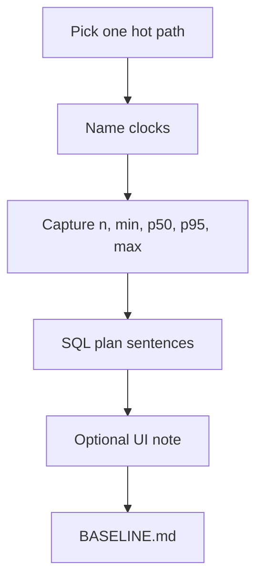

# Month 17 · Week 1 · Day 6
# Independent: Baseline One Hot Path on Project 7

**Program:** Full-Stack Mastery · 18 months  
**Phase:** 6 — Advanced engineering and system design  
**Month index:** [../../README.md](../../README.md)  
**Week 1:** [1](day-01.md) · [2](day-02.md) · [3](day-03.md) · [4](day-04.md) · [5](day-05.md) · Day 6 (today) · [7](day-07.md)  
**Week rhythm today:** Independent implementation  
**Student state:** You can measure, classify, time middleware, read a plan, and speak the cache rule. Today you apply that to **your** product — **one** path, **numbers**, no shopping.  
**Study time:** 3–4 focused hours

This textbook will **not** give you a finished `BASELINE.md` and will **not** paste Project 7. It will give you a **spec envelope** and a **forbidden list**.

Put `BASELINE.md` in **your** API or `docs/` folder (your choice, written down). A **redacted** copy may live in `~\fullstack-lab\month-17\week-01\day-06\` — **numbers and resource names only**, no handlers.

---

## How to use this textbook

1. Measure **first**. Do not add Redis, indexes, or a CDN today unless you already had them.  
2. One hot path. Not the whole app.  
3. Honest gaps are passing work. Invented p99 from three curls is not.  
4. Optional review links are for later rechecking.

---

## How to read this chapter

Week 1’s skill is not “I ran Locust once.” It is “I can **defend** a before-number for *this* product.” Day 7 will allow **one** change and a remeasure. Without today’s baseline, Day 7 is theatre.



**Wrong belief:** “I’ll optimize first so the baseline looks good.”  
**Correct:** a baseline after secret changes is a press release. Capture **current** main (or your running local), commit hash recorded.

**Wrong belief:** “I’ll paste the list router into fullstack-lab so the professor can help.”  
**Correct:** names and numbers only. Product source stays in **your** repo.

---

## Today's contract

By the end of this day you will be able to:

1. Name **one** hot API path and the UI journey that uses it (if any).  
2. Record **environment**: machine, Compose vs local, data volume (row counts **order of magnitude**).  
3. Capture **API** timings (middleware log, TestClient, or `curl.exe` — say which) with **n ≥ 20** warm samples if the path is cheap enough; if it is expensive, n ≥ 10 and say why.  
4. Run **EXPLAIN** or **EXPLAIN ANALYZE** on the **primary** query (or EXPLAIN QUERY PLAN on SQLite) and write **four sentences**.  
5. Optional: one Network note (JS size or LCP guess) — not a full audit.  
6. Write what you **will not** change until Day 7.

**Today's gate.** Closed-book:

> I have a baseline for one path: n, percentiles or honest min/median/max, environment, and a SQL plan in sentences. I did not add a cache today. I did not paste product code into fullstack-lab.

---

## Time box

| Block | Minutes | Work |
|---|---|---|
| A | 25 | Theory: what “hot” means; forbidden list |
| B | 30 | Pick path; record env; warm-up rule |
| C | 100 | Measure API + SQL; optional UI glance |
| D | 20 | Write BASELINE.md + lab redaction |
| E | 15 | Recall + git in **your** repo and lab |

---

# Block A — Theory

## 1. What “hot” means

A **hot path** is one of:

- the **list** after login (most sessions hit it),  
- a **dashboard** or summary,  
- a **search**,  
- the **create** that must feel instant  

Not: settings, avatar crop, an admin CSV export nobody runs. If two paths argue, pick the one a **user** would file “slow” on.

## 2. Clocks you will name

| Clock | How you might capture it on Windows |
|---|---|
| API | Existing request-id duration logs; or temporary middleware **in your repo** (you type it; this book does not paste it); or `curl.exe -w` |
| SQL | `EXPLAIN ANALYZE` in `psql` against **local/staging-shaped** data, never a production write |
| Browser | Network disable-cache reload of **that** screen — optional today |

If you add temporary middleware, remove it or gate it behind env before you commit to `main` if logs would flood. A few lines of duration on one route is enough.

## 3. Forbidden today

- Pasting product source into `C:\Users\Universe\Downloads\2026` or `fullstack-lab`.  
- Adding Redis “to get ahead of Day 7.”  
- Creating an index **and then** measuring only after (unless the index **already** existed). If you accidentally added one, say so — the baseline is contaminated; note the commit.  
- Locust against the **production** URL.  
- Claiming p99.  
- GraphQL/Kafka/K8s as required work.

## 4. Data volume

“Works on my 12-row database” is a different system. Write **approximate counts** of the primary table. If local data is tiny, say: “baseline is tiny-data; production-shaped volume is a **gap**.” That gap is honest and **passing**. Inventing 10 million rows you do not have is not required today; **naming** the gap is.

## 5. Success criteria are not the baseline

A baseline is **what is**. An SLO (“p95 < 300 ms”) is **what you want**. You may write a **target** as a hypothesis. Do not fail the day because local p95 is “too high.” You are measuring.

---

# Block B — Pick and freeze

In **your** repo, checkout the branch you actually run (usually `main` or develop). Record:

```text
git rev-parse --short HEAD
```

Write `~\fullstack-lab\month-17\week-01\day-06\ENV.md`:

- OS (Windows), how API starts (uvicorn, Compose, …)  
- Postgres vs SQLite  
- HEAD short hash  
- Warm-up: discarded first N requests  

Do not start measuring until this file exists.

```powershell
cd ~\fullstack-lab
mkdir month-17\week-01\day-06 -Force
```

---

# Block C — Measure

## C1 — API samples

Warm the path (login if needed — **your** test user, not production customers). Then collect **n** durations.

PowerShell example for a **public lab-like** GET (adjust URL and headers **you** already use; do not copy secrets into the textbook folder):

```powershell
$times = @()
1..25 | ForEach-Object {
  $t = curl.exe -s -o NUL -w "%{time_total}" http://127.0.0.1:8000/YOUR-PATH
  $times += [double]$t
}
$times | Measure-Object -Average -Minimum -Maximum
```

If the path needs a cookie, use **your** existing login flow; put only the **method** in notes (“cookie from test user”), not the cookie value.

Sort the times. Compute min, p50, p95 (nearest-rank from Day 3), max. Put them in `BASELINE.md`.

If `curl.exe` is the wrong clock (SPA), still measure the **API** URL the Network panel shows — that is the API baseline. UI is C3.

## C2 — SQL

In `psql` (or your GUI’s explain):

```sql
EXPLAIN ANALYZE
-- your list or detail query, parameterized as you really run it
```

Write four sentences: node type, actual time, rows, whether an index was used. If you cannot get ANALYZE (permissions), `EXPLAIN` only and say so.

Do not run ANALYZE on a statement that **writes**.

## C3 — Optional UI

One reload, cache disabled: JS transferred on that route (order of KB/MB), and whether LCP looks like a spinner, heading, or image. Three lines. Skip if the API is the agreed hot path and UI is trivial.

## C4 — Do not “fix”

If you see N+1 in logs, **write it as a hypothesis** for Day 7. Today you only baseline.

---

# Block D — Documents

## `BASELINE.md` in **your** product docs (required)

Headings **you** fill:

1. Path (URL pattern + UI route name)  
2. Environment + git hash  
3. Load (1 user, local)  
4. API: n, min, p50, p95, max, clock used  
5. SQL: four sentences  
6. UI (or “skipped”)  
7. Hypotheses (max three) — not implemented  
8. Explicit: no Redis added today  

## Lab copy `~\fullstack-lab\month-17\week-01\day-06\BASELINE-REDACTED.md`

Same numbers. Replace secret hostnames if any. **No source.**

Write `CHECKLIST.md` in the lab: all contract items ticked with yes/no.

---

# Block E — Recall + git

Recall: why a baseline after adding an index is dishonest; four ticket fields; Locust vs Chrome.

```powershell
cd ~\fullstack-lab
git add month-17
git commit -m "Month 17 Day 6: redacted hot-path baseline notes."
```

Commit `BASELINE.md` in **your** Project 7 repo with a message you own, e.g. `docs: Month 17 Week 1 API baseline.`

---

## Office hours

**I have no duration logs.** Temporary middleware in **your** code is allowed. Or `curl.exe -w`. Do not skip numbers.

**Auth makes curl hard.** Browser Network timing on the API row is acceptable if you export **n** samples by reloading; say n is small if it is. Better: TestClient in **your** test suite with a timer — still not pasted here.

**EXPLAIN needs production-sized data I lack.** Write the tiny-data limitation. Optionally restore a **sanitized** dump you already have. Do not dump production PII into the lab.

**Multiple APIs on one screen.** Baseline the **slowest** API row, plus mention the count of calls (HTTP N+1).

## Definition of done

- [ ] `BASELINE.md` in the product repo with n and plan sentences  
- [ ] Redacted copy in fullstack-lab, no source  
- [ ] No new Redis/index/CDN as today’s “win”  
- [ ] Gate paragraph spoken  
- [ ] Two commits (lab + product docs) or an honest note that product commit waits on your process  

---

## Optional review links

Repair from this week’s chapters first.

- [PostgreSQL EXPLAIN](https://www.postgresql.org/docs/current/sql-explain.html)  
- [curl.exe -w](https://curl.se/docs/manpage.html#-w)  

---

## Tomorrow

**Review:** one change, remeasure, debug five false optimizations. Bring `BASELINE.md`.
