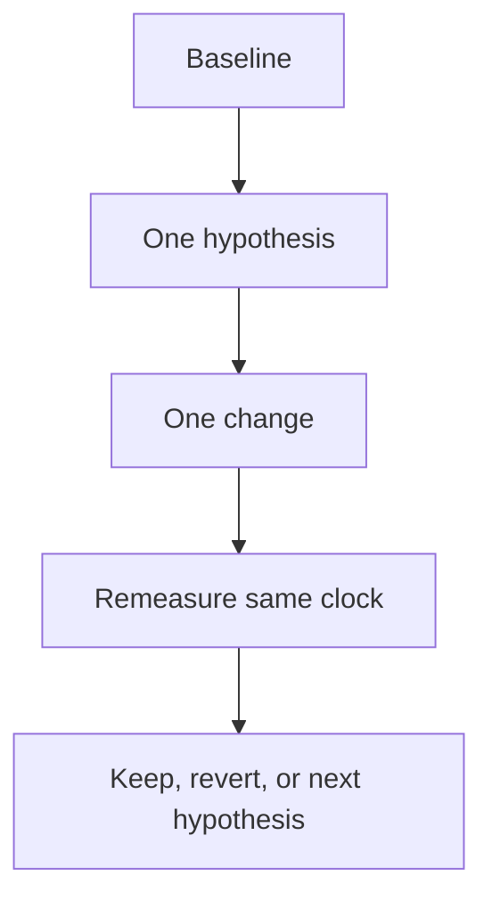

# Month 17 · Week 1 · Day 7
# Review: One Change, Remeasure, Five False Optimizations

**Program:** Full-Stack Mastery · 18 months  
**Phase:** 6 — Advanced engineering and system design  
**Month index:** [../../README.md](../../README.md)  
**Week 1:** [1](day-01.md) · [2](day-02.md) · [3](day-03.md) · [4](day-04.md) · [5](day-05.md) · [6](day-06.md) · Day 7 (today)  
**Week rhythm today:** Weekly review  
**Student state:** You have a **baseline**. Today you prove the Month 17 loop: **one** change, then **remeasure**. Then you debug five optimizations that look like engineering and are not.  
**Study time:** 3–4 focused hours  
**Prereq:** Day 6 `BASELINE.md` exists (product and/or redacted lab copy).

Textbook files for Days 1–6 stay **closed** during Blocks 1–4 except **this file**. Repair forgotten facts from the **synthesis below**.

Work in `~\fullstack-lab\month-17\week-01\day-07\` for review evidence. Product change, if you make one, lives in **your** repo. This textbook will **not** paste Project 7.

---

## How to read this chapter

This file is the **teacher** for Week 1. The synthesis is written so you can re-learn measurement without opening six days.



**Wrong belief:** “I changed five things and it feels faster.”  
**Correct:** you cannot name which change worked. Revert the pile. One change.

---

## Today's contract

By the end of this day you will be able to:

1. Teach Week 1 aloud from this synthesis.  
2. Apply **one** change to the **lab** (required) and optionally to Project 7.  
3. Remeasure with the **same** clock, n, and warm-up.  
4. Debug five false optimizations in writing.  
5. Decide keep vs revert with numbers.

**Today's gate.** Closed-book:

> Measure, hypothesize, one change, remeasure. Latency is not throughput. p95 is not mean. Cache needs key, TTL, invalidation. I can name five false optimizations including cache without invalidation, N+1, missing index, giant bundle, and blocking work on the request.

---

## Time box

| Block | Minutes | Work |
|---|---|---|
| 0 | 25 | Read synthesis; speak it |
| 1 | 30 | Closed-book `exam-01.md` |
| 2 | 50 | Lab: one change + remeasure (`mini/`) |
| 3 | 30 | Debug five false optimizations |
| 4 | 40 | Optional: one Project 7 change **or** explicit defer |
| 5 | 15 | Design: what Week 2 will not fix |
| 6 | 15 | Retro + git |

---

## Week 1 synthesis (the lesson, in this book)

**Measurement first.** A performance ticket names **path**, **load**, **metric**, **environment**. “It feels slow” is a hypothesis generator.

**Latency** is time for one request (say where the clock starts). **Throughput** is completions per second (count successes). High RPS with terrible p95 is still a failure.

**Mean** is dominated by outliers. **p50** is median. **p95** needs enough samples (nearest-rank or equivalent, method written down). **p99** from a dozen curls is theatre. **Cold vs warm** are different experiments.

**Clocks.** TestClient is in-process ASGI. `curl.exe` is HTTP. Browser waterfall includes JS and images. Middleware duration is the API process (includes SQL wait if the handler awaited it). `EXPLAIN` is a plan; **`EXPLAIN ANALYZE`** runs it; **cost ≠ ms**; **actual time** is ms. Seq Scan vs Index Scan: sentences, not morals. Small tables lie.

**Frontend.** Waterfalls, bundle parse cost, **LCP** (largest paint), **CLS** (shift). TanStack Query v5 `useQuery({ queryKey, queryFn })`: `isPending` vs `isFetching`; `staleTime` is UX; invalidation is correctness. Images: size, dimensions, lazy vs hero.

**Pools.** Too few connections: queue in the app. Too many: queue or crash Postgres. `workers × pool` must respect `max_connections`.

**Cache.** Key + TTL + invalidation **or do not add Redis**. HTTP: do not `public`-cache authenticated JSON. CDN: static/public bytes, not a Seq Scan fix. In-process dict: not shared across workers.

**Locust.** Tiny, local, not production. HTTP only — not LCP.

**N+1.** SQL loop or HTTP loop. Middleware looks “slow Python.”

**Product work** is checklists and `BASELINE.md`. Labs are gyms.

**Wrong belief:** “We’ll add Redis and Kafka and it will scale.”  
**Correct:** name the failure you prevent and the failure you introduce. Kafka is optional and not this week.

---

# Complete explanation — false optimizations you must still own

## 1. Cache without invalidation

You store `GET /slips` in Redis for 24 hours. A slip is renamed. Users see the old name. Support tickets. You “fixed” latency by breaking truth. **Repair:** invalidate on write after commit, or do not cache.

## 2. N+1 (SQL or HTTP)

80 queries or 80 fetches, each fast. The journey is slow. **Repair:** JOIN / `IN` / a richer list payload. Not a bigger instance.

## 3. Missing index (or unused index)

Filter on `harbor_id` over 120k rows, Seq Scan, 800 ms. **Repair:** index that matches the `WHERE`/`ORDER`, then `EXPLAIN ANALYZE` again. An index that is never used is write tax.

## 4. Giant bundle

API is 20 ms; 1.8 MB JS blocks paint. **Repair:** split routes, stop importing unused charts, shrink images. Not Redis.

## 5. Sync / blocking on the request

`time.sleep`, SMTP, PDF generation, a 12 MB JSON dump on the event loop. **Repair:** do less, or **Week 2** move work to a queue. Adding Kubernetes replicas duplicates the blocking.

Other cousins: OFFSET 50_000; `public` cache leak; Locust against production; pooling 200 connections per worker.

---

# Block 0 — Speak the synthesis

Out loud: four ticket fields; latency vs throughput; p95 vs mean; three clocks; cache rule; five false optimizations. Then Block 1.

---

# Block 1 — Closed-book (30 min)

```powershell
cd ~\fullstack-lab
mkdir month-17\week-01\day-07 -Force
```

Write `exam-01.md` (20–35 lines):

1. Latency vs throughput.  
2. Why mean of `{20,20,2000}` is a bad ticket.  
3. Middleware ms vs ANALYZE actual time — how you split blame.  
4. Query `isPending` vs `isFetching`.  
5. Redis three-part rule.  
6. The **one** change you will make in Block 2 (lab) and how you will remeasure.

If you cannot fill it, re-read the synthesis. Do not open Day 4 yet except to copy **your** lab folder path from memory.

---

# Block 2 — Lab: one change and remeasure (50 min)

Textbook closed except this spec. Use Day 4’s slip app **or** rebuild a **tiny** copy here (`mini/`). Domain remains harbor slips.

Required:

1. **Baseline** chatty list (`/slips/chatty` or equivalent N+1) — n=15 warm, min/p50/p95/max via TestClient + `perf_counter` or `X-Duration-Ms`. Write `before.md`.  
2. **One change:** replace the per-id loop with a **single** `select` where `harbor_id = ...` (the non-chatty query). Do not also add an index and Redis.  
3. **After** numbers in `after.md`, same n and clock.  
4. `DELTA.md`: did p95 drop? If not, say so — maybe SQLite is too small; then **increase row count** and repeat **once**, still one logical change (the query shape).  
5. pytest: chatty route may stay as a **bad example** or you delete it; a test asserts the **good** list returns 200 and length > 0.

```powershell
uv run pytest -q
```

Must not: Celery, Kafka, product source, Locust against a non-lab host.

---

# Block 3 — Debug (30 min)

Write `DEBUG.md`. For each: **what someone did**, **why it is false**, **what evidence would have stopped them**.

**A.** Cached `GET /slips` in Redis for 12 hours; PATCH rename; cache not deleted.  
**B.** Added `for slip in slips: db.get(Slip, slip.id)` because “get by PK is O(1).”  
**C.** Refused an index because Seq Scan “is simpler”; 200k rows, filter 0.1% selectivity; never ran ANALYZE.  
**D.** Doubled the EC2 instance class because LCP was 4 s; Network showed 2.1 MB JS and a 3 MB PNG.  
**E.** Called `smtp.send` inside the POST handler; p95 of create became 1.8 s; added a second Uvicorn worker and called it “horizontal scale.”

Then **F (bonus):** `Cache-Control: public, max-age=3600` on `GET /slips/me`.

---

# Block 4 — Project 7 (optional implementation, required decision)

Open **only** your `BASELINE.md`. Write `PRODUCT.md` in the lab (no source):

- **Either** you make **one** change in **your** repo (e.g. kill an HTTP N+1, or add an index you **proved** with EXPLAIN), remeasure, record after-numbers and hash.  
- **Or** you **defer** with a reason (“data too tiny to prove index”; “risk too high before Week 2”; “need a test first”). Defer is a **passing** answer if the reason is specific.

Do not add Redis unless key/TTL/invalidation are written **and** a test exists. Do not paste diffs of product code here — hashes and numbers only.

---

# Block 5 — Design

`WEEK2.md` (8–12 lines): which of today’s false optimizations is actually a **background job** problem (E). What a second server will not fix about SMTP-in-request.

---

# Block 6 — Retro + git

`retro.md`: weakest clock this week; whether you still want to report mean; Day 6 baseline quality (honest).

```powershell
cd ~\fullstack-lab
git add month-17
git commit -m "Month 17 Week 1 review: one change, remeasure, false optimizations."
```

If you changed Project 7, commit **there** separately with a message about the measured change.

---

## Worked answers — check after you write DEBUG.md

**A.** Stale read; invalidate after commit or skip cache. Evidence: a test that PATCH then GET sees new name.  
**B.** HTTP/SQL N+1; PK get in a loop is still N round trips. Evidence: query count / duration vs one SELECT.  
**C.** Missing index; ANALYZE actual time. Evidence: plan change after `CREATE INDEX`.  
**D.** Giant bundle / images; waterfall. Evidence: transferred bytes, LCP element.  
**E.** Sync in request; workers duplicate the wait. Evidence: middleware ms ≈ SMTP RTT. Week 2: queue.  
**F.** Privacy; `no-store` / `private`. Evidence: two users must not share a cached body.

If your written answers disagree, fix them from this box **only after** you attempted A–E alone.

---

## Office hours

**After numbers worse.** Write that. Revert. Hypothesize. Small SQLite is a valid reason the N+1 gap is tiny — then grow rows, do not add Redis.

**I changed product and lab.** Fine. Two `DELTA` stories. Still **one** change **each**.

**No Day 6 baseline.** Do a **mini** baseline now on the lab only; mark Week 1 product baseline as owed. Do not start Week 2 pretending Day 6 happened.

Windows: `uv run pytest -q`. `curl.exe`.

## Definition of done

- [ ] exam-01 teaches the loop and names the lab change  
- [ ] before.md + after.md + DELTA.md  
- [ ] DEBUG.md A–E  
- [ ] PRODUCT.md decision  
- [ ] Commit exists  

---

## Optional review links

Repair from this synthesis first.

- [PostgreSQL EXPLAIN](https://www.postgresql.org/docs/current/sql-explain.html)  
- [MDN Cache-Control](https://developer.mozilla.org/en-US/docs/Web/HTTP/Headers/Cache-Control)  
- [TanStack Query invalidation](https://tanstack.com/query/latest/docs/framework/react/guides/query-invalidation)  

---

# Lecture: how to read a before/after table

If `before.md` and `after.md` use different n, different clocks, or mixed cold/warm, the delta is **not science**. Rewrite the after capture. A p95 that moved 2% on n=15 is noise; say so in `DELTA.md` instead of claiming victory.

If chatty and non-chatty are equal on 50 SQLite rows, you **grew the table** once. You did not add Redis. The lesson is the **shape** of N+1, not a vendor.

Write `CLOCK.md` (eight lines): which clock you used in Block 2; why Chrome LCP would be the wrong clock for that SQL-loop change; why Locust against production would be wrong even if p95 “improved.”

Closed-book cards (answers in `retro.md`):

1. Four ticket fields.  
2. Mean of `{20,20,2000}`.  
3. Middleware vs ANALYZE.  
4. Cache three-part rule.  
5. Why more Uvicorn workers do not fix SMTP-in-request (preview of Week 2).

If you miss two, re-read the synthesis only.

## Scoring Block 2

| Piece | Honest pass |
|---|---|
| Same clock before and after | Not TestClient then curl |
| Same n and warm-up | Written in both files |
| One change | Not index plus Redis |
| DELTA.md names the metric | p95 or honest min/max |
| pytest still green | Chatty optional |

If after is worse, revert and write why. That still **passes** the review if the loop is real.

---

## Next week

**Background processing.** The request thread is the wrong place for work that must survive a crash. Queue, worker, at-least-once, retries, idempotency. You will not paste Project 7’s worker. You will type a tiny one in the lab, then add **one** real workflow to **your** app from a checklist.
