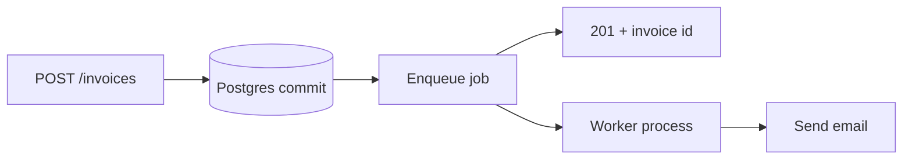
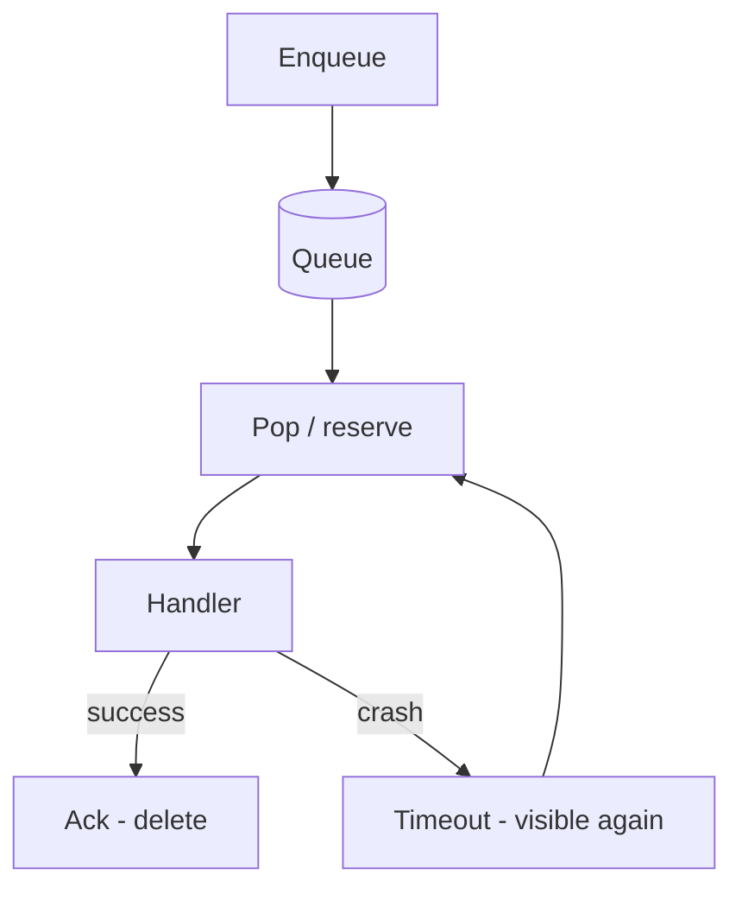

# Month 17 · Week 2 · Day 1
# The Request Is the Wrong Place: Queues, Workers, At-Least-Once

**Program:** Full-Stack Mastery · 18 months  
**Phase:** 6 — Advanced engineering and system design  
**Month index:** [../../README.md](../../README.md)  
**Week 2:** Day 1 (today) · [2](day-02.md) · [3](day-03.md) · [4](day-04.md) · [5](day-05.md) · [6](day-06.md) · [7](day-07.md)  
**Week rhythm today:** Learn + type-along  
**Student state:** Week 1’s loop is true: you measure before you guess. Yesterday you saw SMTP-in-request as a false scale-out. Today you learn the **shape** that replaces it: a **queue** and a **worker**. Retries and idempotency are Day 2. The tiny worker lab is Day 4.  
**Study time:** 3–4 focused hours

**This week covers:** why the HTTP thread is the wrong place, queues, workers, at-least-once, Redis lists vs a broker, retries, backoff, jitter, idempotency, poison messages, DLQ, cron, job status, one real workflow on **your** Project 7.

Labs: `~\fullstack-lab\month-17\week-02\day-01\`. Product work stays in **your** repos. This textbook will **not** paste Project 7.

---

## How to use this textbook

1. Read a section. Close it. Say why `BackgroundTasks` is not a job queue.  
2. Type the contrast lab: HTTP returns 201 while a **separate** process does work.  
3. Optional review links are for later rechecking.

---

## How to read this chapter

An HTTP request has a **budget**: a client timeout, a load-balancer timeout, a human waiting. Work that must **finish even if the client hangs up**, or that takes **seconds to minutes**, or that **talks to a flaky neighbor** (email, PDF, webhooks), does not belong in the request handler as its only home.



**Wrong belief:** “Background jobs are `asyncio.create_task` in the request.”  
**Correct:** if the process dies, the task dies. A request that must survive a restart belongs on a **queue** with a **worker**, **retries**, and **idempotency** (Day 2).

**Wrong belief:** “FastAPI `BackgroundTasks` is our architecture.”  
**Correct:** Month 9 told you it runs **after the response, same process**. Fine for a log line. Not fine for “we billed the card and must email the receipt.”

---

## Today's contract

By the end of this day you will be able to:

1. Name three kinds of work that **must not** live only in the request.  
2. Draw enqueue → worker → ack (or fail).  
3. Explain **at-least-once** delivery without claiming exactly-once.  
4. Contrast a **Redis list** (or SQLite table) used as a queue with a **broker** (RabbitMQ, SQS, Kafka — optional, named as ideas).  
5. Explain why the HTTP handler still **commits business data first** (or in the same transaction as an outbox — Week 3), not “fire email then maybe commit.”

**Today's gate.** Closed-book:

> The request is for a short, user-visible answer. Durable work goes on a queue. A worker pulls jobs. At-least-once means I may see duplicates; I design for that. Redis LIST is a tool, not a religion. BackgroundTasks is not a broker. Celery is not magic I skip understanding.

---

## Time box

| Block | Minutes | Work |
|---|---|---|
| A | 55 | Theory |
| B | 55 | Type-along: enqueue file + worker process |
| C | 70 | Independent: classify eight pieces of work |
| D | 15 | Git |
| E | 15 | Recall |

---

# Block A — Theory

## 1. What the request thread is for

The handler should:

- authenticate / authorize,  
- validate (Pydantic v2),  
- **commit** the system-of-record change (Postgres),  
- return **201/200** with a body the UI can cache via TanStack Query.

The handler should **not**, as the only mechanism:

- send email over SMTP,  
- generate a 40-page PDF,  
- call a partner HTTP API that takes 8 seconds,  
- resize 20 uploaded images,  
- wait for a human.

Those can **start** from a request (enqueue). They **finish** in a worker.

Week 1 Day 7’s false optimization E was: SMTP in POST, then “scale” with more workers. You scaled **waiting**.

## 2. Queue + worker — the vocabulary

| Word | Meaning in this course |
|---|---|
| **Job / message** | A small payload: `{"type": "send_invoice_email", "invoice_id": 44}` |
| **Queue** | A durable-enough list of jobs waiting for work |
| **Enqueue** | API (or cron) **appends** a job after (or with) the business commit |
| **Worker** | A **separate process** that **pops** jobs and runs handlers |
| **Ack** | Worker tells the queue “this job is done” so it is not retried |
| **Nack / fail** | Worker could not finish; job may return for retry (Day 2) |
| **Visibility timeout** | Job is hidden while in flight; if the worker dies, it **reappears** |

That last row is the heart of **at-least-once**: crash after send but before ack → the job runs **again**.



## 3. At-least-once, at-most-once, exactly-once

**At-most-once:** fire and forget. Process dies → job lost. Users never get the email. Simple. Usually wrong for money and mail.

**At-least-once:** do not lose the job. You **will** get duplicates when crashes and timeouts overlap. This is the default honest model for Redis lists, SQS, most brokers.

**Exactly-once:** as a **magic property of the pipe**, you should not claim it. What you **can** do is **exactly-once effects** via **idempotency** (Day 2): the handler may run twice; the **side effect** happens once (one email row, one charge).

**Wrong belief:** “Our broker is exactly-once so I will not write idempotent workers.”  
**Correct:** brokers lie, retries happen, humans re-push. Idempotency is **your** job. Week 3 will refuse “exactly-once” again for events.

## 4. Redis list vs a real broker

You already know Redis (Month 11). A common beginner queue:

- `LPUSH jobs '{...json...}'`  
- worker `BRPOP jobs 5` (block up to 5 seconds)

**What that is:** a list in memory (with Redis persistence if you configured it). Fast. Familiar.

**What that is not:**

- delayed retry with backoff (you will **build** it or use a sorted set — Day 2/4)  
- poison-message isolation (Day 2/5)  
- competing consumers with well-documented ack (BRPOP **removes** the item: if you crash **after** pop **before** finishing, the job is **gone** unless you used a safer pattern)

**Safer Redis pattern (idea today, code Day 4):** `BRPOPLPUSH` / `BLMOVE` from `jobs` to `jobs:processing`, then delete from processing on success. If the worker dies, a **reaper** moves stuck items back. That is still a **list pretending to be a broker**.

**Brokers** (RabbitMQ, Amazon SQS, Redis Streams, Kafka): visibility timeouts, consumer groups, dead-letter **features**. They **cost** ops (Month 16 already taught that extra boxes cost). Kafka is **optional** in this program — do not add it to look senior.

**SQLite / Postgres table as queue:** `INSERT` a row `status=pending`; worker `UPDATE ... WHERE id = ... AND status=pending` (lock). Survives Redis being down. Slower. Fine for **one** workflow on a modular monolith. Many production systems start here.

**Wrong belief:** “If I do not use Celery, I am not a backend engineer.”  
**Correct:** Celery is a **framework on top of a broker**. If you cannot enqueue JSON and ack, Celery is a hat on a mystery.

## 5. Commit then enqueue — the dual-write preview

If you `commit()` the invoice and then `LPUSH` and Redis is down, the user has an invoice and **no job**. If you `LPUSH` then `commit()` fails, the worker may send email for a row that does not exist.

This is the **dual-write** problem. Week 3’s **outbox** is the grown-up fix: write the job row **in the same Postgres transaction** as the invoice, then a publisher drains the outbox. **Today:** know the lie exists. For the lab, a SQLite/Redis enqueue **after** commit plus a “repair” checklist is enough. Do not pretend it cannot fail.

## 6. What FastAPI should return

`201` with the invoice **id** and `status: queued` for the email. The UI does not wait for SMTP. Query invalidation still runs on the **invoice** resource, not on “email sent.”

If the product **must** show “email sent” live, that is a **job status** field (Day 5) or polling/SSE (Week 3) — not a 25-second POST.

## 7. Worked examples — in request or on a queue?

| Work | Place | Why |
|---|---|---|
| Validate body, 422 | Request | Fast, user must see it |
| Insert invoice row | Request | System of record |
| Send invoice PDF email | Queue | Slow, flaky, must retry |
| Compute `can_edit` | Request | Pure, microseconds |
| Nightly reconciliation | Cron → queue | Not a user click |
| Stripe charge | Request **or** queue with extreme care | Duplicate charge is Week 7’s exam cousin — Day 2 idempotency; often a queue **plus** idempotency key |

## 8. What you will not do today

- You will not install Celery as a personality.  
- You will not add Kafka.  
- You will not paste Project 7 workers.

## 9. Say it — closed-book drill

BackgroundTasks vs worker; at-least-once vs lost jobs; why BRPOP alone can **lose** work; dual-write in one sentence.

---

# Block B — Type-along

```powershell
cd ~\fullstack-lab
mkdir month-17\week-02\day-01 -Force
cd ~\fullstack-lab\month-17\week-02\day-01
uv init --name lab-queue-shape
uv add fastapi uvicorn pydantic
uv add --dev pytest httpx
```

You will use the **filesystem as a queue** so Redis being off is not a blocker. JSON files in `queue/` are jobs. A **second** command is the worker. This is pedagogically ugly and **honest**.

`main.py`:

```python
import json
import uuid
from pathlib import Path
from fastapi import FastAPI
from pydantic import BaseModel, Field

app = FastAPI()
QUEUE = Path("queue")
INVOICES: dict[str, dict] = {}


class InvoiceIn(BaseModel):
    to_email: str
    amount_cents: int = Field(gt=0)


@app.on_event("startup")
def startup() -> None:
    QUEUE.mkdir(exist_ok=True)


@app.post("/invoices", status_code=201)
def create_invoice(body: InvoiceIn) -> dict:
    inv_id = str(uuid.uuid4())
    rec = {"id": inv_id, "to_email": body.to_email, "amount_cents": body.amount_cents}
    INVOICES[inv_id] = rec
    job = {"type": "send_invoice_email", "invoice_id": inv_id}
    (QUEUE / f"{inv_id}.json").write_text(json.dumps(job), encoding="utf-8")
    return {**rec, "email": "queued"}
```

`worker.py`:

```python
import json
import time
from pathlib import Path

QUEUE = Path("queue")
DONE = Path("done")


def main() -> None:
    DONE.mkdir(exist_ok=True)
    QUEUE.mkdir(exist_ok=True)
    print("worker started")
    while True:
        files = list(QUEUE.glob("*.json"))
        if not files:
            time.sleep(0.5)
            continue
        path = files[0]
        job = json.loads(path.read_text(encoding="utf-8"))
        print(f"SENDING invoice {job['invoice_id']} (fake)")
        path.replace(DONE / path.name)


if __name__ == "__main__":
    main()
```

Terminal 1:

```powershell
uv run uvicorn main:app --host 127.0.0.1 --port 8018
```

Terminal 2:

```powershell
uv run python worker.py
```

Terminal 3:

```powershell
curl.exe -s -X POST http://127.0.0.1:8018/invoices -H "Content-Type: application/json" -d "{\"to_email\":\"a@b.test\",\"amount_cents\":1500}"
```

Watch the worker print. The POST returned **before** “SENDING” if you were quick — or even if not, the **architecture** is two processes. Write `SHAPE.md`: what happens if you **Ctrl+C the worker** after POST but before it moves the file? (Job stays in `queue/` — **at-least-once** when you restart. Contrast: if the worker had deleted first, job **lost**.)

Stop both. Write `CRASH.md`: this file queue deletes-on-success via `replace`. If `print` is “send” and crash happens **after print before replace**, restart **sends again**. That is at-least-once. Day 2 exists.

`test_enqueue.py`: TestClient POST 201, `email` queued, a json file exists. Do **not** run the worker in pytest today (infinite loop).

```powershell
uv run pytest -q
```

---

# Block C — Independent

Write `CLASSIFY.md`. For each: **request / queue / either with reason**.

1. 422 on missing email  
2. Insert invoice row  
3. SMTP send  
4. Audit log line to stdout  
5. Generate 15 MB PDF  
6. `can_edit` predicate  
7. Call partner API, 2–10 s, retries  
8. Return invoice `id` to the SPA  

Then `RISKS.md`: file-as-queue vs Redis `BRPOP` vs Postgres table — one failure mode each. No Kafka required.

`MY-WORK.md`: name **one** Project 7 workflow that should leave the request (or “none yet — Week 2 Day 6 will still pick a small one”). Names only.

---

# Block D — Git

```powershell
cd ~\fullstack-lab
git add month-17
git commit -m "Month 17 Week 2 Day 1: queue shape, file worker, classification."
```

---

# Block E — Recall

1. Why BackgroundTasks dies with the process.  
2. At-least-once vs at-most-once.  
3. Why exactly-once-the-pipe is a claim to refuse.  
4. Dual-write in one sentence.  
5. BRPOP loss mode.

## Office hours

**Worker burns CPU.** `sleep(0.5)` is lab-grade. Brokers block. Do not `sleep` in FastAPI handlers to fake async.

**I already have Celery.** Still type this lab. You must own the shape under the hat.

**pytest left files.** Use `tmp_path` if you refactor; today’s lesson is the shape.

Windows: two terminals. `curl.exe`. Ctrl+C worker cleanly.

## Definition of done

- [ ] POST 201 while worker is a separate process  
- [ ] `SHAPE.md` + `CRASH.md`  
- [ ] `CLASSIFY.md` eight rows  
- [ ] pytest enqueue green  
- [ ] Gate paragraph spoken  
- [ ] Commit exists  

---

## Optional review links

- [FastAPI Background Tasks](https://fastapi.tiangolo.com/tutorial/background-tasks/) — reread as **not** a broker  
- [Redis lists](https://redis.io/docs/latest/develop/data-types/lists/)  

---

## Tomorrow

**Retries, exponential backoff, jitter, idempotency keys, poison messages.** The duplicate send in `CRASH.md` becomes a design problem, not a surprise.
