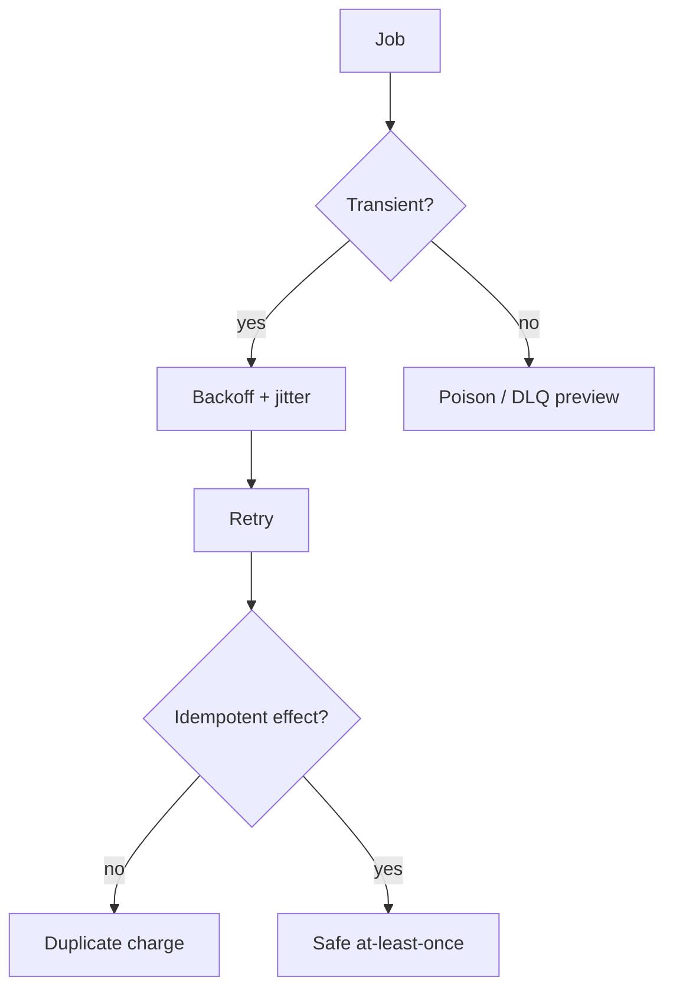

# Month 17 · Week 2 · Day 2
# Retries, Backoff, Jitter, Idempotency, Poison Messages

**Program:** Full-Stack Mastery · 18 months  
**Phase:** 6 — Advanced engineering and system design  
**Month index:** [../../README.md](../../README.md)  
**Week 2:** [1](day-01.md) · Day 2 (today) · [3](day-03.md) · [4](day-04.md) · [5](day-05.md) · [6](day-06.md) · [7](day-07.md)  
**Week rhythm today:** Exercises + debugging (theory is in this file)  
**Student state:** Day 1 gate passed. You know at-least-once duplicates exist. Today you make retries **survivable**: wait longer each time, do not stampede, **do not charge twice**, and stop retrying **poison**.  
**Study time:** 3–4 focused hours  
**Prereq:** Day 1 gate passed.

Labs: `~\fullstack-lab\month-17\week-02\day-02\`. Do not charge a real card. Do not paste Project 7.

---

## How to use this textbook

1. Read until you can compute the next delay with jitter on paper.  
2. Type the retry helper and an idempotency set.  
3. Optional review links are for later rechecking.

---

## How to read this chapter

A **retry** is a second attempt after a **failure you believe is transient**. A **poison message** is a job that **will not succeed** with the current payload (bug, 422-equivalent, missing invoice). Retrying poison forever is how a worker becomes a CPU heater and an email cannon.



**Wrong belief:** “Retry immediately in a tight loop until it works.”  
**Correct:** you DDoS your neighbor and yourself. **Exponential backoff** plus **jitter**.

**Wrong belief:** “Idempotency is a unique email column.”  
**Correct:** Month 11’s HTTP `Idempotency-Key` was for **POST**. Workers need a **job key** (invoice_id + type) so a **second run** does not create a second side effect.

---

## Today's contract

By the end of this day you will be able to:

1. Distinguish **transient** vs **permanent** failures.  
2. Implement **exponential backoff**: `base * 2**attempt`, capped.  
3. Add **jitter** so ten workers do not retry on the same millisecond.  
4. Store an **idempotency key** for a side effect.  
5. Define **poison** and why infinite retries are a bug.  
6. Explain duplicate **charge** vs duplicate **email** (different costs).

**Today's gate.** Closed-book:

> I retry transients with capped exponential backoff and jitter. I do not retry validation bugs forever. At-least-once requires idempotent handlers. An idempotency key names the effect. Poison messages need a dead-letter path (Day 5), not hope.

---

## Time box

| Block | Minutes | Work |
|---|---|---|
| A | 50 | Theory |
| B | 75 | Type-along: backoff + idempotent send |
| C | 50 | Independent: classify failures; charge scenario |
| D | 15 | Git |
| E | 15 | Recall |

---

# Block A — Theory

## 1. What is worth retrying

**Transient (retry):** SMTP connection reset, 503 from a partner, Postgres serialization failure, Redis briefly down, DNS blip.

**Permanent (do not retry the same payload):** `to_email` fails your validator; invoice_id does not exist; 401 from **your** bug; `amount_cents` negative that should have been rejected at enqueue.

**Ambiguous:** HTTP 500 from a partner. Often retry a **few** times, then poison. HTTP 400: usually permanent.

**Wrong belief:** “Retry all exceptions.”  
**Correct:** `ValueError` from **your** parser is poison. `ConnectionError` is transient. Catch **narrowly**.

## 2. Exponential backoff

Attempt 0 fails. Wait `base` (e.g. 0.5 s). Attempt 1: `2 * base`. Attempt 2: `4 * base`. Cap at `max_delay` (e.g. 60 s) so you do not wait a day between tries without a **schedule** (Day 5).

```text
delay = min(max_delay, base * (2 ** attempt))
```

`attempt` starts at 0 for the first **retry wait** (after the first failure). Write it down in code comments so you do not double the exponent by accident.

**Why exponential:** the neighbor is overloaded. Linear `sleep(1)` forever still hammers. Exponential gives the system **air**.

## 3. Jitter

Ten workers fail together (shared outage). They wake together. That is a **retry storm**. **Jitter** adds randomness:

**Full jitter (honest default for this course):**

```text
delay = random.uniform(0, min(max_delay, base * (2 ** attempt)))
```

**Equal jitter:** exponential midpoint plus a random sliver. Full jitter is enough to type today.

**Wrong belief:** “Jitter is unprofessional; I want deterministic retries.”  
**Correct:** determinism belongs in **tests** (inject a clock and a `random` port). In production, synchronized retries are a self-DoS.

Month 14 taught injecting clocks. Same idea: `delay_fn` is a port.

## 4. Idempotency keys for jobs

Month 11: client sends `Idempotency-Key` on POST; you store key + body hash + response.

Workers: the **key** is often `f"{job_type}:{invoice_id}"` or a UUID generated **once at enqueue** and stored on the job forever.

Handler:

1. If key is **completed** in a `job_results` table (or Redis `SET key NX` with status), **return** — do not send again.  
2. Do the side effect.  
3. Record completed.

Race: two workers process the same job (visibility timeout too short). You need a **unique constraint** on the key or `SET NX`. The loser **skips** the side effect.

**Email:** sending twice is bad (annoyance, sometimes legal). **Charge:** sending twice is **catastrophic**. Same pattern; higher stakes. Stripe-like APIs often accept an **idempotency key** you must pass through — still **your** table if you also have an internal worker.

**Wrong belief:** “I’ll check `if already_sent` without a unique constraint.”  
**Correct:** two processes both see false. Unique + handle conflict (Month 11 race).

## 5. Poison messages

A job whose handler **raises a permanent error** every time. If you retry with backoff forever:

- the queue never drains,  
- logs fill,  
- you may still **partially** succeed (charged but crashed before ack) — that is why idempotency exists **and** why you inspect poison.

**Today:** after `max_attempts` (e.g. 5), stop. Write the job to `poison/` (file lab) or a table. Day 5 names this a **dead-letter queue (DLQ)** and adds operator workflow.

Do not `except Exception: pass` and ack. That is **at-most-once with a smile**.

## 6. Timeouts are part of retry design

If SMTP has no timeout, a worker hangs; visibility expires; another worker sends; the first also sends. **Timeouts + idempotency** travel together.

## 7. What you will not do today

- Celery `autoretry_for=(Exception,)` as a substitute for thinking.  
- Retrying POST from the **SPA** blindly (Query `retry` on mutations is a product choice; default is danger). TanStack Query v5: think before `retry` on POST.

---

# Block B — Type-along

```powershell
cd ~\fullstack-lab
mkdir month-17\week-02\day-02 -Force
cd ~\fullstack-lab\month-17\week-02\day-02
uv init --name lab-retry
uv add --dev pytest
```

`backoff.py`:

```python
import random


def exp_delay(attempt: int, base: float = 0.5, cap: float = 30.0) -> float:
    if attempt < 0:
        raise ValueError("attempt")
    raw = base * (2 ** attempt)
    return min(cap, raw)


def exp_delay_jitter(
    attempt: int,
    base: float = 0.5,
    cap: float = 30.0,
    rng: random.Random | None = None,
) -> float:
    ceiling = exp_delay(attempt, base, cap)
    r = rng or random.Random()
    return r.uniform(0, ceiling)
```

Tests: attempt 0 → 0.5; attempt 1 → 1.0; high attempt → cap; jitter with `Random(0)` is **deterministic** in the test.

`idempotency.py`:

```python
class FakeMailer:
    def __init__(self) -> None:
        self.sent: list[str] = []
        self.completed: set[str] = set()

    def send_invoice(self, key: str, to: str) -> str:
        if key in self.completed:
            return "duplicate"
        self.sent.append(to)
        self.completed.add(key)
        return "sent"
```

Tests: two calls same key → `sent` length 1, second returns `"duplicate"`; different keys → length 2.

`poison.py`:

```python
PERMANENT = (ValueError,)


def should_retry(exc: BaseException, attempt: int, max_attempts: int = 5) -> bool:
    if isinstance(exc, PERMANENT):
        return False
    return attempt + 1 < max_attempts
```

Tests: `ValueError` → False; `ConnectionError` attempt 0 → True; attempt 4 with max 5 → False.

```powershell
uv run pytest -q
```

Write `STORM.md`: 20 workers, no jitter, 1.0 s backoff — when do they retry? One paragraph on jitter.

---

# Block C — Independent

`FAILURES.md` — transient / permanent / ambiguous:

1. `smtplib.SMTPServerDisconnected`  
2. Invoice id not in database  
3. `json.JSONDecodeError` on the job file  
4. Partner HTTP 429  
5. Partner HTTP 422  
6. `asyncio.TimeoutError`  
7. `IntegrityError` unique on idempotency key (is this failure or **success of the other worker**?)  

**Row 7 is a trick.** Write it.

`CHARGE.md` (15 lines): worker charges a card then crashes before ack. Second run. What **must** exist so the customer is billed once? Name the key. Do not implement Stripe.

`QUERY.md`: should `useMutation` retry a “pay invoice” POST by default? Yes/no and why (SPA retry × worker retry = explosion).

---

# Block D — Git

```powershell
cd ~\fullstack-lab
git add month-17
git commit -m "Month 17 Week 2 Day 2: backoff, jitter, idempotency tests."
```

---

# Block E — Recall

1. Formula for capped exponential delay.  
2. Why jitter exists.  
3. Idempotency key vs “check a flag.”  
4. Poison vs transient.  
5. Timeout + duplicate send.

## Office hours

**`Random(0)` not stable across Python versions.** Pin the assertion to “0 <= x <= ceiling” plus one seeded call you print once into the test — or only test `exp_delay` exactly and jitter’s **range**.

**I want Celery retry today.** Type these tests first.

## Definition of done

- [ ] pytest green (backoff, mailer, poison)  
- [ ] `STORM.md`, `FAILURES.md`, `CHARGE.md`  
- [ ] Gate paragraph spoken  
- [ ] Commit exists  

---

## Optional review links

- [AWS Architecture: exponential backoff and jitter](https://aws.amazon.com/blogs/architecture/exponential-backoff-and-jitter/) — idea, not an AWS requirement  
- [Month 11 idempotency lab](../../../month-11/week-04/day-04.md)  

---

## Tomorrow

**From memory:** design a “send invoice email” job from spec. Days 1–2 closed during drills.
