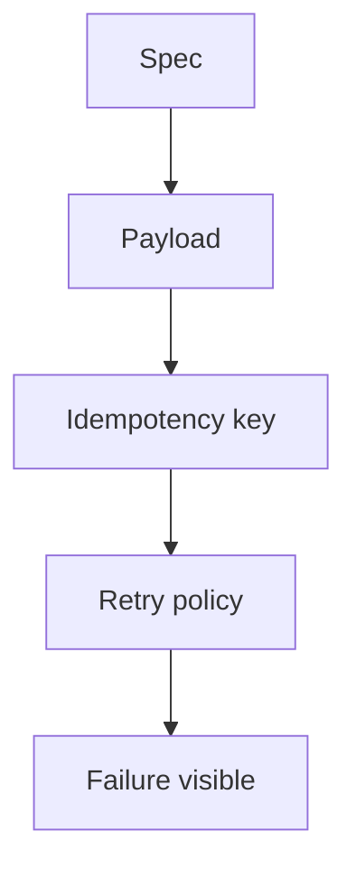

# Month 17 · Week 2 · Day 3
# From Memory: Design a Send-Invoice-Email Job

**Program:** Full-Stack Mastery · 18 months  
**Phase:** 6 — Advanced engineering and system design  
**Month index:** [../../README.md](../../README.md)  
**Week 2:** [1](day-01.md) · [2](day-02.md) · Day 3 (today) · [4](day-04.md) · [5](day-05.md) · [6](day-06.md) · [7](day-07.md)  
**Week rhythm today:** Implement from memory  
**Student state:** Day 2 gate passed. You can explain queues, at-least-once, backoff, jitter, idempotency, poison. Today you **design** one job from a spec — from **this file**.  
**Study time:** 3–4 focused hours  
**Prereq:** Day 2 gate passed.

Labs: `~\fullstack-lab\month-17\week-02\day-03\`. Do **not** open Day 1–2 textbook files during Blocks 1–3. Do **not** paste Project 7.

---

## How Day 3 works

Days 1 and 2 stay **closed** during the drills. This recap is the teacher.

Allowed: this file; your fullstack-lab notes; pytest output.

Not allowed: AI-written design as the first draft; Celery docs as the teacher; browsing Day 4 “to get ahead.”

If stuck **more than 25 minutes**, open **only** the matching Day 1 or Day 2 section, read, close, continue. Record `lookups.txt`.

No answer key in the first half. Worked box after you write `DESIGN.md`.

---

## How to read this chapter

A job design is a **contract**: payload, enqueue point, worker steps, retry policy, idempotency key, poison behavior, what the HTTP response contains.



**Wrong belief:** “I’ll write `send_email()` in the router and add retry later.”  
**Correct:** the design names **where** the process boundary is **before** Day 4’s code.

---

## Complete explanation (jobs you must still own)

**Request vs worker.** HTTP: auth, validate, commit SoR, enqueue, return 201. Worker: side effects (SMTP, PDF, partner HTTP).

**BackgroundTasks / create_task.** Same process; die on restart. Not a queue.

**At-least-once.** Crash before ack → job returns. Duplicates happen. **Exactly-once pipe** is a claim to refuse. **Idempotent effects** are required for money and mail.

**Redis LIST BRPOP.** Removes the message; crash after pop can **lose** work unless you use a processing list + reaper, Streams, a broker, or a DB row.

**Dual-write.** Commit + enqueue are two systems. They can diverge. Outbox is Week 3. Today: name the risk.

**Transient vs permanent.** Disconnect, 429, timeout → retry. Bad JSON, missing row, validation → poison, not infinite retry.

**Backoff.** `min(cap, base * 2**attempt)`. **Jitter:** random in `[0, delay]` so workers do not align.

**Idempotency key.** Stable string, unique constraint or `SET NX`. Second run returns “already done.” Checking a flag without uniqueness races.

**Poison / max_attempts.** Then dead-letter (Day 5). Do not ack on unknown failure.

**Timeouts** on the side effect, or visibility timeout causes overlapping workers.

**SPA.** Do not blindly retry pay mutations (`useMutation` retry). Worker retries are enough.

**Wrong belief:** “Unique email in users table is job idempotency.”  
**Correct:** that is a different constraint. The job key is `send_invoice_email:{invoice_id}` (or enqueue UUID).

**Windows.** PowerShell, `uv run pytest`, `curl.exe` tomorrow not today.

---

## Today's contract

1. Produce a complete job design from the spec below.  
2. Classify eight enqueue-or-not prompts.  
3. Rebuild backoff + idempotent fake mailer from memory.  
4. Debug five bad designs.

**Today's gate.** Closed-book:

> I can specify payload, key, retries, poison, and HTTP response for send-invoice-email. I do not put SMTP in the request as the only path. I do not claim exactly-once.

---

## Time box

| Block | Minutes | Work |
|---|---|---|
| 1 | 25 | Speak recap; `exam-01.md` |
| 2 | 50 | `DESIGN.md` from spec |
| 3 | 45 | Mini-build from memory |
| 4 | 30 | Debug five designs |
| 5 | 20 | Worked box; `DIFF.md` |
| 6 | 20 | Map one Project 7 name |
| 7 | 15 | Retro |

---

# Block 1 — Speak

Cover: request vs queue; at-least-once; BRPOP loss; backoff+jitter; key uniqueness; poison. Write `exam-01.md` (12–20 lines).

```powershell
cd ~\fullstack-lab
mkdir month-17\week-02\day-03 -Force
cd ~\fullstack-lab\month-17\week-02\day-03
```

---

# Block 2 — Design from spec

**Product (gym, not Project 7):** Harbor Desk issues **invoices** for slip fees. After an invoice row is committed, the customer must receive **one** email with amount and invoice id. SMTP is fake in production-like labs. The SPA shows the invoice immediately; it must **not** wait for SMTP.

Write `DESIGN.md` with **exactly** these headings:

1. **HTTP** — method, path, success status, JSON fields (no SMTP in the request).  
2. **Payload** — JSON keys the worker needs (not the whole invoice blob if an id suffices).  
3. **Enqueue moment** — after commit / with outbox (name the dual-write risk).  
4. **Idempotency key** — string format.  
5. **Retry** — max attempts, base, cap, jitter yes/no.  
6. **Permanent failures** — three examples.  
7. **Poison** — what happens after max attempts (folder/table is enough).  
8. **Timeout** — one sentence.  
9. **Observability** — you will log `invoice_id` and `job_id` (Day 5); mention them.  
10. **What you will not build today** — Celery, Kafka, real Gmail.

Then `CLASSIFY.md` — request / queue / neither:

**T1.** Pydantic rejects `amount_cents=0`.  
**T2.** `INSERT` invoice.  
**T3.** SMTP send.  
**T4.** `asyncio.create_task(smtp)` in the router.  
**T5.** Nightly “retry all poison” without a human.  
**T6.** Return `{id, email: "queued"}`.  
**T7.** Worker `print` fake send.  
**T8.** Query `retry: 3` on the pay mutation.

---

# Block 3 — Mini-build from memory

```powershell
uv init --name lab-invoice-job
uv add --dev pytest
```

`backoff.py`: `exp_delay(attempt, base=0.5, cap=30.0)` as Day 2.

`mailer.py`: `FakeMailer.send(key, to) -> "sent"|"duplicate"` with a `completed` set.

Tests: delays; duplicate key; `ValueError` is not retried using a `should_retry` helper you write.

```powershell
uv run pytest -q
```

Write `WHY-UNIT.txt`: these tests are not a broker.

---

# Block 4 — Debug

`DEBUG.md` — wrong design, why, repair:

**A.** Router `smtplib` then 201.  
**B.** `BRPOP` then send; no processing list; kill -9.  
**C.** Retry `except Exception` 100 times, `sleep(0)`.  
**D.** Idempotency: `SELECT sent FROM invoices` without unique/lock; two workers.  
**E.** Ack then send (ack before side effect).

---

# Block 5 — Worked box (after DESIGN.md and CLASSIFY.md)

**DESIGN (essence):** POST `/invoices` 201 `{id, to_email, amount_cents, email: "queued"}`. Payload `{type, invoice_id}` or include `to_email` **copied at enqueue** so a later email change does not silently retarget — **say which you chose**. Key `send_invoice_email:{invoice_id}`. Dual-write named. Retry 5×, base 0.5, cap 30, jitter. Permanent: missing invoice, invalid email, JSON decode. Poison after max. Timeout on SMTP. Logs ids. No Celery required.

**T1** request (validation). **T2** request. **T3** queue. **T4** neither-as-architecture (same process — wrong). **T5** dangerous automation — not “the” worker design; human+DLQ. **T6** request. **T7** queue (lab). **T8** neither — do not.

**A** blocks user; process crash loses send. **B** at-most-once loss. **C** storm + poison CPU. **D** double send. **E** lost email, job gone.

Write `DIFF.md` or `MATCH.txt`.

---

# Block 6 — Design your product (names)

`MY-JOB.md`: one workflow name on Project 7 that fits this template, or “we will pick on Day 6.” Payload keys as **names**, no source.

---

# Block 7 — Retro

`retro.md` + `lookups.txt`.

```powershell
cd ~\fullstack-lab
git add month-17
git commit -m "Month 17 Week 2 Day 3: invoice job design; backoff tests."
```

---

## Office hours

**Copied email vs lookup.** Both valid if you discuss stale copy vs missing row. Pick one in DESIGN.md.

**T4 “it is a queue in memory.”** Grade as wrong architecture for durable mail.

## Definition of done

- [ ] DESIGN.md before the worked box  
- [ ] CLASSIFY.md  
- [ ] pytest green  
- [ ] DEBUG.md A–E  
- [ ] DIFF or MATCH  
- [ ] Commit exists  

---

## Optional review links

Repair from this recap first.

- [FastAPI Background Tasks](https://fastapi.tiangolo.com/tutorial/background-tasks/)  

---

## Tomorrow

**Lab:** tiny worker — enqueue JSON, process, ack, retry. Python + Redis **or** SQLite if Redis is off. Not Celery magic.
