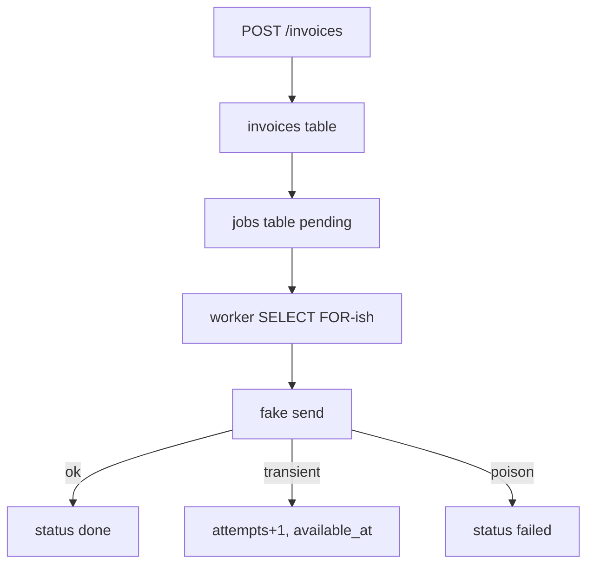

# Month 17 · Week 2 · Day 4
# Lab: A Tiny Worker — Enqueue, Process, Ack, Retry

**Program:** Full-Stack Mastery · 18 months  
**Phase:** 6 — Advanced engineering and system design  
**Month index:** [../../README.md](../../README.md)  
**Week 2:** [1](day-01.md) · [2](day-02.md) · [3](day-03.md) · Day 4 (today) · [5](day-05.md) · [6](day-06.md) · [7](day-07.md)  
**Week rhythm today:** Learn + lab feature  
**Student state:** You designed send-invoice-email. Today you **type** a worker you can explain: JSON in, handler, ack, retry with backoff. Redis if it is already in your life; **SQLite queue** if not. Not Celery as a personality.  
**Study time:** 3–4 focused hours  
**Prereq:** Day 3 gate passed.

Labs: `~\fullstack-lab\month-17\week-02\day-04\`. Domain: **harbor invoices**. Not Project 7 source.

---

## How to use this textbook

1. Read the ack protocol until you can explain a crash **between** send and ack.  
2. Type **every** module. Do not `pip install celery` to skip the lab.  
3. Optional review links are for later rechecking.

---

## How to read this chapter

A worker is an ordinary Python process with a loop: **reserve** a job, **run** a handler, **ack** or **schedule retry**. If you cannot draw that loop, a framework will only hide it.



**Wrong belief:** “I’ll call Celery.delay and I have learned queues.”  
**Correct:** you have learned a function call. Today you store JSON and change **status** yourself.

**Wrong belief:** “Redis BRPOP is enough.”  
**Correct:** BRPOP deletes on pop. Today’s default lab is a **SQLite table** so ack is an `UPDATE`. Redis stretch uses `BLMOVE` if you already run Redis.

---

## Today's contract

By the end of this day you will be able to:

1. Enqueue a job row (or Redis payload) **after** creating an invoice record.  
2. Run `worker.py` as a **second process**.  
3. **Ack** on success (`status=done` or delete from processing).  
4. **Retry** transient failures with `available_at` in the future (backoff).  
5. Stop after `max_attempts` with `status=failed`.  
6. Prove with pytest: duplicate handler is idempotent; poison does not loop forever in the test.

**Today's gate.** Closed-book:

> I enqueue JSON, a worker reserves it, success acks, transient retries with a future time, poison stops. I can explain crash-after-send. I did not need Celery to do that. Redis is optional; SQLite is a valid queue for this lab.

---

## Time box

| Block | Minutes | Work |
|---|---|---|
| A | 45 | Theory: reserve/ack; SQLite vs Redis |
| B | 80 | Type-along: API + worker |
| C | 50 | Independent: crash drill + tests |
| D | 15 | Git |
| E | 15 | Recall |

---

# Block A — Theory

## 1. Reserve is not read

If two workers `SELECT * FROM jobs WHERE status='pending'` and both send, you double-email. You need **one winner**:

- SQLite: `BEGIN IMMEDIATE`; pick oldest pending with `available_at <= now`; `UPDATE ... status='working' AND id=... AND status='pending'`; check `rowcount == 1`.  
- Postgres (product later): `FOR UPDATE SKIP LOCKED`.  
- Redis: `BLMOVE` source → processing (atomic).

**Wrong belief:** “I’ll use a sleep so they don’t collide.”  
**Correct:** sleep is not a lock (Month 14). `rowcount` is.

## 2. Ack after the side effect

Order:

1. Reserve.  
2. Perform side effect (fake mail).  
3. Ack (done).  

If you ack **before** send, crash loses the email (**at-most-once**). If you send **then** crash before ack, restart sends again (**at-least-once**) — **idempotency** makes that safe.

## 3. Retry with `available_at`

Do not `time.sleep(16)` inside the worker for backoff — that pins a process. Set `available_at = now + delay`, `status=pending`, `attempts += 1`, loop to the next job. Sleep **short** (0.2 s) only when the queue is empty.

Jitter: `random.uniform(0, exp_delay(attempts))` when you compute `available_at`.

## 4. SQLite as queue — honest limits

One writer. Fine for a lab and even some small products. Not a reason to skip the ideas. WAL mode helps (`PRAGMA journal_mode=WAL`) if you want; not required to pass the day.

## 5. Redis stretch (optional)

If Redis runs (Docker/WSL/Memurai):

- enqueue: `LPUSH invoices:jobs <json>`  
- reserve: `BLMOVE invoices:jobs invoices:processing LEFT LEFT` (or `BRPOPLPUSH` on older Redis)  
- ack: `LREM invoices:processing 1 <json>`  
- retry: `LPUSH` again later (or a sorted set with score=timestamp — stretch)

If you crash after BLMOVE, the JSON sits in `processing`. Write a **reaper** note: if you skip the reaper, say **that is a known hole**. The SQLite path has a clearer ack. **Prefer SQLite today** unless you already wanted Redis practice.

## 6. FastAPI surface

`POST /invoices` 201, Pydantic v2, `model_dump()` if you return models. Body: `to_email`, `amount_cents`. Enqueue job `{type, invoice_id, to_email}`. Return `email: "queued"`.

Fake mailer: append to `sent.jsonl` or an in-memory list **in the worker process** (the API process will not see it — **that is the point**). Tests can import the handler function directly.

---

# Block B — Type-along

```powershell
cd ~\fullstack-lab
mkdir month-17\week-02\day-04 -Force
cd ~\fullstack-lab\month-17\week-02\day-04
uv init --name lab-worker
uv add fastapi uvicorn pydantic
uv add --dev pytest httpx
```

Type `queue.py` — SQLite helpers. Keep SQL obvious.

```python
import json
import sqlite3
import time
import uuid
from pathlib import Path

DB = Path("lab.db")


def connect() -> sqlite3.Connection:
    conn = sqlite3.connect(DB)
    conn.row_factory = sqlite3.Row
    conn.execute("PRAGMA foreign_keys = ON")
    return conn


def init() -> None:
    with connect() as c:
        c.executescript(
            """
            CREATE TABLE IF NOT EXISTS invoices (
              id TEXT PRIMARY KEY,
              to_email TEXT NOT NULL,
              amount_cents INTEGER NOT NULL
            );
            CREATE TABLE IF NOT EXISTS jobs (
              id TEXT PRIMARY KEY,
              type TEXT NOT NULL,
              payload TEXT NOT NULL,
              status TEXT NOT NULL,
              attempts INTEGER NOT NULL DEFAULT 0,
              available_at REAL NOT NULL,
              last_error TEXT
            );
            CREATE TABLE IF NOT EXISTS mail_log (
              key TEXT PRIMARY KEY,
              to_email TEXT NOT NULL
            );
            """
        )
```

`enqueue(invoice_id, to_email)` inserts `type='send_invoice_email'`, `status='pending'`, `available_at=time.time()`, payload JSON.

`reserve()` as in Block A. `ack(job_id)`, `fail_permanent(job_id, err)`, `retry(job_id, attempts, err, delay)`.

Type `handlers.py`:

```python
import json
import sqlite3

from queue import connect  # if name clash with stdlib, name the file jobqueue.py instead


def send_invoice_email(conn: sqlite3.Connection, payload: dict) -> None:
    key = f"send_invoice_email:{payload['invoice_id']}"
    try:
        conn.execute(
            "INSERT INTO mail_log(key, to_email) VALUES (?, ?)",
            (key, payload["to_email"]),
        )
    except sqlite3.IntegrityError:
        return
    # Fake SMTP: the INSERT is the side effect.
```

If `queue.py` shadows `queue` stdlib, **rename your module to `jobstore.py`**. Do that if imports hurt. This textbook would prefer `jobstore.py` — type that name if you already collided.

**Use `jobstore.py` as the filename** to avoid shadowing.

Type `main.py`: FastAPI create invoice + enqueue in the **same** SQLite connection `commit()` so this lab **avoids dual-write** (both tables one DB — that is a baby outbox). Mention in `NOTES.md`: two databases would need Week 3.

Type `worker.py`:

```python
import time
from jobstore import init, reserve, ack, retry, fail_permanent, connect
from handlers import send_invoice_email
from backoff import exp_delay_jitter

MAX = 5


def once() -> bool:
    job = reserve()
    if job is None:
        return False
    payload = json.loads(job["payload"])
    try:
        with connect() as conn:
            send_invoice_email(conn, payload)
            conn.commit()
        ack(job["id"])
    except ValueError as e:
        fail_permanent(job["id"], str(e))
    except Exception as e:
        n = job["attempts"] + 1
        if n >= MAX:
            fail_permanent(job["id"], str(e))
        else:
            retry(job["id"], n, str(e), exp_delay_jitter(n - 1))
    return True


def main() -> None:
    init()
    while True:
        if not once():
            time.sleep(0.25)


if __name__ == "__main__":
    main()
```

You must implement `backoff.py` from Day 2 (copy **by typing**, not by opening Day 2 if you still remember; looking at **your** Day 2 lab code is allowed).

Wire `reserve` to increment attempts **or** increment only on retry — pick one, document it. Do not increment twice.

```powershell
uv run python -c "from jobstore import init; init()"
uv run uvicorn main:app --host 127.0.0.1 --port 8018
```

Second terminal:

```powershell
uv run python worker.py
```

Third:

```powershell
curl.exe -s -X POST http://127.0.0.1:8018/invoices -H "Content-Type: application/json" -d "{\"to_email\":\"dock@harbor.test\",\"amount_cents\":2500}"
```

Confirm `mail_log` has one row:

```powershell
uv run python -c "from jobstore import connect; c=connect(); print(list(c.execute('SELECT * FROM mail_log'))); print(list(c.execute('SELECT id,status,attempts FROM jobs')))"
```

Write `RUN.md` with those outputs (lab data, not product).

Stop worker and Uvicorn.

---

# Block C — Independent

## C1 — Crash drill (on paper + a test)

Write `CRASH.md`: worker inserted `mail_log` then died before `ack`. On restart, `reserve` sees `working` stuck. **Your** `reserve` must not leave rows in `working` forever.

**Repair to type:** `reserve` also reclaims `working` rows older than 30 seconds (lab timeout) back to `pending`. That is a baby visibility timeout. Implement it. Write `VISIBILITY.md`.

## C2 — Tests

`test_worker.py`:

- `test_once_sends_and_acks` — enqueue via jobstore, `once()`, mail_log=1, status done  
- `test_second_once_is_duplicate_safe` — call `send_invoice_email` twice; still one mail_log  
- `test_value_error_is_failed` — handler raised or a special payload `to_email="bad"` you reject as `ValueError`  
- `test_transient_retries` — monkeypatch handler to raise `ConnectionError` once; `once()` twice; attempts increment; not failed yet  

```powershell
uv run pytest -q
```

## C3 — Redis note

`REDIS.md`: either “skipped, SQLite queue used” or a short log of BLMOVE experiment. Skipping Redis is **passing**.

---

# Block D — Git

```powershell
cd ~\fullstack-lab
git add month-17
git commit -m "Month 17 Week 2 Day 4: sqlite job worker with ack and retry."
```

---

# Block E — Recall

1. Why reserve must be exclusive.  
2. Ack-before-send vs send-before-ack.  
3. Why sleep-the-backoff in the worker is the wrong place.  
4. How one SQLite DB avoided dual-write.  
5. Visibility timeout in one sentence.

## Office hours

**`queue.py` import chaos.** Rename `jobstore.py`. Delete the bad file.

**SQLite locked.** One worker in the lab. Close extra `connect()` with context managers.

**Worker infinite loop in pytest.** Call `once()`, never `main()`.

**IntegrityError on invoices.** Use UUID ids.

Windows: three terminals. `curl.exe`. `--host 127.0.0.1`.

## Definition of done

- [ ] POST 201; worker writes mail_log  
- [ ] Visibility reclaim documented and coded  
- [ ] pytest four tests green  
- [ ] `REDIS.md` skip or stretch  
- [ ] Gate paragraph spoken  
- [ ] Commit exists  

---

## Optional review links

- [SQLite transactions](https://www.sqlite.org/lang_transaction.html)  
- [Redis BLMOVE](https://redis.io/docs/latest/commands/blmove/)  
- [PostgreSQL SKIP LOCKED](https://www.postgresql.org/docs/current/sql-select.html) — product later  

---

## Tomorrow

**Dead-letter, scheduled/cron jobs, job status in DB, logs with job id.** Operators must **see** failure.
