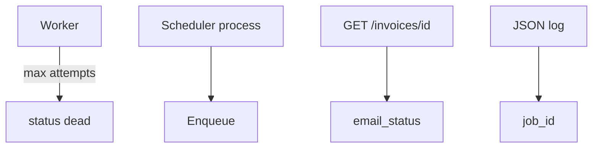

# Month 17 · Week 2 · Day 5
# Dead Letters, Cron, Job Status, Logs with Job Id

**Program:** Full-Stack Mastery · 18 months  
**Phase:** 6 — Advanced engineering and system design  
**Month index:** [../../README.md](../../README.md)  
**Week 2:** [1](day-01.md) · [2](day-02.md) · [3](day-03.md) · [4](day-04.md) · Day 5 (today) · [6](day-06.md) · [7](day-07.md)  
**Week rhythm today:** Tests + docs  
**Student state:** The tiny worker acks and retries. Today failure becomes **visible**: a **dead-letter**, a **schedule**, a **status** the API can read, and logs you can **join** on `job_id` like Month 11’s request id.  
**Study time:** 3–4 focused hours

Labs: `~\fullstack-lab\month-17\week-02\day-05\`. You may copy **ideas** from Day 4’s lab by **retyping** into this folder — do not paste Project 7.

---

## How to use this textbook

1. Read until you can explain who reads a DLQ.  
2. Type status endpoints and a pytest on failed jobs. Write runbooks in markdown.  
3. Optional review links are for later rechecking.

---

## How to read this chapter

A queue without an operator story is a trash can. **Dead-letter** means: this job will **not** be retried automatically; a human (or a later, explicit replay) decides. **Cron** means: time created the job, not a user POST. **Status in DB** means: the SPA can poll `GET /jobs/{id}` without reading Redis internals. **Logs** mean: `job_id` on every line so you can grep.



**Wrong belief:** “Failed jobs can stay `pending` forever; we’ll notice.”  
**Correct:** you will not. `dead` + a count in `/health` or a daily query is how you notice.

**Wrong belief:** “I’ll use Windows Task Scheduler to hit a secret GET `/run-cron` on production.”  
**Correct:** that is a CSRF-shaped gun. A **process** or platform scheduler (Compose `command:`, GitHub scheduled workflow for **non-product** chores, cloud scheduler) that **enqueues** with the same auth story as workers. Do not expose an unauthenticated “run all jobs” HTTP route.

---

## Today's contract

1. Add `status=dead` (or a `dead_jobs` table) after max attempts.  
2. `GET` invoice (or job) includes **email_status**: queued | working | sent | dead.  
3. Document a **cron**: daily “overdue slip reminder” as **enqueue**, not as SMTP in the scheduler.  
4. Log **job_id** (and invoice_id) as JSON fields.  
5. pytest: a job that always `ValueError`s ends **dead**; GET shows `dead`.  
6. Write `RUNBOOK.md`: how to replay one dead job **manually** (SQL/update status) — lab only.

**Today's gate.** Closed-book:

> Poison goes to a dead-letter with a reason. Cron enqueues; it does not SMTP. Status lives in the database. Logs carry job_id. Replay is explicit, not an infinite retry loop.

---

## Time box

| Block | Minutes | Work |
|---|---|---|
| A | 45 | Theory |
| B | 65 | Type-along: status + DLQ + tests |
| C | 55 | Independent: cron doc + runbook + log sample |
| D | 15 | Git |
| E | 15 | Recall |

---

# Block A — Theory

## 1. Dead-letter queue (DLQ)

After `max_attempts` or a **permanent** error, set `status='dead'`, keep `payload` and `last_error`. Options:

- same table, status filter,  
- separate `dead_jobs` table (clearer ops).

**Who consumes DLQ?** Not the hot worker loop. A human, or a **replay tool** that sets `pending` and `attempts=0` **one id at a time** after a fix.

**Wrong belief:** “A night job retries all dead forever.”  
**Correct:** that is how a bad payload emails 10,000 times after you “fix SMTP” but not the payload.

## 2. Job status in the API

The SPA (TanStack Query `useQuery({ queryKey: ["invoice", id] })`) may show “Email queued.” Polling every 5 s is **honest** if you do not need Week 3 realtime. `staleTime` short on that query is UX.

Statuses you can defend:

| Status | Meaning |
|---|---|
| `queued` | pending, not reserved |
| `working` | reserved |
| `sent` | acked after mail_log insert |
| `dead` | will not retry |

Do not invent `exactly_once_sent`.

## 3. Scheduled / cron jobs

A **scheduler** is a clock with a checklist: “every day 08:00, enqueue `remind_overdue` for slips with `due_at < today` and no reminder job this period.” The **worker** sends mail. If you put SMTP in the scheduler, you rebuilt the request problem without HTTP.

**Idempotency:** a cron that runs twice (two Compose replicas) must not enqueue duplicate work — unique key `remind:{slip_id}:{date}`.

**Windows lab:** you will **not** be required to configure Task Scheduler. A `scheduler.py` you **run once** (`uv run python scheduler.py`) that enqueues is enough. Document what production would use (one process, or the platform’s cron). Kubernetes CronJob is **optional**, not required.

## 4. Logs with job id

Month 11: `request_id`. Month 17 jobs: `job_id` (and `invoice_id`). JSON lines:

```json
{"job_id":"...","invoice_id":"...","event":"reserved"}
{"job_id":"...","event":"sent"}
{"job_id":"...","event":"dead","error":"ValueError: bad email"}
```

No SMTP passwords. No raw recipient lists in production logs if PII policy forbids — lab may log `to_email`.

## 5. Tests today

The rhythm is tests + docs: pytest on the **dead** path and GET status; `RUNBOOK.md` and `CRON.md` are the docs. Locust is not required this week.

## 6. Health

Stretch: `GET /health` returns `{ "dead_jobs": N }`. Alerting is Month 16 CloudWatch cousin — here a number you can curl.

---

# Block B — Type-along

Continue Day 4 code **retyped** into day-05 **or** import from a shared folder you copy. Isolated day-05 is cleaner for git.

Minimum API:

- `POST /invoices` as before  
- `GET /invoices/{id}` → invoice + `email_status` derived from jobs + mail_log  
- `GET /jobs/dead` → list of dead payloads (lab admin; **no auth** is a lab shortcut — write `AUTH.md`: product must not ship this naked)

Force poison: `POST /invoices` with `to_email="not-an-email"` if your handler validates, **or** a test-only `POST /jobs/poison` that enqueues `{type:"always_fail"}`. Prefer validation at enqueue for real emails **and** a dedicated poison type for the test so 422 does not hide the DLQ lesson.

**Design choice to write in `NOTES.md`:** reject bad email at POST (422, **no job**) vs enqueue and let worker poison. **Both** are valid. For DLQ practice, the worker must see a permanent error **once**. Use `type=always_fail` for the test.

```powershell
cd ~\fullstack-lab
mkdir month-17\week-02\day-05 -Force
cd ~\fullstack-lab\month-17\week-02\day-05
```

Retype jobstore + worker + FastAPI. Add `always_fail` handler that raises `ValueError("poison")`. pytest:

1. create invoice, `once()` until sent, GET status `sent`  
2. enqueue always_fail, `once()` up to MAX, status `dead`, GET `/jobs/dead` nonempty  
3. log capture: `caplog` or read a `lab.jsonl` you write from the worker — at least one line contains `job_id`

```powershell
uv run pytest -q
```

`curl.exe` GET after a manual run if you want; pytest is the gate.

---

# Block C — Independent

`CRON.md` (20–30 lines):

1. Job type `remind_overdue`.  
2. Schedule phrase (daily 08:00 local — name timezone UTC).  
3. Query in words: which slips.  
4. Idempotency key including **date**.  
5. Scheduler vs worker responsibilities.  
6. What happens if the scheduler is down for 3 days (catch-up: one reminder or three? **pick** and justify).  
7. Kubernetes CronJob: **optional**, one sentence why you do not need it for the gate.

`RUNBOOK.md`:

1. How to list dead jobs (SQL).  
2. How to replay **one** id (UPDATE pending, attempts=0) after fixing code.  
3. How **not** to `UPDATE jobs SET status='pending'` with no WHERE.

`LOG-SAMPLE.jsonl`: two fake lines, valid JSON, with `job_id`.

`MY-STATUS.md`: would Project 7 show job status in UI? Yes/no, names only.

---

# Block D — Git

```powershell
cd ~\fullstack-lab
git add month-17
git commit -m "Month 17 Week 2 Day 5: DLQ, job status, cron doc, job_id logs."
```

---

# Block E — Recall

1. Who reads a DLQ.  
2. Why cron must enqueue.  
3. Why unauthenticated `/run-cron` is a bad production idea.  
4. Status values.  
5. Why replay is per-id.

## Office hours

**GET /jobs/dead on product.** That is an admin surface. Month 13 authz. Lab may skip auth with a written warning.

**Timezone.** Store UTC. Display local. Cron in UTC.

**pytest leftover dead rows.** Unique DB per test (`tmp_path`).

## Definition of done

- [ ] pytest dead + sent status  
- [ ] CRON.md + RUNBOOK.md + LOG-SAMPLE.jsonl  
- [ ] AUTH.md warning  
- [ ] Gate paragraph spoken  
- [ ] Commit exists  

---

## Optional review links

- [12-factor: admin processes](https://12factor.net/admin-processes)  
- [Python logging](https://docs.python.org/3/library/logging.html)  

---

## Tomorrow

**Independent:** add **one** real background workflow to **your** Project 7. Checklist and interfaces. This textbook does not write your worker.
