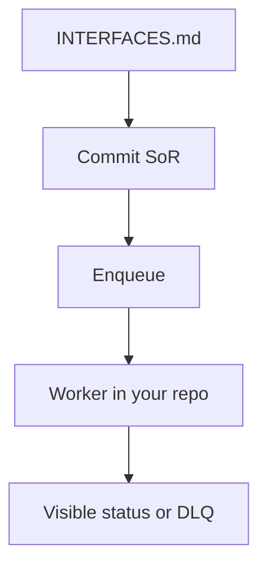

# Month 17 · Week 2 · Day 6
# Independent: One Background Workflow on Project 7

**Program:** Full-Stack Mastery · 18 months  
**Phase:** 6 — Advanced engineering and system design  
**Month index:** [../../README.md](../../README.md)  
**Week 2:** [1](day-01.md) · [2](day-02.md) · [3](day-03.md) · [4](day-04.md) · [5](day-05.md) · Day 6 (today) · [7](day-07.md)  
**Week rhythm today:** Independent implementation  
**Student state:** You can enqueue, ack, retry, dead-letter, and show status in a **lab**. Today **one** workflow on **your** Project 7. The textbook will **not** write your worker.  
**Study time:** 3–4 focused hours

Product code lives in **your** repos. Lab folder `~\fullstack-lab\month-17\week-02\day-06\` holds **checklists, interfaces, and names** — no pasted handlers.

---

## How to use this textbook

1. Write the interface document **before** a long coding trance.  
2. Implement in **your** tree. If you cannot finish the worker, the **interfaces + honest gap** still ship today; the worker must exist before Month 17’s gate (Week 4 Day 7). Prefer a thin slice that **runs**.  
3. Optional review links are for later rechecking.

---

## How to read this chapter

Month 17’s gate asks for **one** background workflow: enqueue, worker, retry with backoff, failure visible, **idempotent** where a double run would corrupt data. That is **this day**, possibly finishing over a second session you log.



**Wrong belief:** “I’ll add Celery, Redis, Kafka, and three job types to look like Month 18.”  
**Correct:** **one** type. Simplest queue that works (Postgres table, SQLite, Redis if you already operate it). Every extra box is Week 4’s ADR.

**Wrong belief:** “I’ll paste the lab `jobstore.py` into the textbook folder with my domain names.”  
**Correct:** copy **ideas** into **your** app. Gym code stays gym.

---

## Today's contract

1. Choose **one** workflow (email, thumbnail, export, reminder, webhook).  
2. Write `INTERFACES.md` (product `docs/` **and** redacted lab copy).  
3. Implement **or** extend: enqueue on a real user action; worker process; retry; dead; idempotency key.  
4. Do not put SMTP/PDF as the **only** path inside the request.  
5. Tests in **your** suite: at least **one** unit test on the handler’s idempotency **or** a TestClient test that 201 returns queued.  
6. No product source in fullstack-lab.

**Today's gate.** Closed-book:

> I named one job, its payload, its key, and where the worker runs. The HTTP response does not wait on the side effect. Failure is visible. Double-run is safe or I said why the effect is naturally idempotent.

---

## Time box

| Block | Minutes | Work |
|---|---|---|
| A | 25 | Theory: picking the slice |
| B | 30 | INTERFACES.md |
| C | 110 | Implement in **your** repo |
| D | 20 | Tests + redacted evidence |
| E | 15 | Recall + git |

---

# Block A — Theory

## 1. How to pick

Good slices:

- “After create X, send a **fake** or real transactional email.”  
- “After upload, generate a thumbnail.”  
- “User clicks export, worker writes a file, status appears.”  

Bad slices for today:

- “Rewrite the architecture to microservices.”  
- “Exactly-once Kafka pipeline.”  
- “Ten cron jobs.”

If Project 7 **truly** has no side effect, **invent a honest one**: “notify the owner when a record is created” with a **FakeMailer** port you already used in Month 14. Fake in dev, real SMTP only if you already have it. Do not sign up for a blast-email vendor to pass the day.

## 2. Queue choice (you pick, you justify)

| Option | When it earns keep |
|---|---|
| Postgres `jobs` table | You already have Postgres; transactions with SoR (baby outbox) |
| Redis list/streams | You already run Redis; you write visibility/reaper |
| SQLite | Local-only product — usually **not** Project 7 |
| Celery/RQ | Only if you can still draw enqueue/ack/retry **without** the brand |

Kubernetes Jobs, Kafka: **not required**.

## 3. Process model on Windows

Two terminals: `uvicorn` and `uv run python -m yourapp.worker`. Compose: a second `service: worker` if Month 15 already wraps the API. Do not hide the worker inside `create_task`.

## 4. Forbidden

- Pasting product source into `Downloads\2026` or fullstack-lab.  
- Unauthenticated production cron HTTP.  
- Retry storms (`sleep(0)`).  
- Claiming exactly-once.

---

# Block B — INTERFACES.md (required before deep code)

Create:

```powershell
cd ~\fullstack-lab
mkdir month-17\week-02\day-06 -Force
```

Product file `docs/BACKGROUND-WORKFLOW.md` (or your docs path) **and** `~\fullstack-lab\month-17\week-02\day-06\INTERFACES.md` with **the same headings**, redacted:

1. **Job type name**  
2. **Trigger** (which user action / HTTP)  
3. **SoR write** (table/resource **name**)  
4. **Payload fields** (names and types, not ORM classes)  
5. **Idempotency key**  
6. **Queue** (which technology)  
7. **Worker how to start** (command in words)  
8. **Retry** (max, base, cap, jitter)  
9. **Dead** (where to look)  
10. **Status** (API field or admin query)  
11. **Logs** (`job_id`)  
12. **Test names** you will add  
13. **Gaps** (honest)

If a heading is “not yet,” write **not yet** — then Block C should close the dangerous ones (enqueue + worker + key).

---

# Block C — Implement in your app

Checklist (tick in `~\fullstack-lab\month-17\week-02\day-06\CHECKLIST.md`):

- [ ] Handler does not SMTP-only-in-request  
- [ ] Enqueue after (or with) commit  
- [ ] Worker separate process  
- [ ] Idempotent side effect  
- [ ] Max attempts → dead  
- [ ] job_id in logs  
- [ ] Fake mailer / fake thumbnail in tests  
- [ ] Query: UI does not need to wait; optional poll  

Pydantic v2: `model_dump()` on responses. TanStack Query: invalidate the **resource**, not a fantasy `["email"]` key unless you have an email resource.

If you stall: ship FakeMailer + SQLite/Postgres jobs table for **one** type. That **is** the course.

---

# Block D — Evidence without source

`EVIDENCE.md` in the lab:

- Worker start command  
- Test names (pytest node ids)  
- Sample **redacted** log line with `job_id`  
- Screenshot **description** (not required file): “UI shows queued”  

Do not paste function bodies.

Commit in **your** repo. Commit lab docs in fullstack-lab.

---

# Block E — Recall + git

Recall: dual-write; why GET status; why one job type.

```powershell
cd ~\fullstack-lab
git add month-17
git commit -m "Month 17 Week 2 Day 6: background workflow interfaces and checklist."
```

---

## Office hours

**Celery already in the repo.** Still fill INTERFACES with **payload, key, DLQ**. If you cannot, the hat is wearing you.

**No time for worker.** Enqueue + table + a worker that `print`s is better than `create_task`. Finish the handler this week.

**Compose already has one service.** Add `worker` service **or** document two processes locally. Do not skip the process boundary.

**Windows two terminals.** API in one, worker in the other. `uv run` both. Do not start the worker with `uvicorn` unless you built an HTTP drain — you did not.

**Pydantic v2.** Worker payloads: parse with a model and `model_dump()` when you persist JSON. Do not `.dict()`.

# Lecture: what “visible failure” means

A job that fails into a log line you never grep is **not** visible. Visible means: a `status=dead` row, or an admin query, or `GET` on the resource showing `email_status: dead`, plus a `job_id` you can search. Week 2 Day 5’s runbook is the template. Copy the **headings** into your product docs, not the harbor SQL.

If double-run would send two receipts, the unique key is **not** optional. If double-run would send two “password changed” mails, still unique — annoyance is a bug. If double-run would charge twice, stop coding UI until the key exists.

## Definition of done

- [ ] INTERFACES.md complete headings  
- [ ] CHECKLIST honestly ticked  
- [ ] Product commit **or** listed remaining gaps toward the month gate  
- [ ] No product source in lab  
- [ ] Gate paragraph spoken  

---

## Optional review links

- Week 2 Days 1–5 in this textbook  
- [FastAPI Background Tasks](https://fastapi.tiangolo.com/tutorial/background-tasks/) — what **not** to use as the architecture  

---

## Tomorrow

**Review:** duplicate charge scenario; debug five job bugs. Bring INTERFACES.md.
