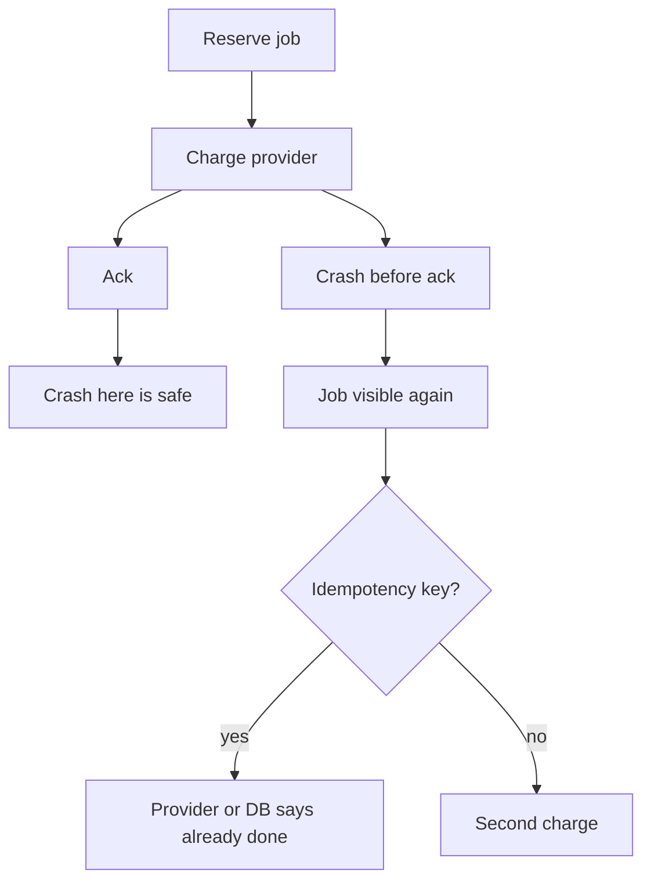

# Month 17 · Week 2 · Day 7
# Review: Duplicate Charge, Five Job Bugs

**Program:** Full-Stack Mastery · 18 months  
**Phase:** 6 — Advanced engineering and system design  
**Month index:** [../../README.md](../../README.md)  
**Week 2:** [1](day-01.md) · [2](day-02.md) · [3](day-03.md) · [4](day-04.md) · [5](day-05.md) · [6](day-06.md) · Day 7 (today)  
**Week rhythm today:** Weekly review  
**Student state:** You designed and (at least in the lab) built a worker. Today you prove you can **think** under a duplicate-money scenario and debug five classic job bugs. Days 1–6 stay **closed** during Blocks 1–3; this synthesis is the teacher.  
**Study time:** 3–4 focused hours

Work in `~\fullstack-lab\month-17\week-02\day-07\`. Do **not** implement a real card charge. Do **not** paste Project 7.

---

## How to read this chapter

Money makes at-least-once concrete. If the worker **charges** then **crashes before ack**, a naive restart charges again. Email duplicates are rude. Charge duplicates are **incidents**.



**Wrong belief:** “The payment API is exactly-once.”  
**Correct:** you pass **your** idempotency key and you record **your** completion row with a unique constraint.

---

## Today's contract

1. Teach Week 2 from this synthesis.  
2. Write a duplicate-charge design (no Stripe account required).  
3. Mini-build: idempotent `charge()` fake.  
4. Debug five job bugs.  
5. Compare INTERFACES.md to the gate.

**Today's gate.** Closed-book:

> Durable work is a queue plus a worker. At-least-once implies duplicates. I retry transients with backoff and jitter. I dead-letter poison. I unique the effect key. I do not SMTP in the request as the only path. I do not claim exactly-once.

---

## Time box

| Block | Minutes | Work |
|---|---|---|
| 0 | 25 | Synthesis aloud |
| 1 | 30 | exam-01.md |
| 2 | 45 | Mini charge lab |
| 3 | 30 | Debug A–E |
| 4 | 25 | INTERFACES vs reality |
| 5 | 20 | Design: Week 3 events |
| 6 | 15 | Retro + git |

---

## Week 2 synthesis (the lesson, in this book)

**The request** authenticates, validates, commits the system of record, enqueues, returns quickly. **BackgroundTasks** and **`asyncio.create_task`** die with the process.

**Queue + worker.** Reserve exclusively, side effect, ack. Crash before ack → **at-least-once** replay. Crash after pop-without-reserve (BRPOP) → **lost** job. Prefer DB row status, `BLMOVE`, or `SKIP LOCKED`.

**Retries.** Transient vs permanent. `delay = min(cap, base * 2**attempt)` plus **jitter**. Store `available_at`; do not sleep the backoff while holding a worker if other jobs wait — empty-queue short sleep is fine.

**Idempotency.** Key `type:entity_id` (or enqueue UUID). Unique constraint / `SET NX`. Second run no second effect. Flag-without-lock races.

**Poison / DLQ.** Max attempts or ValueError-class → `dead`, reason stored, **human replay per id**. Cron **enqueues**; it does not SMTP. Scheduler idempotency includes a **date**.

**Status + logs.** queued/working/sent/dead. `job_id` on JSON logs. No unauthenticated `/run-cron` in production.

**Dual-write.** API DB vs Redis queue can diverge. Same SQLite/Postgres transaction is a baby outbox. Full outbox: Week 3.

**Celery** is optional sugar. **Kafka** is optional. Neither is the week’s gate.

**Product:** one workflow, your repo, INTERFACES.md, no source in the textbook folder.

**Wrong belief:** “More Uvicorn workers fix SMTP in POST.”  
**Correct:** that duplicates waiting. Queue it.

---

# Complete explanation — the duplicate charge

## Scenario (gym)

`POST /payments` creates a `Payment` row `status=pending` and a job `charge_card` with `payment_id`. The worker calls `provider.charge(amount, idempotency_key=payment_id)`. On success, `payments.status=paid` and ack.

**Failure A:** Worker charged, crashed before ack. Replay. If you send a **new** provider key, the customer pays twice. If you send the **same** key, the provider returns the first charge. You still need **your** `mail_log`-like table (`charges.provider_ref UNIQUE`) so you do not “complete” twice with different business effects.

**Failure B:** Two workers reserved because visibility was 1 second and SMTP (charge) took 8 seconds. Unique on `payment_id` in `charges` — loser IntegrityError → treat as success/skip.

**Failure C:** You ack then charge. Crash → **paid in UI never, or pending forever**, card not charged — at-most-once. Wrong order.

**HTTP:** 201 `{payment_id, status: "queued"}` not 201 after the card.

SPA: `useMutation` **must not** retry the POST blindly. User double-click: **HTTP idempotency key** (Month 11) **and** unique payment for that invoice.

---

# Block 0 — Speak

Request vs worker; at-least-once; backoff+jitter; DLQ; charge order; dual-write. Then Block 1.

---

# Block 1 — Closed-book

```powershell
cd ~\fullstack-lab
mkdir month-17\week-02\day-07 -Force
```

`exam-01.md` (25–40 lines):

1. Why BackgroundTasks is not enough.  
2. BRPOP loss vs BLMOVE/DB.  
3. Backoff formula + jitter purpose.  
4. Duplicate charge: key and unique row.  
5. Your Project 7 job type name (or lab invoice if product slipped).  
6. One gap on INTERFACES.md.

---

# Block 2 — Mini-build

```powershell
cd ~\fullstack-lab\month-17\week-02\day-07
mkdir mini -Force
cd mini
uv init --name exam-charge
uv add --dev pytest
```

`provider.py`:

```python
class FakeProvider:
    def __init__(self) -> None:
        self.charges: dict[str, int] = {}
        self.calls = 0

    def charge(self, key: str, amount_cents: int) -> str:
        self.calls += 1
        if key in self.charges:
            return "duplicate"
        self.charges[key] = amount_cents
        return "ok"
```

`worker.py`: `run_charge(store: dict, provider, payment_id, amount)`:

- if `payment_id` in `store` as paid, return `"already"`  
- `result = provider.charge(payment_id, amount)`  
- `store[payment_id] = "paid"`  
- return result  

Tests:

- two `run_charge` same id → provider.calls == 1, store paid  
- two FakeProvider.charge same key → second `"duplicate"`  
- `test_order_comment` as a docstring test or `ORDER.md`: ack after charge  

No FastAPI required. No real network.

```powershell
uv run pytest -q
```

Write `CHARGE.md`: map FakeProvider to “Stripe idempotency key” in four sentences. Still no product source.

---

# Block 3 — Debug

`DEBUG.md` — what fails, root cause, fix:

**A.** `BackgroundTasks.add_task(charge)` only; deploy kills process mid-charge.  
**B.** Worker `except Exception: ack()`.  
**C.** `retry` with `time.sleep(0)` 10_000 times on `ValueError`.  
**D.** Cron HTTP `GET /cron/run-all` public.  
**E.** `useQuery` retry 3 + user double submit + worker retry on `POST /payments`.  

Worked box after you write.

---

# Block 4 — INTERFACES vs reality

Open **only** your Day 6 INTERFACES (lab copy). `GAP.md`: one lie (status not implemented, no unique key, worker still `create_task`). If complete, write `MATCH.txt` and the pytest node id.

---

# Block 5 — Design toward Week 3

`EVENTS.md` (8–12 lines): if “invoice paid” should also update a dashboard, is that a **query poll**, **SSE**, or **domain event**? Do not implement. Do not require Kafka.

---

# Block 6 — Retro + git

`retro.md`: scariest bug (usually E or B).

```powershell
cd ~\fullstack-lab
git add month-17
git commit -m "Month 17 Week 2 review: duplicate charge mini, job debug."
```

---

## Worked answers — after DEBUG.md

**A.** In-process task lost; queue + worker.  
**B.** Ack-on-all-exceptions drops poison and transients; classify; dead-letter; never ack before success.  
**C.** Poison storm; permanent vs transient; cap; jitter.  
**D.** Anyone triggers work; scheduler process + authz.  
**E.** Multiplied side effects; mutation retry off; HTTP idempotency key; unique payment.

If you disagreed, fix **after** the attempt.

---

## Office hours

**I did not finish Day 6 worker.** Mini still required. Product gap listed toward month gate. Do not start Week 3 pretending the workflow exists if it does not — Week 4 exam will ask.

**FakeProvider isn’t Stripe.** Good. You are testing **your** control flow.

Windows: `uv run pytest -q`.

# Lecture: the charge timeline you must be able to draw

Write `TIMELINE.md` after the mini (ten lines):

1. POST returns 201 queued.  
2. Worker reserves.  
3. Provider.charge(key=payment_id).  
4. Local unique row / store paid.  
5. Ack.  
6. Crash between 3 and 5: replay, provider duplicate, your unique skip.  
7. Crash between 2 and 3: replay, one charge.  
8. Ack before 3: lost money or lost job — **wrong order**.  
9. Two workers overlap: unique wins.  
10. SPA `useMutation` retry **off** for pay.

Closed-book: if you cannot say 6–8 without notes, re-read the synthesis, not Stripe’s marketing page.

**Wrong belief:** “We’ll refund duplicates in support.”  
**Correct:** that is not a retry policy. That is an incident process. Design so support is rare.

## Scoring the mini

| Piece | Honest pass |
|---|---|
| Same key, two calls, one charge | `provider.calls == 1` |
| ORDER.md ack after charge | Not ack-first |
| No network | FakeProvider only |

Write `WHY-UNIQUE.md` (six lines): why `payment_id` as provider key **and** a local unique row. One without the other still double-applies *something*.

---

## Definition of done

- [ ] exam-01  
- [ ] mini pytest green  
- [ ] DEBUG A–E  
- [ ] GAP.md or MATCH.txt  
- [ ] Commit exists  

---

## Optional review links

- [Month 11 idempotency](../../../month-11/week-04/day-04.md)  
- [Stripe idempotent requests](https://docs.stripe.com/api/idempotent_requests) — concept only  

---

## Next week

**Real-time and events.** WebSockets vs SSE vs polling. Pub/sub, delivery, duplicates, ordering. Eventual consistency. A **small** SSE or WS lab. Outbox. Then **NEED.md**: Project 7 might **not** need realtime — that can be a passing answer.
