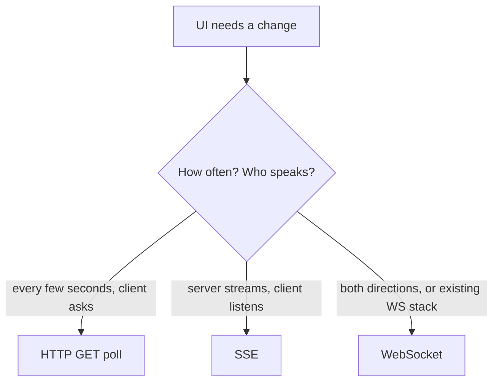

# Month 17 · Week 3 · Day 1
# WebSockets vs SSE vs Polling: Cost, Failure, When Not to Use WS

**Program:** Full-Stack Mastery · 18 months  
**Phase:** 6 — Advanced engineering and system design  
**Month index:** [../../README.md](../../README.md)  
**Week 3:** Day 1 (today) · [2](day-02.md) · [3](day-03.md) · [4](day-04.md) · [5](day-05.md) · [6](day-06.md) · [7](day-07.md)  
**Week rhythm today:** Learn + type-along  
**Student state:** Week 2’s gate-shaped skill is a **worker**. Job status can already be **polled**. Today you learn **live** channels as **tools with bills**, not as a résumé line. The small lab is Day 4. Day 6 may conclude Project 7 **does not** need realtime.  
**Study time:** 3–4 focused hours

**This week covers:** WebSockets, SSE, polling, pub/sub, domain events, delivery, duplicates, ordering, eventual consistency, outbox, a tiny live lab, NEED.md.

Labs: `~\fullstack-lab\month-17\week-03\day-01\`. This textbook will **not** paste Project 7. Kafka is **optional** and not used today.

---

## How to use this textbook

1. Read until you can refuse a WebSocket that exists “for modernity.”  
2. Type a **polling** client against a fake status endpoint so you feel the cost.  
3. Optional review links are for later rechecking.

---

## How to read this chapter

**Realtime** means the UI learns about a change **without** the user refreshing. That can be: poll every N seconds, **Server-Sent Events** (server pushes text over HTTP), or a **WebSocket** (bidirectional frames). Each has **cost** (connections, memory, proxies, code) and **failure modes** (drops, duplicates, stale tabs).



**Wrong belief:** “Serious products use WebSockets.”  
**Correct:** many serious products **poll** or use SSE. Slack-like chat is a different product than a slip list.

**Wrong belief:** “I’ll open a WebSocket per row in a table.”  
**Correct:** that is how you melt a process. Subscriptions are **coarse** (one per session, filtered).

---

## Today's contract

1. Define polling, SSE, and WebSockets in operational terms.  
2. Name **cost** (connections, proxy timeout, horizontal scale / sticky sessions preview).  
3. Name **failure modes** (lost connection, missed events, double events).  
4. Give **three cases** where you **must not** start with WebSockets.  
5. Explain how TanStack Query **polling** (`refetchInterval`) is a legitimate design.

**Today's gate.** Closed-book:

> Polling is HTTP GET on a timer. SSE is a one-way HTTP stream. WebSockets are bidirectional and another protocol. I choose the cheapest that meets the need. I do not use WS for a form submit. Missed events and duplicates still happen. Sticky sessions and connection count are part of the bill.

---

## Time box

| Block | Minutes | Work |
|---|---|---|
| A | 55 | Theory |
| B | 55 | Type-along: status poll with Query-shaped fetch |
| C | 70 | Independent: choose a channel for eight products |
| D | 15 | Git |
| E | 15 | Recall |

---

# Block A — Theory

## 1. Polling

The client repeats `GET /invoices/44` every 5 s (or `refetchInterval: 5000` in `useQuery({ queryKey: ["invoice", 44], queryFn, refetchInterval })`).

**Cost:** request rate × users × bytes. 1,000 tabs × 1 GET/s = 1,000 RPS of **mostly unchanged** JSON. Caching and `ETag` / `304` help. `staleTime` does not replace refetchInterval; they interact — know which you set.

**Failure:** a missed poll is fine; the next one catches up. **Good** for job status. **Bad** for “must see the message in <100 ms.”

**Timeouts:** ordinary HTTP. Load balancers understand GET.

**Wrong belief:** “Polling is unprofessional.”  
**Correct:** polling is **predictable**. Week 1 taught you to measure. Measure RPS before you “upgrade” to WS.

## 2. Server-Sent Events (SSE)

HTTP response stays open. Server writes `data: {...}\n\n`. Browser `EventSource` API. **Client → server** still uses ordinary POST. One-way: **server to client**.

**Cost:** one long-lived connection per tab. Memory on the API process. Proxies may **cut idle** connections (nginx `proxy_read_timeout`). You send comments/heartbeats.

**Failure:** reconnect is built into EventSource (it retries). You may **miss** events during the gap unless you send an **id** and the server supports `Last-Event-ID` — many labs do not. **Duplicates** after retry: client must be idempotent (Week 2 mind).

**Fits:** live logs, job progress, notification toasts, dashboards that only **listen**.

**Does not fit:** collaborative cursor movement both ways; binary frames; the only tool you read about this month.

## 3. WebSockets

Upgrade from HTTP to a **persistent bidirectional** channel. FastAPI/Starlette supports this. The client is `new WebSocket(...)`.

**Cost:** same connection tax as SSE **plus** you now **design a protocol** (JSON messages both ways), heartbeats, authentication **on connect** (tokens in query strings leak to logs — prefer a first message or cookie you already use). Horizontal scale: connections live on **one** process. A second instance does not share the socket. **Pub/sub** (Day 2) or **sticky sessions** (Week 4) appear.

**Failure:** mobile networks drop sockets constantly. You must **reconnect** and **resume** (last version / last id). People forget and the UI silently dies. Backpressure: a slow client + a chatty server fills memory.

**Fits:** true bidirectionality (game, pair editing, chat) **when the product is that**.

**Does not fit:** submitting a form (use POST); showing “email sent” (poll job status); replacing REST for CRUD.

## 4. When NOT to use WebSockets (memorize)

1. **CRUD** that already has REST + Query cache.  
2. **Job status** that can wait 2–5 s.  
3. **Rare** events (one admin announcement a day) — poll or refresh.  
4. You cannot explain **auth**, **reconnect**, and **what happens with two Uvicorn workers**.  
5. You wanted GraphQL subscriptions because a blog post did — GraphQL is **optional** in this program and not a reason.

## 5. Proxies, timeouts, and HTTP/2

SSE is HTTP; some corporate proxies buffer it (events arrive in a clump). WebSockets need `Upgrade` support on the load balancer. Month 16’s reverse proxy may need an explicit idle timeout. **Local** Uvicorn hides this. Write it as a **production risk**, not as today’s yak shave.

## 6. Security sketch

- Same-origin or explicit CORS. WS has an origin check you must not disable casually.  
- Auth: cookie on the handshake if you already use cookie auth; do not put long-lived access tokens in query strings.  
- Every message is **untrusted input** — Pydantic on JSON if you accept client messages.

## 7. Query cache vs live

If SSE says “invoice 44 paid,” you still `queryClient.invalidateQueries({ queryKey: ["invoice", 44] })` or `setQueryData`. The socket is **not** your system of record. Postgres is.

## 8. Say it — closed-book drill

Three channels; one cost each; three no-WS cases; reconnect misses events.

---

# Block B — Type-along

```powershell
cd ~\fullstack-lab
mkdir month-17\week-03\day-01 -Force
cd ~\fullstack-lab\month-17\week-03\day-01
uv init --name lab-poll
uv add fastapi uvicorn pydantic
uv add --dev pytest httpx
```

`main.py` — job status that **changes once** after 3 seconds of process time (use a dict + timestamp). Not a worker — we are studying the **client pattern**.

```python
import time
from fastapi import FastAPI

app = FastAPI()
START = time.time()


@app.get("/jobs/lab")
def job_status() -> dict:
    elapsed = time.time() - START
    status = "sent" if elapsed > 3 else "queued"
    return {"id": "lab", "email_status": status}
```

`poll.py` — a tiny loop (stand-in for Query refetchInterval):

```python
import time
import urllib.request
import json

url = "http://127.0.0.1:8019/jobs/lab"
for i in range(8):
    with urllib.request.urlopen(url) as r:
        body = json.loads(r.read().decode())
    print(i, body)
    if body["email_status"] == "sent":
        break
    time.sleep(1)
```

```powershell
uv run uvicorn main:app --host 127.0.0.1 --port 8019
```

Second terminal:

```powershell
uv run python poll.py
```

Write `POLL.md`: how many GETs until `sent`; what happens if `sleep` is 0.05 (cost). Restart Uvicorn between experiments because `START` is process-global.

pytest: TestClient GET returns one of the two statuses.

Write `WS-REFUSE.md`: five sentences — you will **not** wrap this status in a WebSocket for the lab product.

Stop Uvicorn.

---

# Block C — Independent

`CHOOSE.md` — poll / SSE / WS / none, plus **one cost** and **one failure**:

1. Invoice email status after create  
2. Chat room, 20 messages/minute, typing indicators  
3. Admin “new order” toast, ~2 per hour  
4. Collaborative whiteboard  
5. Settings form save  
6. Stock ticker, 10 ticks/s, thousands of clients (idea-level)  
7. Mobile users on flaky LTE, job progress  
8. GraphQL subscription to replace one GET list  

Then `MY-NEED-PREVIEW.md`: guess for Project 7 (Day 6 will decide). Names only.

`SCALE.md`: 5,000 open WebSockets on one 512 MB process — what dies first (RAM, FDs)? You need not measure; reason.

---

# Block D — Git

```powershell
cd ~\fullstack-lab
git add month-17
git commit -m "Month 17 Week 3 Day 1: polling lab, channel choices."
```

---

# Block E — Recall

1. SSE directionality.  
2. Why WS + two workers is a puzzle.  
3. Query `refetchInterval` vs WS.  
4. Missed events on reconnect.  
5. Three no-WS cases.

## Office hours

**urlopen vs httpx.** Either. No extra ceremony.

**I want to type WS today.** Day 4. Today is **refusal skill**.

Windows: `curl.exe -s http://127.0.0.1:8019/jobs/lab` also works.

# Lecture: connection count is a capacity plan

Write `CONNECTIONS.md` (12 lines): 200 logged-in users, 2 tabs each, poll every 5 s vs 1 SSE each vs 1 WS each. Which number is HTTP RPS, which is **held sockets**? Uvicorn and Postgres `max_connections` are different pools (Week 1). A socket is RAM and a file descriptor. Polling 400 GET/s of tiny JSON may still be cheaper to **reason about** than 400 idle WS you forgot to heartbeat.

**Wrong belief:** “SSE is free because the client does not poll.”  
**Correct:** you pay **idle connections** and proxy timeouts instead of request rate. Pick the bill you can operate. Month 16’s load balancer idle timeout is part of that bill even if you do not change it today.

Auth sketch: cookie on the same site for EventSource; never put a long-lived access token in the query string (it lands in access logs). Client messages on a WebSocket are untrusted — Pydantic if you accept JSON. POST remains the way you **create** announcements; the stream only **listens**.

Write `TIMEOUTS.md` (six lines): what a 60 s proxy idle timeout does to a quiet SSE; why a `: ping` every 10 s is an engineering control, not a decoration.

---

## Definition of done

- [ ] poll.py observed queued → sent  
- [ ] CHOOSE.md eight rows  
- [ ] WS-REFUSE.md  
- [ ] pytest green  
- [ ] Gate paragraph spoken  
- [ ] Commit exists  

---

## Optional review links

- [MDN EventSource](https://developer.mozilla.org/en-US/docs/Web/API/EventSource)  
- [MDN WebSocket](https://developer.mozilla.org/en-US/docs/Web/API/WebSocket)  
- [TanStack Query refetchInterval](https://tanstack.com/query/latest/docs/framework/react/guides/window-focus-refetching)  

---

## Tomorrow

**Pub/sub, domain events, delivery guarantees, duplicate events, ordering.** Live UI is not the same as a **domain event**.
