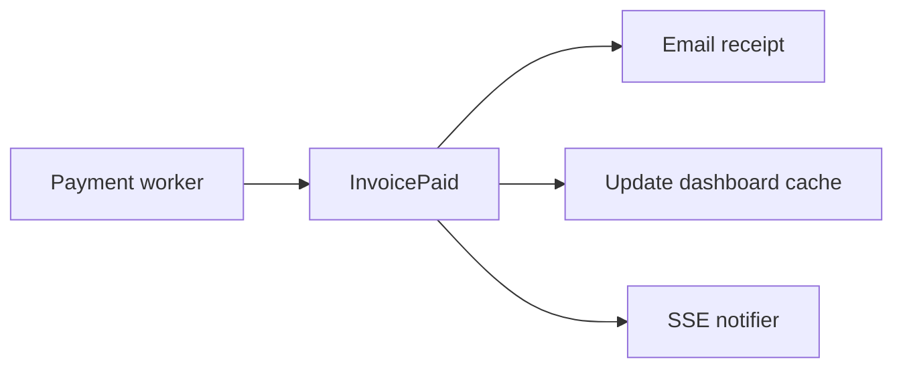

# Month 17 · Week 3 · Day 2
# Pub/Sub, Domain Events, Delivery, Duplicates, Ordering

**Program:** Full-Stack Mastery · 18 months  
**Phase:** 6 — Advanced engineering and system design  
**Month index:** [../../README.md](../../README.md)  
**Week 3:** [1](day-01.md) · Day 2 (today) · [3](day-03.md) · [4](day-04.md) · [5](day-05.md) · [6](day-06.md) · [7](day-07.md)  
**Week rhythm today:** Exercises + debugging  
**Student state:** You can choose poll vs SSE vs WS. Today the **backend** story: something happened in the domain; **other** code should react. That is **events**, not a socket.  
**Study time:** 3–4 focused hours  
**Prereq:** Day 1 gate passed.

Labs: `~\fullstack-lab\month-17\week-03\day-02\`. Kafka remains **optional**. You will type an **in-process** pub/sub and a **list of events** — not a cluster.

---

## How to use this textbook

1. Read until you can refuse “exactly-once delivery” as a slogan.  
2. Type a tiny event bus and two handlers.  
3. Optional review links are for later rechecking.

---

## How to read this chapter

A **domain event** is a fact: `InvoicePaid { invoice_id, paid_at }`. **Pub/sub** means: publishers do not call each subscriber by name. **Delivery guarantees** are the same family as Week 2: at-most-once, at-least-once. **Duplicates** will happen. **Ordering** is a **wish** you must **specify** (per invoice id? global?).



**Wrong belief:** “If I have WebSockets, I have an event architecture.”  
**Correct:** a socket is a **transport to a browser**. A domain event is a **fact for the rest of the system**. You can have events with **zero** sockets (handlers enqueue Week 2 jobs).

**Wrong belief:** “Kafka gives ordering and exactly-once, so I am done.”  
**Correct:** Kafka is optional. Even there, **exactly-once** is a narrow transactional feature people misquote. You still design **idempotent consumers** and **per-key** order.

---

## Today's contract

1. Define **domain event** vs **command** vs **HTTP request**.  
2. Sketch **pub/sub** (in-process vs Redis Pub/Sub vs broker).  
3. Explain **at-least-once** for events (retry the handler).  
4. Explain **duplicate events** (handler idempotency).  
5. Explain **ordering**: global vs per-aggregate; what “out of order” does to inventory.  
6. Redis Pub/Sub **does not persist** — a down subscriber **misses** messages.

**Today's gate.** Closed-book:

> An event is a fact that already happened. Subscribers must tolerate duplicates. I do not claim exactly-once. Redis Pub/Sub is fire-and-forget. Order is per key if I need it. A WebSocket is not a domain event.

---

## Time box

| Block | Minutes | Work |
|---|---|---|
| A | 50 | Theory |
| B | 75 | Type-along: in-process bus + idempotent handler |
| C | 50 | Independent: eight delivery claims |
| D | 15 | Git |
| E | 15 | Recall |

---

# Block A — Theory

## 1. Command vs event vs query

| Kind | Tense | Example |
|---|---|---|
| **Command** | Do this | `SendInvoiceEmail(invoice_id)` — a **job** |
| **Event** | This happened | `InvoicePaid` |
| **Query** | What is true now | `GET /invoices/44` |

Commands can **fail** (validation). Events are **past tense**; you do not “reject” reality — you **fix consumers**.

Publishing `InvoicePaid` **before** commit is a lie. Publish **after** commit, or via **outbox** (Day 5).

## 2. Pub/sub shapes

**In-process list of callables.** Fast, same process, **dies** with the process, **no** other workers see it. Fine for a lab. Dangerous as the only “architecture” in production with multiple replicas.

**Redis Pub/Sub.** `PUBLISH` / `SUBSCRIBE`. **No history.** If the worker is restarting, it **misses**. Good for “please drop SSE caches” **hints**, bad as the only invoice-paid log.

**Redis Streams / Kafka / SQS.** Persistence, consumer groups — **ops cost**. Optional. This week you must **understand** them as a **sentence**, not install them.

**Postgres NOTIFY.** Similar to Redis Pub/Sub: no backlog.

## 3. Delivery

The **pipe** you actually have is almost always **at-least-once** (retry) or **at-most-once** (Pub/Sub miss). **Exactly-once delivery** as “the event arrives once, in all failure modes, across processes” is **not** something you will claim in this course.

What you **will** claim: **exactly-once processing effects** via idempotency (Week 2): handler stores `event_id` processed.

## 4. Duplicate events

Causes: publisher retry, at-least-once queue, user double-click producing two **facts** (that is two events — different problem), SSE reconnect replay.

Handler: `INSERT event_id PRIMARY KEY` then do work; conflict → skip.

## 5. Ordering

**Global order** across all invoices is expensive and usually unnecessary.

**Per-aggregate order:** events for invoice 44 should be `created → paid` not `paid → created`. A **single worker** per stream partition/key, or a **version number** on the row (`UPDATE ... WHERE version=n`).

Out of order: email “paid” before the row exists → handler retries (transient) or dead-letters.

**Wrong belief:** “I’ll timestamp events and sort; that is order.”  
**Correct:** clocks skew. Use **monotonic version** on the aggregate when you care.

## 6. Fan-out and poison

One event, three handlers. If **email** poisons, **cache invalidation** should still run — **separate jobs** per handler, not one mega-handler `try` soup without isolation. Week 2: one job type per side effect is easier to dead-letter.

## 7. Frontend

SSE might send `InvoicePaid`. Duplicate WS messages: Query `setQueryData` should be **idempotent** (set paid=true twice is fine). Reordering: ignore an event with `version < current`.

---

# Block B — Type-along

```powershell
cd ~\fullstack-lab
mkdir month-17\week-03\day-02 -Force
cd ~\fullstack-lab\month-17\week-03\day-02
uv init --name lab-events
uv add --dev pytest
```

`bus.py`:

```python
from collections import defaultdict
from collections.abc import Callable
from typing import Any

Handler = Callable[[dict[str, Any]], None]


class Bus:
    def __init__(self) -> None:
        self._subs: dict[str, list[Handler]] = defaultdict(list)

    def subscribe(self, name: str, fn: Handler) -> None:
        self._subs[name].append(fn)

    def publish(self, name: str, event: dict[str, Any]) -> None:
        for fn in list(self._subs[name]):
            fn(event)
```

`handlers.py` — idempotent projection:

```python
class Receipts:
    def __init__(self) -> None:
        self.seen: set[str] = set()
        self.sent: list[str] = []

    def on_paid(self, event: dict) -> None:
        eid = event["event_id"]
        if eid in self.seen:
            return
        self.seen.add(eid)
        self.sent.append(event["invoice_id"])
```

Tests:

- two subscribers called  
- publish twice same `event_id` → `sent` length 1  
- different event_ids → length 2  
- unknown event name → no crash  

Write `REDIS-PUBSUB.md`: if a subscriber is down during PUBLISH, what happens? (Missed. Not a queue.)

```powershell
uv run pytest -q
```

---

# Block C — Independent

`CLAIMS.md` — true / false / “depends”, with a sentence:

1. “WebSocket means we have domain events.”  
2. “Redis Pub/Sub will deliver to a worker that starts 10 s later.”  
3. “At-least-once can duplicate InvoicePaid.”  
4. “Exactly-once is our SLA.”  
5. “Order of events for two different invoices must be global.”  
6. “Idempotent handler + duplicates is OK.”  
7. “Publish before DB commit is fine if we retry.”  
8. “Kafka is required for Month 17.”  

`ORDER.md`: `StockReserved` after `StockAlreadySold` for the **same sku** — what the UI might show; how a version number helps.

`MY-EVENTS.md`: 0–2 event **names** for Project 7. Zero is allowed.

---

# Block D — Git

```powershell
cd ~\fullstack-lab
git add month-17
git commit -m "Month 17 Week 3 Day 2: in-process bus, idempotent handlers."
```

---

# Block E — Recall

1. Command vs event.  
2. Redis Pub/Sub persistence.  
3. Duplicate handling.  
4. Per-aggregate order.  
5. Why WS ≠ event bus.

## Office hours

**In-process bus in FastAPI.** Other workers will not see publishes. Write that in CLAIMS if you add a ninth row.

**I already run Kafka.** Still type the bus. The month gate does not require Kafka.

## Definition of done

- [ ] pytest green  
- [ ] CLAIMS.md  
- [ ] REDIS-PUBSUB.md  
- [ ] Gate paragraph spoken  
- [ ] Commit exists  

---

## Optional review links

- [Redis Pub/Sub](https://redis.io/docs/latest/develop/pubsub/)  
- [Martin Fowler: Event](https://martinfowler.com/eaaDev/EventNarrative.html)  

---

## Tomorrow

**From memory:** eventual consistency story — inventory + email. Days 1–2 closed during drills.
