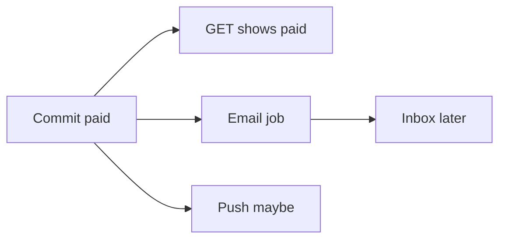

# Month 17 · Week 3 · Day 3
# From Memory: Eventual Consistency — Inventory and Email

**Program:** Full-Stack Mastery · 18 months  
**Phase:** 6 — Advanced engineering and system design  
**Month index:** [../../README.md](../../README.md)  
**Week 3:** [1](day-01.md) · [2](day-02.md) · Day 3 (today) · [4](day-04.md) · [5](day-05.md) · [6](day-06.md) · [7](day-07.md)  
**Week rhythm today:** Implement from memory  
**Student state:** Day 2 gate passed. You know poll/SSE/WS costs and event duplicates. Today you tell a **consistency story** without opening Days 1–2.  
**Study time:** 3–4 focused hours  
**Prereq:** Day 2 gate passed.

Labs: `~\fullstack-lab\month-17\week-03\day-03\`. No Project 7 source. Kafka not required.

---

## How Day 3 works

Days 1–2 **closed** during Blocks 1–3. Recap below is the teacher. 25-minute lookup rule. Worked box after `STORY.md`.

---

## How to read this chapter

**Strong consistency** (in the informal sense you need): the user who just paid sees **paid** on the next GET because one database committed. **Eventual consistency:** another view (email sent, search index, second service, SSE client) **catches up**. During the gap, two screens **disagree**. That is not always a bug — **unbounded** disagreement is.



**Wrong belief:** “Distributed systems must be strongly consistent everywhere.”  
**Correct:** you **choose** where the truth is (Postgres) and where a **delay** is allowed (email, analytics).

---

## Complete explanation (you must still own)

**Polling / SSE / WS.** Poll = GET timer. SSE = one-way stream. WS = bidirectional, extra protocol, connection tax, multi-worker puzzle. Do not WS for CRUD or job status that can wait seconds.

**Events.** Past-tense facts. Pub/sub decoupling. Redis Pub/Sub has **no backlog**. At-least-once → duplicates. Idempotent consumers. Order **per aggregate** + versions, not global timestamps. Do not publish before commit (or use outbox Day 5). Do not claim exactly-once delivery.

**Jobs vs events.** `SendEmail` is a command/job. `InvoicePaid` is an event that **may** enqueue that job.

**Eventual consistency.** After commit, projections catch up. User may see “paid” in the app and **no email yet**. UI copy should tell the truth (“Receipt sending…”). Inventory: decrement **in the same transaction** as the sale if you cannot oversell; email **after**. If inventory is a **second database**, you accept a window or you use a protocol (outbox + worker) — you do **not** pretend two commits are one.

**Wrong belief:** “I’ll decrement stock in the email worker.”  
**Correct:** then email delay **oversells**. Stock is SoR; email is a side effect.

**TanStack Query.** After a mutation, invalidate. Live push only **invalidates or sets** cache; SoR remains REST GET.

**Windows.** PowerShell, `uv run pytest`.

---

## Today's contract

1. Write the inventory+email story from spec.  
2. Classify eight “is this OK to be eventually consistent?” prompts.  
3. Mini-build: versioned projection that ignores stale events.  
4. Debug five consistency bugs.

**Today's gate.** Closed-book:

> Postgres is the truth for stock and payment. Email may lag. I do not sell in the mailer. Duplicates and reorder must not corrupt the projection. I do not require WebSockets for that story.

---

## Time box

| Block | Minutes | Work |
|---|---|---|
| 1 | 25 | Speak; exam-01.md |
| 2 | 50 | STORY.md + CLASSIFY.md |
| 3 | 45 | Mini-build versions |
| 4 | 30 | DEBUG.md |
| 5 | 20 | Worked box |
| 6 | 20 | Project 7 lag copy |
| 7 | 15 | Retro |

---

# Block 1 — Speak

Cover: three channels; event vs command; Pub/Sub miss; duplicates; stock vs email. `exam-01.md`.

```powershell
cd ~\fullstack-lab
mkdir month-17\week-03\day-03 -Force
cd ~\fullstack-lab\month-17\week-03\day-03
```

---

# Block 2 — Story from spec

**Gym:** Harbor shop sells **line rope** with `stock` integer. `POST /sales` in one transaction: if stock≥qty, decrement, insert `sale` paid. Then enqueue `send_receipt_email`. A dashboard projection `rope_sold_today` updates from events (may lag). SSE optional later.

Write `STORY.md` headings:

1. What must be **true immediately** after 201 for the buyer.  
2. What may **lag**.  
3. What the list UI should show if email is queued.  
4. What happens if the email worker is down 10 minutes.  
5. What happens if `InvoicePaid` is delivered twice.  
6. What happens if a stale SSE says `stock=5` when GET says `4`.  
7. Whether you need WebSockets (yes/no + reason).  
8. Dual-write risk if you also `PUBLISH` to Redis.

`CLASSIFY.md` — OK lag / not OK / depends:

**T1.** Receipt email 2 minutes late.  
**T2.** Stock decrement 2 minutes late, two buyers.  
**T3.** Admin dashboard sales count 30 s late.  
**T4.** Authz 403 lagging (permission cached).  
**T5.** Search index 1 minute late.  
**T6.** Bank charge duplicate.  
**T7.** Chat message order swapped in one room.  
**T8.** GraphQL as the only SoR.

---

# Block 3 — Mini-build

```powershell
uv init --name lab-consistency
uv add --dev pytest
```

`projection.py`:

```python
class StockView:
    def __init__(self) -> None:
        self.stock = 0
        self.version = 0

    def apply(self, version: int, stock: int) -> None:
        if version <= self.version:
            return
        self.version = version
        self.stock = stock
```

Tests: apply v1 then v2; apply v2 then v1 (stale ignored); apply same version twice (no change / ignored).

```powershell
uv run pytest -q
```

---

# Block 4 — Debug

**A.** Email worker decrements stock.  
**B.** Redis Pub/Sub only; worker restart misses `SaleMade`; stock in Redis cache never updates.  
**C.** WS message applied without version; old event overwrites new.  
**D.** `useQuery` cache shows paid; GET still pending because mutation did not invalidate and SSE never ran.  
**E.** “Exactly-once Kafka so no idempotency table.”

---

# Block 5 — Worked box (after STORY + CLASSIFY)

**STORY essence:** Buyer GET sees paid + new stock **from Postgres**. Email lags. UI: “Receipt queued.” Worker down: sales still succeed; DLQ/email later. Duplicate event: idempotent mail key. Stale SSE: prefer GET/version. WS not required. Redis publish can miss — outbox/jobs.

**T1** OK. **T2** not OK. **T3** OK. **T4** not OK (security). **T5** usually OK. **T6** not OK. **T7** depends (UX); per-room order often required. **T8** not OK (GraphQL optional, not SoR).

**A** oversell. **B** Pub/Sub miss; cache must rebuild from SoR. **C** versions. **D** invalidate Query. **E** refuse slogan.

`DIFF.md` / `MATCH.txt`.

---

# Block 6

`MY-LAG.md`: one Project 7 place lag is OK, one where it is not. Names only.

---

# Block 7

`retro.md`, `lookups.txt`.

```powershell
cd ~\fullstack-lab
git add month-17
git commit -m "Month 17 Week 3 Day 3: eventual consistency story; versioned view."
```

---

## Office hours

**T4.** Cached 403/200 is a **security** bug, not a dashboard lag.

**T7.** If you said OK, argue. If you said not OK, also fine. Write **why**.

## Definition of done

- [ ] STORY.md before the box  
- [ ] pytest green  
- [ ] DEBUG A–E  
- [ ] Commit exists  

---

## Optional review links

Repair from this recap first.

- [TanStack Query invalidation](https://tanstack.com/query/latest/docs/framework/react/guides/query-invalidation)  

---

## Tomorrow

**Lab:** small SSE **or** WebSocket — FastAPI + a tiny HTML/React page. Keep it small.
