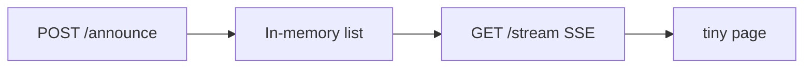

# Month 17 · Week 3 · Day 4
# Lab: Tiny SSE (or WebSocket) — FastAPI Plus a Small Page

**Program:** Full-Stack Mastery · 18 months  
**Phase:** 6 — Advanced engineering and system design  
**Month index:** [../../README.md](../../README.md)  
**Week 3:** [1](day-01.md) · [2](day-02.md) · [3](day-03.md) · Day 4 (today) · [5](day-05.md) · [6](day-06.md) · [7](day-07.md)  
**Week rhythm today:** Learn + lab feature  
**Student state:** You can tell an eventual-consistency story. Today you **type** one live channel in a **gym** — small enough to understand reconnect. Default: **SSE**. WebSocket is an allowed alternative if you already need bidirectionality; do not do both as a personality.  
**Study time:** 3–4 focused hours  
**Prereq:** Day 3 gate passed.

Labs: `~\fullstack-lab\month-17\week-03\day-04\`. Domain: **harbor board announcements**. Not Project 7. Do not replace FastAPI with a realtime SaaS.

---

## How to use this textbook

1. Read until you can explain a dropped SSE connection.  
2. Type the API and a tiny page. Keep the page **under ~80 lines**.  
3. Optional review links are for later rechecking.

---

## How to read this chapter

SSE is an HTTP response that **does not end**. FastAPI returns a `StreamingResponse` (or `EventSourceResponse` if you add `sse-starlette` — **stdlib streaming is enough**). The browser `EventSource` parses `data:` lines.



**Wrong belief:** “I’ll stream Query results from Postgres with a long transaction open.”  
**Correct:** the stream **sends events**; it does not hold a table lock. Persist in a list/queue; the generator **yields**.

**Wrong belief:** “This lab means Project 7 must use SSE.”  
**Correct:** Day 6 may say no. The lab teaches the **mechanism**.

---

## Today's contract

1. `POST /announce` `{text}` → 201, store in memory (list cap 50).  
2. `GET /stream` SSE: send a hello, then each new announcement; **heartbeat** comment every ~15 s (or shorter in lab).  
3. A page: connect EventSource, append `<li>` (or React state).  
4. Document: what happens on **refresh**; what happens if Uvicorn **restarts**; two workers **do not** share memory.  
5. pytest: POST 201; stream test **or** a unit test of the format function if streaming TestClient is awkward — at least one automated test plus a manual `curl.exe` note.

**Today's gate.** Closed-book:

> SSE is a long HTTP GET. I send data lines and heartbeats. Memory pub/sub is per process. Reconnect can miss events unless I replay. I did not build a chat product. I did not add Kafka.

---

## Time box

| Block | Minutes | Work |
|---|---|---|
| A | 40 | Theory: SSE format, heartbeats, auth sketch |
| B | 80 | Type-along: FastAPI + page |
| C | 55 | Independent: reconnect notes + optional WS stretch |
| D | 15 | Git |
| E | 15 | Recall |

---

# Block A — Theory

## 1. Wire format

```text
data: {"text": "Dock closed"}

: heartbeat

data: {"text": "Storm warning"}

```

Blank line ends an event. Lines starting with `:` are comments (keep proxies and EventSource alive).

`Content-Type: text/event-stream`. `Cache-Control: no-cache`. Disable buffering if a proxy would sit on the bytes (`X-Accel-Buffering: no` as a **name** you might need later).

## 2. FastAPI generator

`async def gen():` yield bytes. If you `while True` without `await asyncio.sleep`, you **block**. Heartbeat: sleep, yield `b": ping\n\n"`.

**Broadcast:** in-memory `asyncio.Queue` per subscriber, POST puts into all queues. Lab scale: tens of clients, not thousands.

## 3. Auth

EventSource cannot set custom headers in the original API. Cookie auth **can** work same-site. Token-in-query is a leak. Product: prefer cookie session you already have, or skip auth in the gym and write `AUTH.md`.

## 4. Reconnect

EventSource retries. Without `id:` and a backlog, **missed announcements** during downtime. For the lab, document the miss. Replay last N from memory on connect as a **kindness** (you should type this).

## 5. WebSocket alternative

If you choose WS instead of SSE: `WebSocket` accept, `receive_text` / `send_text`, still in-memory broadcast. You must handle **client messages** (even if you ignore them). Still heartbeats. Still two-worker warning. **Do not** build a protocol with five message types.

## 6. React

A 30-line `App.tsx` with `useEffect` that constructs `EventSource`, `onmessage` → `setItems`, `return () => es.close()`. Import router **only if** you already created Vite with a route — a single page is enough. TanStack Query is **not** required for the stream; you may `invalidateQueries` in `onmessage` if you also fetch a list — optional.

Vite proxy: EventSource to `http://127.0.0.1:8020` **directly** in the lab to avoid proxy buffering puzzles. CORS: `allow_origins=["http://127.0.0.1:5173"]` if the page is on 5173. **Do not** `allow_origins=["*"]` with credentials.

---

# Block B — Type-along

```powershell
cd ~\fullstack-lab
mkdir month-17\week-03\day-04 -Force
cd ~\fullstack-lab\month-17\week-03\day-04
uv init --name lab-sse
uv add fastapi uvicorn pydantic
uv add --dev pytest httpx
```

`main.py` — type carefully. Cap the backlog.

```python
import asyncio
import json
from fastapi import FastAPI
from fastapi.middleware.cors import CORSMiddleware
from fastapi.responses import StreamingResponse
from pydantic import BaseModel, Field

app = FastAPI()
app.add_middleware(
    CORSMiddleware,
    allow_origins=["http://127.0.0.1:5173", "http://localhost:5173"],
    allow_methods=["*"],
    allow_headers=["*"],
)

backlog: list[dict] = []
subscribers: list[asyncio.Queue] = []


class AnnounceIn(BaseModel):
    text: str = Field(min_length=1, max_length=200)


@app.post("/announce", status_code=201)
async def announce(body: AnnounceIn) -> dict:
    rec = body.model_dump()
    backlog.append(rec)
    del backlog[:-50]
    for q in list(subscribers):
        await q.put(rec)
    return rec


@app.get("/stream")
async def stream() -> StreamingResponse:
    q: asyncio.Queue = asyncio.Queue()
    subscribers.append(q)

    async def gen():
        try:
            for rec in list(backlog):
                yield f"data: {json.dumps(rec)}\n\n".encode()
            while True:
                try:
                    rec = await asyncio.wait_for(q.get(), timeout=10)
                    yield f"data: {json.dumps(rec)}\n\n".encode()
                except TimeoutError:
                    yield b": ping\n\n"
        finally:
            if q in subscribers:
                subscribers.remove(q)

    return StreamingResponse(
        gen(),
        media_type="text/event-stream",
        headers={"Cache-Control": "no-cache", "X-Accel-Buffering": "no"},
    )
```

`TimeoutError` is the builtin in 3.11+; if your Python is older, `asyncio.TimeoutError`.

`static/index.html` — no build step required:

```html
<!doctype html>
<meta charset="utf-8" />
<title>Harbor board</title>
<h1>Announcements</h1>
<form id="f">
  <label>Text <input name="text" required /></label>
  <button type="submit">Post</button>
</form>
<ul id="list"></ul>
<script>
  const list = document.getElementById("list");
  const es = new EventSource("http://127.0.0.1:8020/stream");
  es.onmessage = (ev) => {
    const rec = JSON.parse(ev.data);
    const li = document.createElement("li");
    li.textContent = rec.text;
    list.appendChild(li);
  };
  document.getElementById("f").onsubmit = async (e) => {
    e.preventDefault();
    const text = new FormData(e.target).get("text");
    await fetch("http://127.0.0.1:8020/announce", {
      method: "POST",
      headers: { "Content-Type": "application/json" },
      body: JSON.stringify({ text }),
    });
    e.target.reset();
  };
</script>
```

Serve the HTML however you like: FastAPI `FileResponse` on `GET /` **or** open the file directly (file:// may block fetch — prefer FastAPI `/`). Add `GET /` FileResponse if needed.

```powershell
uv run uvicorn main:app --host 127.0.0.1 --port 8020
```

Browser: `http://127.0.0.1:8020/` if you mounted the page. Second tab: both should receive.

```powershell
curl.exe -N -s http://127.0.0.1:8020/stream
```

`-N` disables buffer. POST from another terminal; watch `data:` lines. Ctrl+C curl.

`test_announce.py`: POST 201 `model` fields. Optional: TestClient stream is finicky — if you skip stream pytest, `STREAM.md` records curl evidence.

Write `WORKERS.md`: two Uvicorn workers, POST hits worker A, SSE on worker B — **empty**. Compose/production needs Redis pub/sub or sticky sessions (Week 4) **if** you scale this. Lab uses **one** worker.

---

# Block C — Independent

`RECONNECT.md`: kill Uvicorn, restart, EventSource retries — **backlog replay** vs miss if you clear memory.

`AUTH.md`: how Project 7 **would** auth SSE (cookie) if Day 6 says yes.

Optional stretch: 40-line Vite React `useEffect` EventSource. **Or** skip — HTML is enough.

Optional WS: only if SSE already works. `WS.md` what you gained (nothing, for this board).

Do not add a chat history database today.

---

# Block D — Git

```powershell
cd ~\fullstack-lab
git add month-17
git commit -m "Month 17 Week 3 Day 4: tiny SSE announcements lab."
```

---

# Block E — Recall

1. SSE content type.  
2. Why heartbeats.  
3. In-memory + two workers.  
4. EventSource and custom headers.  
5. Backlog replay vs Kafka (not required).

## Office hours

**CORS errors.** Origins must match the page origin exactly (`http://127.0.0.1:5173` ≠ `http://localhost:5173`).

**Stream never pings.** You are not awaiting sleep/wait_for.

**`subscribers` leak.** `finally` remove. Refresh without finally grows RAM.

**React StrictMode double mount.** Close in cleanup; expect double connect in dev.

Windows: `curl.exe -N`. One Uvicorn process.

## Definition of done

- [ ] POST + SSE visible in browser  
- [ ] curl.exe -N evidence in STREAM.md **or** a test  
- [ ] WORKERS.md  
- [ ] RECONNECT.md  
- [ ] Gate paragraph spoken  
- [ ] Commit exists  

---

## Optional review links

- [MDN Using EventSource](https://developer.mozilla.org/en-US/docs/Web/API/EventSource)  
- [Starlette StreamingResponse](https://www.starlette.io/responses/#streamingresponse)  
- [FastAPI WebSockets](https://fastapi.tiangolo.com/advanced/websockets/) — alternative  

---

## Tomorrow

**Outbox pattern.** Why dual-write to DB and queue **lies**, and how a table in the **same transaction** tells the truth.
