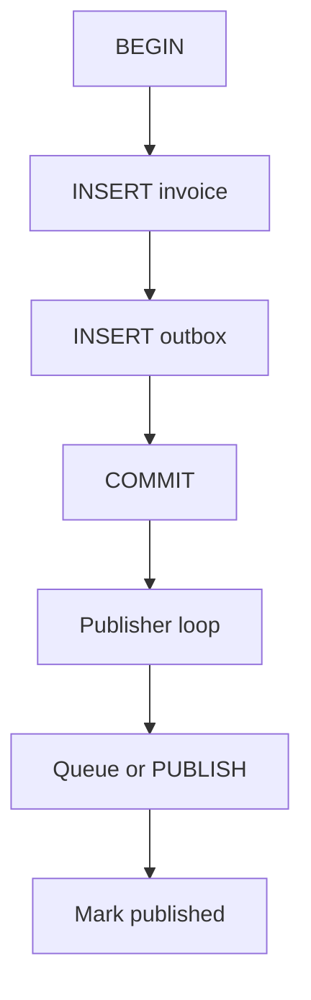

# Month 17 · Week 3 · Day 5
# The Outbox: Dual-Write Lies, One Transaction Tells the Truth

**Program:** Full-Stack Mastery · 18 months  
**Phase:** 6 — Advanced engineering and system design  
**Month index:** [../../README.md](../../README.md)  
**Week 3:** [1](day-01.md) · [2](day-02.md) · [3](day-03.md) · [4](day-04.md) · Day 5 (today) · [6](day-06.md) · [7](day-07.md)  
**Week rhythm today:** Tests + docs  
**Student state:** You can stream SSE in a lab. Week 2 warned that **commit then LPUSH** can split. Today that warning becomes a **pattern** you can implement in miniature and **test**.  
**Study time:** 3–4 focused hours

Labs: `~\fullstack-lab\month-17\week-03\day-05\`. Not Project 7 source. Kafka optional — **not** used.

---

## How to use this textbook

1. Read until you can draw the failure of two writes to two systems.  
2. Type an `outbox` table in the same SQLite transaction as the sale. pytest the invariant.  
3. Optional review links are for later rechecking.

---

## How to read this chapter

**Dual-write:** `COMMIT` invoice in Postgres, then `PUBLISH` Redis / `LPUSH` queue / HTTP to a bus. Between the two, the process can die. You get **paid without event** or **event without paid** (if you reversed the order).

**Outbox:** in the **same database transaction**, insert `invoices` **and** a row in `outbox(id, event_name, payload, created_at, published_at NULL)`. A **publisher** process (`SELECT ... WHERE published_at IS NULL`) sends to Redis/SSE/queue, then marks published. If the publisher dies, the row is still there. **At-least-once** to subscribers; they stay idempotent.



**Wrong belief:** “I’ll write Redis first, then the DB; if DB fails I’ll undo Redis.”  
**Correct:** undo can fail too. Compensations are a second product. Outbox keeps **one** commit as the fact.

**Wrong belief:** “The outbox is Kafka.”  
**Correct:** the outbox is a **table**. Kafka, if you ever add it, is an optional **drain target**.

---

## Today's contract

1. Explain dual-write with a crash between the two calls.  
2. Implement `sales` + `outbox` in **one** `commit()`.  
3. Implement `publisher.once()` that marks a row published (fake: append to `published.jsonl`).  
4. pytest: crash-before-second-write is **impossible** for DB+outbox in one tx; publisher retry does not duplicate `jsonl` if you unique `outbox.id`.  
5. Write `WHEN.md`: when Project 7 needs this vs “same SQLite as Week 2 jobs table.”

**Today's gate.** Closed-book:

> Two systems cannot share a commit. I put the event row in the same transaction as the business row. A publisher drains the outbox at-least-once. Consumers are idempotent. I do not call that exactly-once delivery.

---

## Time box

| Block | Minutes | Work |
|---|---|---|
| A | 45 | Theory |
| B | 65 | Type-along + tests |
| C | 55 | Independent: failure matrix + docs |
| D | 15 | Git |
| E | 15 | Recall |

---

# Block A — Theory

## 1. The lie, slowly

1. `session.add(invoice); session.commit()`  
2. `redis.lpush("events", payload)`  
3. Process killed after 1, before 2 → **no email job**.  
4. Reverse order: job runs, invoice missing → worker errors (retry/poison). Worse if the job **charges**.

SSE `subscribers` queues in Day 4 are **in-memory dual-write cousins**: POST updates memory, another process never sees it. Outbox does not fix **multi-worker SSE** by itself; it fixes **durable facts**. A worker then PUBLISH/SSE.

## 2. Outbox columns (minimum)

| Column | Role |
|---|---|
| `id` | UUID PK, also **event_id** for consumers |
| `name` | `sale_made` |
| `payload` | JSON text |
| `created_at` | |
| `published_at` | NULL until drain succeeds |

Do not delete immediately (ops). You may archive later.

## 3. Publisher

Loop: pick unpublished, **send**, set `published_at`. If send succeeds and mark fails, **duplicate send** → consumer idempotency (Week 2/3). If you mark **before** send, crash **loses** the send — same ack-order lesson.

**SKIP LOCKED** / SQLite exclusive transaction so two publishers do not double-send the same row **before** either marks — still duplicates possible around crash; unique `event_id` on consumer.

## 4. Inbox (name only)

Consumers store processed `event_id` (**inbox**). Symmetric to outbox. You typed this as `seen` set on Day 2.

## 5. When you may skip a formal outbox

Week 2 **jobs table in the same Postgres** as invoices is already an outbox-shaped command. If your only subscriber is **your** worker reading `jobs`, you do not need Redis. If you **also** notify another system, drain outbox to that system.

## 6. Tests today

Assert: creating a sale without an outbox row is **impossible** if both inserts happen before commit — a unit test that `create_sale` always inserts two rows or none (rollback).

---

# Block B — Type-along

```powershell
cd ~\fullstack-lab
mkdir month-17\week-03\day-05 -Force
cd ~\fullstack-lab\month-17\week-03\day-05
uv init --name lab-outbox
uv add --dev pytest
```

`store.py`: SQLite `sales(id, sku, qty)` and `outbox(...)`. `create_sale` uses one connection, both inserts, commit. If second insert throws, nothing visible.

`publisher.py`: `once()` reads one NULL `published_at`, appends payload to `published.jsonl` **using event id as dedupe** (skip if id already in a `published_ids` table), then sets `published_at`.

Tests:

- `test_create_sale_inserts_outbox`  
- `test_create_sale_rollback` — force failure after modeling (e.g. invalid qty raises **before** commit)  
- `test_publisher_twice_one_line` — `once()` twice, jsonl one object for that id  
- `test_dual_write_essay` not a test — put in markdown  

```powershell
uv run pytest -q
```

Write `LIE.md`: 12 lines, the Redis LPUSH story vs outbox.

---

# Block C — Independent

`MATRIX.md` — for each, **symptom**, **outbox helps?**:

1. Commit sale, crash before Redis Pub/Sub.  
2. SSE in-memory, two Uvicorn workers.  
3. Email job table in same Postgres transaction.  
4. Publisher sent, crashed before `published_at`.  
5. Kafka (optional) as drain — still need idempotent consumer?

`WHEN.md`: Project 7 — jobs-in-Postgres enough, or true outbox? Honest.

`SSE.md`: how Day 4 would **drain outbox** instead of RAM-only (words, no giant rewrite required).

---

# Block D — Git

```powershell
cd ~\fullstack-lab
git add month-17
git commit -m "Month 17 Week 3 Day 5: outbox table tests and dual-write docs."
```

---

# Block E — Recall

1. Dual-write crash.  
2. Same transaction contents.  
3. Publisher ack order.  
4. Why consumers still dedupe.  
5. Jobs table as baby outbox.

## Office hours

**jsonl duplicates.** Dedupe table is the lesson; deleting jsonl is not.

**Distributed transactions / 2PC.** Out of scope. Outbox is the practical pattern.

**Publisher in the API process.** A `BackgroundTasks` drain is the Day 1 sin again. The publisher is a **looping process** like a worker. Same Compose service pattern as Week 2.

# Lecture: jobs table vs outbox vs Redis list

Write `THREE.md`:

| Mechanism | Same TX as sale? | Survives Redis down? | Fan-out to SSE? |
|---|---|---|---|
| `jobs` row in Postgres | Yes if you insert both | Yes | Worker can notify |
| `outbox` row | Yes | Yes | Publisher drains |
| `LPUSH` after commit | No | No | Easy and **lying** |

Week 2’s baby outbox (jobs in the same DB) is enough for **one** worker. Outbox **named** as events earns keep when **more than one** consumer must see `sale_made` (email + search + SSE). Do not add Kafka to get a second consumer. A second `jobs` type or a second handler on the publisher is cheaper.

pytest must prove: no sale row without outbox row after a successful `create_sale`. If you only tested the publisher, you tested the drain, not the invariant.

Write `CRASH-DIAGRAM.md` (10–12 lines, mermaid or numbered): process dies after COMMIT of sale+outbox, before publisher send; then dies after send, before `published_at`. Name which consumer rule saves each case (replay vs idempotency).

**Wrong belief:** “I’ll DELETE the outbox row instead of setting published_at.”  
**Correct:** you lose the audit. Mark it. Archive later.

---

## Definition of done

- [ ] pytest green  
- [ ] LIE.md MATRIX.md WHEN.md  
- [ ] Gate paragraph spoken  
- [ ] Commit exists  

---

## Optional review links

- [Fowler: Transactional Outbox](https://microservices.io/patterns/data/transactional-outbox.html)  

---

## Tomorrow

**Independent:** `NEED.md` — does Project 7 need realtime? **No** is a passing answer with reasons. If yes, implement the **minimum**.
