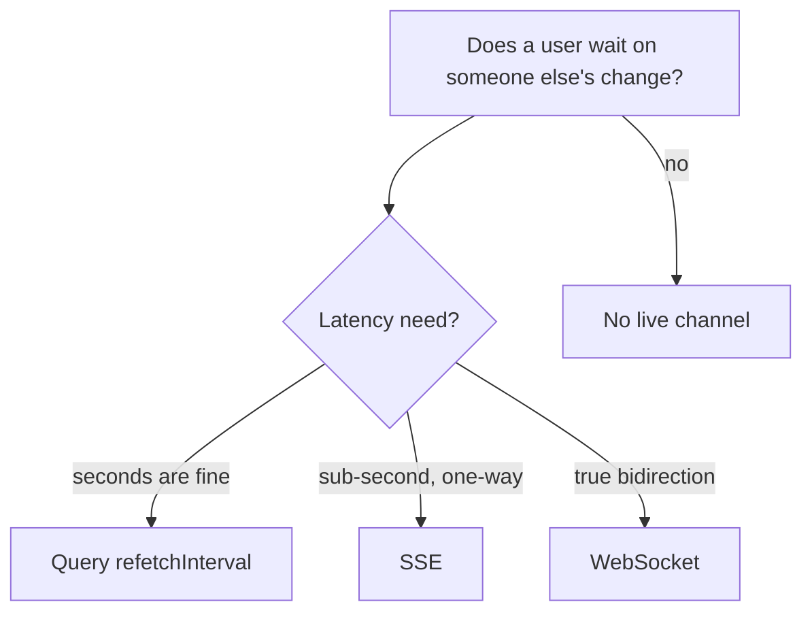

# Month 17 · Week 3 · Day 6
# Independent: NEED.md — Does Project 7 Need Realtime?

**Program:** Full-Stack Mastery · 18 months  
**Phase:** 6 — Advanced engineering and system design  
**Month index:** [../../README.md](../../README.md)  
**Week 3:** [1](day-01.md) · [2](day-02.md) · [3](day-03.md) · [4](day-04.md) · [5](day-05.md) · Day 6 (today) · [7](day-07.md)  
**Week rhythm today:** Independent implementation  
**Student state:** You have SSE in a gym and an outbox in a gym. Today you decide, in writing, whether **your** product needs live updates. **No** is a complete, passing answer if the reasons are engineering reasons.  
**Study time:** 3–4 focused hours

This textbook will **not** paste Project 7. Put `NEED.md` in **your** docs and a copy in `~\fullstack-lab\month-17\week-03\day-06\`.

---

## How to use this textbook

1. Argue from **user need** and **cost**, not from tutorials.  
2. If you implement, implement the **minimum** (often poll).  
3. Optional review links are for later rechecking.

---

## How to read this chapter

Month 17’s gate: WebSockets or SSE appear **only** if the product needs live updates; a poll is allowed if it is honest.



**Wrong belief:** “We built SSE in the lab, so Project 7 must use it.”  
**Correct:** labs are gyms. Product gets a **justified** channel or none.

**Wrong belief:** “No realtime means I skipped Week 3.”  
**Correct:** a defended **no** is Week 3 applied.

---

## Today's contract

1. Write `NEED.md` with the required headings.  
2. Choose **none / poll / SSE / WS**.  
3. If none or poll: do **not** add a socket “anyway.” Optionally add `refetchInterval` on **one** query if it matches a user wait.  
4. If SSE/WS: implement **minimum** in **your** repo (one resource, auth, reconnect note).  
5. Mention outbox/jobs: how facts reach the channel.  
6. No product source in fullstack-lab.

**Today's gate.** Closed-book:

> I can justify none, poll, SSE, or WS for my product. I named cost and failure. I did not add Kafka to look distributed. I did not claim exactly-once.

---

## Time box

| Block | Minutes | Work |
|---|---|---|
| A | 25 | Theory: decision tests |
| B | 40 | Write NEED.md |
| C | 100 | Implement minimum **or** poll/none + Query note |
| D | 20 | Evidence redacted |
| E | 15 | Recall + git |

---

# Block A — Theory

## Decision tests (all should be answered)

1. **Whose** data changes while the user stares? (self via mutation — Query invalidation is enough.)  
2. **How fast** must they see someone else’s change?  
3. **How many** connections at peak?  
4. **How many** API processes? (in-memory SSE fails here.)  
5. **Auth** on the stream?  
6. **Missed events** acceptable?  
7. Is this actually a **job status** (Week 2)?

If 1 is “only their own mutation,” you likely need **none**.

## Minimum implementations

**Poll:** `useQuery({ queryKey: ["jobs", id], queryFn, refetchInterval: 4000, staleTime: 0 })` while status is queued; `false` interval when terminal. Object API, v5.

**SSE:** one endpoint, cookie auth, heartbeat, backlog or accept misses, one worker **or** Redis pub/sub you already operate.

**WS:** only if users **send** continuous messages.

Do not add GraphQL subscriptions. Optional in the program; not today’s work.

---

# Block B — NEED.md headings (required)

```powershell
cd ~\fullstack-lab
mkdir month-17\week-03\day-06 -Force
```

Copy the same headings into the product repo:

1. Product noun (one sentence)  
2. Live user stories (0–n). If 0, say so.  
3. Decision: none | poll | SSE | WS  
4. Cost you accept  
5. Failure modes (disconnect, two workers, duplicates)  
6. How it relates to Week 2 jobs  
7. Outbox: yes/no/baby jobs table  
8. What you will **not** build (Kafka, mesh, presence avatars)  
9. Implementation notes (commands, env) **or** “none shipped”  
10. How you will **measure** extra RPS (Week 1 mind)

---

# Block C — Implement or refuse

**Refuse path (passing):** NEED.md + maybe Query invalidation audit (do mutations invalidate the list?). Write `INVALIDATION.md` in the lab: query keys **names**, no source.

**Poll path:** one `refetchInterval` behind a status that is not terminal. Evidence: test or a sentence in NEED.md.

**SSE/WS path:** keep it smaller than Day 4’s gym if possible — **one** event type. Auth required on product. `WORKERS.md` in product docs.

---

# Block D — Evidence

`~\fullstack-lab\month-17\week-03\day-06\NEED.md` (may be identical). `EVIDENCE.md`: decision + test names or “no code change.”

---

# Block E — Git

```powershell
cd ~\fullstack-lab
git add month-17
git commit -m "Month 17 Week 3 Day 6: NEED.md realtime decision."
```

Product repo commit if code or docs changed.

---

## Office hours

**I feel guilty saying no.** Guilt is not a requirement. A dashboard that is not a trading floor **should** say no.

**I already opened WS for fun.** Either justify it in NEED.md or **remove it** from the product path. Souvenir sockets are Week 4 anti-patterns.

**Query refetchInterval on every list.** That is a **load-test** of your own API (Week 1). Scope it to **in-progress job status**, and set `refetchInterval: false` when `email_status` is `sent` or `dead`. v5 object API:

```ts
useQuery({
  queryKey: ["invoice", id],
  queryFn: () => api.getInvoice(id),
  refetchInterval: (q) =>
    q.state.data?.email_status === "queued" ? 4000 : false,
})
```

If your Query version’s callback shape differs, read the type error and keep the **idea**: poll only while queued.

# Lecture: minimum realtime, spelled out

If NEED.md says **SSE**, the minimum is:

1. One path, one event name.  
2. Cookie auth (no token query string).  
3. Heartbeat.  
4. Reconnect: miss accepted **or** last-N replay from Postgres, not RAM-only if you have two workers.  
5. `onmessage` → `queryClient.invalidateQueries({ queryKey: ["invoice", id] })` — the socket is a **hint**.  
6. Compose: one API replica **or** a shared pub you already run.

If NEED.md says **none**, Block C is an **invalidation audit**: after create/update/delete, does the list Query key update? Write three keys (names only) in `INVALIDATION.md`. That work is **more** on-product than a souvenir socket.

Write `ANTI.md` (eight lines): GraphQL subscriptions, presence avatars, one WS per table row, Kafka “so we can scale events” — all rejected unless the user story exists. Kafka remains optional in this program.

**Wrong belief:** “Month 17 requires a live dashboard.”  
**Correct:** Month 17 requires a **decision**. The gate says SSE/WS **only if** the product needs live updates.

Write `POLL-COST.md`: if you chose poll, estimate GETs/minute = tabs × (60 / interval) for **your** expected concurrent clerks, not a fantasy IPO. If that number is tiny, poll is the correct professional choice.

Write `AUTH-STREAM.md`: if you chose SSE/WS, one paragraph on cookie vs query-string token. If you chose none, write “N/A — no stream.”

If implementation lags NEED.md, the document still ships today with a **dated gap**. The month gate will not.

## Scoring NEED.md

| Heading | Honest pass |
|---|---|
| Live stories | Zero is allowed |
| Decision matches code or a dated gap | Not a souvenir socket |
| Cost in numbers or “tiny staff” | Not “it will scale” |
| Two-worker story if SSE | RAM vs shared pub |
| Kafka rejected | Optional in this program |

---

## Definition of done

- [ ] NEED.md complete in product + lab  
- [ ] Decision matches implementation (or explicit gap)  
- [ ] No pasted source  
- [ ] Gate paragraph spoken  
- [ ] Commit exists  

---

## Optional review links

- Week 3 Days 1–5  
- [TanStack Query refetchInterval](https://tanstack.com/query/latest/docs/framework/react/reference/useQuery)  

---

## Tomorrow

**Review:** ordering and duplicates. Do not claim exactly-once.
