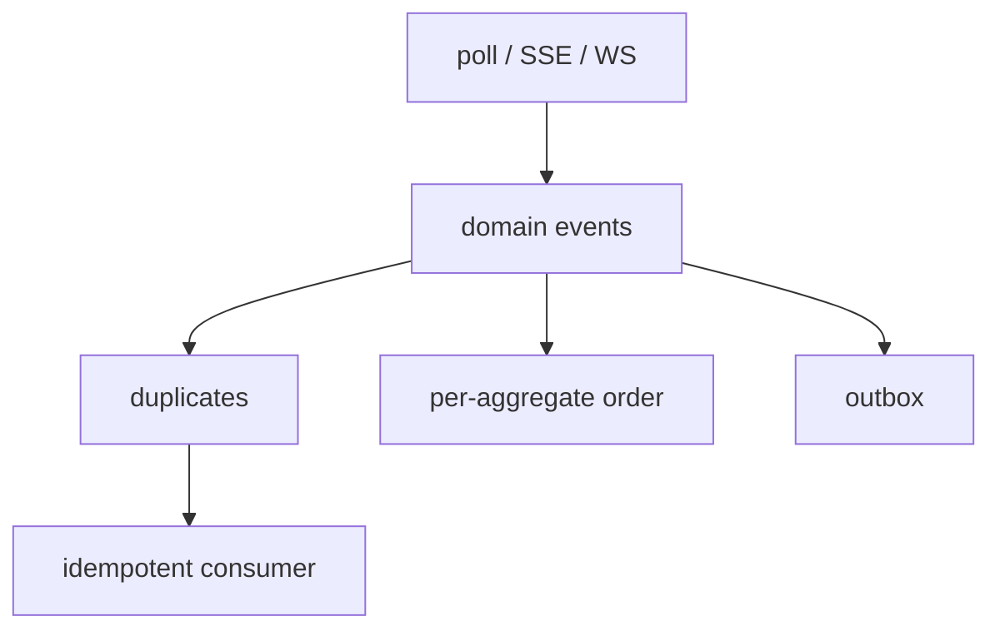

# Month 17 · Week 3 · Day 7
# Review: Ordering, Duplicates, and the Exactly-Once Refusal

**Program:** Full-Stack Mastery · 18 months  
**Phase:** 6 — Advanced engineering and system design  
**Month index:** [../../README.md](../../README.md)  
**Week 3:** [1](day-01.md) · [2](day-02.md) · [3](day-03.md) · [4](day-04.md) · [5](day-05.md) · [6](day-06.md) · Day 7 (today)  
**Week rhythm today:** Weekly review  
**Student state:** NEED.md exists. Today you synthesize live channels, events, consistency, and outbox, then **refuse** exactly-once as a slogan while still designing **safe effects**. Days 1–6 closed during Blocks 1–3.  
**Study time:** 3–4 focused hours

Work in `~\fullstack-lab\month-17\week-03\day-07\`. No Project 7 source. Kafka not required.

---

## How to read this chapter

This file is the teacher for Week 3.



**Wrong belief:** “If I say exactly-once, the design is done.”  
**Correct:** you name **at-least-once** plus **idempotency** plus **where order matters**.

---

## Today's contract

1. Teach Week 3 from the synthesis.  
2. Debug ordering and duplicate scenarios.  
3. Mini-build: inbox table + ignore stale versions.  
4. Review NEED.md against costs.  
5. Closed-book refusal of exactly-once **delivery**.

**Today's gate.** Closed-book:

> I pick poll, SSE, WS, or none from need. Events are facts; Redis Pub/Sub can miss. Duplicates happen; consumers dedupe. Order is per key. Dual-write lies; outbox shares a transaction. I do not claim exactly-once delivery.

---

## Time box

| Block | Minutes | Work |
|---|---|---|
| 0 | 25 | Speak synthesis |
| 1 | 30 | exam-01.md |
| 2 | 45 | Mini inbox + versions |
| 3 | 30 | Debug A–F |
| 4 | 20 | NEED.md critique |
| 5 | 20 | Design toward Week 4 scale |
| 6 | 15 | Retro + git |

---

## Week 3 synthesis (the lesson, in this book)

**Polling.** Repeated GET. Query `refetchInterval`. Cheap to reason about; RPS cost; fine for job status.

**SSE.** One-way `text/event-stream`. Heartbeats. EventSource retries; **gaps** without replay. No custom headers; cookies possible. In-memory fan-out is **per process**.

**WebSockets.** Bidirectional. Protocol + reconnect + auth + multi-instance story. Not for CRUD. Not the default.

**When not WS.** Forms, slow job status, rare toasts, “modernity,” GraphQL subscriptions as a personality (GraphQL optional).

**Domain events.** Past tense. Commands are jobs. In-process bus ≠ multi-worker. Redis Pub/Sub: **no persistence**.

**Delivery.** At-most-once (miss) or at-least-once (dup). **Exactly-once delivery** refused. **Exactly-once effects** via inbox/unique keys.

**Ordering.** Not global. Per aggregate + `version`. Timestamps lie. Stale SSE must not overwrite new GET.

**Eventual consistency.** SoR immediate (stock, payment). Email and dashboards may lag. UI tells the truth. Do not decrement stock in the mailer. Authz must not lag.

**Outbox.** Same TX as business row. Publisher drains. Mark after send. Consumers still dedupe. Baby form: jobs table in Postgres.

**NEED.md.** No is passing. Minimum if yes.

**Wrong belief:** “WebSockets are our event bus.”  
**Correct:** browsers are not subscribers of record.

---

# Complete explanation — duplicates and order (worked)

**Duplicate `SaleMade`.** Inbox `event_id` PK. Second handler return. Email key `receipt:{sale_id}`.

**Out of order.** `StockView` version 5 then 4: ignore 4. GET is truth if push is a hint (`invalidateQueries`).

**Two workers SSE.** User connected to B, POST on A: silence. Fix: sticky (Week 4) or shared pub (Redis) **draining outbox**, not RAM.

**Exactly-once broker marketing.** Still: retries, human replay, two consumers, clock skew. Your inbox stays.

---

# Block 0 — Speak

Three channels; Pub/Sub miss; outbox; NEED.md decision; exactly-once refusal.

---

# Block 1 — Closed-book

```powershell
cd ~\fullstack-lab
mkdir month-17\week-03\day-07 -Force
```

`exam-01.md` (25–40 lines): channels; when not WS; duplicate + order; outbox vs dual-write; your NEED decision; one sentence you will **not** say in an interview (“we have exactly-once”).

---

# Block 2 — Mini-build

```powershell
cd ~\fullstack-lab\month-17\week-03\day-07
mkdir mini -Force
cd mini
uv init --name exam-inbox
uv add --dev pytest
```

`inbox.py`:

```python
class Inbox:
    def __init__(self) -> None:
        self.seen: set[str] = set()
        self.stock = 0
        self.version = 0

    def apply(self, event_id: str, version: int, stock: int) -> str:
        if event_id in self.seen:
            return "duplicate"
        if version <= self.version:
            self.seen.add(event_id)
            return "stale"
        self.seen.add(event_id)
        self.version = version
        self.stock = stock
        return "applied"
```

Tests: duplicate, stale, applied in order, stale does not lower stock.

```powershell
uv run pytest -q
```

Write `REFUSE.md`: 8 lines — delivery vs effects.

---

# Block 3 — Debug

`DEBUG.md`:

**A.** “Redis Pub/Sub so we don’t need outbox.”  
**B.** Global sort by `created_at` ISO strings from two hosts.  
**C.** EventSource without replay; “we never miss.”  
**D.** Decrement inventory in `on_email_sent`.  
**E.** `allow_origins=["*"]` with credentialed SSE.  
**F.** NEED.md says none; production still opens 1 WS per table row.

Worked box after you write.

---

# Block 4 — NEED.md

Open **lab copy only**. `CRITIQUE.md`: one cost missing, or `SOLID.txt` if the decision still holds.

---

# Block 5 — Toward Week 4

`SCALE.md` (10 lines): 10k SSE connections — sticky vs Redis vs “don’t.” Simplest first.

---

# Block 6 — Retro + git

`retro.md`

```powershell
cd ~\fullstack-lab
git add month-17
git commit -m "Month 17 Week 3 review: inbox mini, exactly-once refusal."
```

---

## Worked answers — after DEBUG.md

**A.** Pub/Sub misses; outbox is durable drain.  
**B.** Skew; versions.  
**C.** Reconnect gaps.  
**D.** Oversell; SoR in the sale TX.  
**E.** CORS + credentials.  
**F.** Souvenir sockets; remove or justify.

---

## Office hours

**Stale vs duplicate order in apply.** Adding `event_id` to `seen` even when stale prevents **reprocessing**; stock unchanged. If you disagreed, argue in DIFF.

Windows: `uv run pytest -q`.

# Lecture: sentences you will not say

Write `BANNED.md` — rewrite each banned sentence into an honest one:

1. “We have exactly-once Kafka.” → at-least-once + inbox.  
2. “WebSockets are our event bus.” → browser transport ≠ SoR.  
3. “Pub/Sub guarantees delivery.” → misses if down.  
4. “Timestamps order events.” → versions on the aggregate.  
5. “The UI is the source of truth.” → GET after invalidate.  
6. “We’ll 2PC the database and Redis.” → outbox.

Then `ORAL.md` answers (one line each): poll cost; SSE heartbeat; WS two-worker; outbox TX; NEED.md no; duplicate `event_id`; stale version; authz must not lag.

If NEED.md chose SSE and production still uses RAM `subscribers` with `--workers 2`, the gate row is **false** until you document single-worker **or** shared pub. Honesty in `CRITIQUE.md` is the repair, not a new broker.

**Wrong belief:** “The exam is the SSE lab.”  
**Correct:** the exam is **duplicates, order, and refusal**. The lab was a mechanism.

## Scoring the mini

| Call order | Expected |
|---|---|
| apply id=a v=1 stock=10 | applied, stock 10 |
| apply id=a v=99 | duplicate, stock 10 |
| apply id=b v=0 | stale, stock 10 |
| apply id=c v=2 stock=8 | applied, stock 8 |

If your `stale` path did not add `event_id` to `seen`, a later replay of the stale event could apply after a bug. Write `SEEN.md`: why seen includes stale ids.

Closed-book: Redis Pub/Sub miss; outbox same TX; NEED.md no; hydration is Week 4 — do not confuse it with SSE.

Write `FANOUT.md` (eight lines): one event, email handler poisons, cache handler must still run — **separate jobs**, not one try-soup. That is Week 2 isolation applied to Week 3 events.

If exam-01 still says “exactly-once,” rewrite it from the synthesis before you mark anything green.

Write `JOIN.md`: GET is truth; SSE is a hint; `invalidateQueries({ queryKey: ["invoice", id] })` after an event. Duplicate events must not flicker paid → unpaid.

Write `EXACTLY.md` (four lines): delivery vs effects. You may write “exactly-once **processing** of side effects via an inbox.” You may not write “the bus is exactly-once.”

---

---

---

---

## Definition of done

- [ ] exam-01  
- [ ] mini pytest  
- [ ] DEBUG A–F  
- [ ] CRITIQUE or SOLID  
- [ ] REFUSE.md  
- [ ] Commit exists  

---

## Optional review links

- [Fowler: Transactional Outbox](https://microservices.io/patterns/data/transactional-outbox.html)  
- [MDN EventSource](https://developer.mozilla.org/en-US/docs/Web/API/EventSource)  

---

## Next week

**System design and React framework literacy.** Vertical vs horizontal scale, load balancers, stateless APIs. Database scale as **ideas**. Modular monolith vs expensive microservices. SOLID/DI on FastAPI. CSR/SSR/hydration experiment. ADR for Project 7/8. **Month exam:** simplest architecture; justify every box.
