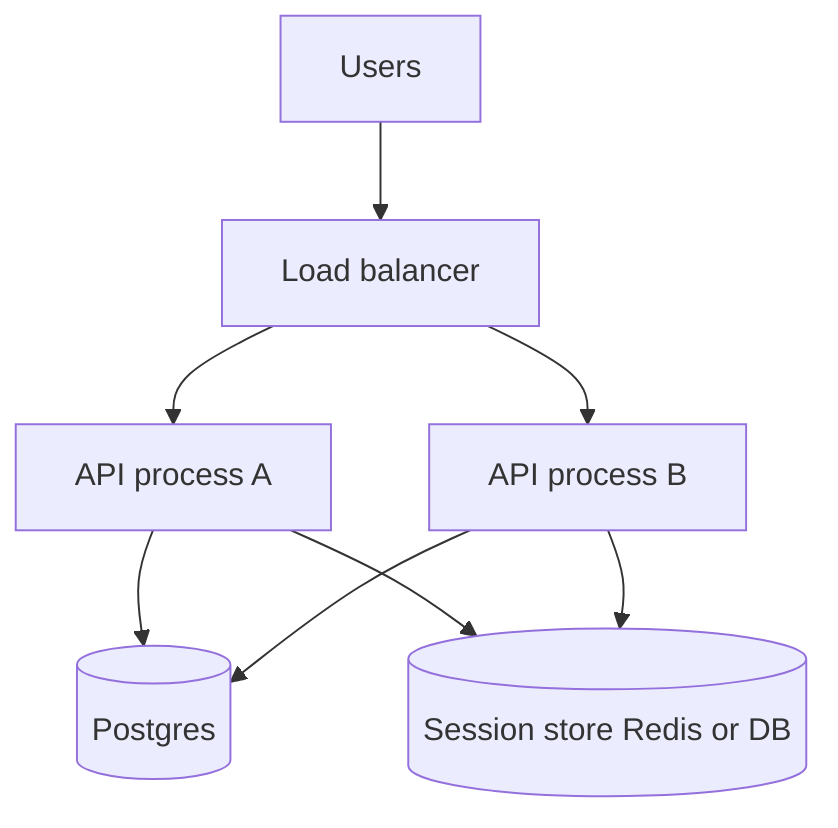

# Month 17 · Week 4 · Day 1
# Scale: Vertical, Horizontal, Load Balancers, Sticky vs Stateless

**Program:** Full-Stack Mastery · 18 months  
**Phase:** 6 — Advanced engineering and system design  
**Month index:** [../../README.md](../../README.md)  
**Week 4:** Day 1 (today) · [2](day-02.md) · [3](day-03.md) · [4](day-04.md) · [5](day-05.md) · [6](day-06.md) · [7](day-07.md)  
**Week rhythm today:** Learn + type-along  
**Student state:** Month 17 Weeks 1–3 are behind you: measure, queue, events. Today you learn how a **second copy** of the API changes the design — especially **sessions** and **in-memory SSE**. Kubernetes remains **optional**.  
**Study time:** 3–4 focused hours

**This week covers:** scale, load balancing, stateless APIs, database scale ideas, cache layers, modular monolith, service boundaries, microservices cost, SOLID/DI, React CSR/SSR/hydration, an ADR, the **month exam**.

Labs: `~\fullstack-lab\month-17\week-04\day-01\`. This textbook will **not** paste Project 7.

---

## How to use this textbook

1. Read until you can refuse sticky sessions as the default.  
2. Type a tiny “who am I” API that shows **process identity** — the seed of the sticky-session bug.  
3. Optional review links are for later rechecking.

---

## How to read this chapter

**Vertical scale:** a bigger machine (more CPU, RAM, a larger RDS instance). **Horizontal scale:** **more** machines (or more containers) behind a **load balancer**. Vertical is simple until the box is maxed or you want redundancy. Horizontal requires the API to be **stateless**: any instance may serve the next request.



**Wrong belief:** “We’ll add Kubernetes and it will scale.”  
**Correct:** Kubernetes schedules containers. It does not make in-memory sessions or SSE queues correct. Optional until you can debug a single Compose stack (Month 15–16).

**Wrong belief:** “Sticky sessions mean I can keep sessions in RAM and still have two boxes.”  
**Correct:** sticky sessions **tie a user to one instance**. Deploys, crashes, and uneven load all hurt. Prefer a **session store** both instances read.

---

## Today's contract

1. Define vertical vs horizontal scale with one example each.  
2. Explain what a **load balancer** does (health, distribute, TLS sometimes).  
3. Contrast **sticky sessions** vs **stateless API** + **shared session store**.  
4. Explain why Week 3’s in-memory SSE breaks at two workers.  
5. Name **what still does not scale** if the database is the bottleneck (Week 1).

**Today's gate.** Closed-book:

> Vertical is a bigger box. Horizontal is more boxes behind a balancer. Stateless means any instance can serve the request. Sessions live in a store both instances share, or in a cookie you can verify, not in one process’s RAM. Sticky is a last resort. I do not need Kubernetes to say that.

---

## Time box

| Block | Minutes | Work |
|---|---|---|
| A | 55 | Theory |
| B | 55 | Type-along: instance id header |
| C | 70 | Independent: eight scale claims |
| D | 15 | Git |
| E | 15 | Recall |

---

# Block A — Theory

## 1. Vertical scale

Buy more CPU/RAM; raise RDS instance class; raise `pool_size` **carefully** (Week 1). **Pros:** no session redesign, one box to SSH (Month 16). **Cons:** ceiling, single failure, price curve steepens. A 3-second Seq Scan does not care that you doubled RAM if it never used RAM.

**Wrong belief:** “Vertical is amateur.”  
**Correct:** this course prefers the **simplest** thing. One well-sized API + one Postgres is the default architecture until a **named** limit appears.

## 2. Horizontal scale

Run N copies of the **same** stateless API. The load balancer picks a healthy instance (round-robin, least connections — you need the **idea**, not a vendor exam).

**What must be shared:**

- **Postgres** (one primary for writes, unless you adopt replicas — Day 2 ideas)  
- **Session/token store** if sessions are server-side  
- **Job queue** (workers are already a second process — they scale separately)  
- **Files:** not local disk of instance A (S3 or equivalent from Month 16)

**What must not live only in RAM of instance A:** shopping carts, SSE subscriber lists, “rate limit dict,” upload temp files you expect instance B to read.

## 3. Load balancer

A **reverse proxy** that terminates the client connection and opens another to an upstream. Month 16 may have used one (ALB, nginx, Caddy). Jobs:

- **Distribute** requests  
- **Health checks** (`GET /health` — Month 11)  
- Often **TLS**  
- Timeouts (SSE/WS need longer **idle** timeouts — Week 3)

It does **not** fix slow SQL. It can hide a dead instance.

**Wrong belief:** “The load balancer is a second application I write in FastAPI.”  
**Correct:** you **configure** one. Writing a toy balancer is not this month.

## 4. Sticky sessions

The balancer pins a client (cookie or IP) to instance A.

**When people want it:** in-memory sessions; WebSockets they do not want to pub/sub.

**Bills:** instance A deploy disconnects those users; A overloaded while B is idle; IP stickiness fails through NATs.

**This course:** treat sticky as a **temporary** crutch while you extract session store or stop using RAM as a database.

## 5. Stateless API

“Stateless” here means **no required server RAM between requests**. JWT or signed cookie (you already have auth) can be verified by any instance. Server-side sessions: **Redis or Postgres** table `sessions(id, user_id, expires_at)` both instances query.

**CSRF and cookies** do not disappear. Stateless is not “no security.”

## 6. Session store options

| Store | Honest use |
|---|---|
| Signed cookie | Small payload, any instance, size limits |
| Postgres | You already have it; slower than Redis; fine for many apps |
| Redis | Fast sessions/ephemeral; **not** SoR; TTL on session keys |
| Process RAM | One instance only |

Month 11 Redis rule still holds: key, TTL, invalidation (logout deletes the key).

## 7. Workers vs API replicas

Uvicorn `--workers 2` is already **two processes** on one box: **horizontal-on-one-machine**. In-memory dicts already break. You met this with SSE. Horizontal **across machines** is the same bug with a network between them.

Job **workers** scale by competing consumers on a queue, not by sticky sessions.

## 8. What you will not do today

- Install Kubernetes.  
- Load-test production.  
- Rewrite Project 7’s session layer unless it is already RAM-only and you have time — Day 6 ADR may name the work.

## 9. Say it — closed-book drill

Vertical vs horizontal; why RAM sessions fail; sticky vs store; LB health checks; SQL still the bottleneck.

---

# Block B — Type-along

```powershell
cd ~\fullstack-lab
mkdir month-17\week-04\day-01 -Force
cd ~\fullstack-lab\month-17\week-04\day-01
uv init --name lab-scale
uv add fastapi uvicorn pydantic
uv add --dev pytest httpx
```

`main.py`:

```python
import os
import uuid
from fastapi import FastAPI, Response

app = FastAPI()
INSTANCE = os.environ.get("INSTANCE_ID", str(uuid.uuid4())[:8])
RAM_SESSIONS: dict[str, str] = {}


@app.get("/whoami")
def whoami() -> dict:
    return {"instance": INSTANCE}


@app.post("/ram-session", status_code=201)
def set_ram(response: Response) -> dict:
    sid = str(uuid.uuid4())
    RAM_SESSIONS[sid] = "dock-master"
    response.set_cookie("sid", sid)
    return {"ok": True}


@app.get("/ram-session")
def get_ram(sid: str | None = None) -> dict:
    # lab: also accept cookie in a real app; query is easier in curl
    name = RAM_SESSIONS.get(sid or "", None)
    return {"instance": INSTANCE, "user": name}
```

```powershell
$env:INSTANCE_ID = "alpha"
uv run uvicorn main:app --host 127.0.0.1 --port 8021
```

Second terminal — **another** process:

```powershell
$env:INSTANCE_ID = "beta"
uv run uvicorn main:app --host 127.0.0.1 --port 8022
```

Third:

```powershell
curl.exe -s http://127.0.0.1:8021/whoami
curl.exe -s http://127.0.0.1:8022/whoami
curl.exe -s -c ram.txt -X POST http://127.0.0.1:8021/ram-session
curl.exe -s -b ram.txt "http://127.0.0.1:8021/ram-session?sid=PASTE"
```

Cookie file may store `sid`; or copy id from JSON if you also return it — **return `sid` in the 201 body** so curl is easy. Add `"sid": sid` to the POST response (type that). Then GET on **8022** with the same sid: **user is null**. Write `STICKY.md`: this is why sticky exists **and** why a shared store is better.

pytest: whoami has instance; ram session on **same** TestClient works (one process).

```powershell
uv run pytest -q
```

Stop both Uvicorns.

Write `LB.md`: in words, a balancer on 8020 forwarding to 8021/8022 without stickiness — what fraction of GETs miss the RAM session (about half). You need not run nginx today.

---

# Block C — Independent

`CLAIMS.md` true/false + sentence:

1. Two Uvicorn workers are already a session-affinity problem.  
2. A bigger RDS always fixes p95.  
3. Health checks should hit Postgres (ready) vs process up (live) — Month 11.  
4. Sticky sessions make deploys easier.  
5. JWT on every instance is a kind of statelessness.  
6. SSE in RAM + two instances is fine.  
7. Kubernetes is required for horizontal scale.  
8. Job workers should be sticky to the API that enqueued them.

`MY-SESS.md`: how **your** Project 7 auth works (cookie/JWT/server session) — names only — and whether two replicas would work **today**.

---

# Block D — Git

```powershell
cd ~\fullstack-lab
git add month-17
git commit -m "Month 17 Week 4 Day 1: instance id lab, sticky vs stateless notes."
```

---

# Block E — Recall

1. Vertical vs horizontal.  
2. What a load balancer is for.  
3. RAM session + two ports.  
4. Session store options.  
5. Why K8s is optional.

## Office hours

**PowerShell `$env:INSTANCE_ID`.** Set per terminal. If both say the same uuid, you forgot the env var.

**Cookie vs query.** Returning sid in JSON is the lab convenience.

## Definition of done

- [ ] Two instances, ram-session miss on the other  
- [ ] STICKY.md LB.md CLAIMS.md  
- [ ] pytest green  
- [ ] Gate paragraph spoken  
- [ ] Commit exists  

---

## Optional review links

- [MDN: Load balancing (concept)](https://developer.mozilla.org/en-US/docs/Glossary/Load_balancing)  
- [FastAPI behind a proxy](https://fastapi.tiangolo.com/deployment/concepts/)  

---

## Tomorrow

**Database scale ideas, cache layers, modular monolith, service boundaries, why microservices are expensive.**
