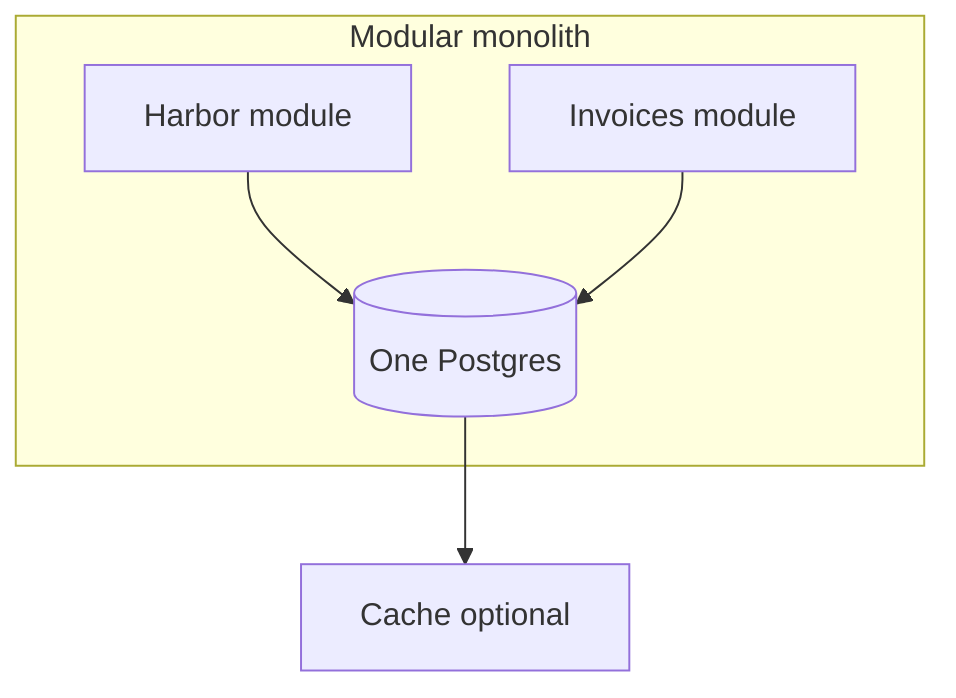

# Month 17 · Week 4 · Day 2
# Data Scale, Cache Layers, Modular Monolith, Why Microservices Cost

**Program:** Full-Stack Mastery · 18 months  
**Phase:** 6 — Advanced engineering and system design  
**Month index:** [../../README.md](../../README.md)  
**Week 4:** [1](day-01.md) · Day 2 (today) · [3](day-03.md) · [4](day-04.md) · [5](day-05.md) · [6](day-06.md) · [7](day-07.md)  
**Week rhythm today:** Exercises + debugging  
**Student state:** You can explain stateless APIs. Today: **data** scale as **ideas**, **cache layers**, and **where a second service earns keep**. This course prefers a **modular monolith** until a boundary is proven.  
**Study time:** 3–4 focused hours  
**Prereq:** Day 1 gate passed.

Labs: `~\fullstack-lab\month-17\week-04\day-02\`. No Kubernetes, no Kafka required. No Project 7 source.

---

## How to use this textbook

1. Read until you can refuse “we’ll microservice it” as a first move.  
2. Type a folder-shaped modular monolith (packages, not HTTP).  
3. Optional review links are for later rechecking.

---

## How to read this chapter

When the **API** is stateless, the next bottleneck is often **Postgres** or **the team’s coupling**, not “need 12 repos.”



**Wrong belief:** “Microservices are how senior engineers start.”  
**Correct:** microservices are how you pay **network, versioning, and on-call** for a boundary you could have been a **Python package**.

**Wrong belief:** “Read replicas make writes faster.”  
**Correct:** replicas spread **reads**. Writes still hit the **primary**. Replication **lag** is eventual consistency (Week 3).

---

## Today's contract

1. Explain **read replica** and **lag** in one paragraph.  
2. Explain **partitioning/sharding** as an **idea** (not a lab you must run).  
3. Place **cache layers**: browser, CDN, app, Redis, DB buffer cache.  
4. Define **modular monolith** vs **ball of mud** vs **microservices**.  
5. List **costs** of a second service (deploy, auth, tracing, dual-write).  
6. Draw a **service boundary** that would justify a split (or none).

**Today's gate.** Closed-book:

> Replicas help reads and lag. Sharding is a last resort. Caches still need keys and invalidation. A modular monolith is packages with rules. Microservices are expensive. I start with one FastAPI and one Postgres.

---

## Time box

| Block | Minutes | Work |
|---|---|---|
| A | 50 | Theory |
| B | 75 | Type-along: two packages, one app |
| C | 50 | Independent: split / do-not-split |
| D | 15 | Git |
| E | 15 | Recall |

---

# Block A — Theory

## 1. Read replicas

A **replica** is a copy of Postgres that receives **WAL** changes from the **primary**. You send **read-only** queries there. **Writes** and transactions that must see the write you just made stay on the primary (or you accept lag).

**Lag:** the replica is **behind**. User writes a slip name, next GET hits replica, **old name**. That is Week 3 eventual consistency inside **one** product.

**Wrong belief:** “I’ll round-robin all queries including POST.”  
**Correct:** POST on a replica **fails** or you built a split-brain.

This course does not require you to configure streaming replication. You must **speak** it.

## 2. Partitioning and sharding (ideas)

**Partitioning** (Postgres): one table split into pieces the planner understands (by date, by harbor_id). Still **one** database.

**Sharding:** different **databases** for different keys. Application routes `harbor_id % N`. Cross-shard joins **hurt**. You do this when **one** primary cannot hold the data or write QPS — **after** indexes, query shape, and vertical scale.

**Wrong belief:** “I’ll shard on Day 1 of Project 8.”  
**Correct:** you will not. Month 18 starts simplest.

## 3. Cache layers (stack them only with stories)

| Layer | What it copies | Invalidation |
|---|---|---|
| Browser | HTTP responses | Headers (Week 1) |
| CDN | Static / public GET | Hash filenames, purge |
| App memory | Dict per process | Dies on restart; not shared |
| Redis | Hot GET JSON | Key + TTL + delete on write |
| Postgres buffer cache | Pages in RAM | Automatic; not your Redis |

Adding **all** layers because a diagram had them is how you serve **stale authz**. Week 1 rule stands.

## 4. Modular monolith

**One** deployable FastAPI, **one** Postgres, **folders** that own rules: `harbor/`, `invoices/`, `identity/`. Modules talk via **function calls** and **explicit APIs** (Python functions), not random imports of each other’s tables.

**Ball of mud:** every router imports every model; no boundaries.

**Extract later:** if `invoices` becomes a team + different scale, the package **is** the candidate service. You did not start with a network.

Month 14 fakes at **ports** already hinted this. Day 4 SOLID names it.

## 5. Service boundaries that can earn keep

A split **might** pay when:

- **Independent scale** (PDF rendering saturates CPU; CRUD does not),  
- **Independent failure** (email vendor outage must not take down GET list) — often a **worker**, not a new HTTP service,  
- **Separate team/release** with real org cost,  
- **Different data** lifecycle you cannot schema-migrate together.

A split **does not** pay when: “Netflix does it”; you want GraphQL; you have 800 users; you have not measured (Week 1).

## 6. Microservices costs (memorize a few)

1. **Deploy N pipelines** (Month 16 × N).  
2. **Authn between services** (mTLS, tokens).  
3. **Local dev** needs many processes.  
4. **Dual-write / outbox** everywhere.  
5. **Latency** of HTTP+JSON vs a function.  
6. **On-call**: N health checks, N logs.  
7. **Versioning** public APIs you cannot type-check across a monorepo as easily.

Workers + queues give you **failure isolation** without a second public API.

**Kafka** as the nervous system of four services you do not have: souvenir.

## 7. GraphQL

Optional. A BFF can be a **module**. Not a reason to split databases.

---

# Block B — Type-along

```powershell
cd ~\fullstack-lab
mkdir month-17\week-04\day-02 -Force
cd ~\fullstack-lab\month-17\week-04\day-02
uv init --name lab-modules
uv add fastapi uvicorn pydantic
uv add --dev pytest httpx
```

Create packages:

```
harbor/__init__.py
harbor/service.py
invoices/__init__.py
invoices/service.py
app.py
```

`harbor/service.py`: `list_slips() -> list[dict]` from an in-memory list.

`invoices/service.py`: `create_invoice(slip_id, amount_cents)` — **calls** `harbor.service.get_slip(slip_id)` (function, not HTTP). If missing, raise a domain error the router maps to 404.

`app.py`: FastAPI routers that call those functions. Pydantic v2 `model_dump()`.

**Forbidden:** `invoices` importing FastAPI `Request` from harbor’s router. Keep **HTTP at the edge**.

Tests: missing slip → 404; happy 201.

Write `BOUNDARY.md`: what would become HTTP if invoices were a service (latency, 404 now a network 404, auth).

```powershell
uv run pytest -q
```

---

# Block C — Independent

`SPLIT.md` — split now / worker only / never yet, with a reason:

1. Image thumbnail CPU  
2. `can_edit` predicate  
3. SMTP send  
4. Search index (optional ES — **not required**)  
5. Second team in another country, same app  
6. “So we can use Kubernetes”  
7. Read-heavy public harbor map  
8. Payments charge (Week 2 job)

`CACHE-LAYERS.md`: for a public map tile vs authenticated invoice GET, which layers are allowed.

`MY-MONOLITH.md`: two folder names you have or owe in Project 7.

---

# Block D — Git

```powershell
cd ~\fullstack-lab
git add month-17
git commit -m "Month 17 Week 4 Day 2: modular packages, split decisions."
```

---

# Block E — Recall

1. Replica lag.  
2. Shard vs partition.  
3. Five cache layers.  
4. One microservice cost.  
5. Worker vs new HTTP service.

## Office hours

**Circular imports.** Domain functions should not import `app.py`. If they do, you built a mud.

## Definition of done

- [ ] Two packages, pytest 404/201  
- [ ] SPLIT.md  
- [ ] BOUNDARY.md  
- [ ] Gate paragraph spoken  
- [ ] Commit exists  

---

## Optional review links

- [Fowler: Monolith First](https://martinfowler.com/bliki/MonolithFirst.html)  
- [PostgreSQL hot standby idea](https://www.postgresql.org/docs/current/hot-standby.html)  

---

## Tomorrow

**From memory:** system design prompt — ticket system or clinic. Simplest architecture first.
