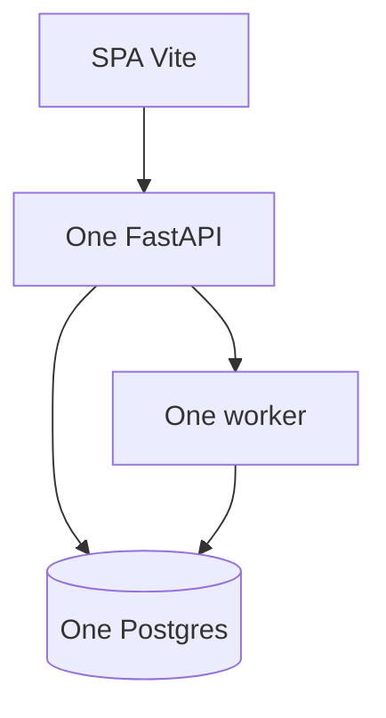

# Month 17 · Week 4 · Day 3
# From Memory: System Design — Simplest Architecture First

**Program:** Full-Stack Mastery · 18 months  
**Phase:** 6 — Advanced engineering and system design  
**Month index:** [../../README.md](../../README.md)  
**Week 4:** [1](day-01.md) · [2](day-02.md) · Day 3 (today) · [4](day-04.md) · [5](day-05.md) · [6](day-06.md) · [7](day-07.md)  
**Week rhythm today:** Implement from memory  
**Student state:** Day 2 gate passed. Today you **design** a small product from a prompt — **this file** is the teacher. Days 1–2 closed during drills.  
**Study time:** 3–4 focused hours  
**Prereq:** Day 2 gate passed.

Labs: `~\fullstack-lab\month-17\week-04\day-03\`. Gym domain: **clinic tickets** (appointments + queue). Not Project 7 source. Not Kafka. Not K8s.

---

## How Day 3 works

25-minute lookup rule. Worked box after `DESIGN.md`. AI must not write the first design.

---

## How to read this chapter

Month 17’s exam skill: **start simplest**, **justify every added box**.



**Wrong belief:** “A clinic needs six microservices because healthcare is serious.”  
**Correct:** serious means **authz, audit, backups, tests** — not a service mesh.

---

## Complete explanation (architecture you must still own)

**Vertical vs horizontal.** Bigger box vs more boxes. **Load balancer** distributes; health checks. **Stateless API:** shared session store or signed cookies/JWT; not RAM. **Sticky** is a crutch. Two Uvicorn workers already break RAM SSE/sessions.

**Data.** Primary writes. **Read replica** + **lag**. Partition vs shard (ideas). **Cache layers** with invalidation. Postgres is SoR.

**Modular monolith.** Packages, HTTP at the edge, function calls inside. **Microservices** cost deploys, auth, dual-write, latency. **Workers** isolate slow I/O without a new public API.

**Performance.** Measure first. p95. No Redis without key/TTL/invalidation.

**Jobs.** Queue + worker, at-least-once, idempotency, DLQ.

**Realtime.** Poll default; SSE/WS only if NEED.md says so.

**Outbox.** Same TX as the fact.

**Optional:** K8s, Kafka, GraphQL, Elasticsearch — not the first diagram.

**Wrong belief:** “Exactly-once bus.”  
**Correct:** refuse delivery slogan.

---

## Today's contract

1. Design a clinic ticket system from the spec — simplest first.  
2. Justify or reject seven extra boxes.  
3. Mini-build: one FastAPI module map in markdown + a tiny health app.  
4. Debug five over-engineering diagrams.

**Today's gate.** Closed-book:

> I start with SPA, FastAPI, Postgres, maybe a worker. Every extra box has a failure it prevents and a failure it introduces. I do not start with microservices.

---

## Time box

| Block | Minutes | Work |
|---|---|---|
| 1 | 25 | Speak; exam-01.md |
| 2 | 55 | DESIGN.md from spec |
| 3 | 40 | Mini health + boxes table |
| 4 | 30 | DEBUG over-engineering |
| 5 | 20 | Worked box |
| 6 | 20 | Project 7 simplest diagram |
| 7 | 15 | Retro |

---

# Block 1 — Speak

Cover: stateless; replica lag; monolith first; worker vs service; cache rule; optional list. `exam-01.md`.

```powershell
cd ~\fullstack-lab
mkdir month-17\week-04\day-03 -Force
cd ~\fullstack-lab\month-17\week-04\day-03
```

---

# Block 2 — Spec (clinic tickets)

**Users:** receptionist, clinician, patient (patient sees **own** appointments only).

**Must:** login; create appointment; list day’s tickets; cancel; one email reminder (queued).

**Scale (honest):** 3 clinics, ~200 appointments/day **total**. Not 200 million.

**Non-goals:** video visit platform, nationwide EHR, ML triage.

Write `DESIGN.md`:

1. **Diagram** (mermaid): boxes you **include**.  
2. **Tables** (names only): users, appointments, jobs, …  
3. **Why not** a `clinician-service` HTTP API.  
4. **Authz:** Month 13 mind — deny other patients.  
5. **Reminder:** job fields + idempotency key with **date**.  
6. **Live board** in waiting room: poll vs SSE vs no.  
7. **Replicas, Redis, CDN, Kafka, K8s:** each **yes/no + one sentence**.  
8. **What you would add first** if p95 of list is 2 s (Week 1 — measure, EXPLAIN).  
9. **Failure modes** of your chosen extra boxes (if none, say “no extra boxes”).

Then `BOXES.md` — keep / reject / later:

B1 Kafka  
B2 Read replica  
B3 Redis session  
B4 Kubernetes  
B5 Elasticsearch  
B6 GraphQL gateway  
B7 Second FastAPI “notification microservice”

---

# Block 3 — Mini-build

```powershell
uv init --name lab-clinic-health
uv add fastapi uvicorn
uv add --dev pytest httpx
```

`main.py`: `GET /health` → `{status: "ok", role: "api"}` — the **only** code. The design is the point.

`MODULES.md`: folders `identity/`, `appointments/`, `jobs/` and **one sentence each** on what they may not import.

```powershell
uv run pytest -q
```

TestClient 200 health.

---

# Block 4 — Debug

**A.** Diagram: 8 Spring-style services, 3 clinics, 200/day.  
**B.** Sticky sessions so clinicians keep RAM caches of patient PHR.  
**C.** Replica for **writes** of appointments.  
**D.** WebSocket per appointment row.  
**E.** Shared DB, 5 services, no outbox, `UPDATE` from all.

---

# Block 5 — Worked box (after DESIGN + BOXES)

**Simplest:** Vite SPA + FastAPI + Postgres + worker for email. Cookie/JWT authz. Poll waiting-room list every 15 s **or** none (receptionist refreshes). No Kafka/K8s/ES/GraphQL. Redis only if sessions need sharing **and** you already operate it — Postgres sessions also fine. Replica: **no** at 200/day. Notification microservice: **no** — worker.

**B1** reject. **B2** later/never at this scale. **B3** later if multi-instance. **B4** reject for this spec. **B5** reject. **B6** reject. **B7** reject.

**A** org-cosplay. **B** PHI in RAM + sticky. **C** replicas aren’t writable primaries. **D** Week 3 refuse. **E** dual-write mud.

`DIFF.md` / `MATCH.txt`.

---

# Block 6

`MY-SIMPLE.md`: Project 7 as **the same template** (boxes you actually have). Extra box you might remove. Names only.

---

# Block 7

`retro.md`, `lookups.txt`.

```powershell
cd ~\fullstack-lab
git add month-17
git commit -m "Month 17 Week 4 Day 3: clinic design from memory; health mini."
```

---

## Office hours

**“Healthcare requires HIPAA diagrams.”** You still start with one DB and access control. Compliance is not Kafka.

**I added Redis for fun.** Put it in BOXES as later and **remove it from the mermaid** if the spec does not need it.

## Definition of done

- [ ] DESIGN.md before the box  
- [ ] BOXES.md  
- [ ] pytest health  
- [ ] DEBUG A–E  
- [ ] Commit exists  

---

## Optional review links

Repair from this recap first.

- [Fowler: Monolith First](https://martinfowler.com/bliki/MonolithFirst.html)  

---

## Tomorrow

**Lab:** SOLID and dependency injection on FastAPI — ports you already used. Patterns that earn keep vs souvenirs.
