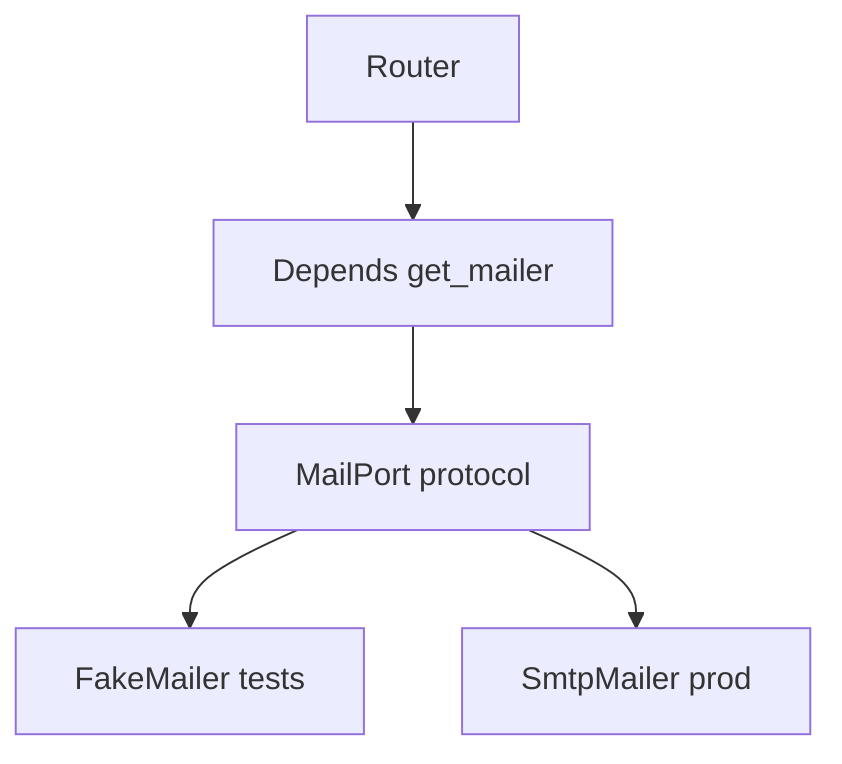

# Month 17 · Week 4 · Day 4
# SOLID and Dependency Injection on FastAPI — Ports, Not Souvenirs

**Program:** Full-Stack Mastery · 18 months  
**Phase:** 6 — Advanced engineering and system design  
**Month index:** [../../README.md](../../README.md)  
**Week 4:** [1](day-01.md) · [2](day-02.md) · [3](day-03.md) · Day 4 (today) · [5](day-05.md) · [6](day-06.md) · [7](day-07.md)  
**Week rhythm today:** Learn + lab feature  
**Student state:** You designed a clinic from memory. Today you **type** the object-oriented hygiene this program already used: **ports and adapters**, FastAPI **`Depends`**, and patterns that **earn keep** (repository, strategy) versus **pattern souvenirs** (AbstractSingletonVisitorFactory).  
**Study time:** 3–4 focused hours  
**Prereq:** Day 3 gate passed.

Labs: `~\fullstack-lab\month-17\week-04\day-04\`. Domain: **clinic tickets**. Not Project 7 source. Month 14 FakeMailer was this idea in testing clothes.

---

## How to use this textbook

1. Read SOLID as **engineering sentences**, not a poster.  
2. Type a `MailPort` protocol, a fake, a SMTP stub, `Depends`.  
3. Optional review links are for later rechecking.

---

## How to read this chapter

**Dependency injection** means the function **receives** its neighbor instead of **constructing** it globally. FastAPI’s `Depends(get_mailer)` is DI. Tests use `dependency_overrides` (Month 14). Production supplies a real adapter.



**Wrong belief:** “SOLID means I need 12 abstract base classes per table.”  
**Correct:** SOLID is a **smell detector**. A router that sends SMTP and SQL and PDF is the smell. One Protocol for **I/O** is enough.

**Wrong belief:** “I’ll inject the FastAPI `Request` into the domain.”  
**Correct:** the domain should not know HTTP. The router translates.

---

## Today's contract

1. Recite **S, O, L, I, D** in this course’s wording (below).  
2. Write a `Protocol` port for mail (or clock).  
3. Wire FastAPI `Depends` + `dependency_overrides` in pytest.  
4. Implement a **repository** function or class that hides SQL/dict.  
5. Implement a **strategy** only if two algorithms exist (pricing weekday vs weekend — tiny).  
6. Write `SOUVENIR.md`: three patterns you will **not** add.

**Today's gate.** Closed-book:

> I inject ports at the HTTP edge. Domain functions take protocols, not smtp lib. Repository hides persistence. Strategy is for real branching algorithms. I do not add a pattern I cannot name a bug it prevents. Depends is DI. I still use Pydantic v2 model_dump().

---

## Time box

| Block | Minutes | Work |
|---|---|---|
| A | 50 | Theory: SOLID + keep vs souvenir |
| B | 80 | Type-along: ports, repo, Depends |
| C | 45 | Independent: souvenir hunt + optional strategy |
| D | 15 | Git |
| E | 15 | Recall |

---

# Block A — Theory

## 1. SOLID — this program’s sentences

**S — Single responsibility.** A module has one **reason to change**. The router changes when HTTP changes; the mail adapter when SMTP changes; `can_cancel` when clinic rules change. If all three sit in one function, every change risks 500s.

**O — Open/closed.** You extend behavior by **new adapters** (a `RecordingMailer`) without editing `create_ticket`’s insides every time. Do not invent a plugin framework for two mailers.

**L — Liskov substitution.** Anything that satisfies `MailPort.send(to, body) -> None` must **actually send-or-record**, not raise `NotImplementedError` in production. Fakes in tests **are** substitutes.

**I — Interface segregation.** A `GodPort` with 40 methods makes fakes painful. Small protocols: `MailPort`, `ClockPort`. Month 14 preferred this.

**D — Dependency inversion.** High-level `create_ticket` depends on **abstractions** (`MailPort`), not `smtplib`. The **composition root** (FastAPI dependencies / `main.py`) wires concretes.

**Wrong belief:** “If I don’t have ABC/Protocol, I’m not a professional.”  
**Correct:** a **function argument** `mailer: MailPort` is enough. Duck typing plus tests also works; Protocol documents the fake.

## 2. FastAPI `Depends`

```python
def get_mailer() -> MailPort:
    return SmtpMailer()

@router.post("/tickets")
def create(body: TicketIn, mailer: MailPort = Depends(get_mailer)) -> dict:
    ...
```

Tests:

```python
app.dependency_overrides[get_mailer] = lambda: fake
# same FakeMailer instance if you assert .sent — Month 14
```

`lambda: FakeMailer()` **new instance per call** is the bug you already learned: the override must return **the object you inspect**.

## 3. Repository — earns keep

A **repository** is a thin API: `add`, `get`, `list_for_day`. It hides SQLAlchemy session details. Routers do not sprinkle `select(Ticket)`.

**Does not earn keep:** `AbstractTicketRepositoryFactoryBean` and a repo per **column**.

**Session boundary** (Month 11) still belongs at the request: repo methods use the session they were given.

## 4. Strategy — earns keep when algorithms really branch

Weekday vs weekend cancellation window: `CancelPolicy.can_cancel(now, appointment) -> bool` with two classes **or** two functions selected by a table. If you have **one** `if`, a function is enough. Strategy is for **swappable** policies you test separately.

## 5. Souvenirs (do not type)

- Singleton `get_instance()` for the database session (hides scope; breaks tests).  
- Visitor over two ticket types.  
- Generic `BaseService[T]` copied from Java.  
- Event bus in-process **and** Kafka **and** Redis because a hexagonal blog had a drawing.  
- Microservices to “do SOLID.” SOLID is **in-process**.

## 6. Hexagonal / ports and adapters (name)

**Inside:** domain rules. **Ports:** protocols. **Adapters:** FastAPI, SQLAlchemy, SMTP, FakeMailer. You have been doing this when tests override mail. Today you **name** it.

Do not rename every folder `adapters/` as a personality unless it helps **you**.

## 7. Composition root

`main.py` / `deps.py` is allowed to import concretes. Domain modules are not allowed to import `smtplib`. That import direction **is** D.

---

# Block B — Type-along

```powershell
cd ~\fullstack-lab
mkdir month-17\week-04\day-04 -Force
cd ~\fullstack-lab\month-17\week-04\day-04
uv init --name lab-solid
uv add fastapi uvicorn pydantic
uv add --dev pytest httpx
```

Type `ports.py`:

```python
from typing import Protocol


class MailPort(Protocol):
    def send(self, to: str, body: str) -> None: ...


class TicketRepo(Protocol):
    def add(self, ticket: dict) -> dict: ...
    def get(self, ticket_id: str) -> dict | None: ...
```

`fakes.py`: `FakeMailer` with `.sent: list[tuple[str,str]]`. `InMemoryTickets` dict repo.

`rules.py`: `can_cancel(role: str, owner_id: str, actor_id: str) -> bool` — clinician or owner. Pure. Unit tests without FastAPI.

`service.py`: `create_ticket(repo, mailer, data) -> dict` — `repo.add`, then `mailer.send`. No FastAPI imports.

`main.py`: FastAPI, Pydantic models, `model_dump()`, `Depends(get_repo)`, `Depends(get_mailer)`. `POST /tickets` 201. `GET /tickets/{id}` 404.

`test_http.py`: override mailer **and** repo; 201; `fake.sent` length 1; GET 404.

`test_rules.py`: stranger cannot cancel.

```powershell
uv run pytest -q
```

Write `DIRECTION.md`: arrows of imports (main → service → ports; fakes → ports; service ↛ smtplib).

---

# Block C — Independent

Optional `policy.py`: `WeekendPolicy` vs `WeekdayPolicy` with a test each — **or** write `STRATEGY.md`: “one if in can_cancel is enough; I did not add Strategy.”

`SOUVENIR.md`: three patterns you reject for this lab and **why**.

`MY-PORTS.md`: one port Project 7 already has (FakeMailer, clock) or owes. Names only.

---

# Block D — Git

```powershell
cd ~\fullstack-lab
git add month-17
git commit -m "Month 17 Week 4 Day 4: MailPort, repo, Depends, rules tests."
```

---

# Block E — Recall

1. D in SOLID in one sentence.  
2. Why `lambda: FakeMailer()` breaks assertions.  
3. Repository vs God service.  
4. When strategy is a souvenir.  
5. Domain ↛ HTTP.

## Office hours

**Protocol vs ABC.** Protocol is enough. ABC if you need `isinstance` — usually you do not.

**Session in repo.** Pass `Session` into the repo constructor in product; lab dict is fine.

Windows: `uv run pytest -q`.

# Lecture: FastAPI is an adapter

The path operation is allowed to know HTTP status codes. It is **not** allowed to be the only place `can_cancel` lives. Extract the predicate (you did this in Month 14). Inject the mailer. Persist through a repo. That is S + D without a conference talk.

**Composition root.** `deps.py`:

```python
def get_mailer() -> MailPort:
    return FakeMailer() if os.environ.get("MAIL") == "fake" else SmtpMailer()
```

Domain `service.py` never reads `os.environ` for SMTP. Env is an adapter concern.

**Repository keep vs souvenir.** `InMemoryTickets` in tests and `SqlTickets(session)` in prod **earn keep** because tests do not need Postgres for `create_ticket`’s mail-call decision. A `BaseRepository[T]` hierarchy for two tables does **not** earn keep.

Write `KEEP.md` (12 lines): one pattern you kept (port, repo, or Depends); one you rejected; how Month 14 FakeMailer was already this lab.

**Wrong belief:** “Microservices are how you do dependency inversion.”  
**Correct:** inversion is **import direction**. HTTP is an expensive way to hide an import.

Write `OVERRIDE.md`: the override dict key must be the **same function object** `get_mailer` the router used. A second `def get_mailer` in the test file will not override. Month 14 already burned this.

**Liskov in the fake.** `FakeMailer.send` must not return a sent-id while silently dropping if the product treats send as void. Match the Protocol. If SMTP raises, the fake should raise a **named** error in tests that exercise retry — not `Exception`.

**Interface segregation.** Do not put `charge_card` on `MailPort` because both are “side effects.” Two ports.

pytest still: `uv run pytest -q`. Add `test_override_uses_same_instance` if you have time: two POST, `len(fake.sent)==2` on **one** fake.

Write `ROUTER.md` (six lines): the router maps `TicketNotFound` to 404. The service raises a domain error, not `HTTPException`. That keeps Liskov and tests that never import FastAPI for `can_cancel`.

**Wrong belief:** “I’ll inject the SQLAlchemy Session into every helper.”  
**Correct:** inject a repo or a unit-of-work at the edge. Helpers take data.

---

---

---

## Definition of done

- [ ] pytest unit + HTTP with overrides  
- [ ] DIRECTION.md  
- [ ] SOUVENIR.md  
- [ ] Gate paragraph spoken  
- [ ] Commit exists  

---

## Optional review links

- [FastAPI dependencies](https://fastapi.tiangolo.com/tutorial/dependencies/)  
- [PEP 544 Protocols](https://peps.python.org/pep-0544/)  
- [Month 14 doubles](../../../month-14/week-01/day-02.md)  

---

## Tomorrow

**React framework literacy:** CSR, SSR, SSG, hydration, server/client components as **concepts**. One **small** experiment. Do not replace FastAPI.
