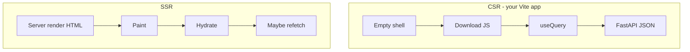

# Month 17 · Week 4 · Day 5
# React Framework Literacy: CSR, SSR, SSG, Hydration — A Small Experiment

**Program:** Full-Stack Mastery · 18 months  
**Phase:** 6 — Advanced engineering and system design  
**Month index:** [../../README.md](../../README.md)  
**Week 4:** [1](day-01.md) · [2](day-02.md) · [3](day-03.md) · [4](day-04.md) · Day 5 (today) · [6](day-06.md) · [7](day-07.md)  
**Week rhythm today:** Tests + docs **and** one small render experiment  
**Student state:** You inject ports on FastAPI. You already ship **Vite CSR** (Month 12). Today you learn **what other render modes are**, you **type** a tiny server-rendered HTML demo **without replacing FastAPI**, and you optionally peek at Next.js. GraphQL is not required.  
**Study time:** 3–4 focused hours

Labs: `~\fullstack-lab\month-17\week-04\day-05\`. Do not migrate Project 7 to Next today. This textbook will **not** paste Project 7.

---

## How to use this textbook

1. Read until you can define hydration without saying “magic.”  
2. Type the 30-line FastAPI HTML demo. Optional Next.js stretch.  
3. Optional review links are for later rechecking.

---

## How to read this chapter

**CSR (client-side rendering):** the server sends a **shell** (`index.html` + JS). The **browser** runs React, then TanStack Query fetches FastAPI. That is **your** default.

**SSR (server-side rendering):** the **server** runs React (or templates) and sends **HTML with the data already in the markup**. The browser **paints earlier**, then **hydrates**.

**SSG / prerender:** HTML is built **at build time**. Good for docs and public pages that do not change per user.

**Hydration:** React attaches event handlers to **existing** HTML. If the server HTML and client render **disagree**, you get hydration warnings and bugs.



**Wrong belief:** “SSR is more professional; I must replace FastAPI with Next.”  
**Correct:** Next can **be** a BFF or a document server. This course’s API remains FastAPI unless you have a **reason** (ADR Day 6). A clinic JSON API does not become Next because a tweet did.

**Wrong belief:** “Server Components delete the need for Query.”  
**Correct:** they change **where** data loads. You still need a **cache story** and a **mutation story**. Literacy, not a rewrite.

---

## Today's contract

1. Define CSR, SSR, SSG, hydration, server vs client components **as concepts**.  
2. Contrast **routing + data loading**: React Router loaders vs Query vs “server component fetch.”  
3. Type a FastAPI endpoint that returns **HTML** (Jinja or f-string lab) for a slip list — **SSR-shaped**, no React required on the server.  
4. Write `HYDRATION.md`: what would break if you later attached React to that HTML with different text.  
5. Optional: `create-next-app` hello that **fetches your FastAPI** — do not copy the product.  
6. pytest: HTML contains a known string; JSON API still exists.

**Today's gate.** Closed-book:

> CSR ships JS then data. SSR ships HTML then hydrates. SSG is build-time HTML. Hydration must match. Server Components are a server/client split, not a religion. I did not replace FastAPI. React Router imports from `react-router`. Query still uses the v5 object API.

---

## Time box

| Block | Minutes | Work |
|---|---|---|
| A | 50 | Theory |
| B | 70 | Type-along: HTML + JSON from one FastAPI |
| C | 45 | Independent: literacy table + optional Next |
| D | 15 | Git |
| E | 15 | Recall |

---

# Block A — Theory

## 1. CSR — what you already operate

Vite + React + `react-router` + TanStack Query v5:

```ts
useQuery({ queryKey: ["slips"], queryFn: () => api.listSlips() })
```

**Wins:** simple hosting (static files + API); clear SoR (FastAPI). **Costs:** TTFB of **HTML** is tiny but **LCP** waits on JS + API (Week 1 Day 2). SEO of empty shells is weak (many Project 7 apps are **auth’d** — SEO may not matter).

## 2. SSR — HTML with data

A Node (Next, Remix) or **Python template** runs **on the request**, talks to DB/API, returns HTML. User sees **text** before JS.

**Wins:** faster first paint of **content**; crawlers see text. **Costs:** your **Python/Node CPU** now renders per request; caching is a new design; **auth** on the server render must match the client.

FastAPI + Jinja2 **is SSR** in the classical sense (not React). That is enough to **learn the idea** without a second runtime.

## 3. SSG / prerender

`npm run build` produces `slip-guide.html`. CDN (Week 1). Invalidation = rebuild. **Do not SSG** a per-user invoice.

## 4. Hydration

Server: `<h1>Harbor</h1>`. Client React expects `<h1>Harbour</h1>` → mismatch. **Dates/timezones** and **random IDs** are classic hydration bugs. Fix: same data, or delay that part to client-only (`useEffect`).

If you **never** hydrate (plain Jinja), you have **no** hydration problem. Progressive enhancement: forms work without JS.

## 5. Server Components vs Client Components (concept)

In Next.js App Router, **Server Components** run on the server, can `await` fetch, **do not** ship that module’s JS to the client. **Client Components** (`"use client"`) use state, effects, Query.

Mental model: **default server, opt into client** for interactivity. Your Vite app is **all client** after the shell.

You will **not** be examined on the latest Next file-convention trivia. You **will** be examined on: **where the data loads** and **what JS the phone downloads**.

## 6. Routing and data-loading architectures

| Style | Where data loads | Typical cache |
|---|---|---|
| React Router + Query | After paint, in component / loader+Query | QueryClient |
| React Router `loader` | In the router before render (CSR or SSR framework) | You manage |
| Next Server Component | On server per request (or cache configs) | Next cache — **another** invalidation story |
| FastAPI Jinja | On server, no React | HTTP headers |

**Wrong belief:** “I’ll use loaders **and** Query **and** Server Components for the same list.”  
**Correct:** pick **one** primary loader for a screen. Mixing three caches is Week 1 false optimization.

Import router from **`react-router`** in new code (this course’s current package).

## 7. Why FastAPI stays

JSON API: mobile, SPA, workers, tests (TestClient). HTML can be an **extra adapter**. Replacing FastAPI with Next API routes **duplicates** authz you already tested in pytest — only do it with an ADR.

---

# Block B — Type-along

```powershell
cd ~\fullstack-lab
mkdir month-17\week-04\day-05 -Force
cd ~\fullstack-lab\month-17\week-04\day-05
uv init --name lab-ssr
uv add fastapi uvicorn pydantic jinja2
uv add --dev pytest httpx
```

`main.py`:

```python
from fastapi import FastAPI, Request
from fastapi.responses import HTMLResponse
from fastapi.templating import Jinja2Templates
from pydantic import BaseModel

app = FastAPI()
templates = Jinja2Templates(directory="templates")

class Slip(BaseModel):
    id: int
    name: str

SLIPS = [Slip(id=1, name="North"), Slip(id=2, name="South")]


@app.get("/api/slips")
def api_slips() -> list[dict]:
    return [s.model_dump() for s in SLIPS]


@app.get("/slips", response_class=HTMLResponse)
def html_slips(request: Request) -> HTMLResponse:
    return templates.TemplateResponse(
        request,
        "slips.html",
        {"slips": SLIPS},
    )
```

If your Jinja2Templates API wants `(request, name, context)` vs older `(name, {"request": request, ...})`, follow **your** FastAPI version’s signature. The lesson is **HTML contains names without JS**.

`templates/slips.html`:

```html
<!doctype html>
<html><body>
  <h1>Harbor slips</h1>
  <ul>
  
    <li>{{ s.name }}</li>
  
  </ul>
</body></html>
```

```powershell
uv run uvicorn main:app --host 127.0.0.1 --port 8025
```

```powershell
curl.exe -s http://127.0.0.1:8025/slips
curl.exe -s http://127.0.0.1:8025/api/slips
```

pytest: `GET /slips` 200 and `"North"` in text; `GET /api/slips` JSON list.

Write `COMPARE.md`: CSR would need JS to show North; this HTML already has it. What you **lost** (no Query cache, no SPA navigation).

Stop Uvicorn.

---

# Block C — Independent

`LITERACY.md` table: CSR / SSR / SSG / hydration / Server Component — **one sentence each** in **your** words.

`ROUTER.md`: how **your** Project 7 loads the primary list today (Query vs loader). Names only.

Optional Next stretch (if Node time remains):

```powershell
npx create-next-app@latest harbor-next --ts --eslint --app --src-dir --no-tailwind --use-npm
```

A **single** page that `fetch`es `http://127.0.0.1:8025/api/slips` — or skip if create-next-app fights Windows. Skipping Next is **passing** if LITERACY.md is strong and the FastAPI HTML lab is done. Write `NEXT.md`: ran / skipped + why FastAPI still owns JSON.

Do not `output: export` your whole career today.

---

# Block D — Git

```powershell
cd ~\fullstack-lab
git add month-17
git commit -m "Month 17 Week 4 Day 5: CSR vs SSR literacy, Jinja slips lab."
```

gitignore `harbor-next/node_modules` if you created it.

---

# Block E — Recall

1. CSR vs SSR first paint.  
2. Hydration mismatch example.  
3. SSG vs per-user data.  
4. Why three caches on one list is a bug.  
5. Why not replace FastAPI this month.

## Office hours

**Jinja `TemplateResponse` signature.** Read the error; adjust. Do not copy a random Stack Overflow FastAPI v0 snippet.

**create-next-app prompts.** Non-interactive flags above; if it still asks, skip Next.

Windows: `curl.exe`. Templates path relative to cwd when you start Uvicorn.

## Definition of done

- [ ] HTML and JSON endpoints tested  
- [ ] LITERACY.md  
- [ ] COMPARE.md  
- [ ] NEXT.md ran or skipped  
- [ ] Gate paragraph spoken  
- [ ] Commit exists  

---

## Optional review links

- [web.dev: Rendering on the web](https://web.dev/articles/rendering-on-the-web)  
- [TanStack Query v5 useQuery](https://tanstack.com/query/latest/docs/framework/react/guides/queries)  
- [React Router](https://reactrouter.com/home)  
- [Next.js: Rendering](https://nextjs.org/docs/app/building-your-application/rendering) — literacy  

---

## Tomorrow

**Independent:** Architecture Decision Record for Project 7/8. Every extra box justified.
