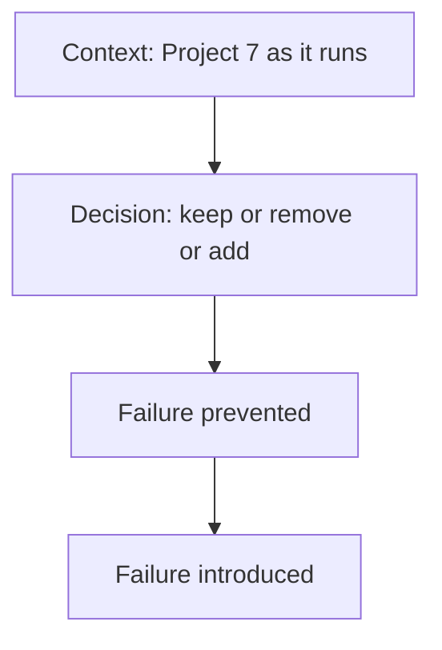

# Month 17 · Week 4 · Day 6
# Independent: Architecture Decision Record — Every Extra Box Justified

**Program:** Full-Stack Mastery · 18 months  
**Phase:** 6 — Advanced engineering and system design  
**Month index:** [../../README.md](../../README.md)  
**Week 4:** [1](day-01.md) · [2](day-02.md) · [3](day-03.md) · [4](day-04.md) · [5](day-05.md) · Day 6 (today) · [7](day-07.md)  
**Week rhythm today:** Independent implementation  
**Student state:** You can design a clinic from simplest-first and you know CSR/SSR as words. Today you write an **ADR** for **your** Project 7 (and notes toward Project 8). The textbook will **not** fill the boxes for you.  
**Study time:** 3–4 focused hours

Put `docs/adr/001-architecture.md` (or similar) in **your** product repo. Copy a **redacted** version to `~\fullstack-lab\month-17\week-04\day-06\ADR.md`. No source dumps.

---

## How to use this textbook

1. List **every** runtime box. Justify each.  
2. “We might need Kafka later” is **not** a justification.  
3. Optional review links are for later rechecking.

---

## How to read this chapter

An **Architecture Decision Record** is a dated document: **context**, **decision**, **consequences**. Month 17’s gate: given a design problem, start simplest and **justify every added component**.



**Wrong belief:** “ADR is bureaucracy for big companies.”  
**Correct:** it is how **you** remember why Redis exists in six months. Month 11 already demanded a Redis paragraph. This is that paragraph for **the whole diagram**.

**Wrong belief:** “I’ll copy a hexagonal template with 15 adapters I do not have.”  
**Correct:** document **reality**, then **debts**. Invented boxes fail the exam.

---

## Today's contract

1. Draw **current** Project 7 (SPA, FastAPI, Postgres, worker?, Redis?, SSE?, CDN?).  
2. For **each** box: purpose, failure it prevents, failure it introduces, how you would **delete** it.  
3. Explicit **rejected** options (Kafka, K8s, GraphQL, Next replacement, extra microservice).  
4. Session/stateless story (Day 1).  
5. Background workflow pointer (Week 2 INTERFACES).  
6. Realtime pointer (Week 3 NEED.md).  
7. Render mode (CSR default; SSR experiment is lab-only unless you decided otherwise).  
8. Project 8 **lean**: what you will **not** copy as souvenirs.

**Today's gate.** Closed-book:

> Every extra box in my diagram has a sentence for prevent and introduce. Absence of Kafka is a decision. I did not paste product code into fullstack-lab.

---

## Time box

| Block | Minutes | Work |
|---|---|---|
| A | 25 | Theory: ADR shape |
| B | 40 | Inventory boxes from **running** system |
| C | 100 | Write ADR + rejected list |
| D | 20 | Redact to lab; peer-read aloud |
| E | 15 | Recall + git |

---

# Block A — Theory

## 1. Required headings

```markdown
# ADR 001 — Project 7 runtime architecture
Date:
Status: accepted | proposed
Context:
Decision:
Current boxes:
Rejected boxes:
Consequences:
Debts:
How we will revisit:
```

**Status accepted** means this is what you run, not what a blog suggested.

## 2. The two-failure test

For Redis, a second worker, SSE, CDN, replica, extra service:

> Prevents: …  
> Introduces: …

If you cannot fill **introduces**, you have not thought. Redis introduces stale data and another process to operate. A worker introduces at-least-once duplicates. SSE introduces connection memory and multi-instance bugs.

## 3. Simplest legal diagram for this course

Vite SPA → FastAPI → Postgres, plus **tests**, plus **CI/CD** you already have (Month 16). Worker if Week 2 exists. Redis **only** with the three-part cache/session story. No K8s required.

## 4. Project 8

Capstone (Month 18) will tempt a rewrite. ADR section **“carry forward”**: modular monolith, jobs table, measure first. **Do not** plan eight services.

## 5. Forbidden

- Pasting routers.  
- Boxes you do not run (“Kafka (planned)”) in the **current** diagram — put them under rejected or later with a **trigger** (“if outbox drain needs a broker **and** we have measured…”).  
- Exactly-once.

---

# Block B — Inventory

```powershell
cd ~\fullstack-lab
mkdir month-17\week-04\day-06 -Force
```

From **your** Compose/GitHub/AWS (Month 16), list processes. `INVENTORY.md` in the lab: names of services only.

If you do not have Compose: list how you start API and web **locally**. Honest.

---

# Block C — Write the ADR

Minimum **current boxes** to mention even if “N/A”:

| Box | Must answer |
|---|---|
| Browser SPA (Vite CSR) | Why not Jinja-only / why not Next |
| FastAPI | Why not Next API routes |
| Postgres | Why not Mongo as SoR (Month 11) |
| Object storage | If you have S3 |
| Worker / queue | Week 2 or “missing — month gate risk” |
| Redis | Key/TTL/invalidation or absent |
| Load balancer / TLS | Month 16 |
| SSE/WS | NEED.md |
| CDN | Static hashes or absent |
| Observability | Logs/request id |

**Rejected** must include: Kafka, Kubernetes, GraphQL, Elasticsearch, extra HTTP microservice — each **one sentence**, even “no problem they solve at our scale.”

**Debts:** RAM sessions, `create_task`, dual-write, no baseline numbers — list them. Debts are passing if **honest**.

---

# Block D — Redact and read aloud

Lab `ADR.md` without secrets, URLs with tokens, or customer names.

Read the two-failure test **out loud** for every extra box. If you stumble, the sentence is not done.

---

# Block E — Git

```powershell
cd ~\fullstack-lab
git add month-17
git commit -m "Month 17 Week 4 Day 6: redacted ADR every box justified."
```

Commit the ADR in **your** repo.

---

## Office hours

**I have no worker.** ADR debt + Week 2 gap. Month exam will see it. Do not invent Kafka instead.

**Next.js experiment yesterday.** Lab-only unless ADR promotes it with a reason.

**Empty prevent/introduce.** “Redis prevents slowness” is not a sentence. Name the **path** and the **metric** (Week 1). “Redis introduces stale list after PATCH without invalidation” is a sentence.

# Lecture: two-failure worked examples

Use these as models in the ADR, then write **your** nouns:

**Worker.** Prevents: SMTP in the request; lost send on process death. Introduces: at-least-once duplicates; another process to deploy; need DLQ. Delete path: if the product has no side effect — you probably still have one.

**Redis cache.** Prevents: repeated identical GET hitting a heavy query **after** you measured it. Introduces: stale data, stampede, another failure domain. Delete path: `DEL` the feature flag; Postgres remains SoR.

**SSE.** Prevents: poll RPS **if** NEED.md proved sub-second. Introduces: connection memory, proxy idle, two-worker RAM split. Delete path: `refetchInterval`.

**Kubernetes.** Prevents: nothing you cannot do with Compose/one compute service at this size. Introduces: a control plane you cannot debug. **Rejected** unless Month 16 already required it — this course still calls it optional.

Write `TRIGGER.md`: one metric that would make you **reopen** the ADR (e.g. p95, connection count, team size). Not a date on the calendar.

## Scoring the ADR

| Section | Honest pass |
|---|---|
| Current boxes match how you start the app | Not a future shopping list |
| Each extra box: prevent + introduce | Redis/SSE/worker if present |
| Kafka, K8s, GraphQL, ES rejected or triggered | One sentence each |
| Session story | RAM vs store vs JWT |
| Pointers to BASELINE, INTERFACES, NEED | Paths, not pastes |
| Project 8 lean | No eight services |

Read the ADR aloud in 90 seconds. If you cannot, it is too long or too vague. Cut slogans; keep nouns.

**Wrong belief:** “ADR 001 must use the word hexagonal.”  
**Correct:** it must use **your** process names.

---

## Definition of done

- [ ] ADR in product docs  
- [ ] Redacted lab copy  
- [ ] Rejected Kafka/K8s/GraphQL sentences  
- [ ] Two-failure test on extra boxes  
- [ ] Gate paragraph spoken  
- [ ] Commits exist  

---

## Optional review links

- [Documenting architecture decisions (Quinn)](https://cognitect.com/blog/2011/11/15/documenting-architecture-decisions)  
- [Month 17 README gate](../../README.md)  

---

## Tomorrow

**MONTH EXAM.** Design from simplest. Oral + written. Self-mark the Month 17 gate. Do not start Month 18 on a false row.
