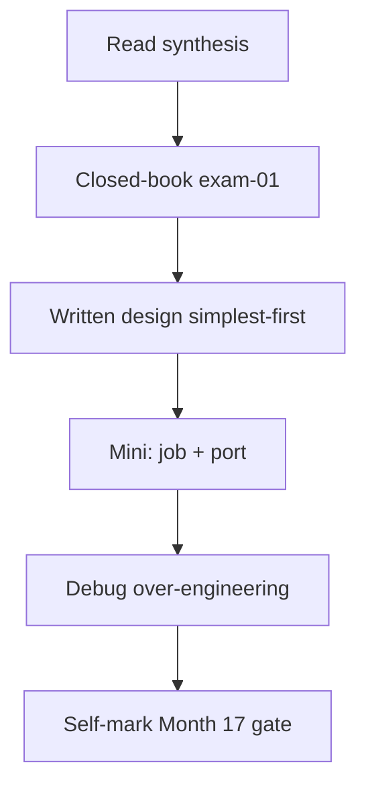
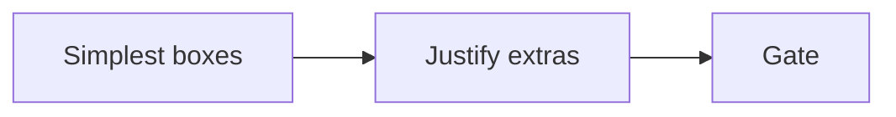

# Month 17 · Week 4 · Day 7
# Month 17 Exam + Gate

**Program:** Full-Stack Mastery · 18 months  
**Phase:** 6 — Advanced engineering and system design  
**Month index:** [../../README.md](../../README.md)  
**Week 4:** [1](day-01.md) · [2](day-02.md) · [3](day-03.md) · [4](day-04.md) · [5](day-05.md) · [6](day-06.md) · Day 7 (today)  
**Week rhythm today:** Monthly exam  
**Study time:** 3–4 focused hours (repair **after** if the gate is still false)

Textbook files stay **closed** except:

- **this file** (synthesis + exam blocks + self-mark table),
- [Month 17 README](../../README.md) **for the gate table wording**,
- your **own** `BASELINE.md`, `INTERFACES.md`, `NEED.md`, `ADR.md` only in the blocks that say so — not as a source to paste product code into the lab.

Repair forgotten facts from **this synthesis**, not from Weeks 1–4 day files and not from a random architecture blog.

Work in `~\fullstack-lab\month-17-exam\` for exam evidence. Do **not** implement exam minis inside Project 7. Do **not** start Month 18 because the calendar moved.

**Month 18** (capstone Project 8) opens when this gate is true.

---

## How to read this chapter

This file is the **exam and the teacher**. The synthesis is written so a student whose Weeks 1–4 notes are foggy can still re-learn the month from **today’s pages**, then prove it with the blocks and the gate.



During Blocks 1–3, other day files stay closed. If you go blank, re-read **this synthesis**. AI may not write exam-01, the design, the mini, or the debug answers.

---

## Today's contract

By the end of this day you will be able to teach Month 17 aloud from this synthesis, design from **simplest first**, justify every box, debug over-engineering, and **honestly** mark the Month 17 gate.

**Today's gate** is the Month 17 Gate table below — not “I attended four weeks.” If any required row is false, **do not start Month 18**.

---

## Time box

| Block | Minutes | Work |
|---|---|---|
| 0 | 25 | Read the complete explanation; speak it |
| 1 | 35 | Closed-book `exam-01.md` |
| 2 | 40 | Written design (`exam-02-design.md`) |
| 3 | 40 | Mini-build (`mini/`) |
| 4 | 25 | Debug A–F over-engineering |
| 5 | 20 | ADR / NEED / INTERFACES / BASELINE vs reality |
| 6 | 15 | Oral rehearsal (10 cards) |
| 7 | 15 | Retro + self-mark |

---

## Month 17 synthesis (the lesson, in this book)

**Measurement first.** Tickets name path, load, metric, environment. Latency ≠ throughput. Mean hides the tail; p50/p95 need enough samples. Cold ≠ warm. TestClient ≠ `curl.exe` ≠ browser waterfall. Middleware ms is the API clock; `EXPLAIN ANALYZE` actual time is SQL. Cost ≠ milliseconds. Pools: too few queue in the app; too many hurt Postgres. Cache: **key, TTL, invalidation** or do not add Redis. HTTP `public` on authenticated JSON leaks. CDN is for static/public bytes. Locust is local HTTP, not LCP, not production. False optimizations: cache without invalidation, N+1, missing index, giant bundle, sync SMTP in the request.

**Background work.** The request is short. `BackgroundTasks` / `create_task` die with the process. Queue + worker: reserve, effect, ack. At-least-once ⇒ duplicates. BRPOP can **lose** jobs. Retries: transient vs poison; exponential backoff + jitter; `available_at`. Idempotency keys + unique constraints (charges). DLQ + per-id replay. Cron enqueues. Logs carry `job_id`. Dual-write lies.

**Events and realtime.** Poll vs SSE vs WS; **when not WS**. Domain events are facts. Redis Pub/Sub misses. Do not claim **exactly-once delivery**; do **idempotent effects**. Order per aggregate + versions. Eventual consistency: stock in the sale TX; email may lag. Outbox: same transaction as the fact. NEED.md: **no** is passing.

**Architecture.** Vertical vs horizontal. Load balancer. Stateless API; session store; sticky is a crutch. Replicas lag; sharding is late. Modular monolith first. Microservices are expensive. Workers often beat new HTTP services. SOLID/DI: `Depends` + ports; repository earns keep; pattern souvenirs do not. CSR vs SSR vs SSG vs hydration; Server Components as **literacy**; FastAPI remains the JSON SoR adapter unless ADR says else. React Router from `react-router`; Query v5 object API.

**Optional:** Kubernetes, Kafka, GraphQL, Elasticsearch — not trophies.

**Wrong belief:** “We’ll add Redis and Kafka and it will scale.”  
**Correct:** name the failure you prevent and the failure you introduce.

**Wrong belief:** “Exactly-once.”  
**Correct:** at-least-once + idempotency.

**Product work** lives in **your** repos. Labs are gyms. This textbook does not paste Project 7 or 8.

---

# Complete explanation — design you must still own

## 1. The first diagram

SPA (Vite CSR) + FastAPI + Postgres. Add a **worker** when a side effect must survive a crash. Add Redis when the three-part story exists. Add SSE when NEED.md says the user cannot poll. Add a replica when **reads** are proven to need it. Add a second **service** when a boundary is proven — almost never this month.

## 2. Justify a box

Prevent / introduce / delete path. Empty “introduce” means remove the box from the exam diagram.

## 3. Over-engineering tells

Eight services for 200 requests/day; Kafka as identity; WS per row; sticky RAM PHI; write to replicas; `create_task` as a queue; Lighthouse as a substitute for p95; Next replacing FastAPI with no ADR.

---

# Block 0 — Speak the synthesis

Out loud, no other files: measure loop; p95; cache rule; queue+ack; at-least-once; NEED.md; simplest diagram; two-failure test. Then Block 1.

---

# Block 1 — Closed-book (35 min)

Create `~\fullstack-lab\month-17-exam\exam-01.md`.

Write **in your words** (25–40 lines):

1. Latency vs throughput; why mean lies.  
2. Redis three-part rule.  
3. Why SMTP in POST does not “horizontally scale.”  
4. At-least-once vs exactly-once **delivery**.  
5. Poll vs SSE vs WS — one line each; when **not** WS.  
6. Outbox in one sentence.  
7. Stateless API vs sticky RAM.  
8. One extra box on **your** ADR and its **introduced** failure.  
9. CSR vs SSR first paint.  
10. The Month 17 gate in **your** one-sentence paraphrase.

If you cannot fill it, re-read the synthesis.

---

# Block 2 — Written design (40 min)

Prompt (**gym**, not Project 7): **Municipal permit desk** — citizens submit permit applications; clerks list and approve; one email on decision; ~50 staff, ~400 applications/week; not a national platform.

Write `exam-02-design.md`:

1. Mermaid of **boxes you include** (simplest).  
2. Tables/job names.  
3. Authz: citizen sees own; clerk sees queue (Month 13 mind).  
4. Email: worker, key, DLQ.  
5. Realtime: none/poll/SSE — **choose**.  
6. For each of: Redis, Kafka, K8s, replica, GraphQL, extra microservice — **keep/reject + prevent/introduce** if keep.  
7. First move if list p95 is 1.5 s.  
8. What you will **measure** before adding a cache.

Must not: paste Project 7. Must not: “exactly-once Kafka.”

---

# Block 3 — Mini-build (40 min)

Textbook closed except this spec.

```powershell
cd ~\fullstack-lab
mkdir month-17-exam\mini -Force
cd ~\fullstack-lab\month-17-exam\mini
uv init --name exam-m17
uv add fastapi pydantic
uv add --dev pytest httpx
```

**Domain: reading-room desk permits** (imposed).

Must:

- Pure `can_approve(role, owner_id, actor_id)` with **stranger deny** unit test  
- `MailPort` Protocol + `FakeMailer`  
- FastAPI `POST /permits` 201 `{title, id}` via `model_dump()`; enqueue **in-process list** `jobs` **and** document in `QUEUE.txt` that this list is **not** durable — a real worker would be a process (honesty test)  
- `Depends(get_mailer)` **not** called on POST (mail is the worker’s job). A function `run_one_job(mailer)` sends using FakeMailer; pytest: POST does **not** append mail; `run_one_job` does  
- GET missing id 404  

Should if time: idempotent `run_one_job` twice → one send.

Must not: Celery, Kafka, product source, `.dict()`, SMTP, Kubernetes.

```powershell
uv run pytest -q
```

---

# Block 4 — Debug (25 min)

Write `exam-04-debug.md`. For each: **what fails or lies**, **root cause**, **fix in one or two sentences**.

**A.** “p95 is the average of three curls.”  
**B.** Redis cache of GET list; PATCH title; no invalidation.  
**C.** `asyncio.create_task(charge_card())` in the router; called it our queue.  
**D.** Eight microservices, 400 applications/week, shared DB, no outbox.  
**E.** WebSocket per permit row; two Uvicorn workers; in-memory.  
**F.** “Kafka exactly-once so no mail_log unique key.”

---

# Block 5 — Reality check

Open **only** your lab copies of BASELINE / INTERFACES / NEED / ADR (redacted). `exam-05-gap.md`: **one** gate row that is still weak. If all strong, `exam-05-match.txt` with paths.

---

# Block 6 — Oral cards (write answers in exam-07-retro)

1. p95 vs mean.  
2. TestClient vs waterfall.  
3. Cache three-part rule.  
4. Ack before send vs after.  
5. Why not WS for a settings form.  
6. Replica lag.  
7. Depends as DI.  
8. Hydration mismatch.  
9. Two-failure test.  
10. Month 17 gate sentence from the README (paraphrase allowed).

If you miss more than two, re-read the synthesis, then the gate table.

---

# Block 7 — Retro + self-mark

`exam-07-retro.md`: weakest week; leftover debts; whether you still want Kafka on Project 8.

---

## Month 17 Gate (self-mark)

True **without a tutorial**. Evidence paths are yours.

| # | Claim | Evidence | Pass? |
|---|---|---|---|
| 1 | Baseline: one hot API, one query, one frontend path — **numbers** | BASELINE.md | |
| 2 | Explain latency vs throughput and p95 vs average | exam-01 | |
| 3 | Caching has key, TTL, invalidation **or you did not add a cache** | ADR / CACHE | |
| 4 | One background workflow: enqueue, worker, retry/backoff, failure visible, idempotent where needed | INTERFACES + running worker | |
| 5 | Explain at-least-once and duplicate events; **no** exactly-once magic | exam-01 / REFUSE | |
| 6 | WS/SSE only if needed; poll allowed if honest | NEED.md | |
| 7 | Sketch vertical vs horizontal, stateless API, modular monolith until proven | exam-02 | |
| 8 | Small React-framework experiment (CSR/SSR/hydration); FastAPI not replaced without reason | Day 5 lab / ADR | |
| 9 | Design prompt: simplest first; **every extra component justified** | exam-02-design.md | |

If any **required** row is false, **do not start Month 18**. Stay on Month 17 until the sentences and the worker are real.

```powershell
cd ~\fullstack-lab
git add month-17-exam
git commit -m "Complete Month 17 exam evidence."
```

---

## If you passed

**Month 18** is the capstone: blank repo, Project 8, production examination. Simplest architecture still wins. Containers and Kafka will not invent a baseline you skipped.

## If you did not pass

Stay on Month 17. This synthesis remains the teacher. Typical holes: no worker, no numbers, Redis souvenir, NEED.md ignored, ADR full of planned boxes.

---

## Optional review links

Repair from this synthesis first.

- [Month 17 README](../../README.md)  
- [PostgreSQL EXPLAIN](https://www.postgresql.org/docs/current/sql-explain.html)  
- [FastAPI dependencies](https://fastapi.tiangolo.com/tutorial/dependencies/)  
- [TanStack Query v5](https://tanstack.com/query/latest/docs/framework/react/overview)  

---

## Worked answers — check after you write debug

**A.** Mean ≠ p95; n too small.  
**B.** Stale reads; invalidate after commit or no cache.  
**C.** In-process; not durable; use a queue + worker.  
**D.** Network + dual-write without benefit; modular monolith + worker.  
**E.** Per-row sockets + RAM fan-out; poll or one stream + shared pub if needed.  
**F.** Refuse slogan; unique effect key.

If your written answers disagree, fix them from this box **only after** you attempted A–F alone.



---

## Month 18 is not a reward for finishing the calendar

A beautiful service mesh will not hide a missing baseline or a charge that runs twice. Continue until every gate row is true. Do not begin Month 18 on a false self-mark.

## Definition of done (exam day)

- [ ] exam-01 teaches the month  
- [ ] exam-02 is simplest-first with rejected Kafka/K8s  
- [ ] Mini pytest: deny unit, 201, mail **not** in POST, worker send  
- [ ] Debug A–F written, then checked  
- [ ] Self-mark table is honest  
- [ ] Month 18 not started on a false row  

The gate table is the course’s definition of done for the month. Attendance is not.
