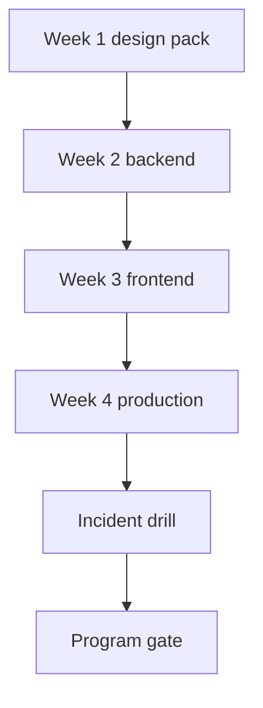

# Month 18 — Production Master Project

**Program:** Full-Stack Mastery Textbook  
**Phase:** 7 — Capstone  
**Length:** 4 weeks · 7 days each · 3–4 focused hours/day (many days will need a second session — say so in your log)  
**Prereq:** Month 17 gate passed (simplest architecture; every extra box justified)  
**This month’s job:** From a **blank repository**, design and ship **Project 8** — a serious production system **you** chose. This is the core-program examination.

**Project 8:** `full_stack_project_requirements_2026/project_08_independent_production_capstone.md`.  
This textbook will **not** give you the product source, the schema, or the “correct” domain. It teaches **how a professional runs the month**.

Project 7 stays running. Do not gut it to feed the capstone unless you are copying **ideas**, not folders.

---

## How this textbook is organized

```
month-18/
  README.md     ← you are here
  week-01/      Discovery and design — docs before code
  week-02/      Backend — FastAPI, Postgres, auth, jobs, logs, tests
  week-03/      Frontend — React, Query, forms, a11y, tests
  week-04/      Production — Docker, CI/CD, AWS, monitor, load, security
                + final incident drill
```

Work in **your capstone repo**. Supporting drills: `~\fullstack-lab\month-18\`.

---

## The examination shape



**Wrong belief:** “I already built Project 7, so I can clone it and rename tables.”  
**Correct:** Project 8 must start from a **business problem** and a **blank repo**. Reusing *skills* is required. Reusing a tutorial architecture as a skin is a fail.

**Wrong belief:** “Microservices will impress the exam.”  
**Correct:** default is a **modular monolith**. Services need a demonstrated reason.

---

## Month 18 Gate (program examination)

True **without a tutorial**, against **your** Project 8 spec and the project_08 file:

1. A written pack exists **before** substantial code: problem, users, ≥12 stories, NFRs, wireframes, ER, API spec, architecture, threat model, test strategy, deploy plan.  
2. Backend: FastAPI + PostgreSQL + SQLAlchemy + Alembic + authn/authz + tests + structured logs. Redis and background jobs **where the product needs them**.  
3. Frontend: React + TypeScript + Router + TanStack Query + forms/validation + a11y + tests. Redux only if justified.  
4. Product capabilities from the spec: roles, related CRUD, search/filter/sort/pagination, one object-storage feature, one notification/email flow, one background job, audit/history for one important action.  
5. Docker + CI/CD + HTTPS + secrets + migrations + monitoring + a backup **strategy** (tested restore idea, not a hope).  
6. A small **load test** and a **performance note** (baseline, bottleneck, change, result).  
7. A **security review** you wrote, mapping Month 13 defenses onto this product.  
8. **Incident drill:** for the listed failure classes, you reproduce, observe, hypothesize, inspect, root-cause, fix, add a regression test, deploy, monitor — and keep the notes.

If any item is false, you are not done with the core program. Repair. The calendar does not graduate you.

---

## After this month

You are a **production-capable independent engineer**, not a finished master. The mastery loop in the roadmap (8–12 week cycles) starts when this gate is true.

---

## Start

Open [week-01/day-01.md](week-01/day-01.md).
