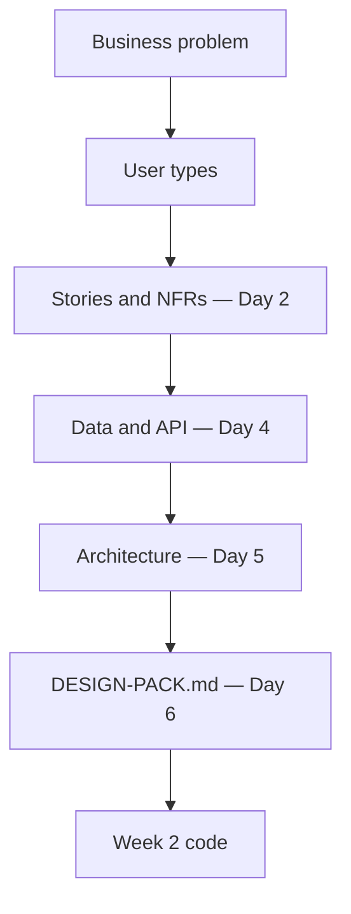

# Month 18 · Week 1 · Day 1
# Choose a Domain: Workflow Complexity, Not a Skin

**Program:** Full-Stack Mastery · 18 months  
**Phase:** 7 — Capstone  
**Month index:** [../../README.md](../../README.md)  
**Week 1:** Day 1 (today) · [2](day-02.md) · [3](day-03.md) · [4](day-04.md) · [5](day-05.md) · [6](day-06.md) · [7](day-07.md)  
**Week rhythm today:** Learn + type-along (writing, not product code)  
**Student state:** Month 17’s gate is true: you start with the simplest architecture and justify every extra box. Today you do **not** open a code generator. You pick a **business problem** that will survive four weeks of honest engineering.  
**Study time:** 3–4 focused hours (a second session is allowed if the paragraph is still vague)

**This week covers:** discovery and design — problem, users, stories, NFRs, data, API, architecture, threat model, tests, deploy plan, wireframes, then a packed `DESIGN-PACK.md` **before** Week 2’s substantial backend.

Today: choose a domain with **workflow complexity**, write a problem statement a stranger could understand, and name user types. User stories with numbers are Day 2. Do not skip them. Do not start FastAPI tonight.

Labs: `~\fullstack-lab\month-18\week-01\day-01\`. Product writing lives in **your capstone repo** once you create it — a `docs/` folder is enough. This textbook will **not** pick your domain, will **not** paste a capstone, and will **not** give you “the clinic schema.”

Project 7 stays running. Copy **skills**, not folders.

---

## How to use this textbook

1. Read a section. Close it. Say the idea with an example that is **not** a todo list.  
2. Type your notes. Do not paste a “SaaS idea generator” paragraph.  
3. When you name a domain, name **who waits** if the workflow breaks.  
4. Optional review links are for later rechecking.

---

## How to read this chapter

Project 8 is the **core-program examination**. The examiner is not impressed by a renamed Project 7. The examiner is impressed by a **problem** that forces users, permissions, relationships, validation, workflows, and failures.



**Wrong belief:** “I already built Project 7, so I can clone it and rename tables.”  
**Correct:** reuse skills. Start from a **blank repository** and a **business problem**. A tutorial architecture wearing a new skin is a fail.

**Wrong belief:** “I should pick the most impressive industry so the exam looks senior.”  
**Correct:** pick a domain you can **explain** and **operate**. A logistics toy you cannot describe is worse than a support-ticket product you can defend.

---

## Today's contract

By the end of this day you will be able to:

1. Recite Project 8’s **good** and **avoid** lists in your own words.  
2. Distinguish a **workflow** (states, roles, handoffs, failures) from a **CRUD brochure**.  
3. Write a **problem statement**: who has what problem, why software, why now.  
4. Name **user types** (at least two who disagree about permissions).  
5. Pass the paragraph gate: a stranger who is not a programmer could understand it.  
6. Record a **non-choice** honestly if you need overnight thought — then still write three candidates.

**Today's gate.** Closed-book:

> I chose a domain with real workflow complexity. I can say who suffers if the system is down. A stranger could understand my paragraph. I have not started substantial product code. Microservices are not the flex.

---

## Time box

| Block | Minutes | Work |
|---|---|---|
| A | 55 | Theory: examination shape, good/bad domains, workflow test |
| B | 50 | Guided writing: reject weak ideas; draft three candidates |
| C | 70 | Independent: pick one; problem statement; user types |
| D | 15 | Lab notes + git (lab and/or capstone docs) |
| E | 15 | Recall |

---

# Block A — Theory

## 1. Why this month exists

Months 1–17 taught pieces. Month 18 asks whether those pieces still work when **nobody hands you the product**. The spec is `full_stack_project_requirements_2026/project_08_independent_production_capstone.md`. Read it as an **exam paper**, not as a feature buffet.

You will still use FastAPI, PostgreSQL, React, Query, Docker, CI/CD, and the security and testing habits of Months 13–14. You will still prefer a **modular monolith** (Month 17). None of that is the product. The product is **your** problem.

**Wrong belief:** “The textbook will eventually reveal the official capstone.”  
**Correct:** there is no official capstone. There is a **quality bar**. You choose the instance.

## 2. What “workflow complexity” means

A workflow is not “there are several tables.” A workflow has:

- **States** a record can be in (open / in progress / waiting / done — *your* nouns).  
- **Handoffs** between people (submitter vs operator vs reviewer).  
- **Rules** that are not “the owner can edit” alone (who may close, who may assign, what must be true before the next state).  
- **Failures** that are not 404 (double submit, expired hold, missing file, email that never sent, job that retried twice).

If your idea is “users post items and other users see items,” you have a brochure until you add **process**.

Ask this aloud:

> If two honest users work at the same time, what can go wrong, and whose job is it to notice?

If the answer is “nothing interesting,” pick a richer domain.

## 3. Good examples — as *classes*, not as your homework

Project 8 lists **good examples**. They are **illustrations**. They are not an assignment to build a clinic because this file mentioned clinics.

| Class (from the spec) | Why it can work | How students fake it |
|---|---|---|
| Multi-tenant project management | Tenants, members, tasks, permissions | A todo list with a `tenant_id` column you never enforce |
| Clinic / appointment operations | Scheduling, roles, conflicts | A calendar with no double-book rule |
| Logistics / inventory | Stock, locations, movements | A spreadsheet of SKUs with no movement history |
| Support-ticket platform | Queues, SLA-ish states, assignment | A guestbook labeled “tickets” |
| Event-management platform | Capacity, registration, roles | A blog of events |
| B2B CRM / workflow | Pipeline stages, ownership | Contacts with no stage rules |

You may pick **none** of these names. You may pick a domain from your work or a club. The test is complexity, not branding.

**Wrong belief:** “The professor wants a clinic.”  
**Correct:** the professor wants a problem you can **operate** for four weeks without lying in the design pack.

## 4. Avoid list — and why each is a fail

| Avoid (from the spec) | Why it fails the exam |
|---|---|
| Basic todo | No workflow, no interesting authz, no job, no audit that matters |
| Weather app | Read-only third-party data; no users who disagree |
| Simple blog | Publishing is not enough process for Project 8 |
| Simple movie search | Search without workflow is a tutorial |

A “todo with teams” that has no tenant isolation tests is still a todo. A “blog with comments” that has no moderation workflow is still a blog.

If you love one of those ideas, **grow it** until the avoid-list no longer applies — then write why. Growing a todo into a real work-tracker is allowed. Shipping the tutorial is not.

## 5. The stranger paragraph

Week 1 Day 7 will critique your pack. Today’s gate is smaller and harsher:

> Write one paragraph a **stranger** could understand.

A stranger is not a FastAPI instructor. They should learn: **who**, **what hurts**, **what success looks like**, **who else is in the room**. They should not learn your ORM.

**Wrong:** “A PostgreSQL-backed multi-tenant SaaS with RBAC and S3.”  
**Correct:** “Neighborhood clinics lose track of which patient is waiting, who confirmed, and who cancelled. Front-desk staff and clinicians need different views of the same day. If two people book the last slot, the clinic looks chaotic.”

That second paragraph is an **example of shape**, not a command to build a clinic. Replace every noun with **your** nouns.

## 6. User types are not “admin and user”

If you only have `admin` and `user`, you have not thought yet. Ask:

- Who **creates** the primary work?  
- Who **processes** it?  
- Who **reviews** or closes it?  
- Who must **never** see another tenant’s rows?  
- Who is **anonymous** (maybe nobody — say so)?

Two types can be enough if they **disagree** about permissions. Five types with identical powers are costume.

Anonymous access is a product choice. Many B2B tools have **no** public pages except login. That is fine. Write it.

## 7. Constraints that are already decided for you

Do not spend Day 1 choosing Python vs Go. The baseline stack is in Project 8:

- Frontend: React, TypeScript, modern routing, TanStack Query, React Hook Form, Zod, tests.  
- Backend: Python, FastAPI, Pydantic, PostgreSQL, SQLAlchemy, Alembic, Redis **when justified**.  
- Production: Git/GitHub, Docker, CI/CD, AWS fundamentals, logs, metrics, HTTPS, secrets.

Redux only if you **write a justification**. Microservices only if you **demonstrate need**. Default: **modular monolith**.

Object storage, email/notification, a background job, and audit/history for **one** important action are **required capabilities**. They should fall out of the domain, not be stapled on Day 20.

## 8. What you will not do today

- You will not `uv init` the capstone as a way to avoid writing. A blank repo may exist; **substantial** product tables may not.  
- You will not copy Project 7’s schema and search-replace nouns.  
- You will not ask an AI to “pick the most impressive capstone.”  
- You will not invent microservices because “capstone.”

## 9. Say it — closed-book drill (two minutes)

Without looking: good-example *classes*; avoid list; what workflow complexity means; why a stranger paragraph is the gate; whether this file chose your domain. If you stumble, re-read sections 2–5.

---

# Block B — Guided writing

```powershell
cd ~\fullstack-lab
mkdir month-18\week-01\day-01 -Force
cd ~\fullstack-lab\month-18\week-01\day-01
```

Create `REJECTS.md`. For each avoid-list item, write **two sentences**: why it fails Project 8, and what you would have to add before it could even be *considered*. Do not “save” a weather app.

Create `CANDIDATES.md` with **three** domains you could actually explain to a relative. For each:

1. Working title (plain language).  
2. Who hurts today (without software).  
3. Two user types who would argue about a permission.  
4. One failure that is not “page not found.”  
5. One reason you might **reject** this candidate (honesty).

Score each 1–5 on: workflow richness, your ability to explain it, whether object storage / email / a job / audit could be **natural** rather than glued.

**Do not** write SQL. **Do not** name fifteen microservices.

If all three candidates are “Project 7 again,” you are not done with Block B.

---

# Block C — Independent

Choose **one** candidate. If you cannot, keep two overnight — but still pick a **leader** and write why.

In the lab folder **and** (when the capstone repo exists) in `docs/PROBLEM.md` or the start of `REQUIREMENTS.md`, write:

### 1. Problem statement (one paragraph, then optional bullets)

Must include: who, pain, what “better” means, who else is involved. Must **not** include library names.

### 2. User types

A short list. For each type: what they come to **do**, what they must **not** do. At least one **deny** in prose (“a member of Org A must not read Org B”).

### 3. Out of scope (today)

Three things you will **not** build in four weeks (mobile native app, marketplace payments, a data lake). Scope control is professional, not laziness.

### 4. Stranger test

Paste the paragraph into a note. Read it aloud to a person or to a voice memo. If you hear jargon, rewrite.

Write `GATE.txt` with the stranger paragraph only. If it needs a glossary, it failed.

**Wrong belief:** “I’ll pick the domain in Week 2 when I see the code.”  
**Correct:** Week 2 implements **this** pack. A wandering domain produces a wandering API.

---

# Block D — Git

If the capstone repo does not exist yet, initialize a **blank** repo when you are ready — empty README is allowed. Do not copy Project 7.

```powershell
cd ~\fullstack-lab
git add month-18
git commit -m "Month 18 Day 1: domain candidates, rejects, stranger paragraph."
```

If you already have the capstone repo:

```powershell
cd <your-capstone-repo>
git add docs
git commit -m "Month 18: problem statement and user types (no product schema yet)."
```

Do not commit secrets. There should be none today.

---

# Block E — Recall

1. Name three **good-example classes** from Project 8 without claiming they are your assignment.  
2. Name the **avoid** list.  
3. What is workflow complexity in one sentence?  
4. Why is “admin and user” a weak user-type list?  
5. What must wait until `DESIGN-PACK.md` exists?

## Office hours — domains that fail quietly

**The skin.** You renamed Project 7’s tables and kept the same permissions. Repair: write a problem that Project 7 did **not** solve; if you cannot, you are not in Month 18 yet.

**The résumé zoo.** Seven user types, no differences. Repair: merge until a permission actually changes.

**The industry cosplay.** You picked “healthcare” and cannot describe a day in the office. Repair: pick a workflow you have watched (even a campus club).

**The infinite marketplace.** Payments, chat, AI, and a mobile app in week one. Repair: out of scope list; keep one core journey.

**Starting Alembic because writing is uncomfortable.** Repair: this week is documents. Code that precedes the pack will be rewritten, or it will fail the exam.

Windows: create folders with `mkdir ... -Force`. If `~` does not expand in an old shell, use `$HOME\fullstack-lab`.

---

## Definition of done

- [ ] `REJECTS.md` covers the avoid list in your words  
- [ ] `CANDIDATES.md` has three scored ideas  
- [ ] One domain chosen (or a named leader)  
- [ ] Problem paragraph passes the stranger test (`GATE.txt`)  
- [ ] User types include at least one explicit deny  
- [ ] No substantial product schema or cloned Project 7  
- [ ] Commit exists  

---

## Optional review links

The lesson is this chapter and the Project 8 file. Use these only to recheck wording later.

- [Project 8 spec](../../../../full_stack_project_requirements_2026/project_08_independent_production_capstone.md) — exam paper, not a template to paste  
- [Month 18 README](../../README.md) — gate table  
- [Roadmap Month 18](../../../../full_stack_mastery_roadmap_expert_2026.md) — Phase 7  

---

## Tomorrow

**User stories (≥12 meaningful)** and **non-functional requirements with numbers** you can test. Bring the stranger paragraph. Do not bring a database dump.
