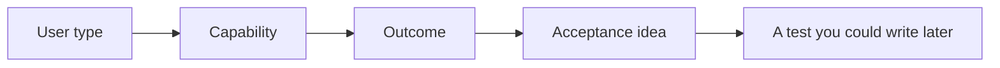

# Month 18 · Week 1 · Day 2
# Stories, Acceptance, and NFRs You Can Test

**Program:** Full-Stack Mastery · 18 months  
**Phase:** 7 — Capstone  
**Month index:** [../../README.md](../../README.md)  
**Week 1:** [1](day-01.md) · Day 2 (today) · [3](day-03.md) · [4](day-04.md) · [5](day-05.md) · [6](day-06.md) · [7](day-07.md)  
**Week rhythm today:** Exercises + writing drills  
**Student state:** Yesterday’s stranger paragraph exists. Today you turn it into **≥12 meaningful user stories**, acceptance ideas, and **non-functional requirements with numbers**.  
**Study time:** 3–4 focused hours

Labs: `~\fullstack-lab\month-18\week-01\day-02\`. Finished prose also belongs in **your capstone repo** (`REQUIREMENTS.md` or equivalent). This textbook will **not** write your twelve stories. It will show **shape**, then make you fill **your** nouns.

---

## How to use this textbook

1. Read the quality bar. Close it. Say what makes a story *meaningful*.  
2. Write stories for **your** domain only. Do not copy the toy sentences as product.  
3. Every NFR must have a **number** or a **pass/fail check** you could run in Week 4.  
4. Optional review links are for later rechecking.

---

## How to read this chapter

A **user story** is a slice of value a **named type of person** can recognize. It is not a Jira decoration and not a disguise for “set up Docker.”



**Wrong belief:** “I will write twelve stories that are really one story with different verbs: create, read, update, delete, list, search, filter, sort, paginate, export, import, print.”  
**Correct:** CRUD is **mechanism**. Stories are **jobs**. Search/filter/sort/pagination are **required capabilities** in Project 8 — they should appear **inside** real jobs, not as twelve fake stories.

**Wrong belief:** “NFRs are adjectives: secure, fast, available.”  
**Correct:** an NFR without a number is a mood. Today you attach numbers you can **test** or **honestly bound** for a learning production.

---

## Today's contract

By the end of this day you will be able to:

1. Write **≥12 meaningful** stories in “As a … I want … so that …” *or* an equivalent that still names the person.  
2. Attach **acceptance ideas** (Given/When/Then sketches are welcome; they need not be Gherkin religion).  
3. Cover Project 8 capabilities **without** stuffing them as empty stories: auth, roles, related CRUD, search/filter/sort/pagination, file/object storage, email/notification, background job, audit/history.  
4. Write NFRs for **security, availability, performance, maintainability, observability** with **numbers**.  
5. Mark which stories are **in** the four-week cut and which are stretch.

**Today's gate.** Closed-book:

> I have at least twelve stories a user would recognize. Each important capability from Project 8 is either a story or an explicit part of one. My NFRs have numbers I could fail. I did not paste a clinic template.

---

## Time box

| Block | Minutes | Work |
|---|---|---|
| A | 40 | Theory: meaningful vs fake stories; NFR numbers |
| B | 55 | Exercises: repair bad stories; draft NFR table for a *toy* |
| C | 80 | Independent: your twelve+ and your NFR table |
| D | 15 | Git |
| E | 15 | Recall |

---

# Block A — Theory

## 1. What “meaningful” means

A meaningful story changes a **person’s next action**. “As a user I want a database so that data is stored” is not a story. “As a dispatcher I want to see only open loads for my region so that I do not call the wrong driver” is a story — **if** those nouns are yours.

Tests of meaning:

- Could you **demo** it to the user type without mentioning HTTP?  
- Does it imply a **permission** (who must not)?  
- Does it imply a **failure** (what if the email never sends)?

If all twelve stories are happy-path creates, you have a brochure with a word count.

## 2. The Project 8 capability map

Project 8 requires product capabilities. Map them **onto jobs**, do not list them as stories 1–12.

| Capability | How it should appear |
|---|---|
| Register / login / logout | Stories for the people who actually sign in; include logout and “session ends” |
| Role / resource authorization | At least two stories that are **denials** or “I only see mine” |
| CRUD on related resources | Two nouns that relate (parent/child). Not twelve CRUD verbs |
| Search / filter / sort / pagination | Inside a “find the right record in a pile” job |
| File / object storage | A job that **needs** a file (photo of damage, PDF of a signed form) — your noun |
| Email / notification | A job that **needs** a message (assignment, confirmation) |
| Background job | Work that **must not** block the request (thumbnail, outbound email, nightly close) |
| Audit / history | One **important** action you could explain in court-ish language (who changed status) |

**Wrong belief:** “Story 9 is ‘As a user I want pagination.’”  
**Correct:** “As a reviewer I want the oldest waiting items first, twenty per page, so the queue is fair.” Pagination is in the acceptance idea.

## 3. Acceptance ideas are not the test suite

An acceptance idea is a **check you would recognize in a demo**:

- Given I am a member of Org A, when I open Org B’s record by id, then I am refused (403), and I do not see the title.  
- Given a title longer than N, when I submit, then I see a field error, and nothing is saved.

You will write real tests in Weeks 2–3. Today you make the claims **specific enough** that Week 2 cannot invent a different product.

Include **deny** and **empty** and **invalid** — not only success.

## 4. Non-functional requirements with numbers

Learning production is not a bank. Still write numbers. If you cannot hit them, you will **measure and explain** in Week 4, not shrug.

Use this skeleton. Replace the numbers with **yours** after you think. The samples below are **order-of-magnitude teaching defaults**, not a secret exam key.

### Security

- Passwords stored as **slow hashes** (argon2 or bcrypt); never logged.  
- Mutating routes: unauthenticated → **401**; authenticated but forbidden → **403**.  
- Rate limit on login: e.g. **5** failed attempts / **15** minutes / IP or account **(you pick and write the test idea)**.  
- Secrets: **zero** in git; rotation described in one sentence.  
- Uploads: max size **N MB**, allowed types listed, stored outside the app process working tree (object storage).

### Availability (learning-honest)

- Target: **single-region**, planned maintenance announced.  
- You are **not** claiming four nines. Write what you **will** do: health/readiness, restart policy, backup RPO/RTO **ideas** (Week 4 deepens this).  
- Example bound: “If the API process dies, Compose/systemd restarts it; I accept **minutes** of downtime, not hours of silent corruption.”

### Performance

- Hot list endpoint: p95 **under X ms** on a dataset of **Y** rows on **your** staging size (pick X and Y you can generate).  
- Frontend: first meaningful list **under Z seconds** on broadband for a logged-in user with empty cache — measure in Week 4; write the intent today.  
- Pagination default page size (e.g. 20), max page size (e.g. 100).

### Maintainability

- Modular monolith: named modules (e.g. `identity`, `work`, `billing` — **your** names).  
- Lint/format/typecheck in CI (Month 16 skill).  
- A new engineer can run the README in **one** evening — you will prove this by following your own README in Week 4.

### Observability

- Structured logs with **request id**.  
- Metrics: traffic, latency, errors (at least).  
- Health and readiness.  
- You can follow **one** request: browser → API → DB → job.

**Wrong belief:** “I’ll write ‘highly available multi-AZ’ because it sounds like AWS.”  
**Correct:** claim what you can **operate**. Inflated NFRs fail the architecture challenge in Project 8 §18.

## 5. Traceability

Give stories stable ids: `US-01` … `US-12+`. Week 2 and Week 3 will cite them. If a capability has no id, it will vanish.

## 6. What you will not do today

- You will not draw the full ER diagram (Day 4).  
- You will not generate OpenAPI from code you have not written.  
- You will not pad to twelve with “as a developer I want CI.” CI is an NFR/process, not a user story.

---

# Block B — Exercises (toy domain, then yours)

Work in the lab. The toy is **not** your capstone. Noun: **community tool-library** (borrow drills, return them). You will **not** ship this unless you independently chose it yesterday — even then, rewrite in your voice.

### Exercise 1 — Kill the fakes

Here are bad stories. Rewrite each into a meaningful one **for the tool-library toy** (five minutes each, then stop):

1. As a user I want CRUD.  
2. As an admin I want a dashboard.  
3. As a user I want a fast website.  
4. As a user I want pagination.  
5. As a developer I want PostgreSQL.

Write rewrites in `TOY-REWRITES.md`.

### Exercise 2 — Capability coverage checklist

Create `TOY-COVERAGE.md`. Twelve short stories for the tool-library that together **touch** authz, related resources (member ↔ loan), search, a photo of a damaged tool, an email when overdue, a job that marks overdue, and an audit when a tool is retired. If you cannot fit a capability, say **where** it lives inside another story.

### Exercise 3 — NFR numbers for the toy

Fill `TOY-NFR.md` using today’s five NFR headings. Every row: **metric**, **number or bound**, **how I would test it**. Inventing “99.999%” without a method is a fail of the exercise.

### Exercise 4 — Deny story

Write one toy story that is **only** a denial: the wrong member must not see another household’s loans. Acceptance: 403 and empty body or generic 404 — **you choose** and **write why** (404-as-forbid vs honest 403; both are designs; leaking titles is not).

When Block B is done, close the toy files. They are gym equipment.

---

# Block C — Independent (your domain)

In **your capstone repo** (create `REQUIREMENTS.md` if needed) and a lab copy of the outline:

1. **Story list** ≥12, ids, user type, want, so-that, acceptance bullets (happy, invalid, deny where relevant).  
2. **Capability map** table: Project 8 capability → story ids. Empty cell means you must fix a story.  
3. **NFR table** with numbers for all five headings.  
4. **Four-week cut**: mark Must / Stretch. Must must still satisfy Project 8.  
5. **Open questions** (max five). A question is not a substitute for a decision. If you cannot decide auth (session cookie vs tokens), write both options and a **deadline**: Day 5 architecture will force a choice.

Do not paste the tool-library stories with nouns search-replaced if that would lie. Port **method**, not plot.

**Wrong belief:** “Twelve is a minimum so I will stop at twelve even if audit is missing.”  
**Correct:** twelve is the floor. Coverage of capabilities is the real floor.

---

# Block D — Git

```powershell
cd ~\fullstack-lab
git add month-18
git commit -m "Month 18 Day 2: story drills and NFR number practice."
```

Capstone repo: commit `REQUIREMENTS.md` (or equivalent) **without** secrets.

---

# Block E — Recall

1. Why is “I want pagination” a weak story?  
2. Name the five NFR headings Project 8 asked you to target.  
3. What number would you put on login rate limiting, and how would you test it?  
4. Where does a background job belong in a story?  
5. What is a deny story?

## Office hours — story piles that lie

**CRUD twelve.** Repair: merge into jobs; put list mechanics in acceptance.  
**Developer stories.** Repair: move CI/Docker to NFR and deployment plan.  
**No deny.** Repair: add at least two “must not.”  
**NFR poetry.** Repair: add a number and a measurement idea.  
**Copied clinic epic.** Repair: if you did not choose clinic, delete it. If you did, rewrite from **your** paragraph, not a blog.

Windows: keep docs in UTF-8. Markdown tables in GitHub-flavored Markdown.

---

## Definition of done

- [ ] Toy rewrites and toy NFR exist (lab)  
- [ ] Capstone has ≥12 meaningful stories with ids  
- [ ] Capability map has no empty required cells  
- [ ] Five NFR headings have numbers or honest bounds  
- [ ] Must/stretch marked  
- [ ] Commit in lab and capstone docs  

---

## Optional review links

- [Project 8 — sections 2, 8, 11, 13](../../../../full_stack_project_requirements_2026/project_08_independent_production_capstone.md)  
- [Month 14 pyramid](../../../month-14/week-01/day-01.md) — you will attach tests to these stories later, not today  

---

## Tomorrow

**Memory day:** pitch closed-book; reconstruct users and top stories **from this file’s recap**, not by rereading Day 1–2 with both open.
