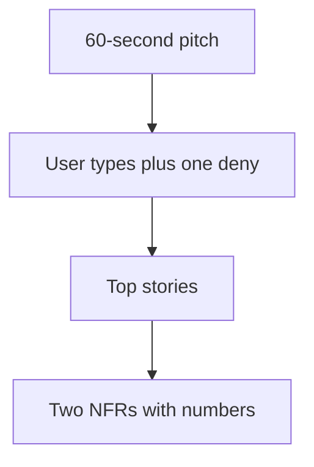

# Month 18 · Week 1 · Day 3
# From Memory: Pitch, Users, and Top Stories

**Program:** Full-Stack Mastery · 18 months  
**Phase:** 7 — Capstone  
**Month index:** [../../README.md](../../README.md)  
**Week 1:** [1](day-01.md) · [2](day-02.md) · Day 3 (today) · [4](day-04.md) · [5](day-05.md) · [6](day-06.md) · [7](day-07.md)  
**Week rhythm today:** Implement from memory (writing)  
**Student state:** Day 2 gate passed. You have a paragraph and a story list. Today those ideas must still live in your head — from **this file**.  
**Study time:** 3–4 focused hours  
**Prereq:** Day 2 gate passed.

Labs: `~\fullstack-lab\month-18\week-01\day-03\`. Days 1–2 textbook files stay **closed** during Blocks 1–3. Your **own** `REQUIREMENTS.md` stays closed until Block 4. This file is the teacher.

---

## How Day 3 works

Days 1 and 2 had guided writing. During the drills they stay **closed**. This file contains a recap so you are not sent to a blog to learn what a story is.

Allowed:

- The complete explanation in this file  
- A blank editor  
- Your voice

Not allowed:

- Opening Day 1 or Day 2 during Blocks 1–3  
- Opening your `REQUIREMENTS.md` during Blocks 1–3  
- Asking AI to regenerate the pitch  
- Pasting Project 7’s README

If you are stuck **more than 25 minutes** on one task, open **only** the matching Day 1 or Day 2 section **in this textbook**, read it, close it, continue from memory. Record lookups in `lookups.txt`.

There is **no answer key** for *your* domain in this file. There is a method, a recap, and a worked **toy** at the end to check **method**, not to steal a product.

---

## How to read this chapter

An examiner will not wait while you find the Markdown. Month 18’s demonstration (Project 8 §21) begins with **the product problem** spoken aloud.



**Wrong belief:** “Memory day means I reread Day 2 with the file open.”  
**Correct:** the recap below is the teacher. Your pack is the backup **after** you attempt the pitch.

---

## Complete explanation (discovery you must still own)

**Project 8 is an exam, not a tutorial clone.** You start from a business problem. Good *classes* of domain (not assignments): multi-tenant project management, clinic/appointment operations, logistics/inventory, support tickets, event management, B2B CRM/workflow. Avoid: basic todo, weather, simple blog, simple movie search. Complexity means states, handoffs, rules, and failures — not extra tables for show.

**The stranger paragraph.** Who hurts, what “better” means, who else is in the room. No library names. If a relative cannot follow it, it is not ready.

**User types.** At least two who disagree about permissions. “Admin and user” with identical powers is costume. Include one explicit **deny** (Org A must not read Org B; a reviewer must not edit after close — **your** rule).

**Meaningful stories.** A person and a job, not “I want CRUD.” Project 8 capabilities (auth, authz, related CRUD, search/filter/sort/pagination, object storage, email, background job, audit) must **map into** stories, not sit as twelve fake tickets. Twelve is a **floor**. Acceptance ideas include happy, invalid, and deny. Ids like `US-01` exist so Week 2 can trace.

**NFRs with numbers.** Security, availability, performance, maintainability, observability. Adjectives without numbers are moods. Learning production does not pretend four nines. Rate limits, max upload size, p95 intent, page size, request ids — these are testable.

**Stack is already chosen.** FastAPI, Postgres, React, Query, RHF, Zod. Modular monolith default. Redux and microservices need written justification. Docs **before** substantial code.

**Wrong belief:** “I will remember the pitch because I felt inspired yesterday.”  
**Correct:** you remember it because you can **reconstruct** users and top jobs without the file.

**Wrong belief:** “If I forget a story, I failed the month.”  
**Correct:** if you forget the **problem** and the **deny**, you are not ready for data modeling. Stories can be recovered; a hollow pitch cannot.

---

## Today's contract

By the end of this day you will be able to:

1. Speak a **60–90 second** pitch with no notes.  
2. Reconstruct user types and **one deny**.  
3. Reconstruct **at least eight** stories from memory (ids optional if titles are stable).  
4. State **two** NFRs with numbers.  
5. Compare to your real pack in Block 4 and repair gaps **without** inventing a new domain.

**Today's gate.** Closed-book:

> I can pitch the problem, name the people, name the must-not, and list the jobs that justify four weeks. I did not open yesterday’s Markdown to start talking.

---

## Time box

| Block | Minutes | Work |
|---|---|---|
| 0 | 20 | Read this recap; speak it |
| 1 | 35 | Closed-book `pitch.md` |
| 2 | 40 | Reconstruct users + stories |
| 3 | 25 | NFR cards + capability map from memory |
| 4 | 40 | Diff against real REQUIREMENTS.md; repair |
| 5 | 20 | Oral rehearsal |
| 6 | 15 | Retro |

---

# Block 0 — Speak the recap

Out loud, no other files: exam not clone; avoid list; stranger paragraph; meaningful vs CRUD-twelve; NFR numbers; docs before code. Then Block 1.

---

# Block 1 — Closed-book pitch (35 min)

Create `~\fullstack-lab\month-18\week-01\day-03\pitch.md`.

Write **in your words** (25–40 lines):

1. The problem in one paragraph (no libraries).  
2. Why software (not a spreadsheet forever).  
3. What you will **not** build in four weeks (three bullets).  
4. Why this is not a todo/weather/blog/movie-search.

If you cannot fill it, re-read **this** complete explanation. Do not open Day 1.

---

# Block 2 — Users and stories from memory (40 min)

Create `reconstruct.md`.

Must:

- Every user type you remember, with one sentence of power and one of **limit**.  
- At least **eight** stories in your nouns. Mark which are denials.  
- Star the **critical journey** (the one a person must complete: sign in, do the main job, see the result).

Should if time: guess which Project 8 capabilities are still unmapped.

Must not: invent a second product because the first felt fuzzy. Fuzzy means repair later, not reboot.

---

# Block 3 — NFR cards (25 min)

Create `nfr-cards.md`. Five headings. Under each, **one** number or bound from memory. If you remember none, write “unknown — owed” rather than inventing 99.999%.

Then `capability-memory.md`: eight rows (the required capabilities). Check yes/no whether a reconstructed story covered them.

---

# Block 4 — Diff (open your pack)

Now open **your** `REQUIREMENTS.md` (or Day 2 files). Write `diff.md`:

- Stories you forgot (list ids).  
- Stories you invented today that are **better** — keep them.  
- NFRs you inflated or softened.  
- Whether the stranger paragraph still matches.

Repair the **capstone** document, not only the lab. If the pitch and the pack disagree, the pack is wrong or the pitch is theater. Align them.

---

# Block 5 — Oral rehearsal

Stand up. No screen. 90 seconds: problem, users, deny, critical journey, one NFR. Record a voice memo if you can. If you stall, the Week 4 demonstration will stall. Repeat until it is boring.

Write `oral-notes.md`: where you stalled.

---

# Block 6 — Retro

`retro.md`: Did you rely on library names? Did you skip denials? Did you almost clone Project 7 in the pitch?

```powershell
cd ~\fullstack-lab
git add month-18
git commit -m "Month 18 Day 3: closed-book pitch and reconstruction."
```

---

## Worked method check (after you write — toy only)

A passing **method** for a hypothetical tool-library (not your product unless you chose it):

- Pitch names borrowers and a volunteer librarian; pain is lost tools and unclear due dates.  
- Deny: a borrower does not see another household’s open loans.  
- Stories include borrow, return, mark damaged + photo, overdue reminder (email + job), retire tool (audit).  
- NFR example: login lockout 5 / 15 minutes; image upload 5 MB; list p95 intent on 1k tools.

If your reconstruction has **no deny** and **no job**, you reconstructed a brochure. Repair in Block 4.

**Wrong belief:** “The worked toy is the official capstone.”  
**Correct:** it is a **shape check**. Your nouns stay yours.

---

## Debug the memory failures

Write `debug.md` after you attempt Blocks 1–3. For each: **what went blank**, **why**, **fix**.

**A.** You could only say “it’s a SaaS for X industry.”  
**B.** You remembered twelve CRUD verbs and no jobs.  
**C.** You could not name a number for any NFR.  
**D.** You described Project 7 by accident.  
**E.** You added microservices in the pitch.

Suggested repairs (check after you write):  
**A.** Start from a person and a bad day, not a market category.  
**B.** Ask “what do they do after lunch?”  
**C.** Re-copy numbers from your pack; if the pack has none, Day 2 is not done — stop and add them.  
**D.** Write one sentence: “Project 7 solved ___; this problem is ___.”  
**E.** Delete them. Modular monolith is the default.

---

## Definition of done

- [ ] `pitch.md` written without Day 1–2 open  
- [ ] `reconstruct.md` has users, deny, ≥8 stories  
- [ ] `nfr-cards.md` honest  
- [ ] `diff.md` drove a pack repair if needed  
- [ ] Oral 90 seconds without a script  
- [ ] Commit  

---

## Optional review links

Repair from this recap first.

- [Project 8 §21 demonstration list](../../../../full_stack_project_requirements_2026/project_08_independent_production_capstone.md) — item 1 is the problem  

---

## Tomorrow

**Lab:** data model and API outline — ER, invariants, hot queries, indexes you can **justify**, resources and errors. You will not receive a clinic schema. You will receive a **method** and a **toy** (`rooms` appear next week; today your nouns).
