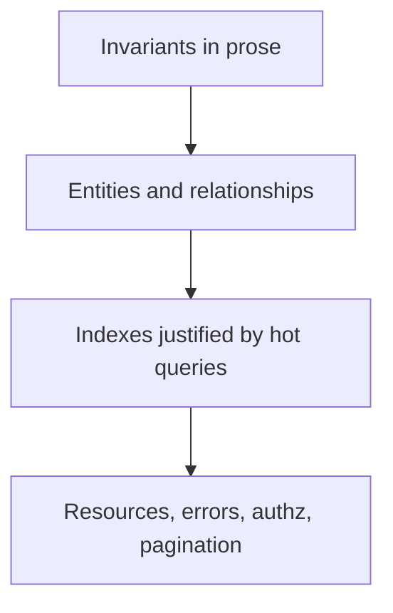
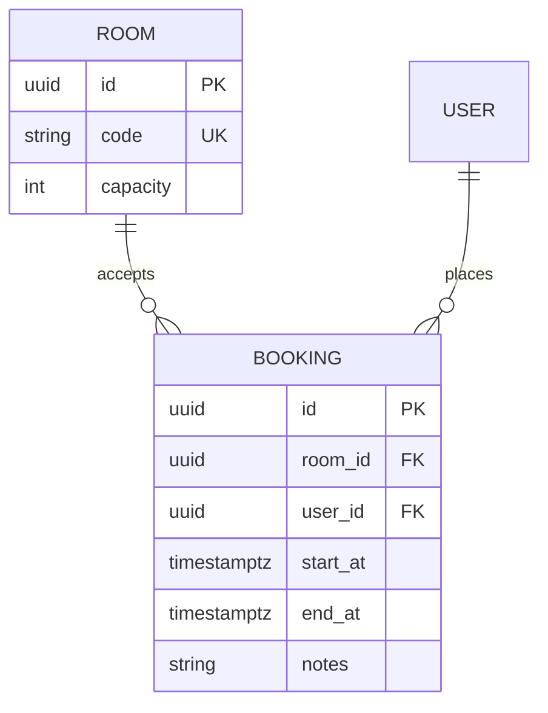

# Month 18 · Week 1 · Day 4
# Lab: Data Model and API Outline (Method, Not Their Schema)

**Program:** Full-Stack Mastery · 18 months  
**Phase:** 7 — Capstone  
**Month index:** [../../README.md](../../README.md)  
**Week 1:** [1](day-01.md) · [2](day-02.md) · [3](day-03.md) · Day 4 (today) · [5](day-05.md) · [6](day-06.md) · [7](day-07.md)  
**Week rhythm today:** Lab (type-along method + independent on **your** nouns)  
**Student state:** You can pitch the problem. Today you design **data** and an **API outline** before SQLAlchemy models.  
**Study time:** 3–4 focused hours (a second session is reasonable if the ER is still mush)

Labs: `~\fullstack-lab\month-18\week-01\day-04\`. Product diagrams live in **your capstone repo** (`DATABASE.md`, `API.md`). This textbook will **not** give you the “correct” clinic, CRM, or ticket schema. It will teach **how to design** and how to write an **OpenAPI-shaped** spec without generating a fake complete API.

---

## How to use this textbook

1. Read Block A. Close it. Say what an **invariant** is.  
2. Type the **toy** ER and two resource sketches so the method is in your fingers.  
3. Port the method to **your** domain. Do not port the toy tables into the capstone.  
4. Optional review links are for later rechecking.

---

## How to read this chapter

A **relational model** is a set of facts the database can **refuse** to store wrongly. An **API outline** is how HTTP exposes those facts without becoming the database.



**Wrong belief:** “I’ll generate tables from a UI mock and fix keys later.”  
**Correct:** keys, uniqueness, and state rules are the product. UI is a lens.

**Wrong belief:** “OpenAPI means I paste a 400-line YAML from a generator today.”  
**Correct:** you write **resource sketches**: paths, verbs, authz, error catalog, pagination **rule**. Week 2 implements them. A generated file that does not match invariants is a souvenir.

---

## Today's contract

By the end of this day you will be able to:

1. List **entities**, relationships, and **invariants** for your domain.  
2. Draw an ER diagram (Mermaid is enough).  
3. Name **hot queries** and **justify** indexes (what filter/sort, why not “index every column”).  
4. Outline API **resources**, error **meanings** (401/403/404/409/422), authz per verb, pagination strategy.  
5. Keep tenant/ownership rules in the model, not only in a FastAPI `if`.

**Today's gate.** Closed-book:

> I can name the facts that must stay true even if the API is buggy. I can name the list query people will run all day. I did not copy a clinic schema from the internet. My API outline is a contract sketch, not a generated novel.

---

## Time box

| Block | Minutes | Work |
|---|---|---|
| A | 45 | Theory: invariants, keys, hot queries, HTTP errors, pagination |
| B | 50 | Type-along: toy `rooms` / `bookings` (lab only) |
| C | 80 | Independent: **your** ER + API.md sketches |
| D | 15 | Git |
| E | 15 | Recall |

---

# Block A — Theory

## 1. Start from invariants, not from columns

An **invariant** is a rule that must hold after every successful transaction.

Examples of **shape** (replace nouns):

- A child row always points at a living parent, or the parent delete is blocked / cascaded **on purpose**.  
- Two tenants never share an id space in a way that makes authz a guess.  
- A unique business key (email per tenant, code per catalog) is unique **in the database**, not only in Python.  
- A state machine: you cannot go from `closed` back to `open` without an explicit action you designed.

Write invariants in prose **before** the table list. If you cannot write them, you do not have a model. You have a mood board.

**Wrong belief:** “SQLAlchemy relationships are the model.”  
**Correct:** constraints and transactions are the model. ORM mappings are a spelling.

## 2. Entities and relationships

For each entity ask:

- What is its **identity** (surrogate UUID/int, plus a **natural** key if humans use one)?  
- Who **owns** it?  
- What are its **states**?  
- What **must** exist before it can exist (foreign keys)?

Prefer **real foreign keys**. Prefer **uniqueness** you can explain. Prefer **check constraints** for cheap state rules when they will not become a migration nightmare.

Do not invent a document store “because JSON is flexible.” JSONB is a tool for **genuinely** schemaless crumbs, not for the primary workflow.

## 3. Hot queries drive indexes

An index is not a badge. It is a **bet** that a lookup pattern will dominate.

Write three **hot queries** in English, then in a SQL **sketch** with **your** names:

- The queue: open items for this actor, ordered by oldest.  
- The detail: one id, plus permission.  
- The search: title/status/date range, paginated.

Then justify:

| Index | Serves query | Why not a table scan | Risk of over-indexing |
|---|---|---|---|
| `(tenant_id, status, created_at)` | Queue | Filter + sort | Write cost on every insert |

**Wrong belief:** “I’ll index every foreign key and every filter checkbox.”  
**Correct:** index what the queue and search actually use. Measure in Week 4. Unique constraints **are** indexes — list them as such.

Month 10–11 skills apply: `EXPLAIN` later, design now. A missing index on the queue is a known debt; a mystery index on a boolean `is_active` alone is often a cargo cult.

## 4. API outline — resources, not your database dumped as URLs

Resources are **nouns the client needs**. They often match aggregates, not every join table.

For each resource write:

- Collection path and item path.  
- Verbs you actually support (do not invent PATCH if you will only PUT).  
- Who may call each verb (**authn** required? **which role/owner**?).  
- Pagination: **cursor vs offset**. For a learning capstone, **offset + limit** with a **max limit** is acceptable if you document its weakness (page drift). Cursor is better for infinite scroll; do not switch mid-month without a reason.  
- Filter/sort **allowlist** (never raw SQL from the query string — Month 13).

### Error catalog (meanings you already own)

| Status | Meaning in this program |
|---|---|
| 401 | Not authenticated |
| 403 | Authenticated, not allowed |
| 404 | Missing **or** hidden (if you chose not to leak existence — write the choice) |
| 409 | Conflict (unique, version, double-book) |
| 422 | Validation (Pydantic `detail` list) |
| 429 | Rate limit on sensitive routes |

Do not return 200 with `{ "success": false }`. Do not use 500 for validation.

## 5. OpenAPI-shaped without a fake complete spec

You may write YAML **snippets** for **one** resource to practice the shape: `operationId`, security, requestBody, responses `201`, `401`, `403`, `422`. Do **not** generate 40 paths of fiction.

A good `API.md` is:

1. Conventions (auth scheme you **chose**, pagination, error envelope).  
2. Resource table.  
3. Two fully spelled operations (create + list-with-filters).  
4. Authz matrix: resource × verb × role.

That is a contract. Swagger UI can wait until code exists.

## 6. Transactions and “related CRUD”

Project 8 wants CRUD on **multiple related** resources. The design question is: when creating a child, must the parent exist in the **same** transaction? Usually **yes**. When deleting a parent, what happens to children? **Block**, **cascade**, or **soft-close** — pick one per pair and write it.

## 7. What you will not do today

- You will not run Alembic for the capstone (Week 2).  
- You will not download a “hospital ER diagram” from a slide deck.  
- You will not add Kafka because the ER has two tables.

---

# Block B — Type-along toy (`rooms` / `bookings`)

This toy is **unrelated** to your capstone on purpose. Week 2 Day 4 will reuse it for SQL/API patterns. Today you only **design**.

```powershell
cd ~\fullstack-lab
mkdir month-18\week-01\day-04 -Force
cd ~\fullstack-lab\month-18\week-01\day-04
```

**Domain imposed:** campus **study rooms** and **bookings**. Not your product.

Invariants (write them in `TOY-INVARIANTS.md` in your words, then keep these):

1. A booking always references an existing room.  
2. Two bookings for the same room must not overlap in time (you will **state** the rule; implementing exclusion constraints can wait — uniqueness of `(room_id, start_at)` is **not** enough if durations exist; write that honesty).  
3. A user may not see another user’s booking **notes** (authz), even if room names are public.

Draw `TOY-ER.md` in Mermaid:



Hot query: “bookings for room X this week, ordered by start.” Index idea: `(room_id, start_at)`.

API sketch in `TOY-API.md`:

- `GET /rooms` public or authenticated — **you pick for the toy**.  
- `POST /rooms/{id}/bookings` authenticated; **409** on overlap (even if Week 2 implements a simplified check).  
- `GET /bookings/{id}` **403/404** for non-owners.  
- Pagination on `GET /rooms/{id}/bookings?from=&to=&page=&page_size=`.

Write `TOY-ERRORS.md`: one line each for 401, 403, 404, 409, 422 on create booking.

Do **not** copy this ER into the capstone.

---

# Block C — Independent (your domain)

In the capstone repo:

### `DATABASE.md`

1. Invariants (numbered).  
2. ER Mermaid (your nouns).  
3. Important tables in prose: identity, ownership, states.  
4. Hot queries (3+) and index justifications.  
5. Delete/cascade policy per relationship.  
6. What you are **not** modeling yet (stretch).

### `API.md`

1. Auth scheme **choice** (session cookie vs tokens) — one paragraph why.  
2. Pagination strategy and max page size (match NFR).  
3. Error catalog.  
4. Resource list with verbs.  
5. Authz matrix.  
6. Two operations fully sketched (list-with-filters and one create).  
7. Idempotency note for the operation that will enqueue a job (even if the job is Week 2).

Lab copy: `MY-DB-OUTLINE.md` and `MY-API-OUTLINE.md` with **names only** if you do not want duplicates — but the capstone files are the exam artifacts.

If you catch yourself drawing the toy rooms, stop. Use yesterday’s stories.

**Wrong belief:** “I’ll skip uniqueness because SQLAlchemy can check in Python.”  
**Correct:** two workers will race. The database is the last word.

---

# Block D — Git

```powershell
cd ~\fullstack-lab
git add month-18
git commit -m "Month 18 Day 4: rooms/bookings design gym; method notes."
```

Commit capstone `DATABASE.md` and `API.md`.

---

# Block E — Recall

1. Invariant vs column list.  
2. Why an index needs a hot query.  
3. 403 vs 404 as a product choice.  
4. Why offset pagination drifts.  
5. Why this file did not give you a CRM schema.

## Office hours

**Spreadsheet ER.** Thirty tables, no invariants. Repair: delete until each table defends a story.  
**REST as SQL.** `/tables/bookings?sql=`. Repair: allowlisted filters.  
**OpenAPI novel.** 80 paths, 0 authz matrix. Repair: matrix first.  
**Copied hospital schema.** Repair: if you did not choose that domain, trash it. If you did, rebuild from **your** invariants, not from a textbook picture.

Windows: Mermaid in Markdown previews in Cursor/GitHub. No extra installer required for the diagram source.

---

## Definition of done

- [ ] Toy invariants, ER, API, errors in the lab  
- [ ] Capstone `DATABASE.md` with invariants and justified indexes  
- [ ] Capstone `API.md` with authz matrix and two sketched operations  
- [ ] No downloaded industry schema presented as yours  
- [ ] Commits exist  

---

## Optional review links

- [Project 8 §§4–5](../../../../full_stack_project_requirements_2026/project_08_independent_production_capstone.md)  
- [OpenAPI Specification](https://swagger.io/specification/) — shape reference after you can sketch by hand  
- [Month 10 README](../../../month-10/README.md) — relational thinking you already passed  

---

## Tomorrow

**Architecture diagram**, trust boundaries, **threat model** (Month 13 skill on **this** product), **test strategy** (Month 14 pyramid), **deployment plan** (Months 15–16). Still no substantial product code.
