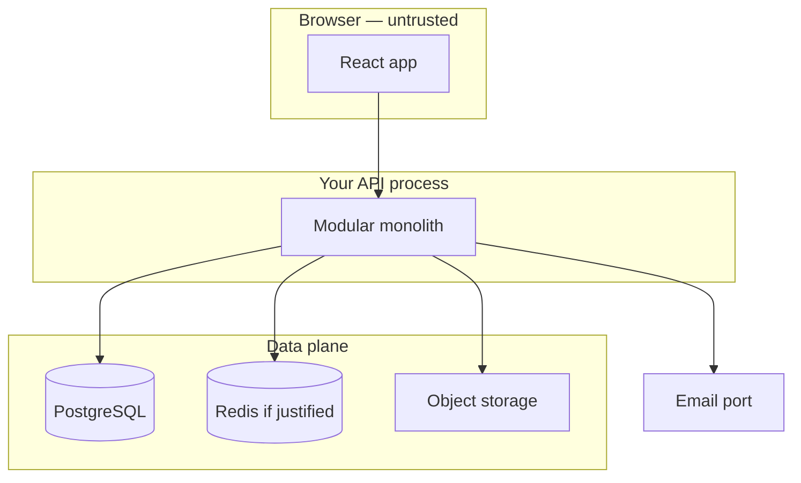

# Month 18 · Week 1 · Day 5
# Architecture, Threats, Tests, and a Deploy Plan

**Program:** Full-Stack Mastery · 18 months  
**Phase:** 7 — Capstone  
**Month index:** [../../README.md](../../README.md)  
**Week 1:** [1](day-01.md) · [2](day-02.md) · [3](day-03.md) · [4](day-04.md) · Day 5 (today) · [6](day-06.md) · [7](day-07.md)  
**Week rhythm today:** Tests/docs (design documents that **bind** later tests and deploys)  
**Student state:** Data and API outlines exist. Today you draw the **system**, the **trust boundaries**, the **Month 13 threat model** on *this* product, the **Month 14 pyramid** for *this* product, and a **Months 15–16 deployment plan** you could actually run.  
**Study time:** 3–4 focused hours

Labs: `~\fullstack-lab\month-18\week-01\day-05\`. Canonical files in **your capstone repo**: `ARCHITECTURE.md`, `SECURITY.md` (or `THREAT-MODEL.md`), `TESTING.md`, `DEPLOYMENT.md`. This textbook will **not** paste a microservice mesh or a copied AWS reference architecture.

---

## How to use this textbook

1. Default to a **modular monolith**. Add a box only with a sentence of need.  
2. Map threats to **your** endpoints, not to an OWASP poster.  
3. Map tests to **your** stories, not to a generic pyramid cartoon.  
4. Optional review links are for later rechecking.

---

## How to read this chapter

Architecture is **where work runs** and **who trusts whom**. It is not a collage of logos.



**Wrong belief:** “Microservices will impress the exam.”  
**Correct:** default is a **modular monolith**. Services need a demonstrated reason (independent scale, independent failure, independent team — you have one team).

**Wrong belief:** “Threat model is a pentest.”  
**Correct:** assets, actors, boundaries, what someone **might try**, what **stops** it, which **deny test** you will write. No exploit recipes.

---

## Today's contract

By the end of this day you will be able to:

1. Draw **system context**, **application modules**, **trust boundaries**, and **deployment** (even if Week 4 fills IPs).  
2. Write a threat model that **maps Month 13** onto this product.  
3. Write a test strategy that **maps Month 14** onto this product (including one Playwright journey named in **your** nouns).  
4. Write a deploy plan: environments, images, migrations as a step, secrets, HTTPS, logs, rollback **idea**.  
5. Justify Redis, a queue, and object storage **or** omit them with a reason (Project 8 still needs a job and a file feature — they can live in the monolith).

**Today's gate.** Closed-book:

> I can point at the browser, the API, Postgres, and every extra box’s job. I can name one IDOR-style risk on my resources and the check that stops it. I can name the unit/integration/component/E2E claims I owe. I can say how a commit becomes a URL.

---

## Time box

| Block | Minutes | Work |
|---|---|---|
| A | 50 | Theory: modules, boundaries, threats, pyramid, deploy steps |
| B | 40 | Guided: fill templates **for the rooms toy** (not the capstone) |
| C | 85 | Independent: four capstone documents |
| D | 15 | Git |
| E | 15 | Recall |

---

# Block A — Theory

## 1. Modular monolith (the default)

A modular monolith is **one deployable** with **hard module boundaries** in code: identity, the primary workflow, files, notifications. Modules may not import each other’s internals. They may call a small **public** function or a domain service.

You still run **one** FastAPI app, **one** Postgres, **one** React build unless a box is justified.

Justifications that **fail**:

- “Netflix does it.”  
- “I want to learn Kubernetes.”  
- “The exam is senior.”

Justifications that **can** pass:

- A worker process **because** the request must not wait for SMTP (still the same codebase, second process).  
- Redis **because** you named a cache key, TTL, and invalidation (Month 17) — or rate limiting you already understand.  
- Object storage **because** files do not belong on the API container’s writable layer.

A **second deployable service** is a high bar. Week 4 operations get harder with every process.

## 2. Diagrams Project 8 asked for

| Diagram | Question it answers |
|---|---|
| System context | Who talks to you (people, email provider, object storage)? |
| Application architecture | Modules inside the monolith; worker if any |
| ER | Yesterday |
| Frontend route map | Which URLs exist; which are auth-gated |
| Trust boundaries | Where data is untrusted (browser, webhooks) vs trusted (your DB) |
| Deployment | Browser → TLS terminator → API → Postgres; where secrets live |

Keep them **boring**. Boring is operable.

## 3. Trust boundaries (Month 13 skill)

Untrusted: anything the browser sends (JSON, query strings, cookies you must **verify**, file bytes).  
Trusted after checks: your Postgres **if** the API is the only writer.  
Semi-trusted: email provider (you own the port; they own delivery).  
Dangerous confusion: treating `X-User-Id` from the client as identity. Identity comes from **your** session/token after verification.

Draw a line at: TLS, authn middleware, authz in the **service** (not only the UI), parameterized ORM, object-storage signed access.

## 4. Threat model — four columns plus tests

Reuse Month 13’s map:

1. **Assets:** password hashes, session/refresh material, tenant data, uploaded files, admin actions.  
2. **Actors:** anonymous, User A, User B (same tenant), other tenant, operator.  
3. **What they might try** (one sentence each, **no payloads**): guess passwords; open another tenant’s URL; upload a huge file; trick a logged-in browser into a mutating request (CSRF class); inject into a search box (injection class); XSS via a stored title.  
4. **Mitigations:** hashing, rate limit, owner/role checks, size/type limits, SameSite/CSRF strategy you **chose**, encoding in React (default), CSP **concept**, no string-built SQL.  
5. **Tests:** the deny test **name you will write**.

Cover Project 8 §9 review list as **classes**: XSS, CSRF, injection, access-control, file upload, dependency/config. Map each to **this** product in one row.

This book teaches **defense**. It does not teach you to break systems you do not own.

## 5. Test strategy — Month 14 pyramid on this product

| Layer | What you will claim here |
|---|---|
| Unit | Predicates: who may transition status; overlap/total math |
| Integration | TestClient: 201, 422, 403 deny, 409; test database |
| Component | RTL + MSW: loading/empty/error on the main list |
| E2E | One Playwright journey: login + critical job + see result |

Name the **critical journey** using Week 1 Day 3’s star. Coverage remains a **flashlight**. Fakes at **email/clock/storage** ports. Do not fake Postgres in every API test.

## 6. Deployment plan — Months 15–16, not a wish

Write as if Week 4 will execute it:

- **Environments:** local Compose, staging, production (names).  
- **Artifact:** image tagged with git SHA.  
- **CI:** lint, types, tests, build (Project 8 §14).  
- **Secrets:** platform store, not `.env` committed.  
- **Migrations:** a **step**, not “create_all on boot.”  
- **HTTPS + DNS.**  
- **Rollback:** previous image; what you do if a migration is unsafe (expand/contract honesty).  
- **Logs/metrics** destination (CloudWatch or equivalent you used in Month 16).  
- **Backup strategy pointer** (Week 4 Day 4 writes the restore rehearsal; today: what is backed up).

If you have no AWS account yet, say so and plan **Compose staging** plus written IAM/RDS/S3 diagrams. Do not call localhost production.

## 7. Frontend architecture (Project 8 §6)

In `ARCHITECTURE.md` or a short `FRONTEND.md`: routes, page boundaries, Query as server state, RHF as form state, Zod at the boundary, error handling that **does not swallow 403**. Redux: only with a paragraph. Most capstones will not need it.

## 8. What you will not do today

- You will not implement the worker.  
- You will not paste a Kubernetes manifesto you cannot explain.  
- You will not write exploit steps “for realism.”

---

# Block B — Guided toy (rooms), then close it

In the lab, write `TOY-ARCH.md` for the **study-room** toy only:

- One FastAPI app, one React app, Postgres, optional Redis **omitted** with a sentence.  
- Worker: “send booking confirmation email” — same repo, second process.  
- Threat row: User B must not read User A’s booking notes. Mitigation: owner check. Test: `test_user_cannot_read_foreign_booking_notes`.  
- Pyramid: unit overlap helper; TestClient 409; RTL empty rooms; Playwright book-and-see.  
- Deploy: Compose file names only.

This proves you can **fill the templates**. Delete any urge to make the toy your capstone unless Day 1 already chose it.

---

# Block C — Independent

Capstone files, real nouns:

### `ARCHITECTURE.md`

Context diagram, module diagram, route map, deploy diagram (Mermaid). Redis/queue/S3: present **or** justified absence **with** how you still meet file + job requirements (S3-compatible local, filesystem adapter behind a port, etc.).

### `SECURITY.md` / `THREAT-MODEL.md`

The four columns, endpoint table for mutating routes, Month 13 class checklist, cookie/token flags.

### `TESTING.md`

Pyramid table with **example test titles**. Critical Playwright journey. Isolation (test DB). Doubles (mailer, storage). What you will **not** test (vendor SMTP).

### `DEPLOYMENT.md`

The Week 4 plan. Include “migrations as a step.” Name rollback. Name where TLS terminates.

Cross-link story ids from `REQUIREMENTS.md`. If a mutating story has no threat row, add one.

**Wrong belief:** “I’ll copy Month 16’s Project 7 deploy doc and change the title.”  
**Correct:** environments and resource **names** must match **this** product. Copying a pipeline **shape** is allowed; copying hostnames and pretending is not.

---

# Block D — Git

```powershell
cd ~\fullstack-lab
git add month-18
git commit -m "Month 18 Day 5: toy architecture templates."
```

Commit the four capstone documents.

---

# Block E — Recall

1. When may you add a second service?  
2. What lives outside the trust boundary?  
3. Why is hiding a button not authorization?  
4. Which layer catches a missing `status_code=201`?  
5. Why is `create_all` on boot not a migration step?

## Office hours

**Logo salad.** Repair: one compute, one DB, one worker if needed.  
**Threats without tests.** Repair: name the deny test.  
**Pyramid with only E2E.** Repair: Month 14 — ice-cream cone.  
**“We’ll figure out secrets in Week 4.”** Repair: write the store name today even if the value is empty.

Windows: diagrams are Markdown. You do not need Visio.

---

## Definition of done

- [ ] Toy arch file in the lab  
- [ ] Capstone architecture, threat model, test strategy, deploy plan  
- [ ] Modular monolith default kept or extra boxes justified  
- [ ] Deny tests named for major mutating routes  
- [ ] Commits exist  

---

## Optional review links

- [Month 13 threat model day](../../../month-13/week-04/day-06.md)  
- [Month 14 pyramid](../../../month-14/week-01/day-01.md)  
- [Month 16 README](../../../month-16/README.md)  
- [Project 8 §§3, 9, 10, 14–15](../../../../full_stack_project_requirements_2026/project_08_independent_production_capstone.md)  

---

## Tomorrow

**Independent:** box-and-arrow **wireframes** (not Figma worship) and a finished **`DESIGN-PACK.md`** in **your** repo that points at every Week 1 artifact. Week 2 code waits on that pack.
