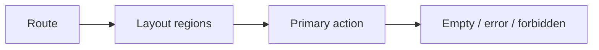

# Month 18 · Week 1 · Day 6
# Independent: Wireframes and DESIGN-PACK.md

**Program:** Full-Stack Mastery · 18 months  
**Phase:** 7 — Capstone  
**Month index:** [../../README.md](../../README.md)  
**Week 1:** [1](day-01.md) · [2](day-02.md) · [3](day-03.md) · [4](day-04.md) · [5](day-05.md) · Day 6 (today) · [7](day-07.md)  
**Week rhythm today:** Independent implementation (documents and boxes)  
**Student state:** Architecture and strategies exist as drafts. Today you **finish the design pack** and draw **wireframes** a developer could build from — boxes, labels, routes — not a Dribbble tribute.  
**Study time:** 3–4 focused hours

This textbook will **not** give you finished wireframes or a finished `DESIGN-PACK.md`. It will give a **spec envelope** and a **forbidden list**.

Work in **your capstone repo**. Lab notes: `~\fullstack-lab\month-18\week-01\day-06\`.

---

## How to use this textbook

1. Draw screens for the **critical journey** first, then secondary.  
2. Assemble `DESIGN-PACK.md` as an **index with decisions**, not a paste dump of every doc.  
3. Honest gaps are allowed only if they are **named** and **dated**. Invented completeness is a fail.  
4. Optional review links are for later rechecking.

---

## How to read this chapter

A wireframe answers: **what is on the page**, **what is the primary action**, **where does failure show**, **what URL is this**. Color palettes do not answer those questions.



**Wrong belief:** “If I do not use Figma, I am not professional.”  
**Correct:** ASCII, paper photos, Excalidraw, or Mermaid box diagrams are professional if a stranger can implement the page. Figma is optional decoration.

**Wrong belief:** “DESIGN-PACK is a zip of everything I wrote this week in one file.”  
**Correct:** it is the **cover sheet** of the examination: problem, pointers, decisions, gaps, and the sentence “substantial code starts after this pack exists.”

---

## Today's contract

By the end of this day you will be able to:

1. Produce wireframes for **login**, **primary list**, **detail**, **create/edit**, **empty**, **error**, **403/forbidden**, and **one settings-or-admin** if you have that role.  
2. Show **URL as source of filter state** on the list (query string names).  
3. Write `DESIGN-PACK.md` that links `REQUIREMENTS.md`, `DATABASE.md`, `API.md`, `ARCHITECTURE.md`, threat model, `TESTING.md`, `DEPLOYMENT.md`, wireframes.  
4. Record **open decisions** (zero or few). A pack with fifteen undecided auth questions is not finished.  
5. Refuse to start Week 2 schema code until the pack exists.

**Today's gate.** Closed-book:

> A new engineer could find every design artifact from DESIGN-PACK.md. The critical journey has boxes. Filters live in the URL. I did not wait for a UI kit.

---

## Time box

| Block | Minutes | Work |
|---|---|---|
| A | 25 | Inventory: which docs exist; which screens the journey needs |
| B | 40 | Wireframe the critical journey (boxes) |
| C | 90 | Remaining screens + DESIGN-PACK.md + decision log |
| D | 20 | Self-review against the envelope |
| E | 15 | Recall + commit |

---

# Block A — Inventory

Create `inventory.md` in the lab (paths only):

| Artifact | Path in capstone | Exists? | One-line status |
|---|---|---|---|
| Problem / users | | | |
| Stories ≥12 | | | |
| NFRs with numbers | | | |
| ER + invariants | | | |
| API outline | | | |
| Architecture | | | |
| Threat model | | | |
| Test strategy | | | |
| Deploy plan | | | |
| Wireframes | | | |
| DESIGN-PACK.md | | | |

If a row is empty, that is today’s work — not Week 2’s. Do not “inventory” by lying.

List **routes** you already wrote in architecture. If you have no route map, write one now: `/login`, `/`, `/items/:id`, `/items/new` — **your** nouns.

---

# Block B — Critical journey boxes

For **your** starred journey (login → main job → see result), draw three to five screens.

Each screen’s notes must include:

1. **Route** (path + example query string).  
2. **Who** can see it.  
3. **Regions:** nav, title, primary button, list or form, status area.  
4. **Loading** copy.  
5. **Empty** copy (not an alert).  
6. **Error** copy (network/500).  
7. **Forbidden** (403): what the user sees — not a blank crash, not a fake 200 list.  
8. **Labels** for inputs (a11y starts here; Week 3 deepens).

Example **shape** (tool-library toy — do not copy if that is not your domain):

```text
GET /loans?status=open&page=1
+----------------------------------+
| App name          [Account]      |
| Filters: status [open v]  [Apply]|
| [New loan]                       |
| list OR "No open loans"          |
| pagination                       |
| region: status (errors)          |
+----------------------------------+
```

Put drawings in `docs/wireframes/` as `.md` or `.png`. Photos of paper are allowed if readable.

**URL as filter state.** Write the query keys: `status`, `q`, `sort`, `page`. Week 3 will implement this. If filters live only in React state, the back button will lie — say so if you still plan that, then **change the plan**.

---

# Block C — Finish the pack

## Wireframe remaining screens

Minimum set:

- Login / logout affordance  
- List (filters in URL)  
- Detail  
- Create  
- Edit (or explain why create-only)  
- Empty list  
- Error  
- Forbidden  
- File upload control if a story needs it (drop zone as a **box**, not a library advertisement)

Optional: a queue board vs a table — pick one for v1.

## `DESIGN-PACK.md` envelope (fill, do not paste this paragraph as the pack)

Required sections:

1. **Title and one-paragraph problem** (stranger test).  
2. **User types** (short).  
3. **Critical journey** (one sentence + wireframe links).  
4. **Index** of documents with relative links.  
5. **Stack and defaults:** modular monolith; auth choice; no Redux unless linked justification.  
6. **Capability map** (Project 8 list → story ids → wireframe).  
7. **NFR highlights** (five numbers).  
8. **Invariants** (top five, link the rest).  
9. **Authz one-pager** (who may not).  
10. **Test highlights** (deny test names + Playwright journey).  
11. **Deploy highlights** (env names, migration step, secret store).  
12. **Gaps** with dates. Empty list is allowed if true.  
13. **Non-goals.**  
14. **Signature line:** “I will not start Week 2 substantial schema code until I pass Day 7’s critique.”

Forbidden in the pack:

- Entire OpenAPI dumps  
- Copied AWS sample architectures with account ids  
- “TBD” on auth **and** domain **and** stories  
- Project 7 screenshots presented as this product  

## Decision log

`docs/DECISIONS.md` (or a section): ADR-lite. Each: context, decision, alternatives rejected. Must include:

- Session cookie vs token  
- Offset vs cursor pagination  
- Where files go (S3-compatible vs disk adapter)  
- Mailer port (never SMTP in tests)

If you cannot decide one, pick the **simpler** and write why. Month 17’s gate was that habit.

---

# Block D — Self-review

Print or split-screen the Month 18 README gate item 1. Check each phrase: problem, users, ≥12 stories, NFRs, wireframes, ER, API spec, architecture, threat model, test strategy, deploy plan.

Write `day-06-review.md` in the lab: one missing piece. Fix it **today** if it is a hole; if it is polish, list it for Day 7.

Ask:

- Could a stranger understand section 1?  
- Is there a deny story?  
- Is there a backup **idea** (even one sentence) in deploy/ops notes? Day 7 will look for it.

---

# Block E — Recall

1. What must a wireframe include besides boxes?  
2. Why do filters belong in the URL?  
3. What is DESIGN-PACK.md for?  
4. Name one forbidden pack content.  
5. What waits until Day 7 says the pack exists?

```powershell
cd ~\fullstack-lab
git add month-18
git commit -m "Month 18 Day 6: pack inventory notes."
```

Capstone: commit wireframes and `DESIGN-PACK.md`.

---

## Office hours

**Figma rabbit hole.** Six hours of shadows, zero forbidden state. Repair: boxes.  
**One screenshot of a competitor.** That is not your wireframe. Repair: draw **your** routes.  
**Pack is a link to ChatGPT.** Repair: your words, your nouns.  
**“I’ll wireframe in Week 3 when I know Tailwind.”** Repair: Tailwind is not information architecture.

Windows: store images under `docs/wireframes\`. Avoid huge uncompressed photos; a readable PNG is enough.

---

## Definition of done

- [ ] Inventory table honest  
- [ ] Critical journey wireframed with URL query keys  
- [ ] Minimum screen set exists  
- [ ] `DESIGN-PACK.md` has all envelope sections  
- [ ] Decisions recorded  
- [ ] Capstone commit  
- [ ] No substantial Week 2 schema yet  

---

## Optional review links

- [Project 8 §2–3, §6, §20](../../../../full_stack_project_requirements_2026/project_08_independent_production_capstone.md)  
- [Month 18 README gate](../../README.md)  

---

## Tomorrow

**Week review:** critique **your** pack — missing story, missing deny-test, missing backup idea. Do **not** start Week 2 code until the pack exists and the critique is written.
