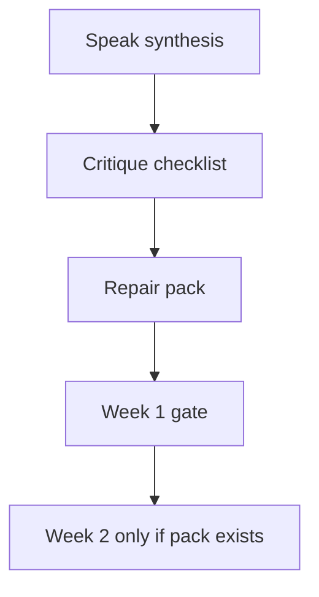

# Month 18 · Week 1 · Day 7
# Week Review — Critique the Design Pack

**Program:** Full-Stack Mastery · 18 months  
**Phase:** 7 — Capstone  
**Month index:** [../../README.md](../../README.md)  
**Week 1:** [1](day-01.md) · [2](day-02.md) · [3](day-03.md) · [4](day-04.md) · [5](day-05.md) · [6](day-06.md) · Day 7 (today)  
**Week rhythm today:** Review, repair, plan Week 2  
**Student state:** A design pack should exist. Today you **attack it like an examiner**, repair holes, and **explicitly forbid** Week 2 code until the pack is real.  
**Study time:** 3–4 focused hours

Work in `~\fullstack-lab\month-18\week-01\day-07\` for critique notes. Repair the **capstone** documents. Days 1–6 stay closed during the mini-critique except when this file says to open the pack.

---

## How to read this chapter

This is a **closed-book teaching day** plus a **document review**. The synthesis **is** the Week 1 lesson.



**Wrong belief:** “I’ll start models tonight and fix the pack on the weekend.”  
**Correct:** Week 2 implements the pack. Code without a pack is how Project 7 gets cloned.

---

## Week synthesis (the lesson, in this book)

Month 18 is the **core-program examination**. You build Project 8 from a **blank repository** and a **business problem**. This textbook never chooses your domain. Good *classes*: multi-tenant work, appointments, logistics, tickets, events, B2B CRM. Avoid: todo, weather, simple blog, movie search. Workflow means states, handoffs, rules, failures.

**Stranger paragraph.** Who hurts, what better means, who else is there. No library names.

**Stories.** ≥12 meaningful jobs with ids, acceptance including **deny** and invalid. Map Project 8 capabilities into stories: auth, authz, related CRUD, search/filter/sort/pagination, object storage, email, background job, audit. CRUD-twelve is a fail.

**NFRs.** Security, availability, performance, maintainability, observability — **with numbers** you could test. Do not claim four nines you cannot operate.

**Data.** Invariants first. ER. Hot queries justify indexes. Unique constraints in the database. Related resources have delete policies.

**API.** Resource sketches, authz matrix, pagination rule, error catalog (401/403/404/409/422/429). OpenAPI-shaped snippets — not a generated fake novel.

**Architecture.** Modular monolith default. Extra boxes justified. Trust boundaries. Frontend: Query for server state, RHF for forms, Redux only with a paragraph.

**Threats.** Month 13 map on **this** product. Defense only. Deny tests **named**.

**Tests.** Month 14 pyramid on **this** product. One Playwright critical journey named.

**Deploy.** Artifact, CI, secrets, migrations as a step, HTTPS, rollback idea, backup **idea**.

**Wireframes.** Boxes, routes, URL filters, empty/error/403. Not Figma worship.

**DESIGN-PACK.md** is the cover sheet. Substantial code waits.

**Wrong belief:** “Microservices impress.”  
**Correct:** simplest architecture; justify every added component (Month 17).

---

## Today's contract

By the end of this day you will be able to teach Week 1 aloud, produce a written critique that finds **at least** a missing story *or* a missing deny-test *or* a missing backup idea (if none are missing, say so with evidence), repair the pack, and **honestly** mark the Week 1 gate.

**Today's gate:** `DESIGN-PACK.md` exists and the critique file exists. If the pack is theater, **do not start Week 2**.

---

## Time box

| Block | Minutes | Work |
|---|---|---|
| 0 | 25 | Read synthesis; speak it |
| 1 | 30 | Closed-book `week1-oral.md` |
| 2 | 40 | Mini: critique a **defective toy pack** in this file |
| 3 | 50 | Critique **your** pack (checklist) |
| 4 | 40 | Repair capstone docs |
| 5 | 20 | Week 2 plan (no code) |
| 6 | 15 | Retro + self-mark |

---

# Block 0 — Speak the synthesis

Out loud: exam not clone; avoid list; stories vs CRUD; NFR numbers; invariants; modular monolith; deny tests named; pack before code. Then Block 1.

---

# Block 1 — Closed-book (30 min)

Create `~\fullstack-lab\month-18\week-01\day-07\week1-oral.md` (20–35 lines):

1. Your problem in the stranger paragraph.  
2. Two user types and one deny.  
3. Five NFR numbers.  
4. The critical journey.  
5. Why Week 2 must not start without the pack.

If you cannot, re-read **this** synthesis. Do not open Day 1.

---

# Block 2 — Mini-critique (defective toy pack)

Textbook closed except this spec. Domain imposed: **campus lost-and-found**. The following pack is **intentionally bad**. Write `toy-critique.md`: list **every** exam-relevant hole you can find. Then repair it **on paper** as `toy-repair.md` (you do not build the app).

**Defective pack (complete for the exercise):**

- Problem: “Lost and found SaaS with AI.”  
- Users: admin, user.  
- Stories: ten CRUD verbs on `items`, plus “pagination,” plus “CI.”  
- NFR: “secure and fast.”  
- ER: one table `items (id, name, ai_tags jsonb)`. No owner. No states.  
- API: `GET /items?q=` with the comment “pass SQL later.”  
- Architecture: eight microservices, no diagram of trust.  
- Threats: “OWASP Top 10.”  
- Tests: “we will use Playwright for everything.”  
- Deploy: “git pull on the server.”  
- Wireframes: none.  
- Backup: none.

Your critique **must** mention: missing meaningful stories, missing deny-test, missing backup idea — because this toy is missing all three. Practice the sentences you will use on yourself.

---

# Block 3 — Critique your pack

Open **only** `DESIGN-PACK.md` and the files it links. Complete `MY-CRITIQUE.md` in the lab.

| # | Question | Finding | Severity (hole / polish / ok) |
|---|---|---|---|
| 1 | Stranger paragraph — jargon? | | |
| 2 | Avoid-list resemblance? | | |
| 3 | ≥12 meaningful stories? | | |
| 4 | Capability map complete? | | |
| 5 | At least two deny stories/acceptance? | | |
| 6 | NFR numbers for all five headings? | | |
| 7 | Invariants numbered? | | |
| 8 | Indexes justified by hot queries? | | |
| 9 | Authz matrix exists? | | |
| 10 | Modular monolith default? Extra boxes justified? | | |
| 11 | Threat rows on mutating routes? Deny **test names**? | | |
| 12 | Pyramid with one Playwright journey named? | | |
| 13 | Migrations as a deploy step? | | |
| 14 | Backup **idea** (what, RPO guess, restore later)? | | |
| 15 | Wireframes include 403 and URL filters? | | |
| 16 | Auth choice recorded? | | |
| 17 | Redux/microservices justification or absence? | | |
| 18 | Pack index links resolve? | | |

You **must** write a section **Missing story / missing deny-test / missing backup idea**. If all three exist, quote them (ids and paths). If one is missing, it is a **hole**. Repair in Block 4.

Examiner voice: short, specific, no “looks good overall” without a table.

---

# Block 4 — Repair

Fix the capstone. Do not “accept risk” on a missing deny story. Do not start Alembic.

If you discover you chose a todo: **stop**. Return to Day 1. The calendar does not graduate you.

Write `repairs.md`: what changed.

---

# Block 5 — Week 2 plan (no code)

`week2-plan.md`:

- Repo layout you will create (names).  
- First Alembic revision: **which** tables from **your** ER (not all if too many — identity + one aggregate is allowed as first revision, with a written sequence).  
- First deny test you will write.  
- Tooling: uv, Ruff, pytest.  
- Explicit: “I will not copy Project 7 folders.”

---

# Block 6 — Retro + Week 1 self-mark

`retro.md`: weakest artifact; whether you almost cloned Project 7.

| # | Claim | Evidence | Pass? |
|---|---|---|---|
| 1 | DESIGN-PACK.md exists as cover sheet | path | |
| 2 | Problem + users + ≥12 stories + NFR numbers | REQUIREMENTS | |
| 3 | ER + API outline | DATABASE.md API.md | |
| 4 | Architecture + threats + tests + deploy | those files | |
| 5 | Wireframes for critical journey | docs/wireframes | |
| 6 | Critique found or confirmed deny-test names and backup idea | MY-CRITIQUE.md | |
| 7 | No substantial product code this week | git log honesty | |

If the pack is false, **do not start Week 2**.

```powershell
cd ~\fullstack-lab
git add month-18
git commit -m "Month 18 Week 1 review: pack critique."
```

---

## Worked notes for the toy (after you write toy-critique)

Check yourself: you should have said the problem is slogan not stranger; admin/user is weak; CRUD+CI are not twelve meaningful stories; NFRs have no numbers; no owner means no deny; `q` as SQL is injection class; microservices unjustified; OWASP list is not a model; Playwright-everything is ice-cream; git pull is not CD; no wireframes; no backup idea. Repair would add: found/claimed/returned states, owner, 403 test name, backup of Postgres dumps, one service.

If your toy critique missed **deny-test** or **backup**, your self-critique method is still weak. Re-read Block 2.

---

## Office hours

**Friendly review.** You wrote “solid work.” Repair: fill the table.  
**Repair by adding microservices.** No.  
**Starting Week 2 because Thursday.** No.

Windows: keep critique files in the lab repo so exam evidence is not only in your head.

---

## Definition of done

- [ ] Synthesis spoken  
- [ ] week1-oral.md  
- [ ] Toy critique + repair notes  
- [ ] MY-CRITIQUE.md table  
- [ ] Pack repaired  
- [ ] Week 2 plan with no code  
- [ ] Self-mark honest  
- [ ] Week 2 not started on a missing pack  

---

## Optional review links

- [Month 18 README](../../README.md)  
- [Project 8](../../../../full_stack_project_requirements_2026/project_08_independent_production_capstone.md)  

---

## Next week

**Week 2 — Backend.** Blank repo layout, tooling, first Alembic from **your** spec, config without secrets. The pack is the spec. This textbook still will not paste the product.
