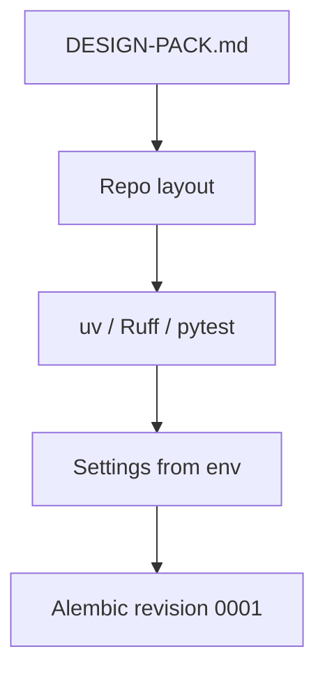

# Month 18 · Week 2 · Day 1
# Blank Repo: Layout, Tooling, First Migration, Config Without Secrets

**Program:** Full-Stack Mastery · 18 months  
**Phase:** 7 — Capstone  
**Month index:** [../../README.md](../../README.md)  
**Week 2:** Day 1 (today) · [2](day-02.md) · [3](day-03.md) · [4](day-04.md) · [5](day-05.md) · [6](day-06.md) · [7](day-07.md)  
**Week rhythm today:** Learn + type-along (repo hygiene, not the product dump)  
**Student state:** Week 1 gate is true: `DESIGN-PACK.md` exists. Today you open a **blank** backend (or a blank monorepo) and make it **habitable**: layout, uv, Ruff, pytest, config that **cannot** hold production secrets, and the **first Alembic revision from your spec** — not from a tutorial blog’s `users` table copied blindly.  
**Study time:** 3–4 focused hours

Labs: `~\fullstack-lab\month-18\week-02\day-01\` for a **tiny** config/settings drill. Product code lives in **your capstone repo**. This textbook will **not** paste your schema. If the pack is missing, stop and return to Week 1.

Project 7 stays running. Do not copy its folder tree as a “starter.”

---

## How to use this textbook

1. Read until you can say what belongs in git and what never does.  
2. Type the settings lab. Then apply the **same rules** in the capstone.  
3. Your first migration must trace to **your** `DATABASE.md`, even if it is only identity plus one aggregate.  
4. Optional review links are for later rechecking.

---

## How to read this chapter

A blank repository is a **liability** until it has a way to run, lint, test, migrate, and refuse secrets. Feature code is secondary today.



**Wrong belief:** “I’ll copy Project 7 and search-replace.”  
**Correct:** copy **habits** (uv, Ruff, test DB URL safety). Type a new tree. Reusing a tutorial architecture as a skin is a fail (Month 18 README).

**Wrong belief:** “`.env` in the repo is fine if I gitignore it later.”  
**Correct:** if it was ever committed, treat it as leaked. Use `.env.example` with **empty or fake** values. Real secrets live in the OS environment or a secret store (Week 4).

---

## Today's contract

By the end of this day you will be able to:

1. Create capstone layout: `src` (or `app`), `tests`, `alembic`, `docs` already from Week 1.  
2. Add **uv** project, **Ruff**, **pytest**, FastAPI/SQLAlchemy/Alembic as dependencies **you** pin.  
3. Load config via environment (Pydantic settings); fail fast if `DATABASE_URL` is missing in production mode.  
4. Refuse to run tests against a prod-looking URL (Month 14 habit).  
5. Generate **one** Alembic revision that matches **your** first slice of ER.  
6. Run `uv run ruff check`, `uv run pytest` (even if tests are few), `uv run alembic upgrade head` against a **dev** database.

**Today's gate.** Closed-book:

> The capstone repo is not Project 7. Settings come from the environment. Secrets are not in git. The first migration comes from my DATABASE.md. Pytest cannot silently use production.

---

## Time box

| Block | Minutes | Work |
|---|---|---|
| A | 45 | Theory: layout, config, migrations as history, secret hygiene |
| B | 50 | Lab: settings object + safety assert |
| C | 80 | Independent: capstone repo + first revision |
| D | 15 | Git |
| E | 15 | Recall |

---

# Block A — Theory

## 1. Layout that matches a modular monolith

You need a layout you can explain in the demonstration (Project 8 §21). A shape that works:

```text
capstone/
  docs/                 Week 1 pack
  src/yourpkg/
    identity/
    <workflow>/         your module name
    files/
    notifications/
    main.py             FastAPI app factory
    settings.py
  tests/
  alembic/
  alembic.ini
  pyproject.toml
  .env.example
  .gitignore
  README.md
```

Names are yours. The idea is **modules**, not `models.py` with every table. FastAPI routers import from module public APIs.

Monorepo (`apps/api`, `apps/web`) is allowed if you already live that way. Two repos are allowed. Write the choice in README. Do not split **microservices**.

## 2. Tooling — uv, Ruff, pytest

You have used these since Python months. Capstone rules:

- **uv** owns the environment. You run `uv run pytest`, not a mystery global Python.  
- **Ruff** check + format. CI will fail later if you skip today.  
- **pytest** from day one, even for `test_health.py`. A repo without tests is a souvenir (Month 1).

Windows: from PowerShell, `cd` to the repo. If `uv` is not recognized, you are in the wrong PATH — fix that before “designing” anything else.

## 3. Config without secrets

Settings are **data about the environment**, not a place to hide passwords in source control.

Pattern:

- `DATABASE_URL`, `SECRET_KEY` (or session signing key), `REDIS_URL` if any, `S3_*` if any, `SMTP_*` or `MAIL_URL` if any — **all from env**.  
- Distinct `APP_ENV`: `local` | `test` | `staging` | `production`.  
- In `production`, missing `SECRET_KEY` is a **crash at boot**, not a default of `"changeme"`.  
- `.env.example` lists keys. `.env` is gitignored.

**Wrong belief:** “I’ll default SECRET_KEY so Docker starts.”  
**Correct:** local Compose can pass a **dev-only** key via env. The **code default** for production must not be a string in git.

Illustrative snippet (lab and capstone **settings**, not your domain):

```python
from pydantic_settings import BaseSettings, SettingsConfigDict

class Settings(BaseSettings):
    model_config = SettingsConfigDict(env_file=".env", extra="ignore")

    app_env: str = "local"
    database_url: str
    secret_key: str = ""

    def require_prod_secrets(self) -> None:
        if self.app_env == "production" and len(self.secret_key) < 32:
            raise RuntimeError("SECRET_KEY missing or too short for production")
```

Type this idea. Do not paste a 200-line settings module from a blog.

## 4. Test database safety

In `tests/conftest.py` (Week 2 Day 2–5 will grow this):

- Read `TEST_DATABASE_URL` or a dedicated name.  
- **Refuse** URLs that look like production (host names you documented, missing `_test`, etc.).  
- Never migrate a human’s TablePlus database from pytest.

This is Month 11–14. Capstone does not get a vacation.

## 5. First Alembic revision from *your* spec

Alembic is **history**. `create_all` in the app factory is not history.

Rules for revision `0001`:

- Every table you create is in `DATABASE.md`.  
- You may **slice**: `users` (or equivalent) + **one** primary entity. Write `MIGRATION-PLAN.md`: what comes in 0002/0003.  
- Constraints you wrote as invariants (unique, FK) belong **in SQL**, not as a comment.  
- Do not generate from a copied Project 7 model file.

```powershell
uv run alembic revision -m "identity_and_primary_slice"
uv run alembic upgrade head
```

Edit the revision. Read the SQL. If you do not understand a line, you do not own the migration.

## 6. Health before features

A `GET /health` that returns `{"status": "ok"}` is allowed. Readiness that checks Postgres is better (`SELECT 1`). Do not put secrets in the health body.

## 7. What you will not do today

- You will not implement full CRUD.  
- You will not implement OAuth.  
- You will not commit `uv.lock` secrets (lockfiles are fine; credentials are not).  
- You will not add Kafka.

---

# Block B — Type-along lab (not the capstone)

```powershell
cd ~\fullstack-lab
mkdir month-18\week-02\day-01 -Force
cd ~\fullstack-lab\month-18\week-02\day-01
uv init --name lab-settings
uv add pydantic-settings
uv add --dev pytest ruff
```

Create `settings.py` with `BaseSettings` as above. Create `test_settings.py`:

- Production env + short secret → `require_prod_secrets` raises.  
- Test URL helper: a function `assert_test_url(url: str) -> None` that raises if `"postgres"` in host **and** `"_test"` not in the URL — **tune the heuristic**; document false positives. The point is **you thought**.

```powershell
uv run pytest -q
uv run ruff check .
```

Write `SECRETS.md`: three places secrets must never appear (source, logs, screenshots of `.env`).

---

# Block C — Independent (capstone repo)

From a **blank** tree (README + docs from Week 1 is not “copying Project 7”):

1. `uv init` / add FastAPI, SQLAlchemy, Alembic, psycopg (or the driver you used in this program), pydantic-settings. Dev: pytest, httpx, ruff.  
2. `.gitignore`: `.env`, `__pycache__`, `.venv`, coverage, OS junk.  
3. `.env.example` with **placeholders**.  
4. App factory + `/health`.  
5. Alembic wired to `settings.database_url`.  
6. First revision from **your** slice.  
7. `README.md`: how to create a local database, `alembic upgrade head`, `uv run pytest`.  
8. `tests/test_health.py` with TestClient.

If Postgres is not running, start the same way you did in Months 10–11. Do not switch to SQLite “just for today” unless you write a **penalty paragraph**: SQLite will lie about types and constraints you need. Prefer Postgres for the capstone.

**Wrong belief:** “I’ll use SQLite until Week 4 then switch.”  
**Correct:** you will debug two databases. Start with PostgreSQL.

---

# Block D — Git

```powershell
cd ~\fullstack-lab
git add month-18
git commit -m "Month 18 Week 2 Day 1: settings safety lab."
```

Capstone: first **code** commit. Message like: “Scaffold API, settings from env, initial Alembic slice.” Verify `git status` does not list `.env`.

```powershell
git status
git grep -n "changeme" || echo "no changeme"
```

On Windows PowerShell, `git grep` still works. If you find a real password, **rotate** it; do not just delete the line from history without understanding (do not rewrite shared history).

---

# Block E — Recall

1. Why production must not default `SECRET_KEY`.  
2. What an Alembic revision is for.  
3. Why the first tables must appear in DATABASE.md.  
4. How pytest should treat DATABASE_URL.  
5. Why copying Project 7’s tree fails the exam.

## Office hours

**Empty revision.** Autogenerate with no models. Repair: models from **your** ER, then autogenerate, then **read**.  
**Committed `.env`.** Repair: gitignore, rotate, assume leak.  
**One `models.py` god file.** Repair: split by module even if files are small.  
**Health returns the database password.** Repair: today.

Windows: Alembic paths use forward slashes in `script_location` more happily; if upgrade cannot find versions, print `pwd` and `alembic.ini`.

---

## Definition of done

- [ ] Lab pytest green  
- [ ] Capstone uv + Ruff + pytest + FastAPI  
- [ ] `.env.example` only  
- [ ] First Alembic revision matches a documented slice  
- [ ] `/health` TestClient test  
- [ ] `git status` clean of secrets  
- [ ] Pack still the spec  

---

## Optional review links

- [Pydantic Settings](https://docs.pydantic.dev/latest/concepts/pydantic_settings/)  
- [Alembic tutorial](https://alembic.sqlalchemy.org/en/latest/tutorial.html)  
- [Ruff](https://docs.astral.sh/ruff/)  
- [Project 8 §7](../../../../full_stack_project_requirements_2026/project_08_independent_production_capstone.md)  

---

## Tomorrow

**Authn/authz skeleton:** hash passwords, sessions or tokens **as the pack chose**, role/ownership checks, tests that **deny** the wrong user. No product dump.
