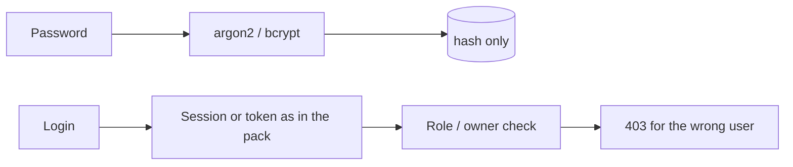

# Month 18 · Week 2 · Day 2
# Authn/Authz Skeleton: Hash, Session-or-Token, Deny the Wrong User

**Program:** Full-Stack Mastery · 18 months  
**Phase:** 7 — Capstone  
**Month index:** [../../README.md](../../README.md)  
**Week 2:** [1](day-01.md) · Day 2 (today) · [3](day-03.md) · [4](day-04.md) · [5](day-05.md) · [6](day-06.md) · [7](day-07.md)  
**Week rhythm today:** Exercises + product skeleton (not the whole workflow)  
**Student state:** The repo boots and migrates a slice. Today **who someone is** and **what they may do** become real on **your** nouns — using Month 13 skills, not a pasted auth tutorial.  
**Study time:** 3–4 focused hours

Labs: `~\fullstack-lab\month-18\week-02\day-02\` for a **locker-account** mini if you need a gym. Product auth lives in **your capstone**. This textbook will **not** dump Project 8. Implement **the scheme your pack chose**.

This book teaches **defense**. It does not teach you to break other people’s systems.

---

## How to use this textbook

1. Re-state hash vs session/token from memory before coding.  
2. Write the **deny** test **before** or **with** the allow test.  
3. Do not add OAuth, 2FA, or JWT because a blog post is anxious.  
4. Optional review links are for later rechecking.

---

## How to read this chapter

Authentication answers **who are you?** Authorization answers **what may you do?** Hiding a button is courtesy. The API must refuse.



**Wrong belief:** “I’ll add JWT because capstone.”  
**Correct:** if the pack chose **HttpOnly session cookies** for a first-party SPA + API, that is often simpler. If the pack chose tokens, implement **expiry, logout/revocation**, and do not put secrets in localStorage without a written reason. **Do not switch schemes today** to chase fashion.

**Wrong belief:** “A 200 with `{ authorized: false }` is fine.”  
**Correct:** unauthenticated **401**; authenticated but forbidden **403**. Be consistent with `API.md`.

---

## Today's contract

By the end of this day you will be able to:

1. Register + login + logout (or token revoke) against **your** user table.  
2. Store **only** password hashes (argon2 preferred, bcrypt acceptable).  
3. Attach identity on later requests via **the pack’s** mechanism.  
4. Enforce **at least one** resource authorization: owner or role.  
5. Pytest: wrong password generic failure; **deny** foreign resource; 401 without credentials.  
6. Never log passwords, raw tokens, or session ids in full.

**Today's gate.** Closed-book:

> I hash passwords. I can deny the wrong user with an HTTP test. Logout or expiry exists as I designed. The UI is not the security boundary.

---

## Time box

| Block | Minutes | Work |
|---|---|---|
| A | 40 | Theory: recap Month 13 applied to *your* matrix |
| B | 45 | Exercises: predict status codes; write deny test names |
| C | 90 | Independent: implement skeleton in capstone |
| D | 15 | Git + secret grep |
| E | 15 | Recall |

---

# Block A — Theory

## 1. Hashing (you already passed this gate)

Plaintext in the database is a product disaster. Encryption that you can reverse is not a password store. Use the library **verify**. Do not invent a salt scheme. Do not log the password on 422.

Generic login errors: do not teach an attacker which emails exist **unless** you explicitly designed enumeration resistance later. Today: same message for unknown user and bad password.

## 2. Sessions vs tokens — implement the pack

| Pack choice | Skeleton today | Must still have |
|---|---|---|
| Server session + cookie | Session id random, stored hashed or as id in a table/store, cookie **HttpOnly**, **SameSite**, **Secure** in prod | Logout deletes server session; expiry |
| Opaque token | Token hashed at rest; `Authorization: Bearer` | Expiry; revoke on logout |
| JWT access + refresh | Short access, refresh stored/revocable | You **justify** in the pack; do not skip revoke |

Cookie flags prevent **classes** of theft (HttpOnly: not JS; Secure: HTTPS; SameSite: CSRF class for many first-party cases). If you are cross-site, you need an explicit CSRF strategy — write it; do not “just set SameSite=None” as a hobby.

## 3. Authorization is per resource

Your `API.md` authz matrix is the spec. Today implement **one** row that is not “any logged-in user can GET everything.”

Typical patterns (pick what **your** invariants need):

- **Ownership:** `resource.owner_id == actor.id`  
- **Role:** `actor.role in {"owner", "dispatcher"}`  
- **Tenant:** `resource.tenant_id == actor.tenant_id` **and then** role  

Always: after load, **check**. Do not trust an id in the URL. That class of bug is **IDOR-style access control** — Month 13. Mitigation: compare owner/tenant; tests deny User B.

**Wrong belief:** “I’ll filter in the list query so detail can skip checks.”  
**Correct:** list filters are necessary; **detail/update/delete must still check**. A guessed UUID must not leak.

## 4. Rate limiting on login

Project 8 requires rate limiting on sensitive endpoints. Today a **simple** in-memory or Redis counter is enough **if** you document that multiple workers need Redis. A single-process limiter is an honest local start; Week 4 should not pretend it is enough for N workers.

Do not implement a captcha. Do not write a brute-force **tool**.

## 5. What “skeleton” means

In scope: user record, hash, login, logout, `GET /me`, one protected resource check (even a toy `GET /notes/{id}` if your primary entity is not ready — **prefer** the real entity if 0001 already has it).

Out of scope: full workflow CRUD (Day 4), email verify, OAuth, the React login page (Week 3).

## 6. Tests that matter more than coverage %

Minimum:

1. Register 201; duplicate email 409.  
2. Login 200; bad password 401 (or 403 if you documented that — **prefer 401**).  
3. `GET /me` 401 without cookie/token.  
4. **User B cannot GET/PATCH User A’s resource → 403 or 404 as in API.md.**  
5. Logout then `GET /me` → 401.

Name test 4 in the threat model. If it does not exist, Day 7’s backend review fails.

---

# Block B — Exercises (before you code)

In the lab:

### Exercise 1 — Status predictions

`PREDICT.md`: for **your** API.md, fill a table of eight calls (anonymous create, wrong user GET, owner GET, empty body, duplicate). Predict status **before** implementing. You will compare on Day 5.

### Exercise 2 — Deny test names

`DENY-TESTS.md`: three pytest names you will write, in the `test_...` style. They must include a **foreign** id.

### Exercise 3 — Cookie/token checklist

Copy the pack’s choice. Tick flags/expiry/revoke. If you cannot tick, the pack was not a decision — fix the pack **first**.

### Exercise 4 — Locker mini (optional gym)

If the capstone is stuck on migrations, build **only** in the lab: in-memory locker users, hash, `X-User-Id` **is forbidden as identity** — use a session dict. The point is muscle memory. Do not ship `X-User-Id` in production.

---

# Block C — Independent (capstone)

Implement the skeleton. Type code. AI may not replace your deny test.

Use `TestClient`. Store the session cookie or token from login response **in the test client**. Create two users in the test DB. Create a resource as A. Authenticate as B. Assert deny.

Extract a **pure predicate** if the rule is more than one comparison; unit-test the predicate **and** keep the HTTP test (Month 14: unused predicates lie).

Password hashing:

```python
from pwdlib import PasswordHash  # or passlib/argon2 you used in Month 13

# Illustrative: hash on register, verify on login.
# Never print password. Never return hash to the client.
```

Use **the library you already learned**. Do not switch stacks for novelty.

CSRF: if cookie session + browser, follow your Month 13 choice (SameSite=Lax for same-site Vite proxy may be enough; if not, CSRF token — document).

---

# Block D — Git

```powershell
cd ~\fullstack-lab
git add month-18
git commit -m "Month 18 Day 2: deny-test names and predictions."
```

Capstone commit: “Auth skeleton with foreign-resource deny test.”

Grep: password strings, `SECRET_KEY=` real values.

---

# Block E — Recall

1. Hash vs encryption.  
2. 401 vs 403.  
3. Why list filters do not replace detail checks.  
4. What logout must do for sessions vs JWT.  
5. Why this file did not paste your user model.

## Office hours

**JWT in localStorage as default.** Repair: read your pack; prefer HttpOnly if first-party.  
**200 for everything.** Repair: API.md catalog.  
**Deny test uses the same user twice.** Repair: two users.  
**Logging `form.password`.** Repair: immediately.  
**Authorize in React only.** Repair: API test must fail if you comment out the check.

Windows: cookie tests with TestClient work without a browser. Do not open Chrome to “see if login works” as your only proof.

---

## Definition of done

- [ ] PREDICT.md and DENY-TESTS.md  
- [ ] Register/login/logout (or revoke)  
- [ ] Hashes only at rest  
- [ ] HTTP deny test green  
- [ ] 401 on /me when logged out  
- [ ] No secrets in git  
- [ ] Threat model links the test name  

---

## Optional review links

- [Month 13 Day 1 hashing](../../../month-13/week-01/day-01.md)  
- [FastAPI security](https://fastapi.tiangolo.com/tutorial/security/) — recheck after you can explain your pack  
- [OWASP: Access Control](https://owasp.org/www-community/Access_Control) — classes, not exploits  

---

## Tomorrow

**Memory:** reconstruct **your** invariants and status codes from the spec — this file will teach the **method** plus a **generic** example, not your schema.
