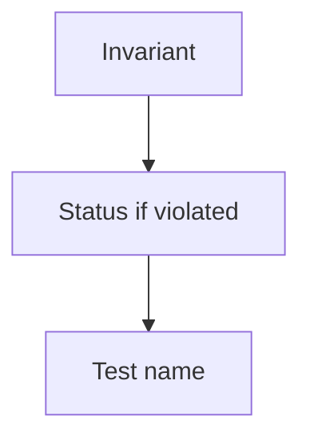

# Month 18 · Week 2 · Day 3
# From Memory: Invariants and Status Codes (Your Spec)

**Program:** Full-Stack Mastery · 18 months  
**Phase:** 7 — Capstone  
**Month index:** [../../README.md](../../README.md)  
**Week 2:** [1](day-01.md) · [2](day-02.md) · Day 3 (today) · [4](day-04.md) · [5](day-05.md) · [6](day-06.md) · [7](day-07.md)  
**Week rhythm today:** Implement from memory  
**Student state:** Day 2 gate passed: you can deny the wrong user. Today you must still **know** your rules without opening `DATABASE.md` first.  
**Study time:** 3–4 focused hours  
**Prereq:** Day 2 gate passed.

Labs: `~\fullstack-lab\month-18\week-02\day-03\`. Capstone `DATABASE.md` / `API.md` stay **closed** during Blocks 1–3. This file is the teacher. It will **not** reprint your schema. It uses a **generic** example so you cannot “fill in the clinic.”

---

## How Day 3 works

Allowed:

- This recap  
- A blank editor  
- pytest on a **lab** generic app if you build the mini

Not allowed:

- Opening your API.md during Blocks 1–3  
- Opening Day 2 product code as a cheat sheet  
- AI writing the reconstruction

If stuck **more than 25 minutes**, open **only** the matching spec section, close it, continue. Record `lookups.txt`.

A worked box at the end checks **method** on a generic **article/comment** toy — not your domain.

---

## How to read this chapter

An invariant that exists only in a Markdown file you cannot remember will not appear in a handler at 1 a.m.



**Wrong belief:** “Memory day is for syntax.”  
**Correct:** memory day is for **your rules**: uniqueness, ownership, state, and the **status code** the client should see.

---

## Complete explanation (method you must still own)

**Invariants** are facts that remain true after a successful commit: uniqueness, foreign keys, “a child belongs to a living parent,” “status cannot jump backward unless designed,” “tenant A rows never attach to tenant B.” They live in **Postgres constraints** plus **service checks** for rules SQL cannot express cheaply (overlap, state machines).

**Hot paths** (create, list queue, detail, status change) each have a **failure catalog**:

| Situation | Typical status |
|---|---|
| Not logged in | 401 |
| Logged in, not allowed | 403 |
| Unknown id (or hidden) | 404 |
| Unique conflict / overlap | 409 |
| Schema/validation | 422 |
| Too many logins | 429 |
| Your bug | 500 — should be rare and **logged** |

**Do not** use 200 for errors. **Do not** use 500 for “email already registered.”

**Authz method.** Load resource → compare tenant/owner/role → then mutate. Tests: two actors.

**Idempotency.** A double click on create may 409. A job retry must not double-send if you designed an idempotency key (Week 2 Day 5).

**Generic example (not your product).** Imagine `Article` and `Comment`. Invariants: comment.article_id exists; comment author is a user; you cannot comment on a `archived` article (409 or 422 — **pick and remember**); User B cannot PATCH User A’s comment (403). List comments paginated, filter `?mine=true`. Indexes: `(article_id, created_at)`. This example exists so you can practice **reconstruction**. If your capstone is articles, still write **your** extra rules; do not stop at this paragraph.

**Wrong belief:** “I’ll look at OpenAPI in /docs instead of remembering.”  
**Correct:** `/docs` is generated from code. If the code drifted from the pack, the demo lies. You must know the **pack**.

---

## Today's contract

1. Reconstruct ≥5 invariants from memory.  
2. Reconstruct the authz matrix for two resources.  
3. Fill a status table for eight situations.  
4. Name the deny tests that already exist or are owed.  
5. Diff against the real spec in Block 4; repair **docs or code**, whichever is wrong.

**Today's gate.** Closed-book:

> I can recite the facts the database must enforce and the HTTP codes for deny, missing, conflict, and validation — for my product, not for a blog’s pet store.

---

## Time box

| Block | Minutes | Work |
|---|---|---|
| 0 | 20 | Read recap; speak method |
| 1 | 35 | Reconstruct invariants |
| 2 | 40 | Status + authz matrix from memory |
| 3 | 35 | Mini: generic article/comment codes (lab) |
| 4 | 40 | Diff vs pack; repair |
| 5 | 20 | Retro |

---

# Block 0 — Speak

Out loud: invariant; 401/403/404/409/422; load-then-check; two users in tests; generic article/comment as **method**, not assignment.

---

# Block 1 — Invariants from memory (35 min)

Create `reconstruct-invariants.md`. Number them. For each: **prose rule**, **where enforced** (guess: unique index vs service), **what HTTP the API returns** if a client tries to violate it.

If you remember fewer than five, you did not learn your `DATABASE.md`. Write that honestly.

---

# Block 2 — Matrix and statuses (40 min)

`reconstruct-http.md`:

- Table: resource × verb × who × status on success × status on deny.  
- Eight rows of “what if”: empty title, duplicate code, foreign id, archived parent, unauthenticated list, over-max page size, overlap/conflict, logout then mutate.

Do not invent new product features. Reconstruct.

---

# Block 3 — Mini (generic, imposed)

```powershell
cd ~\fullstack-lab
mkdir month-18\week-02\day-03\mini -Force
cd ~\fullstack-lab\month-18\week-02\day-03\mini
uv init --name lab-codes
uv add fastapi pydantic
uv add --dev pytest httpx
```

Build an **in-memory** API:

- `POST /articles` `{title}` → 201 unique title 409, empty 422  
- `POST /articles/{id}/comments` `{body}` → 201; unknown article 404; if article `status=="archived"` → **409**  
- `PATCH /comments/{id}` only author (header `X-User-Id` **lab only**) → 403 for stranger  
- No SQL required

Write tests first or with the code. `uv run pytest -q`

This mini is **not** the capstone. `X-User-Id` is a lab sin you will not repeat in product.

---

# Block 4 — Diff

Open `DATABASE.md` and `API.md`. Write `diff.md`: forgotten invariants, wrong codes, tests owed. Align **code** if Day 2 already contradicts the pack (the pack wins unless you explicitly amend the pack).

---

# Block 5 — Retro

`retro.md`: Did you remember denials? Did you use 200 for errors in your head?

```powershell
cd ~\fullstack-lab
git add month-18
git commit -m "Month 18 Day 3: invariant reconstruction and codes mini."
```

---

## Worked mini answers (after you write tests)

- Duplicate article title: **409**  
- Empty title: **422**  
- Comment on missing article: **404**  
- Comment on archived: **409** (as specified here)  
- Stranger PATCH comment: **403**  
- No header: **401** if you implemented it; if not, write “owed”

If you chose 422 for archived, your tests may still pass **this lab** only if you **change the spec in a comment** — do not; follow the mini spec. The lesson is **spec first**.

**Wrong belief:** “The article mini is Project 8.”  
**Correct:** it is a **gym** for status discipline.

---

## Debug A–D (write then check)

**A.** You reconstructed Project 7 invariants.  
**B.** Every failure was 400.  
**C.** You could not name a unique constraint.  
**D.** Deny was “the frontend won’t show the button.”

After writing: A repair = one sentence of difference; B = use the catalog; C = open DATABASE.md in Block 4 and add the unique; D = HTTP test.

---

## Definition of done

- [ ] reconstruct-invariants.md ≥5  
- [ ] reconstruct-http.md  
- [ ] Mini pytest green  
- [ ] diff.md and spec/code alignment  
- [ ] lookups.txt if any  
- [ ] Commit  

---

## Optional review links

- [HTTP status codes (MDN)](https://developer.mozilla.org/en-US/docs/Web/HTTP/Status) — meanings you already use  
- [Project 8 §5](../../../../full_stack_project_requirements_2026/project_08_independent_production_capstone.md)  

---

## Tomorrow

**Lab:** CRUD for **two related** resources — search/filter/sort/pagination **patterns** on a `rooms` / `bookings` **toy**. You **port** the pattern to your domain; you do not replace your domain with rooms.
