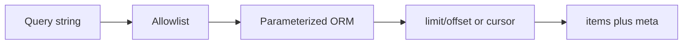

# Month 18 · Week 2 · Day 4
# Lab: Related CRUD, Search, Filter, Sort, Pagination (Rooms/Bookings Toy)

**Program:** Full-Stack Mastery · 18 months  
**Phase:** 7 — Capstone  
**Month index:** [../../README.md](../../README.md)  
**Week 2:** [1](day-01.md) · [2](day-02.md) · [3](day-03.md) · Day 4 (today) · [5](day-05.md) · [6](day-06.md) · [7](day-07.md)  
**Week rhythm today:** Lab (type-along + port)  
**Student state:** You can deny the wrong user and recite status codes. Today you implement **list mechanics** on a schema that is **not** your product, then **port the pattern** home.  
**Study time:** 3–4 focused hours (porting may need a second session — log it)

Labs: `~\fullstack-lab\month-18\week-02\day-04\`. Domain **imposed:** `rooms` and `bookings`. Do **not** implement this toy inside the capstone repo. Do **not** replace your capstone with a room scheduler unless Week 1 already chose that.

---

## How to use this textbook

1. Read the SQL/API patterns. Close the theory. Say what an allowlist is.  
2. Type the toy. Predict status codes in `PREDICT.txt` **before** pytest.  
3. Port **patterns** (allowlisted filters, page bounds, parent/child create) to **your** two related resources.  
4. Optional review links are for later rechecking.

---

## How to read this chapter

Project 8 requires CRUD on **multiple related** resources plus search, filtering, sorting, and pagination. Those are **mechanics**. They become dangerous when the query string turns into SQL.



**Wrong belief:** “I’ll pass `order_by=raw` into SQLAlchemy `text()`.”  
**Correct:** allowlist sort fields. Bind values. Never concatenate user strings into SQL (Month 13 injection class).

**Wrong belief:** “I’ll load the whole table and paginate in Python.”  
**Correct:** that works for ten rows and dies at ten thousand. `LIMIT`/`OFFSET` (or a cursor) belong in the database.

---

## Today's contract

By the end of this day you will be able to:

1. Create parent `Room` and child `Booking` with FK.  
2. List bookings with **filter**, **sort allowlist**, **pagination meta**.  
3. Search rooms by code/name with `ilike` **and** a bound pattern (escape `%` if you accept user wildcards — or **disallow** `%` from users).  
4. Return 422 for `page_size` above max; 404 for missing room on nested create.  
5. Port the same list envelope to **your** capstone pair of resources (even if search is incomplete, the envelope exists).

**Today's gate.** Closed-book:

> Filters are allowlisted. Pagination is in SQL. Parent must exist before child. I practiced on rooms/bookings and ported the pattern, not the nouns.

---

## Time box

| Block | Minutes | Work |
|---|---|---|
| A | 40 | Theory: envelopes, allowlists, offset vs cursor, overlap honesty |
| B | 70 | Type-along toy API + tests |
| C | 65 | Port pattern to capstone related pair |
| D | 15 | Git |
| E | 15 | Recall |

---

# Block A — Theory

## 1. Related CRUD

Parent exists independently. Child **must** reference parent. `POST /rooms/{room_id}/bookings` loads the room first. Missing parent → 404. You do not insert a booking with a random UUID and hope.

Delete policy: for the toy, **block** deleting a room that has future bookings (409), or cascade if you document it. Pick one. In the capstone, follow `DATABASE.md`.

## 2. List envelope

A stable JSON shape saves Week 3:

```json
{
  "items": [],
  "page": 1,
  "page_size": 20,
  "total": 0
}
```

`total` is a second query (`COUNT(*)`) or an approximation. For the capstone, exact count is fine at learning scale. Document if you skip `total` for speed later.

**Offset pagination:** `OFFSET (page-1)*page_size`. Weakness: a new insert shifts pages (drift). Accept for v1 if `API.md` said so.

**Cursor pagination:** `WHERE (start_at, id) < (:ts, :id) ORDER BY start_at DESC, id DESC LIMIT n`. Better for infinite scroll. Do not mix both in one endpoint.

## 3. Filter and search

Each filter is a **known** column and operator:

- `status=open` → equality on an enum  
- `from` / `to` → range on timestamps  
- `q` → search on **named** columns, `ilike` with `%` added **by you**, not by the user if you can avoid it

Max `q` length (e.g. 80). Empty `q` means no search clause.

## 4. Sort allowlist

```python
SORTS = {
    "start": RoomBooking.start_at.asc(),
    "-start": RoomBooking.start_at.desc(),
    "created": RoomBooking.created_at.desc(),
}
```

Unknown `sort` → 422. Default documented.

## 5. Indexes (toy)

Hot query: bookings for a room in a window, ordered by start. Index `(room_id, start_at)`. Do not index every filter checkbox.

## 6. Overlap (honesty)

True range overlap in Postgres can use exclusion constraints (`tstzrange`, `&&`). That is **excellent** and optional today if you have not practiced it. A **simplified** check: reject if any booking exists with `start_at < new_end AND end_at > new_start` for the same room, inside a transaction. Race: two requests can still collide without a constraint — **write that** in `TOY-LIMITS.md`. Unique `(room_id, start_at)` is **not** enough for durations. Capstone: if your domain has overlap, your `DATABASE.md` already said so — implement the honest version you promised.

## 7. What you will not do today

- You will not add a calendar frontend.  
- You will not copy toy tables into the capstone.  
- You will not implement GraphQL.

---

# Block B — Type-along toy

```powershell
cd ~\fullstack-lab
mkdir month-18\week-02\day-04 -Force
cd ~\fullstack-lab\month-18\week-02\day-04
uv init --name lab-rooms
uv add fastapi sqlalchemy alembic pydantic pydantic-settings psycopg
uv add --dev pytest httpx ruff
```

If Postgres in the lab is heavy, an **in-memory** SQLAlchemy SQLite toy is allowed **for this gym only**, with `TOY-LIMITS.md` noting SQLite will not teach `ilike` vs `like` the same way. Prefer Postgres if you already have a local server.

**Must implement:**

- `POST /rooms` `{code, capacity}` unique `code` → 409  
- `GET /rooms?q=&page=&page_size=&sort=`  
- `POST /rooms/{id}/bookings` `{start_at, end_at, notes}` 201; end after start else 422; overlap 409  
- `GET /rooms/{id}/bookings?from=&to=&page=&page_size=&sort=`  
- `GET /bookings/{id}`  
- Pagination max page_size **50** → 422 if over  
- Tests: empty list envelope; filter by time window; unknown sort 422; missing room 404; overlap 409

Auth is **optional** in the toy (keep Day 2 energy for the product). If you skip auth, write “toy is public; product is not.”

Illustrative pagination (pattern, not your schema):

```python
def page_args(page: int, page_size: int, max_size: int = 50) -> tuple[int, int]:
    if page < 1 or page_size < 1 or page_size > max_size:
        raise ValueError("page")
    offset = (page - 1) * page_size
    return offset, page_size
```

Raise HTTP 422 at the router when `ValueError`.

Write `PREDICT.txt` **before** running tests: overlap status, fat page_size status, unknown sort status.

```powershell
uv run pytest -q
```

---

# Block C — Port to the capstone

Open **your** two related resources from the pack (not rooms). Implement or complete:

1. Nested create or explicit `parent_id` as **API.md** said.  
2. List envelope matching Week 3’s plan.  
3. Allowlisted `sort` and at least two filters plus `q` if a story needs search.  
4. Tests: 422 page_size; 404 parent; one filter test; deny still green from Day 2.

Do not port room overlap code into a CRM. Port **allowlist + SQL limit + parent check**.

If the second resource is not in Alembic yet, add revision `0002` from **DATABASE.md**, not from the toy.

**Wrong belief:** “I’ll keep the toy as my capstone because it already works.”  
**Correct:** unless Week 1 chose it, you would be sitting the wrong exam.

---

# Block D — Git

```powershell
cd ~\fullstack-lab
git add month-18
git commit -m "Month 18 Day 4: rooms/bookings list mechanics gym."
```

Capstone: “Related list with allowlisted filters and pagination.”

---

# Block E — Recall

1. Why sort must be allowlisted.  
2. Offset drift.  
3. Why unique start time ≠ no overlap.  
4. What `total` costs.  
5. Why the toy is not the product.

## Office hours

**`sort='; drop`.** Repair: allowlist; you never execute the string as SQL.  
**page_size=100000.** Repair: max; 422.  
**Python pagination.** Repair: LIMIT.  
**ilike `%` from user matching everything.** Repair: strip or escape wildcards.

Windows: ISO timestamps in JSON use `Z` or offset; be consistent with UTC (Month 14).

---

## Definition of done

- [ ] PREDICT.txt then pytest on the toy  
- [ ] Toy: related CRUD + filter/sort/page  
- [ ] TOY-LIMITS.md overlap honesty  
- [ ] Capstone pair uses the same envelope/allowlist ideas  
- [ ] Commits in both places  

---

## Optional review links

- [SQLAlchemy 2.x querying](https://docs.sqlalchemy.org/en/20/orm/queryguide/index.html)  
- [Project 8 §8](../../../../full_stack_project_requirements_2026/project_08_independent_production_capstone.md)  
- [Month 10 — SQL](../../../month-10/README.md)  

---

## Tomorrow

**Background job + structured logs + request id**; pytest for rules and API deny paths. The job is a **port** (email or similar), not a hidden `asyncio.create_task` that dies with the request.
