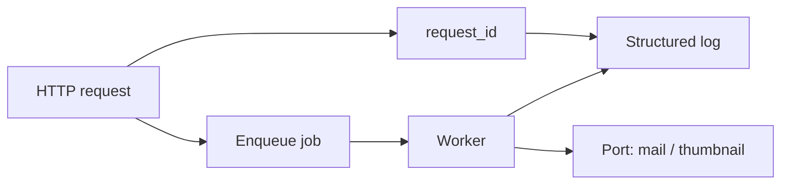

# Month 18 · Week 2 · Day 5
# Jobs, Structured Logs, Request Ids, and Tests for Rules

**Program:** Full-Stack Mastery · 18 months  
**Phase:** 7 — Capstone  
**Month index:** [../../README.md](../../README.md)  
**Week 2:** [1](day-01.md) · [2](day-02.md) · [3](day-03.md) · [4](day-04.md) · Day 5 (today) · [6](day-06.md) · [7](day-07.md)  
**Week rhythm today:** Tests/docs (observability + the net that proves jobs and denials)  
**Student state:** Related CRUD exists. Today a **background job** is real, logs are **structured**, every request can be **followed**, and pytest covers **rules** plus **deny paths**.  
**Study time:** 3–4 focused hours

Labs: `~\fullstack-lab\month-18\week-02\day-05\` for a **mail-job toy**. Product worker lives in **your capstone**. This textbook will **not** paste your workflow. Month 17 taught queues, retries, idempotency; you apply them.

---

## How to use this textbook

1. Enqueue from the request; **work** in a worker.  
2. Log **JSON lines** (or key=value) with `request_id`. Never log secrets.  
3. Tests use a **fake** mailer/queue at the port.  
4. Optional review links are for later rechecking.

---

## How to read this chapter

A request that must survive process restart belongs on a **queue**. `asyncio.create_task` is not that. Structured logs are how Week 4 incidents become **timelines** instead of folklore.



**Wrong belief:** “I’ll send SMTP inside the FastAPI handler; it is simpler.”  
**Correct:** SMTP hangs, retries, and fails. The handler should **record intent** (201 + job id or “queued”). The worker **does** the I/O.

**Wrong belief:** “I’ll `print()` the user object.”  
**Correct:** logs are data. Use fields: `event`, `request_id`, `user_id` (not email if you can avoid it), `resource_type`, `resource_id`, `duration_ms`. Never `password`, never `Authorization`, never full session id.

---

## Today's contract

By the end of this day you will be able to:

1. Enqueue **one** job your stories already named (confirmation email, thumbnail, overdue mark — **yours**).  
2. Worker: **retry** with backoff **idea**, **idempotency** where double-run would duplicate a side effect, **failure visible** (status column or dead-letter **concept**).  
3. Middleware: generate or accept `X-Request-ID`, echo it, attach to logs.  
4. Pytest: unit tests for a **rule**; API deny paths still green; job handler with FakeMailer does not send on 422.  
5. Document log field names in `OPERATIONS.md` stub.

**Today's gate.** Closed-book:

> I can follow one request_id from the handler into a job log. A 422 does not enqueue. A worker crash is visible. I do not log passwords.

---

## Time box

| Block | Minutes | Work |
|---|---|---|
| A | 45 | Theory: jobs, idempotency, logs, request ids |
| B | 50 | Lab toy: queue + fake port + request id |
| C | 80 | Capstone: one real job + logging + tests |
| D | 15 | Git |
| E | 15 | Recall |

---

# Block A — Theory

## 1. Anatomy of a job

- **Producer:** API persists “work to do” (table row or Redis list) **in the same transaction** as the domain change when possible (transactional outbox **concept**: if you commit the booking but fail to enqueue, you have a bug — prefer a `jobs` table committed with the booking).  
- **Worker:** loop or ARQ/RQ/Celery/Huey — **you pick what you already used in Month 17**. Same codebase, second process.  
- **Status:** `queued | running | succeeded | failed`.  
- **Retries:** count + backoff.  
- **Idempotency:** key = `email:booking:{id}` so a retry does not send five mails. Store “already sent” or use provider idempotency if any.

Dead-letter: conceptually, after N failures, mark `failed` and **alert** (log at error). You do not need Kafka.

## 2. Request id

On each request:

1. Read `X-Request-ID` if present **and** looks like a token (length bound); else generate UUID.  
2. Bind it in a contextvar.  
3. Return it as a response header.  
4. Every log line includes it.  
5. When enqueueing, copy `request_id` onto the job so the worker log **joins** the story.

This is Project 8 §13 “trace thinking” without requiring OpenTelemetry today (optional later).

Illustrative middleware shape:

```python
import uuid
from starlette.middleware.base import BaseHTTPMiddleware

class RequestIdMiddleware(BaseHTTPMiddleware):
    async def dispatch(self, request, call_next):
        rid = request.headers.get("x-request-id") or str(uuid.uuid4())
        request.state.request_id = rid
        response = await call_next(request)
        response.headers["X-Request-ID"] = rid
        return response
```

Type the idea. Bind logging extras yourself.

## 3. Structured logs

JSON one object per line is searchable. Keys stable. Levels: info for success, warning for 4xx you care about, error for 5xx and job failures.

Do **not** log request bodies on login.

## 4. Tests

| Claim | Layer |
|---|---|
| Predicate: who may cancel | unit |
| 403 foreign | API integration |
| 422 create does not enqueue | API + fake queue |
| Job handler calls mailer once for one idempotency key | unit/integration on worker function |

Use `dependency_overrides` for the mailer port (Month 14 FakeMailer). Clear overrides.

## 5. Redis

Justify: queue backend, rate limit, cache. If your queue is a **Postgres table**, Redis may wait. Project 8 says Redis **when justified**. Honesty beats a unused Redis container.

## 6. What you will not do today

- You will not build a full observability SaaS.  
- You will not log stack traces with secrets.  
- You will not write a payload to “test XSS” against a live host.

---

# Block B — Lab toy

```powershell
cd ~\fullstack-lab
mkdir month-18\week-02\day-05 -Force
cd ~\fullstack-lab\month-18\week-02\day-05
uv init --name lab-jobs
uv add fastapi pydantic
uv add --dev pytest httpx
```

**Imposed domain:** `POST /notices` `{title}` queues an email. In-memory list is the queue.

Must:

- Middleware sets `X-Request-ID`  
- 422 empty title → `FakeMailer.sent == []` and queue empty  
- 201 → one job with same request id field  
- `process_one(job, mailer)` is idempotent: second call does not append a second mail if `job.id` already in `mailer.sent_ids`  
- `test_logs_include_request_id` — capture logs with `caplog` or a list handler

```powershell
uv run pytest -q
```

Write `LOG-FIELDS.md`: the keys you used.

---

# Block C — Capstone

1. Choose the **one** job from stories (email/notification is the usual).  
2. Jobs table or existing queue library.  
3. Worker command in README: `uv run python -m yourpkg.worker`  
4. Structured logging configured.  
5. Request id middleware.  
6. Tests listed in Block A.  
7. Stub `docs/OPERATIONS.md`: how to grep by request id (even locally).

If email is not ready, a job that **writes a file** to a temp dir is a valid **port** — still a job, still idempotent, still logged. Then Day 6 swaps the adapter.

**Wrong belief:** “The test calls the worker inline, so I do not need a worker process.”  
**Correct:** calling `process_one` in pytest is good. You still must **know how to start** the worker in Compose later.

---

# Block D — Git

```powershell
cd ~\fullstack-lab
git add month-18
git commit -m "Month 18 Day 5: job toy with request id and idempotent mail."
```

Capstone: “Background job, structured logs, request id, deny and 422-no-enqueue tests.”

---

# Block E — Recall

1. Why create_task is not a queue.  
2. What idempotency prevents for email.  
3. Three fields a log line should have.  
4. What must not be logged.  
5. How a request_id joins HTTP and worker.

## Office hours

**Job in the request with try/except pass.** Repair: queue + visible failure.  
**Logs are uvicorn access only.** Repair: application events.  
**Idempotency forgotten; retries spam.** Repair: key.  
**caplog test asserts a password.** That is a bug.

Windows: worker is a second PowerShell window. Ctrl+C stops it. Do not start it as a hidden service today.

---

## Definition of done

- [ ] Lab pytest green (422 no mail, idempotent process, request id)  
- [ ] Capstone job + worker instructions  
- [ ] Structured logs + request id header  
- [ ] Deny tests still green  
- [ ] OPERATIONS stub with grep idea  
- [ ] Commits  

---

## Optional review links

- [Python logging cookbook](https://docs.python.org/3/howto/logging.html)  
- [Month 17 README](../../../month-17/README.md) — jobs and simplest architecture  
- [Project 8 §§12–13](../../../../full_stack_project_requirements_2026/project_08_independent_production_capstone.md)  

---

## Tomorrow

**Independent checklist:** remaining backend capabilities from Project 8 — file/object storage feature, email port if still fake, audit/history for one important action. No frontend required.
