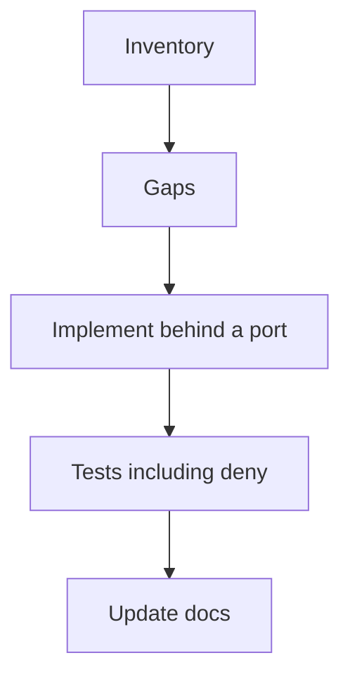

# Month 18 · Week 2 · Day 6
# Independent: Remaining Backend Capabilities (Checklist Day)

**Program:** Full-Stack Mastery · 18 months  
**Phase:** 7 — Capstone  
**Month index:** [../../README.md](../../README.md)  
**Week 2:** [1](day-01.md) · [2](day-02.md) · [3](day-03.md) · [4](day-04.md) · [5](day-05.md) · Day 6 (today) · [7](day-07.md)  
**Week rhythm today:** Independent implementation  
**Student state:** Core CRUD, authz, one job, logs exist. Today you **close the Project 8 backend capability list** you have not already honestly finished.  
**Study time:** 3–4 focused hours (this is the day that often needs a second session — say so in your log)

This textbook will **not** implement your storage, mail, or audit modules. It will give a **checklist**, **quality bars**, and **forbidden shortcuts**.

Work in **your capstone repo**. Notes: `~\fullstack-lab\month-18\week-02\day-06\`.

---

## How to use this textbook

1. Inventory first. Do not start a new feature you already have.  
2. Each remaining capability needs a **port**, **tests**, and a **line in the pack**.  
3. Honest “adapter is local disk” beats a fake “we use S3” with no code.  
4. Optional review links are for later rechecking.

---

## How to read this chapter

Project 8 §8 is a **definition of done**, not a buffet you sample.



**Wrong belief:** “I’ll skip files and email because the UI is next week.”  
**Correct:** Week 3 needs endpoints. Week 4 needs something to operate. Backend gaps become theater.

**Wrong belief:** “Audit means I log to stdout.”  
**Correct:** audit/history for **one important action** is a **queryable** record: who, what, when, maybe before/after. Logs are complementary.

---

## Today's contract

By the end of this day you will be able to:

1. Show a filled checklist against Project 8 §8 **backend-facing** items.  
2. Have **one** object-storage feature (upload or download path) behind a port.  
3. Have **one** email/notification flow that is more than a comment (fake in tests, real adapter configurable).  
4. Have **audit/history** for one important action.  
5. Keep rate limiting on login (from Day 2) documented and tested at least once.  
6. List remaining holes for Day 7 — not hide them.

**Today's gate.** Closed-book:

> I can point at code and tests for files, notifications, a job, and audit — or I can point at a dated gap and I will not mark Week 2 done.

---

## Time box

| Block | Minutes | Work |
|---|---|---|
| A | 25 | Inventory checklist |
| B | 40 | Design ports (storage, mail) on paper |
| C | 110 | Implement remaining gaps + tests |
| D | 20 | Docs + self-review |
| E | 15 | Recall + commit |

---

# Block A — Inventory

Copy this table into `~\fullstack-lab\month-18\week-02\day-06\CHECKLIST.md` and into capstone `docs/BACKEND-CHECKLIST.md`. Fill **paths and test names**, not essays.

| Capability | In pack story | Code path | Test name | Status (done / partial / missing) |
|---|---|---|---|---|
| Register / login / logout | | | | |
| Role/resource authz + deny | | | | |
| CRUD resource A | | | | |
| CRUD related resource B | | | | |
| Search | | | | |
| Filter | | | | |
| Sort | | | | |
| Pagination | | | | |
| File / object storage | | | | |
| Email / notification | | | | |
| Background job | | | | |
| Audit / history | | | | |
| Rate limit sensitive | | | | |
| Structured logs + request id | | | | |
| Alembic | | | | |
| Health | | | | |

Optional WebSockets: **blank unless the pack justified them**.

If eight rows are “partial,” you will not finish all today. **Prioritize:** storage, email port, audit — those are the usual holes.

---

# Block B — Ports (quality bar)

## Object storage

A **port** `Storage.save(key, bytes, content_type) -> url_or_key` and `Storage.open(key)`.

Adapters:

- **Local disk** under a configured directory (gitignored) — valid for local/dev.  
- **S3-compatible** (AWS S3 or MinIO) — Week 4 production should use the real one **or** you document the remaining gap.

Rules (defense):

- Max size from NFR.  
- Allowlist content types.  
- Do not serve user files from the API process as `/static/uploads/../../../etc`. Prefer **redirect to signed URL** or a controlled download endpoint that **checks authz**.  
- Store **keys**, not client-chosen absolute paths.  
- Virus scanning is out of scope; **do not** claim it.

Tests: oversize 422; forbidden type 422; User B cannot download User A’s object.

## Email / notification

Port `Notifier.send(to, template, context)`. Fake records `.sent`. SMTP/API adapter reads env. 422 must not send (you may already have this).

If the product “notification” is in-app only, you still need **one** outbound or durable notification **flow**. Project 8 lists email/notification — an in-app table plus a job that would email is acceptable if the pack said so. A `TODO: sendgrid` is not.

## Audit / history

Pick **one** important action from stories: status change, permission grant, delete, retire.

Table sketch **shape** (your names): `id`, `actor_id`, `action`, `entity_type`, `entity_id`, `at`, `payload` (small JSON of after-state). Append-only from the app’s point of view. List endpoint **authz**: only people who may see the entity, or only operators — **write it**.

Test: performing the action inserts a row; User B cannot read A’s audit if that is the rule.

**Wrong belief:** “I’ll use SQLAlchemy events on every model.”  
**Correct:** one **explicit** write in the service that performs the important action is clearer for v1.

---

# Block C — Independent build

Work the missing rows. Do not beautify working pagination while audit is empty.

Rules:

- New tables → Alembic revision, not `create_all`.  
- Tests in the same commit if practical.  
- No secrets.  
- No copying Project 7 upload code blindly — **read** it if you own it, then **retype** against **this** pack’s authz.

If storage requires AWS credentials you do not have, implement the **port + local adapter + tests**, and write `GAPS.md`: “staging S3 in Week 4.” That is an honest partial.

---

# Block D — Docs

Update `API.md` with upload and audit routes. Update threat model: file upload risks (size, type, authz). Update `TESTING.md` with new test names.

Self-review: run

```powershell
uv run ruff check
uv run pytest -q --tb=short
```

from the capstone API root (Windows: that directory). Paste nothing into the textbook folder.

Write `OWED.md` for Day 7: any false checklist row.

---

# Block E — Recall

1. Why files need a port.  
2. Why audit is not only stdout.  
3. One upload deny test.  
4. When Redis is still optional.  
5. What WebSockets require.

```powershell
cd ~\fullstack-lab
git add month-18
git commit -m "Month 18 Day 6: backend capability checklist."
```

Capstone: meaningful commit(s) per capability if large; otherwise one “files, mail port, audit.”

---

## Office hours

**Base64 in JSON as “files.”** Acceptable only if the pack’s NFR size is tiny and you still authz; still not object storage. Prefer bytes to storage.  
**Audit of login passwords.** Never.  
**Public bucket “to make React easier.”** Repair: private + signed or authed download.  
**Celery + Redis + Kafka + S3 on a missing deny test.** Repair: deny test first.

Windows: local storage path `C:\` vs Docker `/data` — configure via env, never hardcode.

---

## Definition of done

- [ ] Checklist filled with paths  
- [ ] Storage feature or honest Week 4 gap with local adapter  
- [ ] Notifier port + test  
- [ ] Audit for one action + test  
- [ ] pytest green  
- [ ] API.md and threat model updated  
- [ ] OWED.md honest  

---

## Optional review links

- [Project 8 §8–9, §12](../../../../full_stack_project_requirements_2026/project_08_independent_production_capstone.md)  
- [boto3 S3 docs](https://boto3.amazonaws.com/v1/documentation/api/latest/guide/s3.html) — after the port exists  

---

## Tomorrow

**Week review:** backend demo **evidence** — tests, logs, deny cases. Repair list. Frontend waits until the backend review is written.
