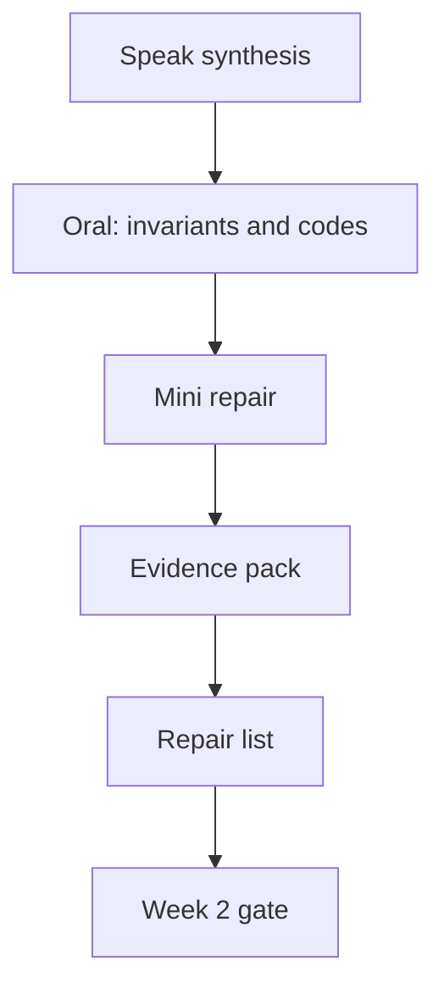

# Month 18 · Week 2 · Day 7
# Week Review — Backend Evidence, Deny Cases, Repair List

**Program:** Full-Stack Mastery · 18 months  
**Phase:** 7 — Capstone  
**Month index:** [../../README.md](../../README.md)  
**Week 2:** [1](day-01.md) · [2](day-02.md) · [3](day-03.md) · [4](day-04.md) · [5](day-05.md) · [6](day-06.md) · Day 7 (today)  
**Week rhythm today:** Review, repair, plan Week 3  
**Student state:** Backend capabilities should exist. Today you **prove** them with evidence a stranger could replay, then repair. You do **not** start the Vite app until the review exists.  
**Study time:** 3–4 focused hours

Work in `~\fullstack-lab\month-18\week-02\day-07\` for evidence notes. Product stays in **your capstone**. Days 1–6 closed during the oral and mini except this synthesis.

---

## How to read this chapter

This is a **closed-book teaching day** plus a **demo rehearsal**. Evidence is **commands and outputs**, not “it worked on my machine.”



**Wrong belief:** “Green pytest means I can demo.”  
**Correct:** you must **show** a deny, a log line with request id, a job status, and a migration history.

---

## Week synthesis (the lesson, in this book)

Week 2 implements the **pack**, not a tutorial. Blank repo, uv, Ruff, pytest, settings from env, **no secrets in git**, Alembic from **your** ER slice.

**Authn.** Slow password hashes. Session or tokens **as the pack said**. Logout/expiry/revoke. Rate limit on login. Never log passwords.

**Authz.** Load then check owner/role/tenant. Tests with **two users**. 401 vs 403. UI is not the boundary.

**HTTP catalog.** 409 conflict, 422 validation, 404 missing/hidden, 429 rate limit. Spec first (Day 3).

**Related CRUD + lists.** Allowlisted filters/sorts. Pagination in SQL. Parent exists before child. Patterns practiced on **rooms/bookings** and **ported**.

**Jobs.** Queue/worker, retries, idempotency, visible failure. Not `create_task` as the durability story.

**Logs.** Structured, `request_id` on HTTP and jobs. Trace thinking.

**Files, mail port, audit.** Behind ports. Authz on download. Audit queryable for one important action.

**Wrong belief:** “Copy Project 7.”  
**Correct:** copy skills. The exam is **this** problem.

---

## Today's contract

Teach Week 2 aloud, run an evidence script, write a repair list, mark the Week 2 gate honestly. Frontend is Week 3.

**Today's gate:** deny test evidence, logs with request id, job evidence, migrations, checklist without silent skips.

---

## Time box

| Block | Minutes | Work |
|---|---|---|
| 0 | 20 | Speak synthesis |
| 1 | 30 | Closed-book `backend-oral.md` |
| 2 | 35 | Mini: fix a broken deny (lab) |
| 3 | 50 | Evidence pack on **your** API |
| 4 | 40 | Repair capstone |
| 5 | 20 | Week 3 plan |
| 6 | 15 | Self-mark |

---

# Block 0 — Speak

Hashes; 401/403; allowlists; jobs; request id; audit vs log; rooms toy was a gym.

---

# Block 1 — Closed-book (30 min)

`backend-oral.md` (25–40 lines):

1. How identity is attached on request (cookie or bearer — **yours**).  
2. Five invariants.  
3. Status for foreign GET, duplicate, empty body.  
4. How you prevent double email on job retry.  
5. Where files live (adapter).  
6. The exact deny test name.

If blank, re-read this synthesis. Do not open Day 2.

---

# Block 2 — Mini (35 min)

```powershell
cd ~\fullstack-lab
mkdir month-18\week-02\day-07\mini -Force
cd ~\fullstack-lab\month-18\week-02\day-07\mini
uv init --name lab-deny-repair
uv add fastapi pydantic
uv add --dev pytest httpx
```

**Broken spec:** `GET /slips/{id}` returns any slip. Slips have `owner_id`. Lab identity: dependency that reads `X-User-Id` (**lab only**).

You must:

- Add check: if actor != owner → 403  
- Tests: owner 200; stranger 403; missing 404  
- Do not paste capstone code

```powershell
uv run pytest -q
```

Write `mini-note.md`: why the list filter would not have been enough if you only had GET-by-id.

---

# Block 3 — Evidence pack (your API)

Create `EVIDENCE.md` in the lab **and** `docs/WEEK2-EVIDENCE.md` in the capstone. Fill by **running** commands. Redact secrets.

Required attachments (paste **snippets**, not secrets):

1. `uv run pytest -q` last lines (counts).  
2. **Deny** test name and a `--tb=short` passing assertion description.  
3. One structured log line with `request_id` (from a local request).  
4. Proof the response echoed `X-Request-ID` (`curl.exe -i` or TestClient print).  
5. Job: a row or log showing `succeeded` or `failed` (not only “code exists”).  
6. `uv run alembic current` (or equivalent).  
7. `git grep` for `SECRET_KEY` showing only env usage, not a production value.  
8. Checklist from Day 6 with statuses — **no silent done**.

If pytest is red, the evidence is the failure. Do not screenshot a old green run.

Windows:

```powershell
curl.exe -sN -D - http://127.0.0.1:8000/health
```

Start uvicorn only if needed; TestClient is enough for many items.

---

# Block 4 — Repair

From evidence holes: write `REPAIR.md` with ordered tasks. Fix **at least** the hole that would fail the Month 18 gate (usually deny or missing job). If everything is truly done, write three **polish** items (index, log field consistency, 429 test).

Do not start React in this block.

---

# Block 5 — Week 3 plan

`week3-plan.md`: Vite app location; `VITE_API_BASE`; routes from wireframes; first page is login + list. Query v5. Router from `react-router`. No Redux unless the pack already justified it.

---

# Block 6 — Self-mark

| # | Claim | Evidence | Pass? |
|---|---|---|---|
| 1 | Blank-repo tooling, env config, Alembic | README + revision | |
| 2 | Hash + session/token as pack | tests | |
| 3 | Deny wrong user | EVIDENCE deny snippet | |
| 4 | Related CRUD + list mechanics | tests | |
| 5 | Job + logs + request id | EVIDENCE | |
| 6 | Files, mail port, audit (or dated gap) | checklist | |
| 7 | No secrets in git | git grep | |
| 8 | Repair list exists | REPAIR.md | |

If 3 is false, **do not start Week 3**.

```powershell
cd ~\fullstack-lab
git add month-18
git commit -m "Month 18 Week 2 review evidence notes."
```

---

## Worked mini (after you write)

Stranger GET must be 403 (or 404 if you **changed the mini spec in writing** — do not). Owner 200. Missing 404. `X-User-Id` remains a lab crutch.

If you “fixed” deny by deleting GET, you cheated.

---

## Office hours

**Evidence is a selfie of the IDE.** Repair: commands.  
**Deny test uses admin for both users.** Repair: two roles/users.  
**Logs in color ANSI only.** Repair: structured field.  
**Starting Vite because the calendar says Week 3.** Only if the table is honest.

---

## Definition of done

- [ ] backend-oral.md  
- [ ] Mini pytest green  
- [ ] EVIDENCE.md filled from this machine  
- [ ] REPAIR.md  
- [ ] Self-mark honest  
- [ ] Week 3 not started on a false deny row  

---

## Optional review links

- [Month 18 README](../../README.md)  
- [Project 8 §8, §21](../../../../full_stack_project_requirements_2026/project_08_independent_production_capstone.md)  

---

## Next week

**Frontend:** Vite, React, TypeScript, Router from `react-router`, TanStack Query v5, app shell, `VITE_API_BASE`, typed client. The API you just evidenced is the backend. This textbook will not paste your screens.
