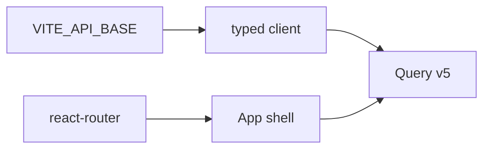

# Month 18 · Week 3 · Day 1
# Vite, React, TypeScript, Router, Query v5, App Shell, Typed Client

**Program:** Full-Stack Mastery · 18 months  
**Phase:** 7 — Capstone  
**Month index:** [../../README.md](../../README.md)  
**Week 3:** Day 1 (today) · [2](day-02.md) · [3](day-03.md) · [4](day-04.md) · [5](day-05.md) · [6](day-06.md) · [7](day-07.md)  
**Week rhythm today:** Learn + type-along (shell, not every screen)  
**Student state:** Week 2 gate is true: deny tests and backend evidence exist. Today you create the **frontend** from a blank Vite app and connect it **without** inventing a second API.  
**Study time:** 3–4 focused hours

Labs: `~\fullstack-lab\month-18\week-03\day-01\` for a **tiny** typed-client drill. Product UI lives in **your capstone** (monorepo `apps/web` or a sibling repo). This textbook will **not** paste your pages. Router comes from **`react-router`**. TanStack **Query v5**. Env: **`VITE_API_BASE`**.

---

## How to use this textbook

1. Scaffold with the official Vite React TypeScript template. Type your shell.  
2. Put the API origin in env, not in scattered fetch URLs.  
3. Query is for **server state**. Do not install Redux today.  
4. Optional review links are for later rechecking.

---

## How to read this chapter

The browser is an untrusted client of **your** API. The shell’s job is: **route**, **auth-aware layout**, **one client** that understands `VITE_API_BASE` and credentials.



**Wrong belief:** “I’ll hardcode `http://localhost:8000` in ten files.”  
**Correct:** `import.meta.env.VITE_API_BASE`. Staging and production will differ. Vite **only** exposes variables prefixed with `VITE_`.

**Wrong belief:** “I’ll use `react-router-dom` as the mental package forever.”  
**Correct:** this program’s capstone uses the **`react-router`** package for `BrowserRouter`, `Routes`, `Route`, `Link`, `useSearchParams` (v7-era naming). If a stale note says `react-router-dom`, you still import from **`react-router`**. Do not mix two routers.

---

## Today's contract

By the end of this day you will be able to:

1. `npm create vite@latest` (or `pnpm`/`npm`) React + TypeScript in the capstone web app.  
2. Install `react-router`, `@tanstack/react-query` (v5), and keep RHF/Zod for Day 2+.  
3. Provide `QueryClientProvider` and a router tree: at least `/login` and `/` (protected shell).  
4. Read `VITE_API_BASE`; fail visibly in dev if missing.  
5. Typed `apiGet`/`apiSend` helpers that throw a **structured** error for 401/403/404/422.  
6. One Query hook that hits **your** `GET /health` or `GET /me` (pack names).

**Today's gate.** Closed-book:

> The SPA does not guess the API host. Query wraps the server. The router has a shell. I did not copy Project 7’s frontend folder.

---

## Time box

| Block | Minutes | Work |
|---|---|---|
| A | 40 | Theory: env, cookies vs CORS, Query defaults, typed errors |
| B | 45 | Lab: mini Vite or a node script client — typed errors |
| C | 90 | Independent: capstone web scaffold + shell + /me |
| D | 15 | Git |
| E | 15 | Recall |

---

# Block A — Theory

## 1. Where the web app lives

Options: directory `web/` next to `src/` API; or `apps/web`. README must say `npm run dev` **and** how it talks to the API. CORS: if Vite is `:5173` and API `:8000`, you need CORS **or** a Vite proxy. Pick one **in the pack** (Day 5 architecture should have hinted). Same-site proxy simplifies cookies (SameSite=Lax). Cross-origin cookies need `credentials: 'include'` **and** explicit CORS origins — Month 13.

**Wrong belief:** “CORS is authentication.”  
**Correct:** CORS is a browser rule. The API still authenticates.

## 2. `VITE_API_BASE`

`.env.example`:

```text
VITE_API_BASE=http://127.0.0.1:8000
```

Code:

```ts
const base = import.meta.env.VITE_API_BASE;
if (!base) {
  throw new Error("VITE_API_BASE is not set");
}
```

No trailing-slash chaos: normalize once. Do not commit a production URL with secrets (there should be no secrets in Vite env except **public** ones — `VITE_` is visible to anyone who loads the JS).

## 3. Typed client

You do not need OpenAPI codegen today. You need:

- `api<T>(path, init): Promise<T>`  
- Parse JSON when present  
- On `!response.ok`, throw `ApiError` with `status` and `body`  
- For 422, keep `detail` array if FastAPI shaped it  

Callers switch on `error.status === 403` in Day 4. If you `catch` and `return []`, you **swallow 403** — forbidden.

Cookies: `credentials: 'include'` if session cookies. Bearer: attach from memory **not** localStorage unless the pack justified it.

## 4. Query v5

`QueryClient` with sensible defaults: `retry` **not** on 401/403 (write a retry function). `staleTime` modest. Query keys: `['me']`, `['items', filters]` — **your** nouns. Filters in the key **and** in the URL (Day 2).

`useQuery({ queryKey, queryFn })`. Mutations `useMutation` + `invalidateQueries`.

## 5. Router and shell

```tsx
// Illustrative shape — your component names
<BrowserRouter>
  <Routes>
    <Route path="/login" element={<LoginPage />} />
    <Route element={<AppShell />}>
      <Route path="/" element={<HomePage />} />
    </Route>
  </Routes>
</BrowserRouter>
```

`AppShell`: nav landmark, outlet, logout control. Unauthenticated visit to `/` → redirect to login. Do not hide this only with CSS.

## 6. TypeScript

API types live next to the client: `Me`, `Page<T>`. They must match `API.md`. If they drift, Week 3 Day 7 will hurt.

## 7. What you will not do today

- You will not build every CRUD screen (Day 2).  
- You will not install Redux Toolkit “for later.”  
- You will not fetch in `useEffect` as the primary server-state tool.

---

# Block B — Lab

```powershell
cd ~\fullstack-lab
mkdir month-18\week-03\day-01 -Force
cd ~\fullstack-lab\month-18\week-03\day-01
```

You may skip a full Vite scaffold in the lab if time is tight. Write `apiError.ts` and `apiError.test.ts` with **Vitest** or a few Node assert tests:

- `parseApiError(status, body)` maps 403 → `kind: 'forbidden'`  
- 422 → `kind: 'validation'`  
- 500 → `kind: 'server'`

```powershell
npm init -y
npm install -D vitest typescript
npx vitest run
```

Write `ENV.md`: why `VITE_` leaks to the client.

---

# Block C — Capstone web

Scaffold. Install:

```powershell
npm install react-router @tanstack/react-query
```

Pin Query **v5** (not v4 `useQuery` API differences you already learned in Month 7 — check `QueryClient` defaults).

Create:

- `src/api/client.ts`  
- `src/api/types.ts`  
- `src/app/router.tsx`  
- `src/app/shell.tsx`  
- `src/main.tsx` providers  
- `.env.example` with `VITE_API_BASE`  
- Login page **stub** (form tomorrow) that can still call `/health` and show the string `ok`

CORS/proxy: make **one** request succeed from the browser. If it fails, **read** the console and the API CORS config. Do not disable the browser’s security.

**Wrong belief:** “I’ll copy the Project 4 Vite app.”  
**Correct:** new app, **your** routes from wireframes.

---

# Block D — Git

```powershell
cd ~\fullstack-lab
git add month-18
git commit -m "Month 18 Week 3 Day 1: ApiError mapping tests."
```

Capstone web: “Scaffold Vite, Query, router, VITE_API_BASE client.”

Do not commit `node_modules`. Do not commit `.env`.

---

# Block E — Recall

1. Why Vite env must be prefixed `VITE_`.  
2. Why 403 must not become an empty list.  
3. Query key includes filters.  
4. Package name for Router in this month.  
5. CORS vs authn.

## Office hours

**`axios` plus `fetch` plus Query all mixed.** Pick **one** HTTP wrapper.  
**Retry 5 times on 401.** Repair: retry function.  
**Router v5 and v7 APIs mixed from a random gist.** Repair: docs for **your** installed version.  
**API base includes a secret token.** Tokens in Vite are public. Repair: cookies or a BFF — you do not have a BFF unless designed.

Windows: `npm` scripts in PowerShell; if `vite` is not recognized, `npx vite`. Execution policy is not an excuse to skip the app.

---

## Definition of done

- [ ] Lab error mapping tests  
- [ ] Capstone Vite TS app runs  
- [ ] `VITE_API_BASE` used  
- [ ] Query + `react-router` shell  
- [ ] One authenticated or health request works  
- [ ] `.env` not committed  

---

## Optional review links

- [Vite env](https://vitejs.dev/guide/env-and-mode.html)  
- [TanStack Query v5](https://tanstack.com/query/latest/docs/framework/react/overview)  
- [React Router](https://reactrouter.com/)  
- [Month 7 README](../../../month-7/README.md) — Query/RHF you already passed  

---

## Tomorrow

**List/detail/create/edit**, **URL as source of filter state**, loading/empty/error. Wireframes are the spec.
