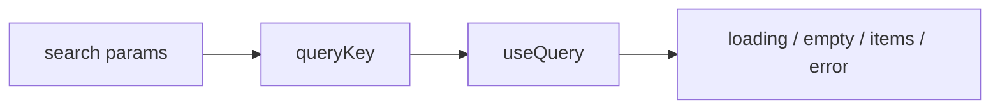

# Month 18 · Week 3 · Day 2
# List, Detail, Create, Edit: URL Filters, Loading, Empty, Error

**Program:** Full-Stack Mastery · 18 months  
**Phase:** 7 — Capstone  
**Month index:** [../../README.md](../../README.md)  
**Week 3:** [1](day-01.md) · Day 2 (today) · [3](day-03.md) · [4](day-04.md) · [5](day-05.md) · [6](day-06.md) · [7](day-07.md)  
**Week rhythm today:** Exercises + screens against **your** API  
**Student state:** The shell talks to `VITE_API_BASE`. Today the **wireframe routes** become pages: list, detail, create, edit — with **filters in the URL** and honest **loading / empty / error**.  
**Study time:** 3–4 focused hours

Labs: `~\fullstack-lab\month-18\week-03\day-02\` for URL-state drills. Product pages in **your capstone**. This textbook will **not** paste your forms. Use React Hook Form + Zod when you touch forms; Query for lists.

---

## How to use this textbook

1. Implement the **critical list** first.  
2. Put `q`, `status`, `sort`, `page` in `useSearchParams`.  
3. Three UI states are not optional.  
4. Optional review links are for later rechecking.

---

## How to read this chapter

The URL is the **shareable** state of a list. React state that dies on refresh is a bug for filters.



**Wrong belief:** “I’ll keep filters in `useState` and sync later.”  
**Correct:** the URL is the source. `useState` is a trap for page 7 you cannot send to a teammate.

**Wrong belief:** “Empty and error can be the same red banner.”  
**Correct:** empty is success with zero rows (“No open tickets”). Error is failure (`role="alert"`). Loading is in progress (not an alert). Month 14.

---

## Today's contract

By the end of this day you will be able to:

1. List page bound to query params; changing a filter **writes the URL** and Query refetches.  
2. Detail page from route param; 404 copy when API 404.  
3. Create + edit with RHF+Zod; 422 field errors mapped.  
4. Loading, empty, error on the list.  
5. After create, invalidate list and **navigate** to detail or list (pack/wireframe).

**Today's gate.** Closed-book:

> I can paste a filtered URL and see the same list. Empty is not an error. Create uses the API I already tested.

---

## Time box

| Block | Minutes | Work |
|---|---|---|
| A | 35 | Theory: search params, query keys, form vs server |
| B | 40 | Exercises: parse/serialize filters (lab, no UI kit) |
| C | 100 | Independent: four screens on **your** nouns |
| D | 15 | Git |
| E | 15 | Recall |

---

# Block A — Theory

## 1. Search params as a tiny language

Allowlist keys the API already allows. Parse `page` as int ≥ 1. Unknown keys: ignore or  strip. When the user changes status, **reset page to 1**.

```ts
// Illustrative — your keys
function readFilters(sp: URLSearchParams) {
  const page = Math.max(1, Number(sp.get("page") || 1) || 1);
  const q = sp.get("q") ?? "";
  return { page, q };
}
```

`queryKey: ['loans', readFilters(sp)]` — **your** resource name.

## 2. List rendering

| Query state | UI |
|---|---|
| `isPending` | skeleton or “Loading…” in a live region |
| `isError` | alert with retry |
| `data.items.length === 0` | empty heading/copy from wireframe |
| items | list; each row a **link** to detail |

Do not use array index as `key` if ids exist.

## 3. Detail

`useQuery(['item', id], ...)`. Title from data. If 403, do not show another user’s fields — Day 4 deepens; today at least **do not** render the payload if the client threw.

## 4. Create / edit

RHF `handleSubmit` → `useMutation` → `apiSend`. Zod schema **mirrors** the API’s required fields, not a random UI kit. On 422, map `detail[].loc` to `setError`. On 409, a form-level message.

Edit: load with Query, `reset()` the form when data arrives. Do not fight Query by storing the entity in Redux.

## 5. Pagination controls

Links or buttons that set `page` in the URL. Do not invent a third state.

## 6. What you will not do today

- You will not pixel-polish.  
- You will not add infinite scroll unless the pack chose cursor pagination.  
- You will not swallow errors in `queryFn` by returning a fake empty page.

---

# Block B — Exercises

```powershell
cd ~\fullstack-lab
mkdir month-18\week-03\day-02 -Force
cd ~\fullstack-lab\month-18\week-03\day-02
```

Create `filters.ts` + tests (Vitest):

1. `parse` : `?page=0` → page 1  
2. `parse` : `page_size=999` → clamp to max **or** keep and let API 422 — **pick one**, test it  
3. `serialize` round-trip `{q:'a', page:2}`  
4. Changing `q` resets page (a function `withQ(prev, q)` )

Write `STATES.md`: one sentence each for loading, empty, error using **your** product nouns (no code dump).

---

# Block C — Independent

Build screens from **wireframes**. Minimum today:

- Login **working** against real register/login if not done (it was stubbed).  
- List with filters in URL.  
- Detail.  
- Create.  
- Edit **or** a written reason that v1 is create+status-change only.

Use accessible names that Week 5 Playwright will need: buttons named from the wireframe (“Create …”).

If the API is down, that is an **error state**, not a reason to mock in the page. MSW is Day 5 for tests, not for hiding a stopped uvicorn.

**Wrong belief:** “I’ll `window.confirm` for every click.”  
**Correct:** confirm destructive actions only. Filters should be cheap.

## Login is part of the journey

If Day 1 left login as a stub, today it must **work**. Register if your pack allows self-signup; otherwise document the seed user. After login, `['me']` should populate the shell. A hard-coded fake name in the nav is not authentication.

**422 mapping (shape):** FastAPI often returns `{ "detail": [ { "loc": ["body", "title"], "msg": "..." } ] }`. Your form code walks `detail` and `setError("title", { message })`. If you only `alert(JSON.stringify(error))`, you have not finished create.

**Wrong belief:** “The list can ignore 403 because members never see the URL.”  
**Correct:** they will paste ids. Day 4 is the full 403 UI; today, **throw** in `queryFn` so you do not paint an empty success.

## Office hours

**`navigate` after create without invalidation.** The list looks stale. Repair: `invalidateQueries`.  
**Filter in localStorage.** Repair: URL.  
**Spinner forever: key missing filter.** Repair: Day 2 theory.  
**Edit form overwrites user input when refetch.** Repair: do not `reset` on every render; reset when `id` changes.  
**Page 2 of filters, then change sort, still page 2 of a two-page set.** Repair: reset page.  
**Create form uses `fetch` beside Query.** Repair: `useMutation` so invalidation is obvious.

Windows: Vite HMR is enough; if env changes, restart `npm run dev`. If the list is empty but curl shows rows, you are probably not sending cookies (`credentials: 'include'`) or the proxy/CORS pair is wrong — fix the client, do not mock the list.

---

# Block D — Git

```powershell
cd ~\fullstack-lab
git add month-18
git commit -m "Month 18 Day 2: filter parse tests."
```

Capstone: “List/detail/create with URL filter state.”

---

# Block E — Recall

1. Why page resets when filters change.  
2. Empty vs error.  
3. Why queryKey includes filters.  
4. How 422 becomes field errors.  
5. Why this file has no clinic form.

## Office hours

**`navigate` after create without invalidation.** The list looks stale. Repair: `invalidateQueries`.  
**Filter in localStorage.** Repair: URL.  
**Spinner forever: key missing filter.** Repair: Day 2 theory.  
**Edit form overwrites user input when refetch.** Repair: do not `reset` on every render; reset when `id` changes.

Windows: Vite HMR is enough; if env changes, restart `npm run dev`.

---

## Definition of done

- [ ] Filter parse tests  
- [ ] List URL round-trip works in the browser  
- [ ] Loading/empty/error distinguishable  
- [ ] Create succeeds against **your** API  
- [ ] Detail route works  
- [ ] Commit  

---

## Optional review links

- [TanStack Query: query keys](https://tanstack.com/query/latest/docs/framework/react/guides/query-keys)  
- [React Router: search params](https://reactrouter.com/en/main/hooks/use-search-params)  
- [React Hook Form](https://react-hook-form.com/)  

---

## Tomorrow

**Memory:** state architecture — server state in Query, form state in RHF, no Redux unless **you** wrote a justification in the pack.
