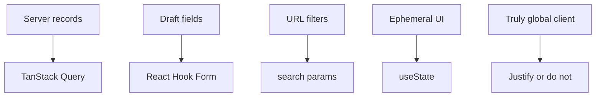

# Month 18 · Week 3 · Day 3
# From Memory: Server State, Form State, and the Redux Bar

**Program:** Full-Stack Mastery · 18 months  
**Phase:** 7 — Capstone  
**Month index:** [../../README.md](../../README.md)  
**Week 3:** [1](day-01.md) · [2](day-02.md) · Day 3 (today) · [4](day-04.md) · [5](day-05.md) · [6](day-06.md) · [7](day-07.md)  
**Week rhythm today:** Implement from memory  
**Student state:** Day 2 screens exist. Today you must **explain** where state lives without opening those files first.  
**Study time:** 3–4 focused hours  
**Prereq:** Day 2 gate passed.

Labs: `~\fullstack-lab\month-18\week-03\day-03\`. Capstone source **closed** during Blocks 1–3. This recap is the teacher. Redux stays **off** unless your pack already contains a justification you can recite.

---

## How Day 3 works

Allowed: this file; blank editor; a tiny memory mini.

Not allowed: opening Day 2 pages to “see where I put state”; installing Redux during the drill; AI architecture essays.

Stuck >25 minutes: open **only** Month 7 notes or **this** recap again. `lookups.txt`.

---

## How to read this chapter

State is not “whatever `useState` is nearby.” Different **lifetimes** need different tools.



**Wrong belief:** “Capstone means Redux Toolkit.”  
**Correct:** Redux is for **genuine global client state** that is not server cache and not a form. Most Project 8 apps never meet that bar. Month 7 already taught this. The pack must contain the paragraph if you use it.

**Wrong belief:** “I’ll put the logged-in user only in Context and fetch `/me` never again.”  
**Correct:** `['me']` in Query is the cache. Context for “theme” maybe. Duplicating `me` in both is how logout lies.

---

## Complete explanation (state you must still own)

**Server state** is data the API owns: lists, detail, `me`, job status. Query fetches, caches, dedupes, invalidates after mutations. The **query key** is the id of that cache. Filters belong in the key **and** the URL so refresh and share work.

**Form state** is the draft: dirty fields, validation, submit count. React Hook Form holds it. Zod validates at the boundary. Do not store field values in Query **while typing**. Do not store the list in RHF.

**URL state** is filters, tabs, page number — anything a teammate should open from a link.

**Local UI state** is “is the extra panel open,” “is the password visible.” `useState` is correct. Do not put it in Query.

**Auth session in the browser.** If cookies: the browser sends them; Query `['me']` tells you who. If bearer: memory (variable) is safer than localStorage; if you used localStorage, you **already justified** XSS risk in the pack.

**403.** Query `isError`; inspect status; show forbidden — do not render `data` from a failed query.

**Invalidation.** After create, `invalidateQueries({ queryKey: ['items'] })` — **your** key. After logout, `queryClient.clear()`.

**Redux bar.** You may add it only if you can name a client-only, cross-route, non-form, non-server cache problem (example **shape**: a multi-step wizard spanning routes with a huge client-only draft you refuse to put on the server — still often solvable with URL + RHF). “I know Redux” is not a justification.

**Wrong belief:** “Context replaces Query.”  
**Correct:** Context is a transport. It does not fetch, cache, or stale.

---

## Today's contract

1. Write a state map for **your** screens from memory.  
2. Recite why Redux is absent **or** quote your justification.  
3. Mini: classify ten state bits.  
4. Diff against code; remove one duplication if you find it.

**Today's gate.** Closed-book:

> Lists live in Query. Forms live in RHF. Filters live in the URL. Redux needs a written reason. 403 is an error, not an empty list.

---

## Time box

| Block | Minutes | Work |
|---|---|---|
| 0 | 20 | Speak recap |
| 1 | 35 | State map from memory |
| 2 | 30 | Classify cards |
| 3 | 40 | Mini app (lab) |
| 4 | 40 | Diff vs capstone; repair duplication |
| 5 | 15 | Retro |

---

# Block 0 — Speak

Query vs RHF vs URL vs useState; logout clears cache; Redux bar.

---

# Block 1 — State map (35 min)

`state-map.md`: every screen you remember. Columns: server | form | url | local. If a cell says “Redux,” you must write the pack sentence from memory or mark **illegal**.

---

# Block 2 — Classify (30 min)

`classify.md` — for each, pick one bucket:

1. Open tickets for current filters  
2. Title field while creating  
3. `?status=open&page=2`  
4. Whether the nav is collapsed  
5. Current user email  
6. 422 on email field  
7. Totals from GET list meta  
8. Optimistic list before server ack (still Query)  
9. Theme dark/light  
10. CSRF token if you use one  

No answer key until the end of this file.

---

# Block 3 — Mini (40 min)

Imposed: **sticky-note wall** (not your domain).

```powershell
cd ~\fullstack-lab
mkdir month-18\week-03\day-03\mini -Force
```

A single `App.tsx` (Vite or even a test file) is enough:

- Query fetches `GET /notes` (you may fake fetch with a module-level array **in the mini**).  
- Form uses RHF to add a note.  
- Filter `?color=` in a string you parse (no need for full router if you simulate `URLSearchParams`).  
- **Must not** put notes array in RHF.  
- **Must not** add Redux.

Write `MINI-WHY.md`: three sentences.

---

# Block 4 — Diff

Open capstone. `dupes.md`: places you stored the same list in useState **and** Query. Delete the useState. If Redux appeared without a pack paragraph, **remove it today**.

---

# Block 5 — Retro

Did you call everything “global state”?

```powershell
cd ~\fullstack-lab
git add month-18
git commit -m "Month 18 Day 3: state architecture from memory."
```

---

## Classify worked box (after Block 2)

1 Query 2 RHF 3 URL 4 useState 5 Query `me` 6 RHF errors 7 Query 8 Query 9 useState/Context 10 whatever your pack said (often cookie, not Redux)

If you put 1 in Redux, re-read the recap.

---

## Debug A–C

**A.** “Redux for `me`.” **B.** Filters only in useState. **C.** Form fields in Query `placeholderData` while typing.

Repairs: Query me; URL filters; RHF for typing.

## Why “global state” is a trap sentence

Juniors say “I need global state” when they mean “two components need the same server record.” That is Query. They say it when they mean “the nav must know who I am.” That is `useQuery(['me'])` in the shell. They say it when they mean “the create form is long.” That is RHF, possibly a multi-step **form** with local step index in `useState`.

A justification for Redux that **can** pass (rare): a collaborative canvas of purely client-side shapes that is not persisted until Save, shared among many components, with undo. If you do not have that, you do not have Redux.

**Wrong belief:** “I’ll keep Redux because I already installed it in Project 4.”  
**Correct:** uninstall it from the capstone unless the pack paragraph exists. Dependencies are decisions.

Windows: if you classify on paper, do not open `src/` “just to peek.” Peeking is Block 4. If VS Code auto-opens the file, close it. The memory is the lesson.

**Say it.** Without notes: where does the filtered list live? Where does the title field live while typing? Where does `?page=2` live? If you say “state” for all three, re-read the recap.

If Redux remains in `package.json` without a pack paragraph, removing it is today’s repair — not a future refactor. A dead store is still a decision you will have to defend.

Month 7 already passed this bar. Capstone is not a license to forget it.

---

## Definition of done

- [ ] state-map.md  
- [ ] classify.md attempted before worked box  
- [ ] mini without Redux  
- [ ] capstone duplication repaired if found  
- [ ] lookups.txt if any  
- [ ] Commit  

---

## Optional review links

- [TkDodo: Practical React Query](https://tkdodo.eu/blog/practical-react-query) — later recheck  
- [Month 7](../../../month-07/README.md)  

---

## Tomorrow

**Accessibility:** keyboard, labels, responsive layout; **error handling that does not swallow 403**.
