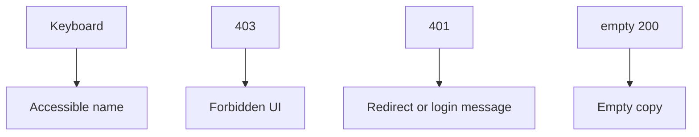

# Month 18 · Week 3 · Day 4
# Accessibility, Keyboard, Labels, Responsive UI; Do Not Swallow 403

**Program:** Full-Stack Mastery · 18 months  
**Phase:** 7 — Capstone  
**Month index:** [../../README.md](../../README.md)  
**Week 3:** [1](day-01.md) · [2](day-02.md) · [3](day-03.md) · Day 4 (today) · [5](day-05.md) · [6](day-06.md) · [7](day-07.md)  
**Week rhythm today:** Lab (a11y + error paths on **your** screens)  
**Student state:** You know where state lives. Today a **keyboard user** and a **forbidden request** are first-class, not leftovers.  
**Study time:** 3–4 focused hours

Labs: `~\fullstack-lab\month-18\week-03\day-04\` for a **403 UI gym**. Product fixes in **your capstone**. This book teaches **defense and inclusion**. It does not teach you to break other people’s sites. No exploit payloads.

---

## How to use this textbook

1. Tab through the critical journey. If you cannot, the control is not a control.  
2. Every input has a **label**.  
3. Treat 403 as **forbidden**, not as empty.  
4. Optional review links are for later rechecking.

---

## How to read this chapter

Accessibility is **whether a person can operate the product**. It is not a color-theme contest. Error handling is **whether the UI tells the truth about the API**.



**Wrong belief:** “I’ll hide the button so we do not need a 403 page.”  
**Correct:** hiding is courtesy. A guessed URL still hits the API. The UI must **show** forbidden, not a spinner that never ends, not a list of zeros.

**Wrong belief:** “Axe green means keyboard works.”  
**Correct:** Axe is a smoke alarm (Month 14). It misses keyboard traps and missing names on custom divs. You still **tab**.

---

## Today's contract

By the end of this day you will be able to:

1. Tab: login → list filter → primary create → submit. No trap.  
2. Inputs associated with labels (`htmlFor` / wrapping).  
3. Listings work at a narrow viewport (usable, not pretty).  
4. Map `ApiError` 401 / 403 / 404 / 500 to **distinct** UI.  
5. `queryFn` **throws** on !ok; never `return { items: [] }` on 403.  
6. Write `A11Y-NOTES.md` with remaining issues (honest).

**Today's gate.** Closed-book:

> Labels and names are the contract. 403 is visible. Empty is not forbidden. I can use the critical path without a mouse.

---

## Time box

| Block | Minutes | Work |
|---|---|---|
| A | 40 | Theory: names, focus, live regions, error taxonomy |
| B | 50 | Lab: 403 vs empty component |
| C | 85 | Independent: capstone pass (keyboard + errors + responsive) |
| D | 15 | Git |
| E | 15 | Recall |

---

# Block A — Theory

## 1. Accessible name

Playwright and humans share this: **role + name**. A submit control is a `button` named “Create …”. A `div` with an onClick is a rumor.

Icons-only buttons need `aria-label`. Decorative images `alt=""`. Meaningful images have text.

## 2. Keyboard

- Tab order follows visual order (do not `tabIndex={5}`).  
- Enter submits forms.  
- Esc closes a dialog **if** you have a dialog (focus return).  
- Custom selects must be widgets or use native `select`.

Skip link to main content is welcome. `main` landmark exists in the shell.

## 3. Responsive

Month 2 skill: wrapping, not shrinking text to dust. Filters stack. Tables can become stacked cards at small widths **or** horizontal scroll **with** a story. Pick one. Touch targets are not 8px.

## 4. Error taxonomy (do not swallow 403)

| Status | UI |
|---|---|
| 401 | “Sign in again”; clear Query; send to `/login` |
| 403 | “You cannot view this.” **Not** the resource title. |
| 404 | “Not found.” |
| 422 | Field errors |
| 409 | Form-level conflict |
| 5xx / network | Alert + retry; log request id if the API sent one |

**Swallowing** looks like:

```ts
if (!res.ok) return { items: [] };
```

That turns a forbidden tenant into “No items yet.” It is a **product lie** and an access-control UI bug.

Correct:

```ts
if (!res.ok) throw new ApiError(res.status, body);
```

Then `isError` + `error.status`.

## 5. Live regions

Loading: `aria-live="polite"` optional. Errors: `role="alert"` for **failures**, not for empty lists (Month 14).

## 6. What you will not do today

- You will not claim WCAG AAA.  
- You will not paste overlay “accessibility widgets” as a substitute for labels.  
- You will not test XSS with attack strings on a production host. Stored text should be rendered as **text** (React default). If you `dangerouslySetInnerHTML`, you need a pack justification and sanitization — prefer not to.

---

# Block B — Lab

```powershell
cd ~\fullstack-lab
mkdir month-18\week-03\day-04 -Force
cd ~\fullstack-lab\month-18\week-03\day-04
```

Create `ForbiddenList.tsx` (or `.md` sketches plus a tiny RTL test if you scaffold Vitest):

- Props: `{ status: 'loading' | 'empty' | 'forbidden' | 'ok', items: string[] }`  
- Forbidden: heading “You cannot view these records” **and** no items rendered even if `items` is accidentally passed  
- Empty: “No records yet” **not** `role="alert"`  
- Write `FORBIDDEN.md` explaining the lie if empty and forbidden share copy

Optional RTL: `getByRole('heading', { name: /cannot view/i })`.

---

# Block C — Capstone

1. Keyboard pass; write `TAB.md` steps.  
2. Fix unlabeled inputs.  
3. Narrow viewport pass (DevTools device mode is enough).  
4. Grep the client for `return []` / `return { items: [] }` on errors; eliminate.  
5. Forbidden component on detail and list.  
6. Show `X-Request-ID` on 5xx if available (helps Week 4).  
7. `docs/A11Y-NOTES.md`: remaining issues (color contrast you did not measure, etc.).

**Wrong belief:** “I’ll use `alert()` for 403.”  
**Correct:** in-page heading; do not brick the shell.

---

# Block D — Git

```powershell
cd ~\fullstack-lab
git add month-18
git commit -m "Month 18 Day 4: forbidden vs empty gym."
```

Capstone: “a11y labels, keyboard path, 403 UI.”

---

# Block E — Recall

1. Why empty is not alert.  
2. How swallowing 403 looks in code.  
3. What an accessible name is.  
4. 401 vs 403 in the UI.  
5. Why Axe is not enough.

## Office hours

**Click-only cards.** Repair: `Link` or `button`.  
**Placeholder as only label.** Repair: visible label.  
**403 toast that disappears.** Repair: stable heading.  
**`catch { setItems([]) }`.** Repair: set error state.

Windows: Tab in Chrome; if focus outline was CSS-reset to none, restore `:focus-visible`.

---

## Definition of done

- [ ] Lab forbidden vs empty written  
- [ ] Tab path documented  
- [ ] Labels on forms  
- [ ] 403 not swallowed in the client  
- [ ] A11Y-NOTES.md honest  
- [ ] Commits  

---

## Optional review links

- [WAI: labels](https://www.w3.org/WAI/tutorials/forms/labels/)  
- [Testing Library: accessible names](https://testing-library.com/docs/queries/byrole/)  
- [Month 2 a11y](../../../month-02/README.md)  
- [Month 14 RTL](../../../month-14/week-01/day-01.md)  

---

## Tomorrow

**RTL + MSW** for one form flow; **plan** one Playwright critical journey (you may write the spec; full green E2E can finish Day 6–7 if the app is still thin).
