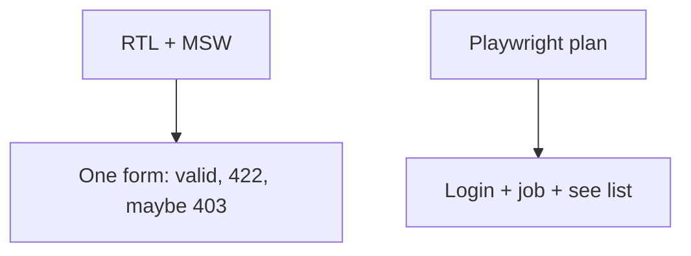

# Month 18 · Week 3 · Day 5
# RTL + MSW for One Form; Playwright Critical Journey Plan

**Program:** Full-Stack Mastery · 18 months  
**Phase:** 7 — Capstone  
**Month index:** [../../README.md](../../README.md)  
**Week 3:** [1](day-01.md) · [2](day-02.md) · [3](day-03.md) · [4](day-04.md) · Day 5 (today) · [6](day-06.md) · [7](day-07.md)  
**Week rhythm today:** Tests/docs  
**Student state:** Screens exist and 403 is visible. Today you pin **one form** with React Testing Library + **MSW**, and you write a **Playwright plan** for the critical journey (Month 14 skill on **this** product).  
**Study time:** 3–4 focused hours

Labs: `~\fullstack-lab\month-18\week-03\day-05\` if you need an MSW gym. Product tests live in **your web repo**. This textbook will **not** paste your form. Query by **role and name**. No CSS-selector contracts.

---

## How to use this textbook

1. Component tests do **not** require Uvicorn. MSW stands in.  
2. Playwright plan names locators and data; the spec can start today.  
3. `onUnhandledRequest: "error"` so silent network is a fail.  
4. Optional review links are for later rechecking.

---

## How to read this chapter

Month 14’s pyramid still holds. Component tests catch **what the UI shows** for a given HTTP story. E2E catches **one path a person must not lose**. You need both kinds of sentence.



**Wrong belief:** “I’ll intercept every API in Playwright and still call it E2E.”  
**Correct:** then you are not proving FastAPI + Postgres + cookies. MSW belongs in Vitest. Playwright talks to the **real** stack (or a documented test env).

**Wrong belief:** “I’ll `waitForTimeout(5000)` in the plan.”  
**Correct:** wait for a **heading**. Sleep is not a wait.

---

## Today's contract

By the end of this day you will be able to:

1. RTL test: happy submit calls the API (MSW) and shows success or navigates (mock router if needed).  
2. RTL test: 422 from MSW maps to a field error the user can read.  
3. MSW `setupServer` from `msw/node`; reset handlers.  
4. `PLAYWRIGHT-PLAN.md`: steps, env vars, seeded user, unique title strategy, locators by role/name.  
5. Optionally commit a first Playwright spec even if CI is later.

**Today's gate.** Closed-book:

> I have a component test for a form that does not hit my laptop’s port 8000. I have a written Playwright journey that would fail if login or create died. I query by role and name.

---

## Time box

| Block | Minutes | Work |
|---|---|---|
| A | 35 | Theory: MSW vs E2E, locators, fixtures |
| B | 50 | Lab or product: MSW form tests |
| C | 80 | Playwright plan + start spec; wire TEST-STRATEGY |
| D | 15 | Git |
| E | 15 | Recall |

---

# Block A — Theory

## 1. MSW is HTTP theater for jsdom

Handlers:

```ts
http.post(`${base}/items`, async ({ request }) => {
  const body = await request.json();
  if (!body.title) {
    return HttpResponse.json(
      { detail: [{ loc: ["body", "title"], msg: "required" }] },
      { status: 422 },
    );
  }
  return HttpResponse.json({ id: "1", title: body.title }, { status: 201 });
});
```

Your `VITE_API_BASE` in tests must match the handler. Set it in `vitest` env.

Wrap the form in `QueryClientProvider` with `retry: false`.

## 2. RTL queries

`getByRole('button', { name: /create/i })`. `userEvent` awaited. `findBy` for async success. Do not `querySelector('.btn-primary')`.

## 3. Playwright plan contents

| Item | Why |
|---|---|
| Base URL | web origin |
| API running | real backend |
| Seeded user | `e2e@example.com` in **test** DB |
| Unique title | timestamp in **data**, not sleep |
| Steps | login, create, see row |
| Locators | role/name from **your** UI |
| Isolation | do not share one row with parallel workers (Month 14) |

Do not use production customers.

## 4. What you will not do today

- You will not write Playwright for every endpoint.  
- You will not test CSS pixels.  
- You will not store E2E passwords in the repo.

---

# Block B — Type-along / product

Prefer implementing tests **on your create form**. If the form is still messy, lab domain **imposed:** `CreateRoomForm` posts to `/rooms`.

Lab scaffold (optional):

```powershell
cd ~\fullstack-lab\month-18\week-03\day-05
npm create vite@latest gym -- --template react-ts
```

Only if you need a gym. Time is better spent on the capstone form.

Must in **capstone**:

- `src/test/server.ts` MSW  
- `src/test/setup.ts`  
- One form test file with happy + 422  

```powershell
npx vitest run
```

---

# Block C — Playwright plan and strategy

Write `docs/PLAYWRIGHT-PLAN.md` in the capstone and a copy outline in the lab.

Also update `TESTING.md`: component layer now has a real test name; E2E is planned with a date (Day 6–7).

If time: `npx playwright install` (once) and a spec that visits `/login` and asserts the heading — even before the full journey. Full journey is the Week 3 Day 7 bar if at all possible.

**Wrong belief:** “Plan is enough forever.”  
**Correct:** Week 4 production still needs the **green** journey. Today is the **plan plus one RTL net**.

---

# Block D — Git

```powershell
cd ~\fullstack-lab
git add month-18
git commit -m "Month 18 Day 5: MSW/RTL notes."
```

Capstone: “RTL form tests with MSW; Playwright plan.”

---

# Block E — Recall

1. Why MSW is not E2E.  
2. `onUnhandledRequest`.  
3. Why unique titles.  
4. Role/name vs CSS.  
5. Why 422 belongs in RTL.

## Office hours

**MSW hitting the real API because base URL wrong.** Repair: env in Vitest.  
**Playwright plan uses `div.MuiButton-root`.** Repair: accessible name.  
**E2E user is your personal admin.** Repair: seed.  
**RTL test uses `waitForTimeout`.** Repair: `findByRole`.

## Playwright plan — a filled shape (your nouns)

Write this structure in `PLAYWRIGHT-PLAN.md`:

1. **Preconditions.** API + web running; test database; user `E2E_EMAIL`.  
2. **Given** I am on `/login`.  
3. **When** I fill email and password by **label** and press the button named from the wireframe.  
4. **Then** I see a heading that means I am in (not the login heading).  
5. **When** I create a record titled `e2e-${Date.now()}`.  
6. **Then** the list shows that title (role/name or a cell with the text).  
7. **Cleanup.** Optional: delete via API with the test token; do not leave thousands of rows.

Include env var **names**. Include “what I will not do”: no `waitForTimeout`, no production URL, no intercept of **your** CRUD.

If you write the spec today, keep it in `e2e/` of the **web** app. CI can wait until Week 4, but the locators should already match Day 4’s names.

Windows: Playwright browsers install large; that is expected. Run from the web app directory. If antivirus locks browser binaries, that is an environment note in OWED — not a reason to skip RTL.

---

## Definition of done

- [ ] Vitest + RTL + MSW: happy and 422  
- [ ] PLAYWRIGHT-PLAN.md  
- [ ] TESTING.md updated  
- [ ] Locators are role/name  
- [ ] No E2E password in git  
- [ ] Commit  

---

## Optional review links

- [MSW](https://mswjs.io/docs/)  
- [Playwright locators](https://playwright.dev/docs/locators)  
- [Month 14 Week 4 Day 2](../../../month-14/week-04/day-02.md) — critical flow  
- [Testing Library user-event](https://testing-library.com/docs/user-event/intro/)  

---

## Tomorrow

**Independent:** remaining UI from the spec — file upload control, audit view if operator-only, empty/forbidden everywhere the pack promised. Then a person can attempt the journey.
