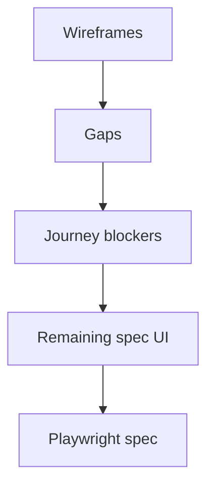

# Month 18 · Week 3 · Day 6
# Independent: Remaining UI from the Spec

**Program:** Full-Stack Mastery · 18 months  
**Phase:** 7 — Capstone  
**Month index:** [../../README.md](../../README.md)  
**Week 3:** [1](day-01.md) · [2](day-02.md) · [3](day-03.md) · [4](day-04.md) · [5](day-05.md) · Day 6 (today) · [7](day-07.md)  
**Week rhythm today:** Independent implementation  
**Student state:** Core screens and one form test exist. Today you **close the UI** the pack promised — not a new design.  
**Study time:** 3–4 focused hours (second session allowed; log it)

This textbook will **not** draw your remaining pages. Envelope + forbidden list. Work in **your capstone**. Notes: `~\fullstack-lab\month-18\week-03\day-06\`.

---

## How to use this textbook

1. Inventory wireframes vs routes.  
2. Implement gaps that block the **critical journey** first.  
3. Then files, audit, notifications **as the pack said**.  
4. Optional review links are for later rechecking.

---

## How to read this chapter

Week 3 Day 7 asks whether **a person can complete the critical journey**. Extra settings pages do not substitute.



**Wrong belief:** “I’ll rebuild the visual identity today.”  
**Correct:** remaining **capabilities**. Theme can wait.

**Wrong belief:** “Upload can be a raw `<input>` with no authz messaging.”  
**Correct:** the API already denies; the UI must label, show progress/error, and not preview another user’s file.

---

## Today's contract

1. UI checklist against Project 8 **user-visible** capabilities.  
2. File/object feature usable by the right role.  
3. User can see **job/notification** outcome at least minimally (flash, status, or “email queued”).  
4. Audit/history **view** if the pack gave a role that may see it.  
5. Playwright spec **runs** or is one honest error away with a note.  
6. `OWED-UI.md` for Day 7.

**Today's gate.** Closed-book:

> The journey is walkable. Remaining screens map to stories. I did not add Redux for a toast.

---

## Time box

| Block | Minutes | Work |
|---|---|---|
| A | 25 | Inventory |
| B | 30 | Journey walk (notes) |
| C | 110 | Build gaps + Playwright |
| D | 20 | Checklist + a11y sweep |
| E | 15 | Recall + commit |

---

# Block A — Inventory

`UI-CHECKLIST.md`:

| Wireframe / story | Route | Exists? | Loading | Empty | Error | 403 |
|---|---|---|---|---|---|---|
| Login | | | | | | |
| List + URL filters | | | | | | |
| Detail | | | | | | |
| Create | | | | | | |
| Edit / status | | | | | | |
| Upload | | | | | | |
| Audit | | | | | | |
| Logout | | | | | | |

Add rows from **your** pack. Mark journey blockers in red (in prose).

---

# Block B — Walk the journey

Use the product as a person. No DevTools first. Write `WALK.md`: where you got stuck. That list **is** Block C.

---

# Block C — Independent

Implement blockers. Quality bars:

- Toasts are `role="status"`; errors `alert`.  
- Upload: label, type/size client hint **and** server 422 display.  
- Do not display internal stack traces.  
- Logout clears Query.  
- Playwright: login → create → list with unique name; locators by role/name; no sleep.

If Playwright cannot run because Windows browser install failed, document the error in `OWED-UI.md` and still complete the **manual** walk. The Month 18 gate still wants E2E; do not pretend.

**Wrong belief:** “I’ll skip upload UI because the API works in curl.”  
**Correct:** Project 8 is a full-stack exam. `curl` is not the demonstration.

---

# Block D — Sweep

Re-tab the journey. Run Vitest. Run Playwright if installed.

```powershell
npx vitest run
npx playwright test
```

Update `TESTING.md` with actual test file names.

---

# Block E — Recall

1. What a journey blocker is.  
2. Why upload needs UI.  
3. Logout vs cache.  
4. What Playwright must not do (sleep).  
5. Why new marketing pages do not count.

```powershell
cd ~\fullstack-lab
git add month-18
git commit -m "Month 18 Day 6: UI checklist notes."
```

Capstone: remaining UI + tests.

---

## Quality bars for remaining screens

**Upload.** The control has a visible label. The user sees selected file name, size, and a failure that names *size* or *type* when the API returns 422. A progress indicator may be a polite live region. Success invalidates the detail query so the new object appears without a full reload superstition. User B never sees a preview URL that the API would 403.

**Audit.** If only operators may read history, the route is absent from the member nav — and still 403 if they guess the URL. The table shows who, action, when. It is not a raw JSON dump unless you labeled it “debug” and hid it from production.

**Notification / job outcome.** After a create that enqueues, the UI says “queued” or shows a status the API actually returns. A spinner that never resolves because you never refetch job status is a journey blocker.

**Logout.** Button in the shell. After click: cookie gone or token cleared, `queryClient.clear()`, `/login`. A later Back button must not show cached private rows as if they were live — Query clear is the point.

**Playwright data.** Unique title using `Date.now()` in the **typed field**, not `waitForTimeout`. Seed user from env. If login fails in CI because the API was never started, that is Compose/docs, not a reason to mock the journey.

**Wrong belief:** “I’ll ship the journey tomorrow and spend today on dark mode.”  
**Correct:** Day 7 asks whether a person finished the job. Contrast can live in A11Y-NOTES as owed.

## Office hours

**New dashboard charts.** Not in the pack. Delete.  
**Modal maze.** Prefer pages from wireframes.  
**Playwright against production.** No — test/staging.  
**Copied Tailwind dashboard template with dummy data.** Fail: it is not your API.  
**Upload is a URL text field.** Only if the pack said “paste a link.” Project 8’s object-storage feature is bytes you store, not a string you hope is an image.  
**Audit page lists every HTTP access log.** That is not the important-action history. Repair: one action, queryable.

Windows: execution policy for `npx`; run from `web` directory; set `PLAYWRIGHT_BASE_URL` in env not in git secrets. If `npx playwright test` fails with browser missing, `npx playwright install` once — still do the **manual** walk today.

## A second pass if the journey still breaks

If `WALK.md` has more than two blockers, stop adding settings pages. Order:

1. Login actually sets the cookie/token the list needs.  
2. Create actually `POST`s and shows field errors.  
3. List refetch after create (invalidation).  
4. Detail loads the new id.  
5. Then upload, audit, polish.

Write `BLOCKERS.md` with one line each. Day 7 will read it. An honest blocker list plus a working login-create-list is closer to the gate than a beautiful settings page and a dead create.

**Wrong belief:** “I’ll fix blockers in the review day.”  
**Correct:** review day is critique, not the first time you discover create 500s.

If the API returns 201 but the UI never navigates, watch the Network tab once — then fix **your** mutation `onSuccess`. Do not blame FastAPI for a missing `navigate`.

Keep the API running while you work. A UI day spent on MSW-only screens is how you discover CORS on Day 7. Hit the real backend for the walk.

## Forms you still owe

If create exists but edit does not, the pack must say why. A status-change control on detail can satisfy “edit” if `API.md` has PATCH and the wireframe showed it. If the wireframe showed a full edit form and you only have create, that is a gap — build the form or amend the pack **in writing**.

Notifications: a toast “Saved” that ignores a 409 is a lie. Show the conflict.

Windows: if `npm run dev` and the API fight over a port, that is not a product bug. Change Vite’s port in config; keep `VITE_API_BASE` pointed at FastAPI.

---

## Definition of done

- [ ] UI-CHECKLIST filled  
- [ ] WALK.md  
- [ ] Journey walkable  
- [ ] Upload/audit/notification UI as packed  
- [ ] Vitest still green  
- [ ] Playwright spec exists or owed with reason  
- [ ] OWED-UI.md  

---

## Optional review links

- [Project 8 §6, §8](../../../../full_stack_project_requirements_2026/project_08_independent_production_capstone.md)  
- [Playwright web-first assertions](https://playwright.dev/docs/actionability)  

---

## Tomorrow

**Week review:** a person completes the critical journey; a11y notes; repair. Production Week 4 waits on that sentence being true — or an honest fail.
