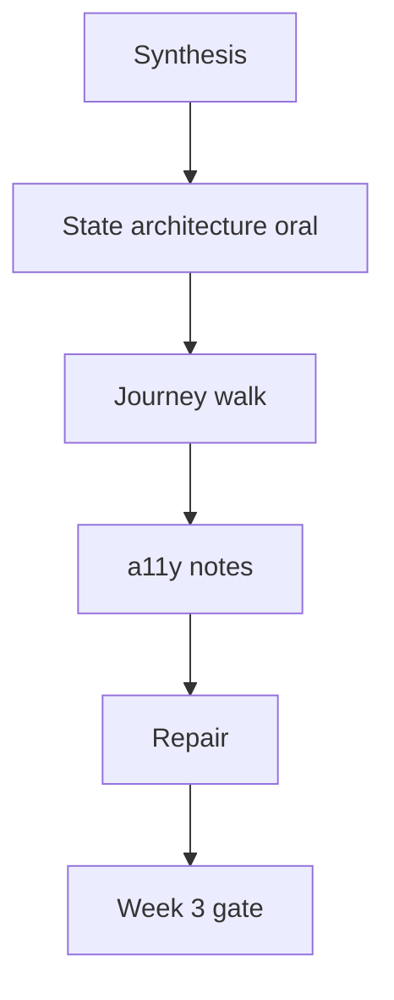

# Month 18 · Week 3 · Day 7
# Week Review — Critical Journey and Accessibility Notes

**Program:** Full-Stack Mastery · 18 months  
**Phase:** 7 — Capstone  
**Month index:** [../../README.md](../../README.md)  
**Week 3:** [1](day-01.md) · [2](day-02.md) · [3](day-03.md) · [4](day-04.md) · [5](day-05.md) · [6](day-06.md) · Day 7 (today)  
**Week rhythm today:** Review, repair, plan Week 4  
**Student state:** The UI should exist. Today a **person** (you, keyboard-first) completes the **critical journey**, you record **a11y notes**, and you do not start Docker-for-show until that is true or honestly false.  
**Study time:** 3–4 focused hours

Work in `~\fullstack-lab\month-18\week-03\day-07\`. Product in **your capstone**. This file is the teacher.

---

## How to read this chapter

Week 3’s exam is not “I used Tailwind.” It is: **a person can finish the job**, and the UI **tells the truth** about 403, empty, and validation.



**Wrong belief:** “Playwright green with mocked APIs is the journey.”  
**Correct:** a person against the **running** API. Playwright should agree.

---

## Week synthesis (the lesson, in this book)

**Vite + TS** SPA. **`VITE_API_BASE`**. Typed client throws on !ok. **`react-router`**. **Query v5** for server state. **RHF + Zod** for forms. **URL** for filters. **No Redux** unless a pack paragraph exists.

**Screens.** List/detail/create/edit from wireframes. Loading / empty / error distinct. Empty is not `role="alert"`.

**a11y.** Labels, keyboard, landmarks, focus. Axe optional smoke; tab is mandatory.

**403.** Not swallowed into empty lists. Forbidden copy. 401 returns to login; cache cleared on logout.

**Tests.** RTL + MSW for one form (happy + 422). Playwright plan and, if possible, green critical journey: login, create, see in list. Role/name locators. No sleep.

**Wrong belief:** “Frontend authorization is enough.”  
**Correct:** API deny tests from Week 2 remain the boundary.

---

## Today's contract

Speak the synthesis, walk the journey, write a11y notes, repair blockers, mark the Week 3 gate. Week 4 is production, not a chance to discover you never had a list page.

---

## Time box

| Block | Minutes | Work |
|---|---|---|
| 0 | 20 | Speak synthesis |
| 1 | 25 | Closed-book `fe-oral.md` |
| 2 | 35 | Mini: 403-swallow bug in lab |
| 3 | 45 | Person walk + Playwright |
| 4 | 30 | A11y notes |
| 5 | 30 | Repair |
| 6 | 20 | Self-mark + Week 4 plan |

---

# Block 0 — Speak

Query vs RHF vs URL; VITE_API_BASE; 403; MSW vs Playwright.

---

# Block 1 — Oral (25 min)

`fe-oral.md`:

1. Where `me` lives.  
2. Why filters are in the URL.  
3. How 422 appears.  
4. Redux: yes/no and why.  
5. The Playwright locator for submit.

---

# Block 2 — Mini (35 min)

Broken list component (lab): `queryFn` returns `{ items: [] }` when `status === 403`. Tests currently expect empty copy.

You must:

- Throw on 403  
- Test `getByRole('heading', { name: /cannot|forbidden|not allowed/i })`  
- Empty test still uses `[]` with **200**

Do not import capstone.

---

# Block 3 — Person walk

`JOURNEY.md`:

- Date, browser  
- Steps with **what you saw**  
- Request id on a forced error if you can  
- Playwright command output snippet  

If the journey fails, **JOURNEY.md is still passing work** if honest. The gate row will be false.

Keyboard-only variant: 10 minutes. Note traps.

---

# Block 4 — a11y notes

`docs/A11Y-NOTES.md` in capstone (update):

- Landmarks  
- Unlabeled remaining  
- Contrast not measured / measured  
- Keyboard traps  
- 403/empty distinction verified  

This is **notes**, not a certificate.

---

# Block 5 — Repair

Fix journey blockers only. No new feature from a blog. Re-run Vitest.

---

# Block 6 — Self-mark

| # | Claim | Evidence | Pass? |
|---|---|---|---|
| 1 | Shell, Query, router, VITE_API_BASE | code | |
| 2 | URL filters | paste a URL | |
| 3 | Loading/empty/error | JOURNEY.md | |
| 4 | 403 not swallowed | mini + product | |
| 5 | RTL+MSW form tests | vitest | |
| 6 | Person completed critical journey | JOURNEY.md | |
| 7 | Playwright exists and matches journey | spec / OWED | |
| 8 | A11Y-NOTES.md | path | |

If 6 is false, **do not start Week 4** except to keep the API running. Docker will not create a list page.

```powershell
cd ~\fullstack-lab
git add month-18
git commit -m "Month 18 Week 3 review: journey notes."
```

---

## Worked mini (after)

403 → throw → forbidden heading. 200 + [] → empty copy. If both share text, you failed the mini.

---

## What “a person can complete the journey” means

You sit at the keyboard. You do not open React DevTools first. You sign in with the **seed** user from the README. You create the primary record with a title you invented **now**. You find that title on the list, including after a refresh, including with the filter URL you would send a teammate. If any step needs a comment in the code to “remember the UUID,” the journey is not a person’s journey.

Keyboard-only: Tab to the email field, fill, Tab to password, fill, Enter. Tab to the primary action. If focus disappears into a `div` card, that is a Day 4 hole you still own.

**Wrong belief:** “I completed it last night, so I can skip the walk.”  
**Correct:** last night’s build is not today’s evidence. `JOURNEY.md` is dated.

**Wrong belief:** “Playwright used `storageState` from a month-old save.”  
**Correct:** expired auth is a **Week 4** class. Today, a fresh login is the proof.

## Office hours

**Walk used seed data you forgot how to create.** Repair: README seed.  
**Playwright green, person lost.** Believe the person; locators lied.  
**Starting Compose because of anxiety.** After the table.  
**Forbidden and empty share the sentence “Nothing here.”** Repair: the mini.  
**Journey works only if Vite proxy is on and fails with `VITE_API_BASE`.** Repair: one documented way; the other is a bug.

Windows: screenshots in `docs/review/` are optional evidence; redact PII. Print-screen of the list with **your** new title is stronger than a console log.

If JOURNEY.md says “I got stuck on login,” Week 4 will containerize a stuck login. Stay on Week 3. Docker is not a product.

A11Y-NOTES.md should mention at least: one unlabeled control you fixed or still owe; whether Tab completes login; whether 403 and empty use different copy. Three bullets beat a certificate you did not earn.

If Playwright is still owed, say so in the gate table. Do not mark row 7 true on a plan file alone.

Week 4 will not invent accessible names. If Playwright cannot find the button, rename the button today. Do not wait for Docker.

---

## Definition of done

- [ ] fe-oral.md  
- [ ] Mini tests green  
- [ ] JOURNEY.md  
- [ ] A11Y-NOTES.md  
- [ ] Self-mark honest  
- [ ] Week 4 not started on a missing journey  

---

## Optional review links

- [Month 18 README](../../README.md)  
- [Project 8 §6, §21](../../../../full_stack_project_requirements_2026/project_08_independent_production_capstone.md)  

---

## Next week

**Production:** Docker/Compose (non-root, health, volumes, env), CI/CD, HTTPS, migrations as a step, runbook, monitoring, backup **strategy**, load test, security review, freeze RC, then the **final incident drill** — the program exam.
